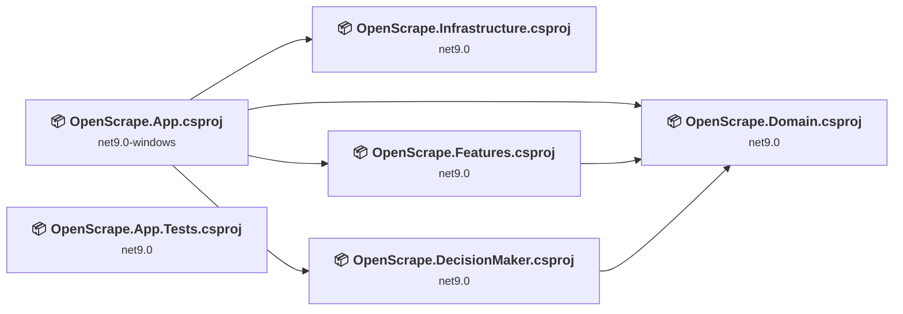
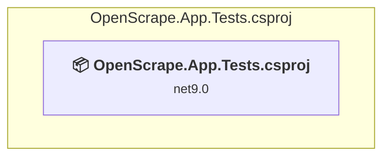
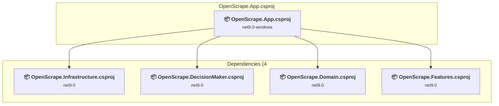
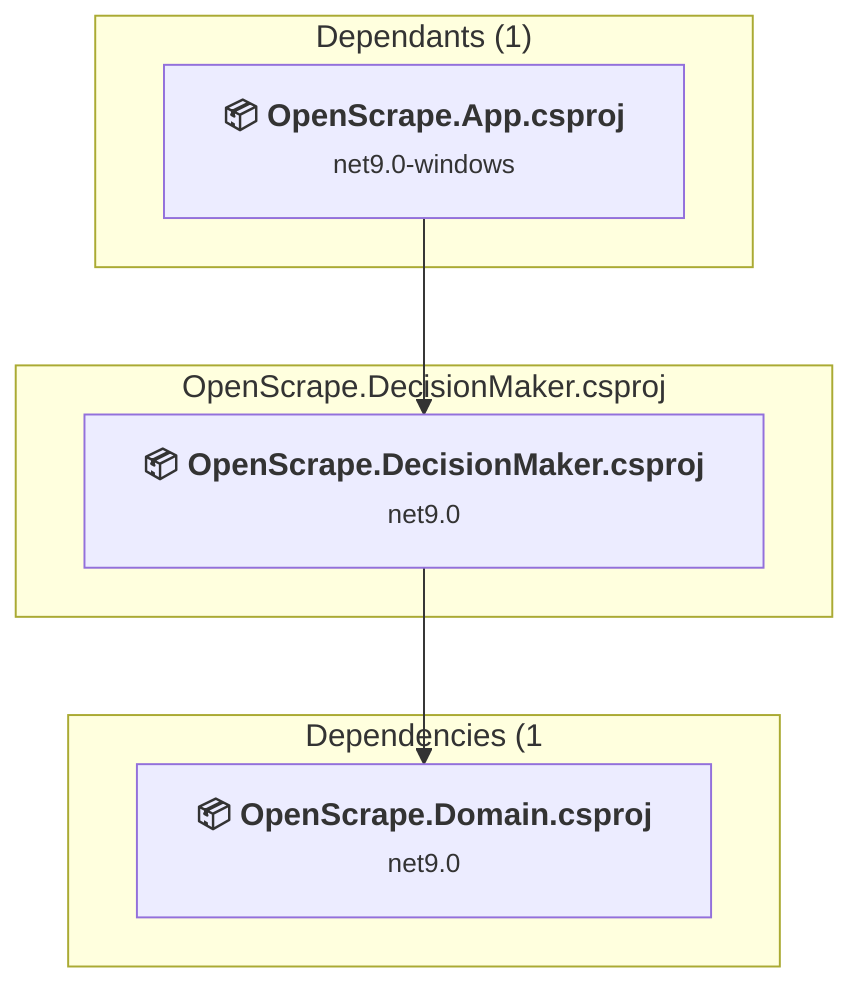
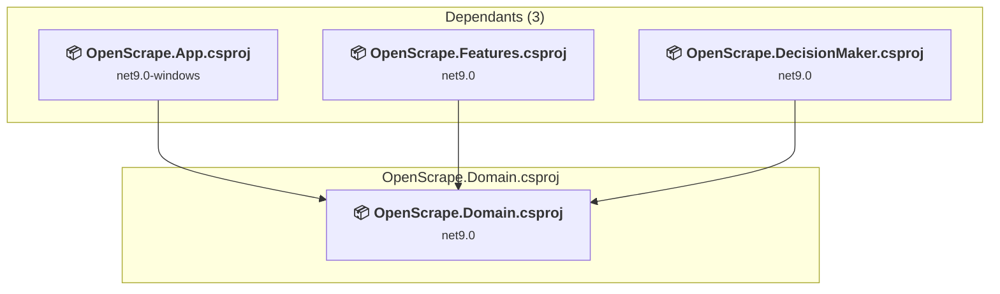
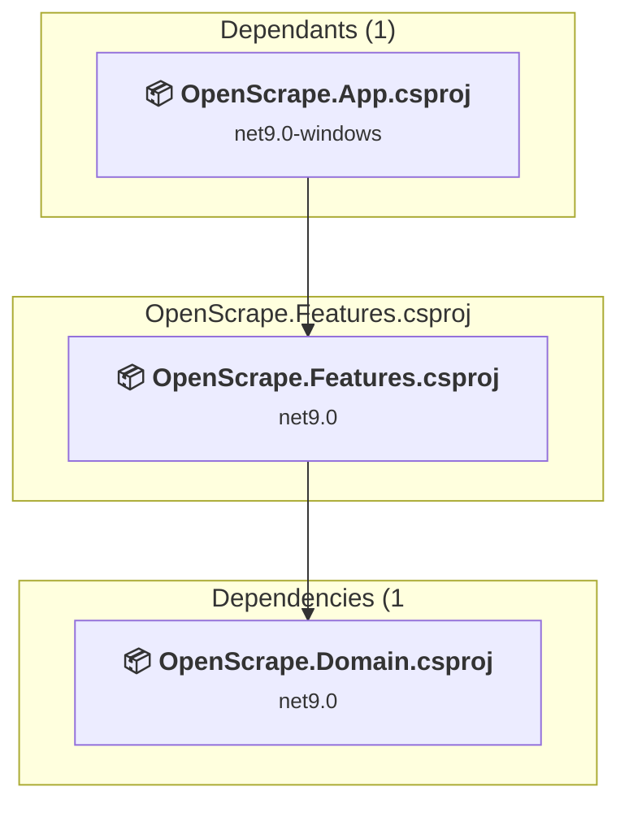
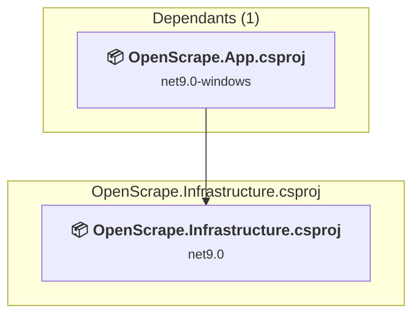

# Projects and dependencies analysis

This document provides a comprehensive overview of the projects and their dependencies in the context of upgrading to .NETCoreApp,Version=v10.0.

## Table of Contents

- [Executive Summary](#executive-Summary)
  - [Highlevel Metrics](#highlevel-metrics)
  - [Projects Compatibility](#projects-compatibility)
  - [Package Compatibility](#package-compatibility)
  - [API Compatibility](#api-compatibility)
- [Aggregate NuGet packages details](#aggregate-nuget-packages-details)
- [Top API Migration Challenges](#top-api-migration-challenges)
  - [Technologies and Features](#technologies-and-features)
  - [Most Frequent API Issues](#most-frequent-api-issues)
- [Projects Relationship Graph](#projects-relationship-graph)
- [Project Details](#project-details)

  - [OpenScrape.App.Tests\OpenScrape.App.Tests.csproj](#openscrapeapptestsopenscrapeapptestscsproj)
  - [src\OpenScrape.App\OpenScrape.App.csproj](#srcopenscrapeappopenscrapeappcsproj)
  - [src\OpenScrape.DecisionMaker\OpenScrape.DecisionMaker.csproj](#srcopenscrapedecisionmakeropenscrapedecisionmakercsproj)
  - [src\OpenScrape.Domain\OpenScrape.Domain.csproj](#srcopenscrapedomainopenscrapedomaincsproj)
  - [src\OpenScrape.Features\OpenScrape.Features.csproj](#srcopenscrapefeaturesopenscrapefeaturescsproj)
  - [src\OpenScrape.Infrastructure\OpenScrape.Infrastructure.csproj](#srcopenscrapeinfrastructureopenscrapeinfrastructurecsproj)

## Executive Summary

### Highlevel Metrics

| Metric | Count | Status |
| :--- | :---: | :--- |
| Total Projects | 6 | All require upgrade |
| Total NuGet Packages | 26 | 6 need upgrade |
| Total Code Files | 130 |  |
| Total Code Files with Incidents | 40 |  |
| Total Lines of Code | 14249 |  |
| Total Number of Issues | 5375 |  |
| Estimated LOC to modify | 5362+ | at least 37,6% of codebase |

### Projects Compatibility

| Project | Target Framework | Difficulty | Package Issues | API Issues | Est. LOC Impact | Description |
| :--- | :---: | :---: | :---: | :---: | :---: | :--- |
| [OpenScrape.App.Tests\OpenScrape.App.Tests.csproj](#openscrapeapptestsopenscrapeapptestscsproj) | net9.0 | 🟢 Low | 0 | 0 |  | DotNetCoreApp, Sdk Style = True |
| [src\OpenScrape.App\OpenScrape.App.csproj](#srcopenscrapeappopenscrapeappcsproj) | net9.0-windows | 🟡 Medium | 4 | 5362 | 5362+ | WinForms, Sdk Style = True |
| [src\OpenScrape.DecisionMaker\OpenScrape.DecisionMaker.csproj](#srcopenscrapedecisionmakeropenscrapedecisionmakercsproj) | net9.0 | 🟢 Low | 1 | 0 |  | ClassLibrary, Sdk Style = True |
| [src\OpenScrape.Domain\OpenScrape.Domain.csproj](#srcopenscrapedomainopenscrapedomaincsproj) | net9.0 | 🟢 Low | 0 | 0 |  | ClassLibrary, Sdk Style = True |
| [src\OpenScrape.Features\OpenScrape.Features.csproj](#srcopenscrapefeaturesopenscrapefeaturescsproj) | net9.0 | 🟢 Low | 0 | 0 |  | ClassLibrary, Sdk Style = True |
| [src\OpenScrape.Infrastructure\OpenScrape.Infrastructure.csproj](#srcopenscrapeinfrastructureopenscrapeinfrastructurecsproj) | net9.0 | 🟢 Low | 2 | 0 |  | ClassLibrary, Sdk Style = True |

### Package Compatibility

| Status | Count | Percentage |
| :--- | :---: | :---: |
| ✅ Compatible | 20 | 76,9% |
| ⚠️ Incompatible | 1 | 3,8% |
| 🔄 Upgrade Recommended | 5 | 19,2% |
| ***Total NuGet Packages*** | ***26*** | ***100%*** |

### API Compatibility

| Category | Count | Impact |
| :--- | :---: | :--- |
| 🔴 Binary Incompatible | 4411 | High - Require code changes |
| 🟡 Source Incompatible | 951 | Medium - Needs re-compilation and potential conflicting API error fixing |
| 🔵 Behavioral change | 0 | Low - Behavioral changes that may require testing at runtime |
| ✅ Compatible | 12983 |  |
| ***Total APIs Analyzed*** | ***18345*** |  |

## Aggregate NuGet packages details

| Package | Current Version | Suggested Version | Projects | Description |
| :--- | :---: | :---: | :--- | :--- |
| Ardalis.Result | 10.1.0 |  | [OpenScrape.Features.csproj](#srcopenscrapefeaturesopenscrapefeaturescsproj) [OpenScrape.Infrastructure.csproj](#srcopenscrapeinfrastructureopenscrapeinfrastructurecsproj) | ✅Compatible |
| Ardalis.Result.FluentValidation | 10.1.0 |  | [OpenScrape.Infrastructure.csproj](#srcopenscrapeinfrastructureopenscrapeinfrastructurecsproj) | ✅Compatible |
| coverlet.collector | 6.0.4 |  | [OpenScrape.App.Tests.csproj](#openscrapeapptestsopenscrapeapptestscsproj) | ✅Compatible |
| Emgu.CV | 4.10.0.5680 |  | [OpenScrape.App.csproj](#srcopenscrapeappopenscrapeappcsproj) | ✅Compatible |
| Marten | 8.0.0-alpha-3 |  | [OpenScrape.App.csproj](#srcopenscrapeappopenscrapeappcsproj) [OpenScrape.Features.csproj](#srcopenscrapefeaturesopenscrapefeaturescsproj) [OpenScrape.Infrastructure.csproj](#srcopenscrapeinfrastructureopenscrapeinfrastructurecsproj) | ✅Compatible |
| MediatR | 12.5.0 |  | [OpenScrape.App.csproj](#srcopenscrapeappopenscrapeappcsproj) | ✅Compatible |
| Microsoft.Extensions.Configuration.Abstractions | 10.0.0-preview.1.25080.5 | 10.0.3 | [OpenScrape.Infrastructure.csproj](#srcopenscrapeinfrastructureopenscrapeinfrastructurecsproj) | Se recomienda actualizar el paquete NuGet |
| Microsoft.Extensions.DependencyInjection | 10.0.0-preview.1.25080.5 | 10.0.3 | [OpenScrape.App.csproj](#srcopenscrapeappopenscrapeappcsproj) | Se recomienda actualizar el paquete NuGet |
| Microsoft.Extensions.DependencyInjection.Abstractions | 10.0.0-preview.1.25080.5 | 10.0.3 | [OpenScrape.Infrastructure.csproj](#srcopenscrapeinfrastructureopenscrapeinfrastructurecsproj) | Se recomienda actualizar el paquete NuGet |
| Microsoft.Extensions.Hosting | 10.0.0-preview.1.25080.5 | 10.0.3 | [OpenScrape.App.csproj](#srcopenscrapeappopenscrapeappcsproj) | Se recomienda actualizar el paquete NuGet |
| Microsoft.Extensions.Logging.Abstractions | 9.0.0 | 10.0.3 | [OpenScrape.DecisionMaker.csproj](#srcopenscrapedecisionmakeropenscrapedecisionmakercsproj) | Se recomienda actualizar el paquete NuGet |
| Microsoft.ML | 4.0.2 |  | [OpenScrape.App.csproj](#srcopenscrapeappopenscrapeappcsproj) | ✅Compatible |
| Microsoft.NET.Test.Sdk | 17.14.0-preview-25107-01 |  | [OpenScrape.App.Tests.csproj](#openscrapeapptestsopenscrapeapptestscsproj) | ✅Compatible |
| Microsoft.NETCore.App | 2.2.8 |  | [OpenScrape.App.csproj](#srcopenscrapeappopenscrapeappcsproj) | ⚠️El paquete NuGet está en desuso |
| Nancy | 2.0.0 |  | [OpenScrape.App.csproj](#srcopenscrapeappopenscrapeappcsproj) | ✅Compatible |
| NUnit | 4.3.2 |  | [OpenScrape.App.Tests.csproj](#openscrapeapptestsopenscrapeapptestscsproj) | ✅Compatible |
| NUnit.Analyzers | 4.6.0 |  | [OpenScrape.App.Tests.csproj](#openscrapeapptestsopenscrapeapptestscsproj) | ✅Compatible |
| NUnit3TestAdapter | 5.0.0 |  | [OpenScrape.App.Tests.csproj](#openscrapeapptestsopenscrapeapptestscsproj) | ✅Compatible |
| OpenCV | 2.4.11 |  | [OpenScrape.App.csproj](#srcopenscrapeappopenscrapeappcsproj) | ✅Compatible |
| OpenCvSharp4 | 4.10.0.20241108 |  | [OpenScrape.App.csproj](#srcopenscrapeappopenscrapeappcsproj) | ✅Compatible |
| OpenCvSharp4.runtime.win | 4.10.0.20241108 |  | [OpenScrape.App.csproj](#srcopenscrapeappopenscrapeappcsproj) | ✅Compatible |
| Rijndael256 | 3.2.0 |  | [OpenScrape.App.csproj](#srcopenscrapeappopenscrapeappcsproj) | ✅Compatible |
| SkiaSharp | 3.118.0-preview.2.3 |  | [OpenScrape.App.csproj](#srcopenscrapeappopenscrapeappcsproj) | ✅Compatible |
| System.Text.RegularExpressions | 4.3.1 |  | [OpenScrape.App.csproj](#srcopenscrapeappopenscrapeappcsproj) | La funcionalidad del paquete NuGet se incluye con la referencia del marco |
| Tesseract | 5.2.0 |  | [OpenScrape.App.csproj](#srcopenscrapeappopenscrapeappcsproj) | ✅Compatible |
| Tesseract.Drawing | 5.2.0 |  | [OpenScrape.App.csproj](#srcopenscrapeappopenscrapeappcsproj) | ✅Compatible |

## Top API Migration Challenges

### Technologies and Features

| Technology | Issues | Percentage | Migration Path |
| :--- | :---: | :---: | :--- |
| Windows Forms | 4411 | 82,3% | Windows Forms APIs for building Windows desktop applications with traditional Forms-based UI that are available in .NET on Windows. Enable Windows Desktop support: Option 1 (Recommended): Target net9.0-windows; Option 2: Add <UseWindowsDesktop>true</UseWindowsDesktop>; Option 3 (Legacy): Use Microsoft.NET.Sdk.WindowsDesktop SDK. |
| GDI+ / System.Drawing | 946 | 17,6% | System.Drawing APIs for 2D graphics, imaging, and printing that are available via NuGet package System.Drawing.Common. Note: Not recommended for server scenarios due to Windows dependencies; consider cross-platform alternatives like SkiaSharp or ImageSharp for new code. |
| Windows Forms Legacy Controls | 78 | 1,5% | Legacy Windows Forms controls that have been removed from .NET Core/5+ including StatusBar, DataGrid, ContextMenu, MainMenu, MenuItem, and ToolBar. These controls were replaced by more modern alternatives. Use ToolStrip, MenuStrip, ContextMenuStrip, and DataGridView instead. |
| Legacy Configuration System | 2 | 0,0% | Legacy XML-based configuration system (app.config/web.config) that has been replaced by a more flexible configuration model in .NET Core. The old system was rigid and XML-based. Migrate to Microsoft.Extensions.Configuration with JSON/environment variables; use System.Configuration.ConfigurationManager NuGet package as interim bridge if needed. |

### Most Frequent API Issues

| API | Count | Percentage | Category |
| :--- | :---: | :---: | :--- |
| T:System.Windows.Forms.Button | 361 | 6,7% | Binary Incompatible |
| T:System.Windows.Forms.Label | 346 | 6,5% | Binary Incompatible |
| T:System.Windows.Forms.PictureBox | 319 | 5,9% | Binary Incompatible |
| T:System.Windows.Forms.Panel | 286 | 5,3% | Binary Incompatible |
| T:System.Windows.Forms.TextBox | 165 | 3,1% | Binary Incompatible |
| P:System.Windows.Forms.Control.Name | 133 | 2,5% | Binary Incompatible |
| T:System.Drawing.Image | 131 | 2,4% | Source Incompatible |
| P:System.Windows.Forms.Control.Size | 128 | 2,4% | Binary Incompatible |
| T:System.Windows.Forms.Control.ControlCollection | 127 | 2,4% | Binary Incompatible |
| P:System.Windows.Forms.Control.Controls | 127 | 2,4% | Binary Incompatible |
| M:System.Windows.Forms.Control.ControlCollection.Add(System.Windows.Forms.Control) | 127 | 2,4% | Binary Incompatible |
| P:System.Windows.Forms.Control.Location | 125 | 2,3% | Binary Incompatible |
| T:System.Drawing.Bitmap | 107 | 2,0% | Source Incompatible |
| P:System.Windows.Forms.Control.TabIndex | 105 | 2,0% | Binary Incompatible |
| T:System.Windows.Forms.TabPage | 102 | 1,9% | Binary Incompatible |
| T:System.Windows.Forms.BorderStyle | 102 | 1,9% | Binary Incompatible |
| T:System.Windows.Forms.CheckBox | 102 | 1,9% | Binary Incompatible |
| T:System.Windows.Forms.GroupBox | 88 | 1,6% | Binary Incompatible |
| T:System.Drawing.Font | 66 | 1,2% | Source Incompatible |
| P:System.Windows.Forms.PictureBox.Image | 58 | 1,1% | Binary Incompatible |
| P:System.Drawing.Image.Height | 54 | 1,0% | Source Incompatible |
| T:System.Drawing.ContentAlignment | 51 | 1,0% | Source Incompatible |
| T:System.Windows.Forms.RadioButton | 50 | 0,9% | Binary Incompatible |
| P:System.Windows.Forms.TextBox.Text | 48 | 0,9% | Binary Incompatible |
| T:System.Drawing.FontStyle | 46 | 0,9% | Source Incompatible |
| P:System.Windows.Forms.Label.Text | 45 | 0,8% | Binary Incompatible |
| T:System.Drawing.Graphics | 44 | 0,8% | Source Incompatible |
| P:System.Drawing.Image.Width | 41 | 0,8% | Source Incompatible |
| M:System.Windows.Forms.Control.ResumeLayout(System.Boolean) | 39 | 0,7% | Binary Incompatible |
| M:System.Windows.Forms.Control.SuspendLayout | 39 | 0,7% | Binary Incompatible |
| T:System.Windows.Forms.TreeView | 39 | 0,7% | Binary Incompatible |
| P:System.Windows.Forms.ButtonBase.UseVisualStyleBackColor | 36 | 0,7% | Binary Incompatible |
| P:System.Windows.Forms.ButtonBase.Text | 36 | 0,7% | Binary Incompatible |
| P:System.Windows.Forms.Control.Font | 31 | 0,6% | Binary Incompatible |
| T:System.Windows.Forms.DataGridView | 30 | 0,6% | Binary Incompatible |
| T:System.Windows.Forms.RightToLeft | 30 | 0,6% | Binary Incompatible |
| M:System.Windows.Forms.Control.PerformLayout | 29 | 0,5% | Binary Incompatible |
| P:System.Windows.Forms.Label.AutoSize | 29 | 0,5% | Binary Incompatible |
| M:System.Windows.Forms.Label.#ctor | 29 | 0,5% | Binary Incompatible |
| M:System.Windows.Forms.Button.#ctor | 27 | 0,5% | Binary Incompatible |
| P:System.Windows.Forms.Control.BackColor | 27 | 0,5% | Binary Incompatible |
| F:System.Windows.Forms.BorderStyle.FixedSingle | 27 | 0,5% | Binary Incompatible |
| T:System.Drawing.Imaging.ImageLockMode | 26 | 0,5% | Source Incompatible |
| E:System.Windows.Forms.Control.Click | 25 | 0,5% | Binary Incompatible |
| T:System.Drawing.Imaging.PixelFormat | 25 | 0,5% | Source Incompatible |
| P:System.Windows.Forms.Control.Enabled | 25 | 0,5% | Binary Incompatible |
| T:System.Windows.Forms.TreeNode | 25 | 0,5% | Binary Incompatible |
| T:System.Windows.Forms.FlatStyle | 24 | 0,4% | Binary Incompatible |
| T:System.Windows.Forms.Padding | 22 | 0,4% | Binary Incompatible |
| T:System.Windows.Forms.TabControl | 22 | 0,4% | Binary Incompatible |

## Projects Relationship Graph

Legend:
📦 SDK-style project
⚙️ Classic project

## Project Details

### OpenScrape.App.Tests\OpenScrape.App.Tests.csproj

#### Project Info

- **Current Target Framework:** net9.0
- **Proposed Target Framework:** net10.0
- **SDK-style**: True
- **Project Kind:** DotNetCoreApp
- **Dependencies**: 0
- **Dependants**: 0
- **Number of Files**: 4
- **Number of Files with Incidents**: 1
- **Lines of Code**: 42
- **Estimated LOC to modify**: 0+ (at least 0,0% of the project)

#### Dependency Graph

Legend:
📦 SDK-style project
⚙️ Classic project

### API Compatibility

| Category | Count | Impact |
| :--- | :---: | :--- |
| 🔴 Binary Incompatible | 0 | High - Require code changes |
| 🟡 Source Incompatible | 0 | Medium - Needs re-compilation and potential conflicting API error fixing |
| 🔵 Behavioral change | 0 | Low - Behavioral changes that may require testing at runtime |
| ✅ Compatible | 42 |  |
| ***Total APIs Analyzed*** | ***42*** |  |

### src\OpenScrape.App\OpenScrape.App.csproj

#### Project Info

- **Current Target Framework:** net9.0-windows
- **Proposed Target Framework:** net10.0-windows
- **SDK-style**: True
- **Project Kind:** WinForms
- **Dependencies**: 4
- **Dependants**: 0
- **Number of Files**: 96
- **Number of Files with Incidents**: 35
- **Lines of Code**: 12571
- **Estimated LOC to modify**: 5362+ (at least 42,7% of the project)

#### Dependency Graph

Legend:
📦 SDK-style project
⚙️ Classic project

### API Compatibility

| Category | Count | Impact |
| :--- | :---: | :--- |
| 🔴 Binary Incompatible | 4411 | High - Require code changes |
| 🟡 Source Incompatible | 951 | Medium - Needs re-compilation and potential conflicting API error fixing |
| 🔵 Behavioral change | 0 | Low - Behavioral changes that may require testing at runtime |
| ✅ Compatible | 11066 |  |
| ***Total APIs Analyzed*** | ***16428*** |  |

#### Project Technologies and Features

| Technology | Issues | Percentage | Migration Path |
| :--- | :---: | :---: | :--- |
| Legacy Configuration System | 2 | 0,0% | Legacy XML-based configuration system (app.config/web.config) that has been replaced by a more flexible configuration model in .NET Core. The old system was rigid and XML-based. Migrate to Microsoft.Extensions.Configuration with JSON/environment variables; use System.Configuration.ConfigurationManager NuGet package as interim bridge if needed. |
| Windows Forms Legacy Controls | 78 | 1,5% | Legacy Windows Forms controls that have been removed from .NET Core/5+ including StatusBar, DataGrid, ContextMenu, MainMenu, MenuItem, and ToolBar. These controls were replaced by more modern alternatives. Use ToolStrip, MenuStrip, ContextMenuStrip, and DataGridView instead. |
| GDI+ / System.Drawing | 946 | 17,6% | System.Drawing APIs for 2D graphics, imaging, and printing that are available via NuGet package System.Drawing.Common. Note: Not recommended for server scenarios due to Windows dependencies; consider cross-platform alternatives like SkiaSharp or ImageSharp for new code. |
| Windows Forms | 4411 | 82,3% | Windows Forms APIs for building Windows desktop applications with traditional Forms-based UI that are available in .NET on Windows. Enable Windows Desktop support: Option 1 (Recommended): Target net9.0-windows; Option 2: Add <UseWindowsDesktop>true</UseWindowsDesktop>; Option 3 (Legacy): Use Microsoft.NET.Sdk.WindowsDesktop SDK. |

### src\OpenScrape.DecisionMaker\OpenScrape.DecisionMaker.csproj

#### Project Info

- **Current Target Framework:** net9.0
- **Proposed Target Framework:** net10.0
- **SDK-style**: True
- **Project Kind:** ClassLibrary
- **Dependencies**: 1
- **Dependants**: 1
- **Number of Files**: 5
- **Number of Files with Incidents**: 1
- **Lines of Code**: 857
- **Estimated LOC to modify**: 0+ (at least 0,0% of the project)

#### Dependency Graph

Legend:
📦 SDK-style project
⚙️ Classic project

### API Compatibility

| Category | Count | Impact |
| :--- | :---: | :--- |
| 🔴 Binary Incompatible | 0 | High - Require code changes |
| 🟡 Source Incompatible | 0 | Medium - Needs re-compilation and potential conflicting API error fixing |
| 🔵 Behavioral change | 0 | Low - Behavioral changes that may require testing at runtime |
| ✅ Compatible | 895 |  |
| ***Total APIs Analyzed*** | ***895*** |  |

### src\OpenScrape.Domain\OpenScrape.Domain.csproj

#### Project Info

- **Current Target Framework:** net9.0
- **Proposed Target Framework:** net10.0
- **SDK-style**: True
- **Project Kind:** ClassLibrary
- **Dependencies**: 0
- **Dependants**: 3
- **Number of Files**: 21
- **Number of Files with Incidents**: 1
- **Lines of Code**: 397
- **Estimated LOC to modify**: 0+ (at least 0,0% of the project)

#### Dependency Graph

Legend:
📦 SDK-style project
⚙️ Classic project

### API Compatibility

| Category | Count | Impact |
| :--- | :---: | :--- |
| 🔴 Binary Incompatible | 0 | High - Require code changes |
| 🟡 Source Incompatible | 0 | Medium - Needs re-compilation and potential conflicting API error fixing |
| 🔵 Behavioral change | 0 | Low - Behavioral changes that may require testing at runtime |
| ✅ Compatible | 475 |  |
| ***Total APIs Analyzed*** | ***475*** |  |

### src\OpenScrape.Features\OpenScrape.Features.csproj

#### Project Info

- **Current Target Framework:** net9.0
- **Proposed Target Framework:** net10.0
- **SDK-style**: True
- **Project Kind:** ClassLibrary
- **Dependencies**: 1
- **Dependants**: 1
- **Number of Files**: 14
- **Number of Files with Incidents**: 1
- **Lines of Code**: 347
- **Estimated LOC to modify**: 0+ (at least 0,0% of the project)

#### Dependency Graph

Legend:
📦 SDK-style project
⚙️ Classic project

### API Compatibility

| Category | Count | Impact |
| :--- | :---: | :--- |
| 🔴 Binary Incompatible | 0 | High - Require code changes |
| 🟡 Source Incompatible | 0 | Medium - Needs re-compilation and potential conflicting API error fixing |
| 🔵 Behavioral change | 0 | Low - Behavioral changes that may require testing at runtime |
| ✅ Compatible | 486 |  |
| ***Total APIs Analyzed*** | ***486*** |  |

### src\OpenScrape.Infrastructure\OpenScrape.Infrastructure.csproj

#### Project Info

- **Current Target Framework:** net9.0
- **Proposed Target Framework:** net10.0
- **SDK-style**: True
- **Project Kind:** ClassLibrary
- **Dependencies**: 0
- **Dependants**: 1
- **Number of Files**: 1
- **Number of Files with Incidents**: 1
- **Lines of Code**: 35
- **Estimated LOC to modify**: 0+ (at least 0,0% of the project)

#### Dependency Graph

Legend:
📦 SDK-style project
⚙️ Classic project

### API Compatibility

| Category | Count | Impact |
| :--- | :---: | :--- |
| 🔴 Binary Incompatible | 0 | High - Require code changes |
| 🟡 Source Incompatible | 0 | Medium - Needs re-compilation and potential conflicting API error fixing |
| 🔵 Behavioral change | 0 | Low - Behavioral changes that may require testing at runtime |
| ✅ Compatible | 19 |  |
| ***Total APIs Analyzed*** | ***19*** |  |

