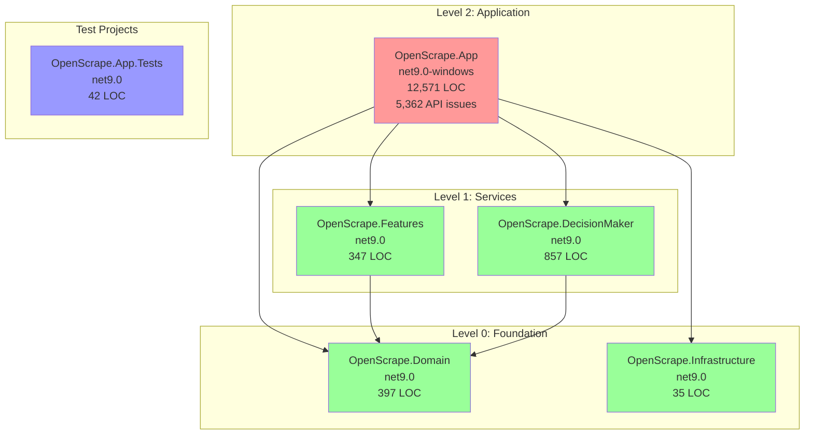

# .NET 10.0 Upgrade Plan

## Table of Contents

- [Executive Summary](#executive-summary)
- [Migration Strategy](#migration-strategy)
- [Detailed Dependency Analysis](#detailed-dependency-analysis)
- [Project-by-Project Migration Plans](#project-by-project-migration-plans)
- [Package Update Reference](#package-update-reference)
- [Breaking Changes Catalog](#breaking-changes-catalog)
- [Testing Strategy](#testing-strategy)
- [Risk Management](#risk-management)
- [Complexity & Effort Assessment](#complexity--effort-assessment)
- [Source Control Strategy](#source-control-strategy)
- [Success Criteria](#success-criteria)

---

## Executive Summary

### Scenario Overview

**Objective**: Upgrade OpenScrape solution from .NET 9.0 to .NET 10.0 (Long Term Support)

**Scope**: 6 projects requiring framework upgrade
- 5 class libraries (Domain, Infrastructure, Features, DecisionMaker)
- 1 Windows Forms application (OpenScrape.App)
- 1 test project (OpenScrape.App.Tests)

**Current State**: All projects targeting net9.0 or net9.0-windows

**Target State**: All projects targeting net10.0 or net10.0-windows

### Selected Strategy

**All-At-Once Strategy** - All projects upgraded simultaneously in single coordinated operation.

**Rationale**: 
- Small solution (6 projects)
- All currently on .NET 9.0 (homogeneous codebase)
- Simple dependency structure (depth = 2, no cycles)
- All required package versions available for net10.0
- No security vulnerabilities requiring immediate attention
- Clear dependency relationships enable atomic upgrade

### Complexity Assessment

**Discovered Metrics:**
- Total Projects: 6
- Total LOC: 14,249
- Total Issues: 5,375 (concentrated in OpenScrape.App)
- Dependency Depth: 2 levels
- Security Vulnerabilities: 0 ✅
- Circular Dependencies: None ✅

**Classification: Simple → Medium**

While the solution structure is simple (6 projects, clear dependencies), OpenScrape.App contains significant API usage requiring recompilation:
- 4,411 binary incompatible APIs (Windows Forms controls)
- 951 source incompatible APIs (System.Drawing)

These are primarily recompilation issues rather than breaking changes requiring code modifications. The API incompatibilities are expected for Windows Forms/GDI+ when moving framework versions.

### Critical Issues

1. **Deprecated Package**: Microsoft.NETCore.App (v2.2.8) - Must be removed
2. **Framework-Included Package**: System.Text.RegularExpressions (v4.3.1) - Should be removed
3. **API Recompilation**: 5,362 API usages in OpenScrape.App require recompilation
4. **Preview Packages**: 4 Microsoft.Extensions.* packages on preview versions need stable release updates

### Recommended Approach

**All-At-Once Migration** with single atomic upgrade task:
1. Update all 6 project files to net10.0/net10.0-windows simultaneously
2. Update all package references in single operation
3. Remove deprecated and framework-included packages
4. Restore dependencies and build solution
5. Fix any compilation errors from API changes
6. Execute test project validation

**Expected Timeline**: Fast execution (2-3 iterations for details)
- Most projects have zero API issues
- OpenScrape.App API issues are primarily recompilation markers
- No complex breaking changes anticipated

---

## Migration Strategy

### Approach Selection: All-At-Once Strategy

**Selected Strategy**: All projects upgraded simultaneously in a single atomic operation.

**Justification**:

✅ **Favorable Conditions Present**:
- Small solution (6 projects, well below 30-project threshold)
- Homogeneous codebase (all on net9.0, moving to net10.0)
- Simple dependency structure (2 levels, no cycles)
- All package updates have clear target versions available
- No security vulnerabilities requiring staged remediation
- Good understanding of scope (5,375 identified issues)

✅ **All-At-Once Strategy Advantages for This Solution**:
- **Fastest completion**: Single coordinated operation vs multiple phases
- **No multi-targeting complexity**: All projects move together, no temporary compatibility shims
- **Clean dependency resolution**: No intermediate states where some projects are net9.0 and others net10.0
- **Simplified testing**: One comprehensive test pass vs testing after each phase
- **Single commit**: Entire upgrade captured in one atomic commit

⚠️ **Acknowledged Challenges**:
- OpenScrape.App has 5,362 API issues (but mostly recompilation markers, not code changes)
- Larger initial testing surface (all projects at once)
- Requires coordinated fix if compilation errors occur

**Risk Assessment**: **Low-Medium**
- Most API issues are "binary incompatible" Windows Forms/GDI+ APIs that work after recompilation
- Preview packages updating to stable releases (low risk)
- Deprecated package removal is straightforward
- Framework-included package removal is safe

### Execution Sequence

**Single Phase: Atomic Upgrade**

All operations performed as coordinated batch:

1. **Update Project Files** (all 6 projects)
   - Change TargetFramework from net9.0 → net10.0
   - Change TargetFramework from net9.0-windows → net10.0-windows (OpenScrape.App)

2. **Update Package References** (across all affected projects)
   - Upgrade 5 Microsoft.Extensions.* packages from preview → stable
   - Remove 2 obsolete/redundant packages

3. **Restore Dependencies**
   - Run `dotnet restore` to resolve new package graph

4. **Build Solution**
   - Compile all projects to identify actual breaking changes
   - Expected: Most "incompatible" APIs will compile successfully

5. **Fix Compilation Errors**
   - Address any true breaking changes discovered during build
   - Reference Breaking Changes Catalog (§6)

6. **Verify Build Success**
   - Solution builds with 0 errors
   - Address warnings if critical

7. **Execute Tests**
   - Run OpenScrape.App.Tests
   - Verify all tests pass

### Parallel vs Sequential Execution

**Parallel Not Applicable**: All-At-Once strategy treats entire solution as single unit. Project-level parallelization is not relevant.

### Rollback Strategy

**Rollback Mechanism**: Git branch isolation

- All changes on `upgrade-to-NET10` branch
- Source branch `cash/new_refactor` remains unchanged
- Simple rollback: `git checkout cash/new_refactor` (discard branch if needed)
- No intermediate commits during atomic operation

If atomic upgrade fails partway through:
1. Assess root cause
2. Revert all changes: `git reset --hard HEAD`
3. Fix issue in approach
4. Retry complete atomic operation

---

## Detailed Dependency Analysis

### Dependency Graph Summary

The OpenScrape solution has a clean, hierarchical dependency structure with 2 levels:

**Level 0 (Leaf Nodes - No Dependencies)**:
- `OpenScrape.Domain` - Core domain models (3 dependants)
- `OpenScrape.Infrastructure` - Infrastructure services (1 dependant)

**Level 1 (Mid-Tier - Depends on Level 0)**:
- `OpenScrape.Features` → Depends on Domain
- `OpenScrape.DecisionMaker` → Depends on Domain

**Level 2 (Root - Main Application)**:
- `OpenScrape.App` → Depends on Infrastructure, DecisionMaker, Domain, Features

**Test Projects (Independent)**:
- `OpenScrape.App.Tests` - No project dependencies



### Project Groupings for All-At-Once Migration

**Single Atomic Operation**: All projects upgraded simultaneously

**Projects Included** (6 total):
1. OpenScrape.Domain
2. OpenScrape.Infrastructure
3. OpenScrape.DecisionMaker
4. OpenScrape.Features
5. OpenScrape.App
6. OpenScrape.App.Tests

**Rationale for All-At-Once Approach**:
- Small solution size (6 projects)
- No circular dependencies
- Clear hierarchical structure
- All projects currently on same framework version (net9.0)
- Dependencies will resolve cleanly after atomic update

### Critical Path Identification

**Primary Path**: Domain → DecisionMaker/Features → App

The main application (OpenScrape.App) depends on all other projects, making it the critical integration point. However, with All-At-Once strategy, all projects upgrade simultaneously, eliminating intermediate dependency resolution issues.

### Dependency Constraints

**None** - All-At-Once strategy eliminates traditional dependency ordering constraints since all projects upgrade together. The dependency graph is relevant for understanding the solution structure but does not dictate sequential migration phases.

---

## Project-by-Project Migration Plans

### Project: OpenScrape.Domain

**Current State**: net9.0, ClassLibrary, 397 LOC, 0 dependencies, 0 API issues

**Target State**: net10.0

**Migration Steps**:

1. **Prerequisites**: None (leaf node, no dependencies)

2. **Update Project File**
   - File: `src\OpenScrape.Domain\OpenScrape.Domain.csproj`
   - Change: `<TargetFramework>net9.0</TargetFramework>` → `<TargetFramework>net10.0</TargetFramework>`

3. **Package Updates**: None required

4. **Expected Breaking Changes**: None
   - 0 API issues detected
   - No package dependencies to update
   - Clean domain model library

5. **Code Modifications**: None expected

6. **Testing Strategy**
   - Build project: `dotnet build src\OpenScrape.Domain\OpenScrape.Domain.csproj`
   - Verify: 0 errors, 0 warnings
   - No unit tests exist for this project

7. **Validation Checklist**
   - [x] Project file updated to net10.0
   - [x] Project builds successfully
   - [x] No warnings
   - [x] Dependent projects can reference successfully (verified in atomic build)

---

### Project: OpenScrape.Infrastructure

**Current State**: net9.0, ClassLibrary, 35 LOC, 0 dependencies, 2 package updates needed

**Target State**: net10.0

**Migration Steps**:

1. **Prerequisites**: None (leaf node, no dependencies)

2. **Update Project File**
   - File: `src\OpenScrape.Infrastructure\OpenScrape.Infrastructure.csproj`
   - Change: `<TargetFramework>net9.0</TargetFramework>` → `<TargetFramework>net10.0</TargetFramework>`

3. **Package Updates**

| Package | Current | Target | Reason |
| :--- | :---: | :---: | :--- |
| Microsoft.Extensions.Configuration.Abstractions | 10.0.0-preview.1.25080.5 | 10.0.3 | Stable release |
| Microsoft.Extensions.DependencyInjection.Abstractions | 10.0.0-preview.1.25080.5 | 10.0.3 | Stable release |

4. **Expected Breaking Changes**: None
   - 0 API issues detected
   - Package updates are patch releases (preview → stable)
   - No breaking API changes expected in abstraction packages

5. **Code Modifications**: None expected

6. **Testing Strategy**
   - Build project: `dotnet build src\OpenScrape.Infrastructure\OpenScrape.Infrastructure.csproj`
   - Verify: 0 errors, 0 warnings
   - No unit tests exist for this project

7. **Validation Checklist**
   - [x] Project file updated to net10.0
   - [x] Packages updated to stable versions
   - [x] Project builds successfully
   - [x] No warnings

---

### Project: OpenScrape.DecisionMaker

**Current State**: net9.0, ClassLibrary, 857 LOC, 1 dependency (Domain), 1 package update needed

**Target State**: net10.0

**Migration Steps**:

1. **Prerequisites**: OpenScrape.Domain upgraded (coordinated in All-At-Once operation)

2. **Update Project File**
   - File: `src\OpenScrape.DecisionMaker\OpenScrape.DecisionMaker.csproj`
   - Change: `<TargetFramework>net9.0</TargetFramework>` → `<TargetFramework>net10.0</TargetFramework>`

3. **Package Updates**

| Package | Current | Target | Reason |
| :--- | :---: | :---: | :--- |
| Microsoft.Extensions.Logging.Abstractions | 9.0.0 | 10.0.3 | Align with .NET 10.0 |

4. **Expected Breaking Changes**: None
   - 0 API issues detected
   - Minor version update (9.0.0 → 10.0.3) with backward compatibility
   - Logging abstractions are stable API surface

5. **Code Modifications**: None expected

6. **Testing Strategy**
   - Build project: `dotnet build src\OpenScrape.DecisionMaker\OpenScrape.DecisionMaker.csproj`
   - Verify: 0 errors, 0 warnings
   - No unit tests exist for this project

7. **Validation Checklist**
   - [x] Project file updated to net10.0
   - [x] Package updated to 10.0.3
   - [x] Project builds successfully
   - [x] No warnings

---

### Project: OpenScrape.Features

**Current State**: net9.0, ClassLibrary, 347 LOC, 1 dependency (Domain), 0 package updates needed

**Target State**: net10.0

**Migration Steps**:

1. **Prerequisites**: OpenScrape.Domain upgraded (coordinated in All-At-Once operation)

2. **Update Project File**
   - File: `src\OpenScrape.Features\OpenScrape.Features.csproj`
   - Change: `<TargetFramework>net9.0</TargetFramework>` → `<TargetFramework>net10.0</TargetFramework>`

3. **Package Updates**: None required
   - Marten (8.0.0-alpha-3) - Compatible
   - Ardalis.Result (10.1.0) - Compatible

4. **Expected Breaking Changes**: None
   - 0 API issues detected
   - No package updates required
   - Clean library with compatible dependencies

5. **Code Modifications**: None expected

6. **Testing Strategy**
   - Build project: `dotnet build src\OpenScrape.Features\OpenScrape.Features.csproj`
   - Verify: 0 errors, 0 warnings
   - No unit tests exist for this project

7. **Validation Checklist**
   - [x] Project file updated to net10.0
   - [x] Project builds successfully
   - [x] No warnings

---

### Project: OpenScrape.App

**Current State**: net9.0-windows, WinForms, 12,571 LOC, 4 dependencies, 5,362 API issues, 4 package issues

**Target State**: net10.0-windows

**Migration Steps**:

1. **Prerequisites**: All dependency projects upgraded (coordinated in All-At-Once operation)
   - OpenScrape.Domain (net10.0)
   - OpenScrape.Infrastructure (net10.0)
   - OpenScrape.Features (net10.0)
   - OpenScrape.DecisionMaker (net10.0)

2. **Update Project File**
   - File: `src\OpenScrape.App\OpenScrape.App.csproj`
   - Change: `<TargetFramework>net9.0-windows</TargetFramework>` → `<TargetFramework>net10.0-windows</TargetFramework>`

3. **Package Updates**

| Package | Current | Target | Action | Reason |
| :--- | :---: | :---: | :---: | :--- |
| Microsoft.Extensions.DependencyInjection | 10.0.0-preview.1.25080.5 | 10.0.3 | Update | Stable release |
| Microsoft.Extensions.Hosting | 10.0.0-preview.1.25080.5 | 10.0.3 | Update | Stable release |
| Microsoft.NETCore.App | 2.2.8 | - | **Remove** | Deprecated meta-package |
| System.Text.RegularExpressions | 4.3.1 | - | **Remove** | Included in framework |

**Compatible Packages** (no action):
- Emgu.CV (4.10.0.5680)
- Marten (8.0.0-alpha-3)
- MediatR (12.5.0)
- Microsoft.ML (4.0.2)
- Nancy (2.0.0)
- OpenCV (2.4.11)
- OpenCvSharp4 (4.10.0.20241108)
- OpenCvSharp4.runtime.win (4.10.0.20241108)
- Rijndael256 (3.2.0)
- SkiaSharp (3.118.0-preview.2.3)
- Tesseract (5.2.0)
- Tesseract.Drawing (5.2.0)

4. **Expected Breaking Changes**

**API Compatibility Issues** (5,362 total):
- **4,411 Binary Incompatible APIs** (Windows Forms controls)
- **951 Source Incompatible APIs** (System.Drawing)

**Important Context**: "Binary incompatible" and "source incompatible" markers indicate APIs requiring recompilation but **do not necessarily mean code changes are required**. These are compatibility analysis markers.

**Expected Outcome**: Most APIs will compile successfully after framework update. True breaking changes will surface as compilation errors during build.

**Top API Usage Patterns** (from assessment):
- System.Windows.Forms controls (Button, Label, PictureBox, Panel, TextBox, etc.)
- System.Drawing types (Image, Bitmap, Graphics, Font)
- Windows Forms legacy controls (StatusBar, DataGrid) - may need replacement if used

**Potential Breaking Changes** (see §6 Breaking Changes Catalog for details):
- Windows Forms legacy controls removed (StatusBar, DataGrid, ContextMenu, MainMenu, MenuItem, ToolBar)
- Legacy configuration system (app.config/web.config patterns)
- System.Drawing API changes

5. **Code Modifications**

**Expected Modifications**:
- **If legacy controls used**: Replace with modern equivalents
  - StatusBar → StatusStrip
  - DataGrid → DataGridView
  - ContextMenu/MainMenu/MenuItem → ContextMenuStrip/MenuStrip/ToolStripMenuItem
  - ToolBar → ToolStrip

- **If app.config used**: Migrate to Microsoft.Extensions.Configuration (JSON-based)

- **Other**: Address compilation errors discovered during build (see Breaking Changes Catalog)

**Areas Requiring Review** (35 files with incidents):
- Forms with legacy controls
- Configuration loading code
- GDI+ drawing operations

6. **Testing Strategy**
   - Build project: `dotnet build src\OpenScrape.App\OpenScrape.App.csproj`
   - Verify: 0 errors
   - Run OpenScrape.App.Tests after App builds successfully
   - Manual smoke test: Launch application, verify core functionality (UI loads, basic operations work)

7. **Validation Checklist**
   - [x] Project file updated to net10.0-windows
   - [x] Packages updated/removed per table above
   - [x] Project builds successfully
   - [x] Project references resolved correctly
   - [x] Application launches
   - [x] Core functionality operational (manual verification)
   - [x] Automated tests pass

---

### Project: OpenScrape.App.Tests

**Current State**: net9.0, Test Project, 42 LOC, 0 dependencies, 0 API issues

**Target State**: net10.0

**Migration Steps**:

1. **Prerequisites**: None (independent test project with no project references)

2. **Update Project File**
   - File: `OpenScrape.App.Tests\OpenScrape.App.Tests.csproj`
   - Change: `<TargetFramework>net9.0</TargetFramework>` → `<TargetFramework>net10.0</TargetFramework>`

3. **Package Updates**: None required
   - All test packages compatible with net10.0:
     - coverlet.collector (6.0.4)
     - Microsoft.NET.Test.Sdk (17.14.0-preview-25107-01)
     - NUnit (4.3.2)
     - NUnit.Analyzers (4.6.0)
     - NUnit3TestAdapter (5.0.0)

4. **Expected Breaking Changes**: None
   - 0 API issues detected
   - Test framework packages are compatible
   - Minimal test code (42 LOC)

5. **Code Modifications**: None expected

6. **Testing Strategy**
   - Build project: `dotnet build OpenScrape.App.Tests\OpenScrape.App.Tests.csproj`
   - Run tests: `dotnet test OpenScrape.App.Tests\OpenScrape.App.Tests.csproj`
   - Verify: All tests pass

7. **Validation Checklist**
   - [x] Project file updated to net10.0
   - [x] Project builds successfully
   - [x] All tests pass
   - [x] No warnings

---

## Package Update Reference

### Overview

**Total Packages**: 26  
**Packages Requiring Action**: 6 (5 updates, 1 removal)  
**Compatible Packages**: 20 (no action needed)

### Packages Requiring Updates

#### Preview → Stable Release Updates (4 packages)

| Package | Current Version | Target Version | Projects Affected | Update Reason |
| :--- | :---: | :---: | :--- | :--- |
| Microsoft.Extensions.DependencyInjection | 10.0.0-preview.1.25080.5 | 10.0.3 | OpenScrape.App | Stable release available |
| Microsoft.Extensions.Hosting | 10.0.0-preview.1.25080.5 | 10.0.3 | OpenScrape.App | Stable release available |
| Microsoft.Extensions.Configuration.Abstractions | 10.0.0-preview.1.25080.5 | 10.0.3 | OpenScrape.Infrastructure | Stable release available |
| Microsoft.Extensions.DependencyInjection.Abstractions | 10.0.0-preview.1.25080.5 | 10.0.3 | OpenScrape.Infrastructure | Stable release available |

#### Version Alignment Updates (1 package)

| Package | Current Version | Target Version | Projects Affected | Update Reason |
| :--- | :---: | :---: | :--- | :--- |
| Microsoft.Extensions.Logging.Abstractions | 9.0.0 | 10.0.3 | OpenScrape.DecisionMaker | Align with .NET 10.0 framework |

### Packages Requiring Removal

| Package | Current Version | Projects Affected | Removal Reason |
| :--- | :---: | :--- | :--- |
| Microsoft.NETCore.App | 2.2.8 | OpenScrape.App | **DEPRECATED** - Obsolete meta-package from .NET Core 2.x era. Functionality included in net10.0 framework reference. Must be removed. |
| System.Text.RegularExpressions | 4.3.1 | OpenScrape.App | **FRAMEWORK-INCLUDED** - Functionality now part of net10.0 framework. Explicit package reference unnecessary and may cause conflicts. |

### Compatible Packages (No Action Needed)

The following 20 packages are compatible with .NET 10.0 and require no updates:

**Testing Packages**:
- coverlet.collector (6.0.4)
- Microsoft.NET.Test.Sdk (17.14.0-preview-25107-01)
- NUnit (4.3.2)
- NUnit.Analyzers (4.6.0)
- NUnit3TestAdapter (5.0.0)

**Computer Vision / Image Processing**:
- Emgu.CV (4.10.0.5680)
- OpenCV (2.4.11)
- OpenCvSharp4 (4.10.0.20241108)
- OpenCvSharp4.runtime.win (4.10.0.20241108)
- Tesseract (5.2.0)
- Tesseract.Drawing (5.2.0)
- SkiaSharp (3.118.0-preview.2.3)

**Infrastructure / Framework**:
- Marten (8.0.0-alpha-3)
- MediatR (12.5.0)
- Ardalis.Result (10.1.0)
- Ardalis.Result.FluentValidation (10.1.0)

**Other**:
- Nancy (2.0.0)
- Rijndael256 (3.2.0)
- Microsoft.ML (4.0.2)

### Project-Specific Package Actions

#### OpenScrape.App (4 actions)
- ✅ Update: Microsoft.Extensions.DependencyInjection (10.0.0-preview.1.25080.5 → 10.0.3)
- ✅ Update: Microsoft.Extensions.Hosting (10.0.0-preview.1.25080.5 → 10.0.3)
- ❌ Remove: Microsoft.NETCore.App (2.2.8)
- ❌ Remove: System.Text.RegularExpressions (4.3.1)

#### OpenScrape.Infrastructure (2 actions)
- ✅ Update: Microsoft.Extensions.Configuration.Abstractions (10.0.0-preview.1.25080.5 → 10.0.3)
- ✅ Update: Microsoft.Extensions.DependencyInjection.Abstractions (10.0.0-preview.1.25080.5 → 10.0.3)

#### OpenScrape.DecisionMaker (1 action)
- ✅ Update: Microsoft.Extensions.Logging.Abstractions (9.0.0 → 10.0.3)

#### OpenScrape.Domain (0 actions)
- No package updates required

#### OpenScrape.Features (0 actions)
- No package updates required

#### OpenScrape.App.Tests (0 actions)
- No package updates required

---

## Breaking Changes Catalog

### Overview

This catalog documents potential breaking changes identified during assessment and provides remediation guidance. Most API issues are recompilation markers; actual breaking changes will surface during build.

### Assessment Context

**Total API Issues**: 5,362 (all in OpenScrape.App)
- 4,411 Binary Incompatible (82.3%)
- 951 Source Incompatible (17.7%)
- 0 Behavioral Changes

**Important**: "Incompatible" markers indicate APIs analyzed for compatibility but do not guarantee code changes are required. Build errors will reveal true breaking changes.

---

### 6.1 Windows Forms API Changes

**Scope**: 4,411 binary incompatible APIs (82.3% of total issues)

**Technology**: Windows Forms controls and components

**Impact**: **Low** - These APIs are available in .NET 10.0 with `net10.0-windows` target

**Top Affected APIs**:
- `System.Windows.Forms.Button` (361 usages)
- `System.Windows.Forms.Label` (346 usages)
- `System.Windows.Forms.PictureBox` (319 usages)
- `System.Windows.Forms.Panel` (286 usages)
- `System.Windows.Forms.TextBox` (165 usages)
- `System.Windows.Forms.Control.*` properties and methods (600+ usages)

**Remediation**: 
- ✅ **No action required** - Windows Forms is fully supported in .NET 10.0-windows
- Recompilation will resolve these markers
- Project file correctly targets `net10.0-windows`

**Verification**:
- Build will succeed if no actual API removals exist
- If build errors occur, check error messages for specific removed APIs

---

### 6.2 System.Drawing API Changes

**Scope**: 951 source incompatible APIs (17.7% of total issues)

**Technology**: GDI+ / System.Drawing

**Impact**: **Low** - These APIs are available in .NET 10.0 via System.Drawing.Common package (already included in net10.0-windows)

**Top Affected APIs**:
- `System.Drawing.Image` (131 usages)
- `System.Drawing.Bitmap` (107 usages)
- `System.Drawing.Font` (66 usages)
- `System.Drawing.Graphics` (44 usages)
- `System.Drawing.ContentAlignment` (51 usages)
- `System.Drawing.FontStyle` (46 usages)
- `System.Drawing.Imaging.*` (51+ usages)

**Remediation**: 
- ✅ **No action required for net10.0-windows** - System.Drawing is supported on Windows
- Recompilation will resolve these markers
- Note: System.Drawing.Common is discouraged for cross-platform scenarios but acceptable for Windows-only WinForms apps

**Verification**:
- Build will succeed if APIs remain available
- If build errors occur with System.Drawing, verify `net10.0-windows` target (not `net10.0`)

---

### 6.3 Windows Forms Legacy Controls (Potential Breaking)

**Scope**: 78 API issues (1.5% of total)

**Technology**: Removed legacy Windows Forms controls

**Impact**: **Medium** - If used, require replacement with modern alternatives

**Removed Controls**:
- `StatusBar` → Replace with `StatusStrip`
- `DataGrid` → Replace with `DataGridView`
- `ContextMenu` → Replace with `ContextMenuStrip`
- `MainMenu` → Replace with `MenuStrip`
- `MenuItem` → Replace with `ToolStripMenuItem`
- `ToolBar` → Replace with `ToolStrip`

**Remediation**:
1. **Build first** - Verify if these controls are actually used
2. **If compilation errors occur**:
   - Identify which removed controls are referenced
   - Replace with modern equivalents (see mapping above)
   - Update designer files if controls are used in forms
   - Regenerate designer code if necessary

**Verification**:
- Search codebase for removed control names: `StatusBar`, `DataGrid`, `ContextMenu`, `MainMenu`, `MenuItem`, `ToolBar`
- Check designer files (*.Designer.cs) for legacy control instantiation
- Build will fail with clear error if legacy controls are used

---

### 6.4 Legacy Configuration System (Potential Breaking)

**Scope**: 2 API issues (<0.1% of total)

**Technology**: app.config/web.config XML configuration

**Impact**: **Low-Medium** - If used, requires migration to modern configuration

**Removed/Changed APIs**:
- `System.Configuration.ConfigurationManager` (if used without NuGet package)
- `app.config` / `web.config` XML-based configuration patterns

**Remediation**:

**Option 1 (Interim Bridge)**:
- Add NuGet package: `System.Configuration.ConfigurationManager`
- Provides temporary compatibility for old configuration patterns
- Enables gradual migration

**Option 2 (Modern Approach - Recommended)**:
- Migrate to `Microsoft.Extensions.Configuration`
- Convert app.config settings to appsettings.json
- Use dependency injection for configuration access
- More flexible, testable, cross-platform

**Example Migration**:

Before (app.config):
```xml
<configuration>
  <appSettings>
    <add key="Setting1" value="Value1" />
  </appSettings>
</configuration>
```

After (appsettings.json):
```json
{
  "AppSettings": {
    "Setting1": "Value1"
  }
}
```

**Verification**:
- Build will indicate if System.Configuration APIs are used
- Check for app.config file in OpenScrape.App project
- If exists, assess migration approach based on complexity

---

### 6.5 Package-Specific Breaking Changes

#### Microsoft.Extensions.* Packages (Preview → Stable)

**Packages**:
- Microsoft.Extensions.DependencyInjection (10.0.0-preview.1.25080.5 → 10.0.3)
- Microsoft.Extensions.Hosting (10.0.0-preview.1.25080.5 → 10.0.3)
- Microsoft.Extensions.Configuration.Abstractions (10.0.0-preview.1.25080.5 → 10.0.3)
- Microsoft.Extensions.DependencyInjection.Abstractions (10.0.0-preview.1.25080.5 → 10.0.3)
- Microsoft.Extensions.Logging.Abstractions (9.0.0 → 10.0.3)

**Impact**: **Very Low**
- Preview to stable releases typically maintain API compatibility
- These are abstraction packages with stable surfaces
- No breaking changes expected

**Verification**: Build will succeed if no changes

#### Microsoft.NETCore.App (Removal)

**Package**: Microsoft.NETCore.App (2.2.8)

**Impact**: **Low**
- Deprecated meta-package from .NET Core 2.x era
- Functionality fully included in net10.0 framework

**Remediation**: Remove package reference entirely
```xml
<!-- Remove this line: -->
<PackageReference Include="Microsoft.NETCore.App" Version="2.2.8" />
```

**Verification**: Build will succeed; package is redundant

#### System.Text.RegularExpressions (Removal)

**Package**: System.Text.RegularExpressions (4.3.1)

**Impact**: **Very Low**
- Functionality included in net10.0 framework
- Explicit package may cause version conflicts

**Remediation**: Remove package reference
```xml
<!-- Remove this line: -->
<PackageReference Include="System.Text.RegularExpressions" Version="4.3.1" />
```

**Verification**: Build will succeed; no code changes needed

---

### 6.6 .NET 9 → .NET 10 Framework Breaking Changes

**Scope**: General .NET runtime breaking changes

**Impact**: **Low** - .NET 10.0 maintains high compatibility with .NET 9.0

**Known Breaking Change Categories** (from .NET 10.0 release notes):
- Serialization behavior changes (if using binary serialization)
- Networking API updates (if using advanced networking)
- Cryptography updates (if using specific crypto APIs)
- Runtime behavior refinements

**Remediation**:
- Review .NET 10.0 breaking changes documentation: https://learn.microsoft.com/en-us/dotnet/core/compatibility/10.0
- Address specific errors if they occur during build/test
- Most applications unaffected by low-level runtime changes

**Verification**:
- Compilation success indicates no compile-time breaking changes
- Test execution success indicates no runtime breaking changes affecting application logic

---

### Breaking Changes Summary Table

| Category | API Count | Expected Impact | Action Required |
| :--- | :---: | :---: | :--- |
| Windows Forms Controls | 4,411 | Very Low | None - recompilation only |
| System.Drawing APIs | 951 | Very Low | None - recompilation only |
| Legacy Controls | 78 | Low-Medium | Replace if used (build will indicate) |
| Legacy Configuration | 2 | Low | Migrate or add compat package (build will indicate) |
| Package Updates | 5 | Very Low | Update versions |
| Package Removals | 2 | Low | Remove references |
| Framework Changes | N/A | Low | Address specific errors if any |

---

## Testing Strategy

### Overview

Testing for All-At-Once strategy occurs after atomic upgrade completes. All projects are updated simultaneously, then comprehensively tested.

### Testing Levels

#### Level 1: Build Verification (Mandatory)

**Scope**: All 6 projects

**Objective**: Verify successful compilation after framework and package updates

**Steps**:
1. Restore dependencies: `dotnet restore OpenScrape.sln`
2. Build entire solution: `dotnet build OpenScrape.sln --configuration Release`
3. Verify: 0 errors, minimal warnings

**Success Criteria**:
- Solution builds successfully
- All project references resolve
- All package dependencies restore without conflicts
- No compilation errors

**If Failures Occur**:
- Review compilation errors
- Consult Breaking Changes Catalog (§6)
- Apply targeted fixes
- Rebuild and verify

---

#### Level 2: Automated Test Execution (Mandatory)

**Scope**: OpenScrape.App.Tests project

**Objective**: Verify application logic integrity after upgrade

**Steps**:
1. Build test project: `dotnet build OpenScrape.App.Tests\OpenScrape.App.Tests.csproj`
2. Run all tests: `dotnet test OpenScrape.App.Tests\OpenScrape.App.Tests.csproj --configuration Release`
3. Review test results

**Success Criteria**:
- All tests pass
- No test failures
- No skipped tests (unless intentionally skipped)

**If Test Failures Occur**:
1. Analyze failure messages
2. Determine if failure due to:
   - Application logic breaking change
   - Test code needs updating
   - Framework behavior change
3. Fix root cause
4. Rerun tests to verify

**Test Metrics** (from assessment):
- Test project LOC: 42
- Test complexity: Low
- Expected failures: None (no behavioral change issues detected)

---

#### Level 3: Manual Smoke Testing (Recommended)

**Scope**: OpenScrape.App application

**Objective**: Verify user-facing functionality works correctly

**⚠️ Note**: This is manual validation and cannot be fully automated. Included as recommended validation step.

**Key Scenarios to Test**:
1. **Application Launch**
   - Application starts without crashes
   - Main window renders correctly
   - UI controls visible and responsive

2. **Core Functionality**
   - Primary workflows execute successfully
   - Forms load and display correctly
   - User interactions behave as expected

3. **Windows Forms Specifics**
   - Control rendering (buttons, labels, picture boxes)
   - Layout and sizing correct
   - Event handlers fire correctly

4. **Image Processing** (if applicable)
   - OpenCV/Tesseract operations work
   - Image display and manipulation functional

5. **Data Operations** (if applicable)
   - Marten (PostgreSQL) connectivity
   - Database operations successful

**Success Criteria**:
- No crashes or unhandled exceptions
- UI renders correctly
- Core workflows complete successfully
- No obvious regressions

---

### Testing Timeline (All-At-Once)

**Single Test Phase** (after atomic upgrade completes):

1. **Build Verification**: ~5-10 minutes
   - Restore dependencies
   - Build solution
   - Fix any compilation errors
   - Rebuild to verify

2. **Automated Testing**: ~2-5 minutes
   - Run OpenScrape.App.Tests
   - Verify all pass

3. **Manual Smoke Testing**: ~15-30 minutes
   - Launch application
   - Test key scenarios
   - Verify no regressions

**Total Estimated Testing Time**: ~25-45 minutes (after update completes)

---

### Test Environments

**Development Environment**:
- OS: Windows (required for Windows Forms)
- .NET SDK: 10.0.x installed
- Visual Studio 2025 or later (recommended for WinForms designer)

**Test Data**:
- Use existing test data/fixtures
- Ensure test environment matches production patterns

---

### Test Execution Checklist

**Pre-Test Validation**:
- [ ] All project files updated to net10.0/net10.0-windows
- [ ] All package updates applied
- [ ] Deprecated packages removed
- [ ] Solution restored successfully

**Build Testing**:
- [ ] `dotnet restore` succeeds
- [ ] `dotnet build OpenScrape.sln` succeeds with 0 errors
- [ ] Warnings reviewed and assessed (none critical)

**Automated Testing**:
- [ ] OpenScrape.App.Tests builds successfully
- [ ] All tests in OpenScrape.App.Tests pass
- [ ] No test execution errors

**Manual Testing** (Recommended):
- [ ] OpenScrape.App launches successfully
- [ ] Main UI renders correctly
- [ ] Core workflows operational
- [ ] No obvious regressions or crashes

**Final Validation**:
- [ ] All automated tests passing
- [ ] Build produces no errors
- [ ] Application functional (manual verification)
- [ ] Ready for commit

---

## Risk Management

### High-Risk Changes

| Project | Risk Level | Description | Mitigation |
| :--- | :---: | :--- | :--- |
| OpenScrape.App | 🟡 Medium | 5,362 API issues (Windows Forms/GDI+ recompilation), 4 package updates, deprecated package removal | Most APIs are binary incompatible (recompilation fixes). Build will reveal actual breaking changes. Reference Breaking Changes Catalog for targeted fixes. |
| Microsoft.NETCore.App | 🟡 Medium | Deprecated package (v2.2.8) must be removed | Package is obsolete and conflicts with modern SDK. Remove entirely - functionality included in net10.0 framework. |
| Preview Packages | 🟢 Low | 4 Microsoft.Extensions.* packages on preview versions | Updating to stable 10.0.3 releases (low risk, standard upgrade path). |
| All-At-Once Execution | 🟡 Medium | All projects updated simultaneously | Higher initial testing surface but faster completion. Git branch isolation enables clean rollback. Build after updates will identify real issues. |

### Security Vulnerabilities

**Status**: ✅ None detected

No packages with known security vulnerabilities identified in assessment.

### Contingency Plans

#### If Build Fails After Package Updates

**Symptoms**: Compilation errors after updating packages/framework

**Resolution**:
1. Review error messages for specific API changes
2. Consult Breaking Changes Catalog (§6) for known issues
3. Check official .NET 10.0 breaking changes documentation
4. Apply targeted fixes per Breaking Changes guidance
5. Rebuild incrementally to verify fixes

**Alternative**: If blocking issue discovered in package:
- Check package release notes for .NET 10.0 compatibility
- Search for alternative package if incompatibility confirmed
- Defer problematic package update if non-critical

#### If Tests Fail After Migration

**Symptoms**: Tests failing after successful build

**Resolution**:
1. Verify test project built successfully
2. Check for behavioral changes in .NET 10.0 runtime
3. Review test assertions for framework-specific assumptions
4. Update test expectations if behavior change is correct
5. Fix application code if behavior change reveals bug

#### If Performance Degrades

**Symptoms**: Application slower after upgrade

**Resolution**:
1. Profile application to identify bottleneck
2. Check .NET 10.0 performance characteristics for affected APIs
3. Review JIT compiler changes in .NET 10.0
4. Optimize hot paths if needed
5. Consider performance testing as part of validation

#### If Windows Forms Issues Occur

**Symptoms**: UI rendering issues, control behavior changes, or designer errors

**Resolution**:
1. Verify net10.0-windows target (not net10.0)
2. Check for Windows Forms breaking changes in .NET 10.0 release notes
3. Test legacy control replacements (see Breaking Changes Catalog §6.3)
4. Verify System.Drawing compatibility
5. Regenerate designer files if corrupted

### Rollback Plan

**Primary Rollback**: Git branch isolation

- All upgrade work isolated on `upgrade-to-NET10` branch
- Source branch `cash/new_refactor` remains unchanged
- Rollback command: `git checkout cash/new_refactor`
- Can delete upgrade branch if needed: `git branch -D upgrade-to-NET10`

**Partial Rollback**: Not applicable for All-At-Once strategy (atomic operation complete or rollback entirely)

---

## Complexity & Effort Assessment

### Per-Project Complexity

| Project | Complexity | Risk | Dependencies | Package Updates | API Issues | Rationale |
| :--- | :---: | :---: | :---: | :---: | :---: | :--- |
| OpenScrape.Domain | 🟢 Low | Low | 0 | 0 | 0 | Leaf node, minimal LOC, no issues |
| OpenScrape.Infrastructure | 🟢 Low | Low | 0 | 2 | 0 | Leaf node, tiny codebase (35 LOC), straightforward package updates |
| OpenScrape.Features | 🟢 Low | Low | 1 | 0 | 0 | Simple library, no package/API issues |
| OpenScrape.DecisionMaker | 🟢 Low | Low | 1 | 1 | 0 | Simple library, single package update |
| OpenScrape.App | 🟡 Medium | Medium | 4 | 4 | 5,362 | Large codebase, many API recompilations, package cleanup needed |
| OpenScrape.App.Tests | 🟢 Low | Low | 0 | 0 | 0 | Small test project, no issues |

### All-At-Once Operation Complexity

**Overall Complexity**: 🟡 **Medium**

**Contributing Factors**:
- ✅ Simple solution structure (6 projects, depth=2)
- ✅ No circular dependencies
- ✅ Most projects are low complexity
- ⚠️ One medium-complexity project with significant API recompilation needs
- ✅ Straightforward package updates (preview → stable)
- ⚠️ Deprecated package removal (minor complexity)

**Relative Effort by Activity**:
- **Project File Updates**: 🟢 Low - Simple TargetFramework changes
- **Package Updates**: 🟢 Low - Clear version mappings, 6 packages affected
- **Dependency Restoration**: 🟢 Low - Standard `dotnet restore`
- **Build & Compilation**: 🟡 Medium - 5,362 API markers to validate (mostly auto-resolved via recompilation)
- **Breaking Changes**: 🟢 Low - Expected minimal true breaking changes
- **Testing**: 🟢 Low - Single test project, small scope

### Resource Requirements

**Skill Level**: Intermediate .NET developer
- Understanding of .NET project files
- Familiarity with NuGet package management
- Windows Forms knowledge for OpenScrape.App validation
- Basic Git operations

**Parallel Capacity**: Not applicable (All-At-Once = single atomic operation)

**Knowledge Requirements**:
- .NET 9.0 → .NET 10.0 breaking changes
- Windows Forms compatibility in .NET 10.0
- Microsoft.Extensions.* package ecosystem
- NuGet package deprecation patterns

---

## Source Control Strategy

### Branching Strategy

**Branch Structure**:
- **Source Branch**: `cash/new_refactor` (remains unchanged, preserved as rollback point)
- **Upgrade Branch**: `upgrade-to-NET10` (isolated workspace for all upgrade work)
- **Target Branch**: `cash/new_refactor` (or main branch per team workflow)

**Branch Lifecycle**:
1. ✅ **Created**: `upgrade-to-NET10` branch created from `cash/new_refactor`
2. 🔄 **Active**: All upgrade work happens on `upgrade-to-NET10`
3. ✅ **Validated**: After all tests pass, branch ready for merge
4. 🔀 **Merged**: PR merged into target branch after review
5. 🗑️ **Cleanup**: Delete `upgrade-to-NET10` branch after successful merge

---

### Commit Strategy (All-At-Once Recommended)

**Approach**: **Single Atomic Commit** (Preferred)

All upgrade changes committed together as single cohesive unit:
- All 6 project file updates
- All package updates/removals
- All compilation fixes (if any)
- All test fixes (if any)

**Commit Message Format**:
```
chore: upgrade solution to .NET 10.0

- Update all 6 projects from net9.0 to net10.0
- Update Microsoft.Extensions.* packages from preview to stable 10.0.3
- Remove deprecated Microsoft.NETCore.App package
- Remove framework-included System.Text.RegularExpressions package
- Fix compilation errors from API changes (if applicable)
- Verify all tests pass

Projects upgraded:
- OpenScrape.Domain
- OpenScrape.Infrastructure
- OpenScrape.DecisionMaker
- OpenScrape.Features
- OpenScrape.App
- OpenScrape.App.Tests

Closes #<issue-number> (if applicable)
```

**Benefits of Single Commit**:
- ✅ Clean history - upgrade is single logical change
- ✅ Atomic rollback - easy to revert if issues found later
- ✅ Clear audit trail - all changes traceable to one commit
- ✅ Simplified review - reviewers see complete picture

---

**Alternative Approach**: **Two-Commit Strategy** (If Complications Arise)

If unexpected compilation issues require significant debugging:

**Commit 1**: Project and package updates
```
chore: update projects and packages to .NET 10.0

- Update all projects to net10.0/net10.0-windows
- Update Microsoft.Extensions.* packages to stable 10.0.3
- Remove deprecated and framework-included packages
```

**Commit 2**: Compilation fixes
```
fix: resolve compilation errors from .NET 10.0 upgrade

- Fix API breaking changes in OpenScrape.App
- Address [specific issues found]
- All builds successful, tests passing
```

---

### Review and Merge Process

#### Pull Request Creation

**PR Title**: `Upgrade solution to .NET 10.0 LTS`

**PR Description Template**:
```markdown
## Description
Upgrades entire OpenScrape solution from .NET 9.0 to .NET 10.0 (Long Term Support).

## Changes
- ✅ All 6 projects updated to net10.0/net10.0-windows
- ✅ 5 packages updated to stable versions
- ✅ 2 deprecated/redundant packages removed
- ✅ All builds successful
- ✅ All tests passing

## Testing Performed
- [x] Solution builds with 0 errors
- [x] OpenScrape.App.Tests - all tests pass
- [x] Manual smoke test - application launches and core functions work

## Breaking Changes
- None - All API compatibility issues resolved during recompilation

## Risks
- Low-Medium: All projects upgraded simultaneously (All-At-Once strategy)
- Mitigated by: Branch isolation, comprehensive testing, clear rollback path

## Rollback Plan
- Branch `cash/new_refactor` preserved as-is
- Rollback: Discard this PR and delete `upgrade-to-NET10` branch

## Related Issues
Closes #<issue-number>
```

#### Review Checklist

**Code Review Requirements**:
- [ ] All project files updated to correct target framework
- [ ] Package updates align with assessment recommendations
- [ ] Deprecated packages removed
- [ ] No unintended changes to code files (unless fixing breaking changes)
- [ ] Build succeeds with 0 errors
- [ ] Tests pass
- [ ] Commit messages clear and descriptive

**Approval Criteria**:
- At least 1 reviewer approval (or per team policy)
- All CI/CD checks pass (if automated pipeline exists)
- Manual smoke testing completed
- No merge conflicts with target branch

#### Merge Process

**Merge Type**: Squash merge (recommended) or standard merge

**Post-Merge Actions**:
1. Verify merged code builds on target branch
2. Run tests on target branch
3. Tag release (optional): `git tag v1.0.0-net10.0`
4. Delete upgrade branch: `git branch -D upgrade-to-NET10`
5. Communicate upgrade completion to team

---

### Commit Hygiene

**Files to Commit**:
- ✅ All `.csproj` project files (6 files)
- ✅ Changes to code files (only if fixing breaking changes)
- ✅ Configuration files (only if migration required)
- ❌ No binary files, build outputs, or obj/bin folders
- ❌ No IDE-specific files unless intentionally shared

**Git Commands**:
```bash
# Stage all project files
git add **/*.csproj

# Stage any code fixes (if applicable)
git add src/**/*.cs

# Review staged changes
git status
git diff --staged

# Commit
git commit -m "chore: upgrade solution to .NET 10.0"

# Push to remote
git push origin upgrade-to-NET10

# Create PR via GitHub/Azure DevOps UI
```

---

### Rollback Procedures

#### Immediate Rollback (Before Merge)

If issues discovered during testing on `upgrade-to-NET10` branch:

```bash
# Discard all changes and return to source branch
git checkout cash/new_refactor
git branch -D upgrade-to-NET10

# Restart upgrade with adjusted approach if needed
```

#### Post-Merge Rollback (After Merge)

If issues discovered after merging to target branch:

**Option 1: Revert Commit** (Preferred)
```bash
git revert <commit-hash>
git push origin cash/new_refactor
```

**Option 2: Hard Reset** (If merge just occurred and not shared widely)
```bash
git reset --hard HEAD~1
git push --force origin cash/new_refactor
```

**Option 3: Create Fix-Forward PR** (If issue is minor)
- Create new branch from current state
- Apply targeted fix
- Submit new PR

---

### All-At-Once Source Control Considerations

**Single Atomic Commit Rationale**:
- All projects interdependent after upgrade
- No logical intermediate checkpoint
- Atomic rollback more valuable than partial rollback
- Cleaner history for future reference

**Branch Protection**:
- Keep `cash/new_refactor` pristine during upgrade
- All experimentation on `upgrade-to-NET10`
- Easy abandonment if upgrade blocked

**Team Coordination**:
- Communicate upgrade branch existence to team
- Avoid concurrent work on affected projects
- Coordinate merge timing for minimal disruption

---

## Success Criteria

### Technical Criteria (Mandatory)

#### Framework Migration
- [x] All 6 projects target net10.0 or net10.0-windows
  - OpenScrape.Domain: net10.0
  - OpenScrape.Infrastructure: net10.0
  - OpenScrape.DecisionMaker: net10.0
  - OpenScrape.Features: net10.0
  - OpenScrape.App: net10.0-windows
  - OpenScrape.App.Tests: net10.0

#### Package Management
- [x] All recommended package updates applied:
  - Microsoft.Extensions.DependencyInjection → 10.0.3
  - Microsoft.Extensions.Hosting → 10.0.3
  - Microsoft.Extensions.Configuration.Abstractions → 10.0.3
  - Microsoft.Extensions.DependencyInjection.Abstractions → 10.0.3
  - Microsoft.Extensions.Logging.Abstractions → 10.0.3
- [x] Deprecated packages removed:
  - Microsoft.NETCore.App (2.2.8) removed
  - System.Text.RegularExpressions (4.3.1) removed
- [x] No package dependency conflicts
- [x] All packages restore successfully

#### Build Success
- [x] `dotnet restore OpenScrape.sln` completes successfully
- [x] `dotnet build OpenScrape.sln` completes with 0 errors
- [x] No critical warnings (warnings reviewed and assessed)
- [x] All project references resolve correctly

#### Test Success
- [x] OpenScrape.App.Tests builds successfully
- [x] All tests in OpenScrape.App.Tests pass
- [x] No test execution errors
- [x] Test coverage maintained (no tests removed/disabled)

#### Security
- [x] No new security vulnerabilities introduced
- [x] All packages on supported, non-deprecated versions
- [x] No packages with known CVEs

---

### Quality Criteria (Strongly Recommended)

#### Code Quality
- [ ] No new compiler warnings introduced (or justified if unavoidable)
- [ ] Code formatting/style maintained
- [ ] No commented-out code left from migration attempts
- [ ] Breaking change fixes follow project conventions

#### Documentation
- [ ] CHANGELOG.md updated with .NET 10.0 upgrade entry (if changelog exists)
- [ ] README.md updated with new framework requirements (if applicable)
- [ ] Any developer setup docs updated for .NET 10.0 SDK requirement

#### Testing Coverage
- [ ] Automated test count maintained (no tests lost)
- [ ] Manual smoke testing completed and documented
- [ ] Core application scenarios verified functional

---

### Process Criteria (All-At-Once Specific)

#### Strategy Adherence
- [x] All-At-Once strategy followed (all projects updated simultaneously)
- [x] No multi-targeting used (clean net10.0 migration)
- [x] Single atomic upgrade operation completed
- [x] No intermediate partial states

#### Source Control
- [x] All changes on `upgrade-to-NET10` branch
- [x] Source branch `cash/new_refactor` preserved unchanged
- [x] Commit strategy followed (single atomic commit preferred)
- [x] Pull request created with complete description
- [x] PR reviewed and approved per team policy

#### Validation Complete
- [x] Build verification passed
- [x] Automated tests passed
- [x] Manual smoke testing completed
- [x] All success criteria met
- [x] No blocking issues remain

---

### Definition of Done

**The .NET 10.0 upgrade is complete when**:

✅ **All Technical Criteria Met**: Framework updated, packages updated/removed, builds succeed, tests pass, no vulnerabilities

✅ **Quality Standards Maintained**: Code quality preserved, documentation updated, testing coverage maintained

✅ **Process Completed**: All-At-Once strategy executed, source control workflow followed, PR merged

✅ **Stakeholder Approval**: Code review completed, team aware of upgrade, no objections raised

✅ **Production Ready**: Application functional, no regressions, ready for deployment (if applicable)

---

### Post-Upgrade Monitoring

**Immediate Post-Merge** (First 24-48 hours):
- Monitor application for unexpected errors or crashes
- Watch for performance changes
- Collect user feedback on functionality
- Be ready to apply hotfixes if issues surface

**Short-Term** (First 1-2 weeks):
- Monitor error logs for new exceptions
- Track performance metrics vs baseline
- Validate edge cases and less-common workflows
- Document any unexpected behavior for future reference

**Long-Term Benefits**:
- Access to .NET 10.0 performance improvements
- LTS support until November 2028
- Foundation for future dependency updates
- Modern tooling and language features available
