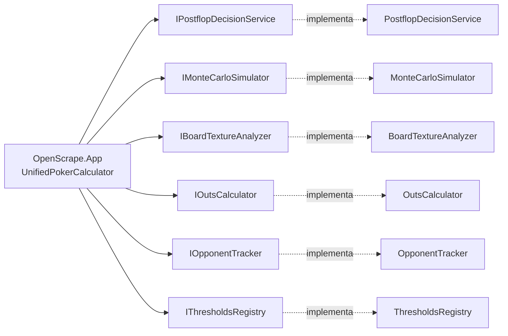

# OpenScrape.DecisionMaker — Design Técnico

> Cómo está construido el motor de decisión: pipeline `DetermineAction`, equity híbrido (exact + MC), tracking thread-safe, inversión de dependencias completa hacia App, ~25 constantes algorítmicas inmutables y dos servicios con anomalías documentadas.

---

## Interface

`OpenScrape.DecisionMaker` expone 4 superficies públicas:

1. **13 interfaces de servicio** — contratos para inversión de dependencias hacia `OpenScrape.App`.
2. **Algoritmos puros (estáticos o instanciables)** — `BitHandEvaluator`, `MonteCarloSimulator`, `OutsCalculator`, `BoardTextureAnalyzer`, `PreflopEquityCalculator` (sin interfaz).
3. **DTOs inmutables** — `PostflopDecisionInput`, `DecisionRequest`, `DecisionResult`, `PostflopDecisionResult`.
4. **Constantes algorítmicas** — `PokerConstants` (~25 valores derivados de teoría del poker).

### 1. Interfaces de servicio (13)

| Interfaz | Implementación | Símbolos clave |
|----------|----------------|----------------|
| `IPostflopDecisionService` | `PostflopDecisionService` | `DetermineAction(PostflopDecisionInput) → PostflopDecisionResult` 🟢 |
| `IMonteCarloSimulator` | `MonteCarloSimulator` | `CalculateEquity(...) → EquityResult` 🟡 (referencia tipo `nested`) |
| `IOutsCalculator` | `OutsCalculator` | `CalculateOuts(...) → OutsResult` 🟡 (referencia tipo `nested`) |
| `IBoardTextureAnalyzer` | `BoardTextureAnalyzer` | `Analyze`, `AnalyzeBoardChange`, `AnalyzeInitialBoard`, `ClassifyRiverCard` 🟢 |
| `IBetSizingService` | `BetSizingService` | `CalculateDynamicBetSize(...)` 🟢 |
| `IDangerPenaltyCalculator` | `DangerPenaltyCalculator` | `Calculate(...) → DangerPenaltyResult` 🟢 |
| `IImpliedOddsCalculator` | `ImpliedOddsCalculator` | `CalculateImpliedOddsFactor`, `CalculateReverseImpliedOdds` 🟢 |
| `IRangePolarizer` | `RangePolarizer` | `GetOptimalRangeType(...)` 🟢 |
| `IThresholdsRegistry` | `ThresholdsRegistry` | `Get(BoardPosition, HandSituation) → StreetThresholds` 🟢 |
| `IOpponentTracker` | `OpponentTracker` | `RegisterSeatAlias`, `RecordPostflopAction`, `GetTypeForPosition`, `GetAdjustedFoldEquity` 🟢 |
| `IEquityCalculatorService` | `EquityCalculatorService` | `CalculateFullEquity(...) → FullEquityAnalysis` 🟡 (referencia tipo `nested`) |
| `IStrategyAnalyzerService` | `StrategyAnalyzerService` | `Analyze(sessions) → StrategyAnalysisResult` 🟢 |
| `IStrategyBacktester` | `StrategyBacktester` | `RunBacktest(sessions) → BacktestResult` 🟢 |
| `IBankrollTrackerService` | `BankrollTrackerService` | `CalculateRiskOfRuin`, `GetSnapshot` 🟢 |
| `IExploitabilityCalculator` | `ExploitabilityCalculator` | `RecordDecision`, `GetTopLeaks` 🟢 |
| `IAutoCalibrationService` | `AutoCalibrationService` | `PreviewAndApply(topLeaks) → CalibrationResult` 🔴 (BUG OldValue) |
| `IPreflopAnalyzer` | `PreflopAnalyzer` (estático + impl trivial) | `IsPreflopAggressor`, `HasRangeAdvantageOnBoard`, `DetectDonkBet` 🟡 |

### 2. Algoritmos sin interfaz

| Símbolo | Razón | Notas |
|---------|-------|-------|
| `PreflopEquityCalculator` | No tiene interface declarada | Consumido directamente por `EquityCalculatorService`. Tabla estática de 169 manos heads-up. 🟡 |
| `HandEvaluator` (legacy) | Sin interface y sin DI | Brute-force `C(7,5)`. Coexiste con `BitHandEvaluator` sin justificación. 🟡 |

### 3. DTOs y records públicos

| DTO | Tipo C# | Campos | Mutabilidad |
|-----|---------|--------|-------------|
| `PostflopDecisionInput` | `record` | 6 required + 36 con defaults (equity, street, situation, board texture, posiciones, profiles villano, flags cross-street, R/I outs, kicker strength, etc.) | Inmutable 🟢 |
| `PostflopDecisionResult` | `record` | `Action`, `BetSize`, `DecisionTag`, `Reason`, debug fields | Inmutable 🟢 |
| `DecisionRequest` | `sealed record` | DTO del facade `IPokerCalculator` (vive en App pero el record vive aquí) | Inmutable 🟢 |
| `DecisionResult` | `sealed record` | Output del facade | Inmutable 🟢 |
| `PostflopGameContext` | `sealed record` | Estado cross-street: `HeroBet*`, `VillainBet*`, sizes, flags (`FloatedFlop`, `TurnCalledWithFlushDanger`, `IsAnyoneAllIn`) | Inmutable + helpers `With*` 🟢 |
| `BetSizingOption` | `record` | (definido en `BetSizingService`) | Inmutable 🟢 |
| `BoardTextureResult`, `BoardChangeResult` | `record` | (definidos en `BoardTextureAnalyzer`) | Inmutables 🟢 |
| `BacktestResult`, `DecisionDivergence` | `class` | (definidos en `StrategyBacktester`) | Mutable 🟡 |
| `StrategyAnalysisResult`, `PositionStats`, `StreetStats`, `SituationStats`, `SessionSummary`, `EquityVsOutcome` | (definidos en `StrategyAnalyzerService`) | 🟢 |
| `CalibrationResult`, `ParameterAdjustment`, `CalibrationPreview` | (definidos en `AutoCalibrationService`) | 🟡 |

### 4. Enums públicos

| Enum | Origen | Valores |
|------|--------|---------|
| `BetSizeCategory` | `PostflopDecisionService.cs` | `Underbet`, `Small`, `Medium`, `Large` |
| `BetSizingType` | `BetSizingService.cs` | `Standard`, `Reduced`, `Polarized`, `Merged`, `Overbet` |
| `RangeType` | `RangePolarizer.cs` | `Linear`, `Polarized`, `Condensed` |
| `BoardTextureCategory` | `BoardTextureAnalyzer.cs` | `Dry`, `SemiDry`, `SemiWet`, `Wet`, `Paired`, `Monotone` |
| `RiverCardType` | `BoardTextureAnalyzer.cs` (S22.2) | `Brick`, `Scare`, `OvercardToTopPair`, etc. |
| `PostflopAction` | `OpponentTracker.cs` | `Bet`, `Raise`, `Call`, `Check`, `Fold` |
| `LeakCategory` | `ExploitabilityCalculator.cs` | `Overfold`, `Underfold`, `Overbluff`, `Underbluff`, `BadSizing`, etc. |
| `HandRank` | `Domain` re-usado | `HighCard` … `RoyalFlush` |
| `KickerStrength` | `Domain` re-usado | `None`, `Weak`, `Medium`, `Strong` |

### 5. Struct público clave

| Struct | Propósito | Tamaño |
|--------|-----------|--------|
| `HandScore` (`readonly struct` en `IHandEvaluator.cs`) | Encapsula rank + 5 kickers en `long CompositeScore` (`rank<<20 \| k1<<16 \| … \| k5`) para comparación O(1) sin GC pressure | 16 bytes (struct) |

---

## Fluxo Principal

### Fluxo A — `DetermineAction` (pipeline postflop)

🟢 Único punto de entrada postflop. `PostflopDecisionService.DetermineAction(PostflopDecisionInput input)` ejecuta una pipeline en orden estricto. Detalle completo en `flowcharts/OpenScrape.DecisionMaker-DetermineAction.md`.

1. **Equity efectiva** (`PostflopDecisionService.cs:140-181`):
   ```
   effectiveEquity = equity − dangerPenalty + comboDrawBonus(textura) − reverseImpliedPenalty
   if (flushOrStraightCompletedWithoutHero) effectiveEquity = min(effectiveEquity, DangerCompletedDrawNoBetCap=45)
   effectiveEquity = max(0, effectiveEquity)
   ```
2. **Modo simplificado** — si `situation == RaiseOverLimper && IsSimplified == true` → corta-circuita a `DetermineSimplifiedAction` (5 bets fijos por equity tier IP/OOP). 🟢
3. **Carga de thresholds** — `ThresholdsRegistry.Get(boardPosition, situation) → StreetThresholds` con `FoldBelow`, `ThinValueAbove`, `ValueAbove`, `StrongValueAbove`, etc. 🟢
4. **Ajustes de thresholds** (orden estricto, cada ajuste suma o resta sobre `FoldBelow`/`ThinValueAbove`):
   1. **Range polarizer** (`RangePolarizer.GetOptimalRangeType`) → ajuste por textura/posición/SPR/street.
   2. **Facing-bet penalty** — categoría (Underbet 0, Small 1, Medium 4, Large 8) × street multiplier (Turn ×1.15, River ×1.30) + `VillainAggressionPenalty=3` si `villainShowedAggression`.
   3. **Multiway** — IP `extra × 2.0`; OOP `extra² × 6.0 × positionDamping × streetMult` (Turn ×1.2, River ×1.4); ×amplifier si villain IP+aggressor; reducido a ×0.5 con Flush+, ×0.7 con set en board no-paired IP (S22.5).
   4. **3-bet/4-bet/squeeze/limp-raise pot adjustment (S20.4)** — incrementos sobre FoldBelow y ThinValueAbove para pots inflados.
   5. **Blind vs Blind dinámico (S20.1)** — SBvsBB, BBvsSB, BBvsBTN.
   6. **Broadway-wet (S21.3)** — villano conecta más broadway combos.
   7. **Agresor / caller / donk** — agresor: −5/−3; caller: +2 FoldBelow.
   8. **Range narrowing (S13.1)** — villain apostó 2+ calles → `+RangeNarrowingPerStreet=3.0 × (n−1)`. Bet-check-bet aplica multiplier ×0.5 (debilidad).
   9. **Kicker quality (S16.2)** — TPTK −3 FoldBelow, TPWK OOP +2 FoldBelow.
   10. **Villain barreling** — barrel real (bet-bet) +5/+3; bet-check-bet +2.
   11. **Sizing escalation** — villain subió bet size entre streets → `+VillainSizingEscalationPenalty`.
   12. **Stats reales `villainFoldToBetPct`** — `>60→−5`, `>45→−2`, `<30→+4`, `<40→+2`; fallback a tipo estático (LP −4/−2, TAG 0, LAG facing −5/−3).
   13. **WSD%/Barrel/DonkBet/WTSD overrides (S18)** — perfiles fiables modulan thresholds.
   14. **SPR push/fold con interpolación suave** — `factor = 1 − spr/threshold`; aplica `−PushFoldFoldReduction × factor` y `+PushFoldValueIncrease × factor`. `isPushFold` solo en mitad inferior (SPR < threshold/2). Zona deep aplica `+SPRDeepFoldIncrease × factor`.
5. **C-bet path (S16.1)** — agresor preflop con equity en `[FoldBelow−15, FoldBelow)` apuesta a `GetCbetFrequency(street)` (Flop 65 %, Turn 45 %, River 30 %), modulada por textura/runout, broadway-wet y `CheckRaise%` del villain. (`PostflopDecisionService.cs:458-481`)
6. **C-bet mixing (S16.X)** — equity media `[FoldBelow, ThinValueAbove)` → check con probabilidad `1 − cbetFreq` (solo HU). (`PostflopDecisionService.cs:523-544`)
7. **Equity baja** → `HandleLowEquity` (semi-bluff con FE check, draw call, bluff puro, pot odds marginales, bluff catching turn/river con multipliers por villainType/runout/blockers, pot commitment expandido S22.7).
8. **Facing bet** → `HandleFacingBet` (push/fold mode, 3-bet pot defense S19.3, donk bet exploitation S18.1, raise vs underbet, raise con TwoPair+, OnePair en board sin flush peligroso, agresor vs donk, thin value strong hand, floating IP, pot commitment).
9. **No facing bet** → `HandleNoBet` (3-bet pot OOP S19.3, turn-river plan flush danger, river opportunity con draw completado, river delayed value tras check-check, check-raise OOP/IP con SPR guard S19.1 mixing, slow play, float exit con bad runout abort, probe bet, overbet con nuts, river sizing contextual, strong/value bets con sizing por SPR, pot control, stackoff planning S22.4, randomización adaptativa por villainType, thin value, double barrel con runout check).

Output: `PostflopDecisionResult { Action, BetSize, DecisionTag, Reason }`. 🟢

### Fluxo B — Equity híbrido (`MonteCarloSimulator.CalculateEquity`)

🟢 Selección por número de community cards. Detalle en `flowcharts/OpenScrape.DecisionMaker-MonteCarloSimulator.md`.

1. **Build villain range** — `BuildVillainCombos(opponentRange, deadCards, board)` pre-expande el rango y descarta combos bloqueados. `precomputedTotalWeight` se calcula una vez.
2. **Selección de método** según `community.Count`:
   - **5 (river)** → `ExactEnumerationRiver` (`MonteCarloSimulator.cs:142-237`). Itera C(45,2)=990 manos; evalúa con `BitHandEvaluator.EvaluateHandScore`; cuenta wins/ties/losses; retorna equity exacta + `IsReliable=true`, `SkippedSimulations=0`.
   - **4 (turn)** → `ExactEnumerationTurn` (`MonteCarloSimulator.cs:244-362`). Itera 45 rivers × C(44,2) opp hands ≈ 42 K evals; equity exacta.
   - **3 (flop)** → `RunMonteCarloSimulation(50_000)` (`MonteCarloSimulator.cs:369-424`). `Parallel.For` con `LocalInit/LocalFinally`, `ThreadLocal<CardDataOuts[]>` deck, `ThreadLocal<List<CardDataOuts>>` buffers, `Interlocked.Add` para acumular sin lock.
   - **0 (preflop)** → `RunMonteCarloSimulation(30_000)`.
3. **Cada iteración MC:**
   1. Reset deck local, remove board + dead + hero.
   2. `TryDrawFromRange(villainRange, 20 retries)` → draw villain hand respetando weights. Si bloqueado → skip iter (`SkippedSimulations++`), no contamina equity.
   3. Draw remaining community cards.
   4. Evaluate hero hand + villain hand → `HandScore` structs comparables vía `long.CompareTo` O(1).
   5. Win/tie/loss según comparación.
4. **Retorno:** `EquityResult { Equity, SkippedSimulations, TotalSimulations, IsReliable, BlockedComboPercentage }`. `IsReliable=false` si `BlockedComboPercentage > BlockedComboUnreliableThreshold=20.0`.

### Fluxo C — Cálculo de outs (`OutsCalculator.CalculateOuts`)

🟢 Inclusión-exclusión con tainted-outs y backdoor. Detalle en `flowcharts/OpenScrape.DecisionMaker-OutsCalculator.md`.

1. **Flush outs** — cuenta cartas del palo del hero que faltan en el board. Solo si hero tiene 4 del mismo palo (flush draw) o 3 + community 1 (backdoor flush flop).
2. **Straight outs** — busca ventanas de 5 ranks consecutivos donde el hero pueda completar. Categoriza OESD (open-ended, 8 outs) o gutshot (4 outs).
3. **Overlap outs** — si una out crea ambos (flush + straight), se cuenta una sola vez.
4. **Overcard outs** — solo si `community.Count >= 3` y hero no tiene mano hecha. Outs ajustadas por textura (S21.1).
5. **Backdoor outs** — solo en flop. Flush backdoor (3 mismo palo + hero con 1) +1.5; straight backdoor (3 ranks en ventana 5) +1.0. S21.4 overlap discount si coexisten.
6. **Tainted discount** (`CalculateTaintedOuts`, `OutsCalculator.cs:286-336`) — para cada out, evalúa si añadirla:
   - Pone 3+ mismo palo en board (flush draw para villano)
   - Parea el board (trips/full para villano)
   - Crea 3 ranks consecutivas (straight draw para villano)
   Categoriza outs en `cleanOuts` y `taintedOuts`. `EffectiveOuts = cleanOuts + taintedOuts × discount` con `discount = 0.7` si hero tiene flush draw, `0.3` si no.
7. **Combo draw** — flush draw + (OESD || gutshot). Marca semi-bluff premium.
8. **OutsToEquity** — `outs × cardsToCome × RuleOf2Multiplier` (regla del 2 turn / regla del 4 river).

### Fluxo D — Análisis de textura (`BoardTextureAnalyzer`)

🟢 Dos análisis ortogonales:

1. **`Analyze(ranks, suits) → BoardTextureResult`** (`BoardTextureAnalyzer.cs:62`, scoring en `:308-343`):
   - Calcula `wetnessScore` sumando 10 contribuciones (Monotone+35, TwoTone+15, Connected+20 o `connectedCount×8`, FlushPossibility+15, StraightPossibility+15, BroadwayHeavy+10, S21.3 BroadwayConnected+20, Paired-10, Trips-15, ExtraCards+5).
   - Categoriza con umbrales `WetnessDryMax=15`, `SemiDryMax=35`, `SemiWetMax=60`.
   - Devuelve flags ortogonales: `IsPaired`, `IsMonotone`, `HasFlushDraw`, `HasStraightDraw`, `IsBroadwayHeavy`.
2. **`AnalyzeBoardChange(previousBoard, newCard) → BoardChangeResult`** (`BoardTextureAnalyzer.cs:153`):
   - Detecta `FlushCompleted` (4+ mismo palo), `FlushDrawAppeared` (3 mismo palo nuevo), `StraightCompleted` (4+ consecutivas con prevHadDraw), `BoardPaired`, `OvercardAppeared`.
   - Calcula `DangerLevel ∈ [0,10]`: flushCompleted+4, flushDrawAppeared+2, straightCompleted+3, boardPaired+2, overcardAppeared+1.
3. **`AnalyzeInitialBoard(flop)`** (`BoardTextureAnalyzer.cs:349-387`) — variante para flop. 2+ same suit = `flushDrawPresent` (DangerLevel+1); 3+ = `flushPossible` (DangerLevel+3). Usado por `dangerousFlushBoard` en `PostflopDecisionService` para decidir si OnePair puede raise.
4. **`ClassifyRiverCard(prevBoard, riverCard) → RiverCardType`** (`BoardTextureAnalyzer.cs:227-249`, S22.2) — brick (no overcard, no flush, no straight) o scare (overcard al top pair, completes flush/straight). Modula bluff catch multipliers en `PostflopDecisionService` (×0.85 brick, ×1.15 scare).

### Fluxo E — Tracking de oponente (`OpponentTracker.RecordPostflopAction`)

🟢

1. **Resolución de identidad** — `RegisterSeatAlias(seat, alias)` mapea seat number → playerId (alias OCR). Necesario para reconciliar cambios de posición tras moving blinds. (`OpponentTracker.cs:234-248`)
2. **Acceso al profile** — `_profiles.GetOrAdd(playerId, new OpponentProfile(playerId))` (`ConcurrentDictionary`). Thread-safe sin locks externos.
3. **Increment counters** — según `(action, isIP, street)`:
   - `Bet/Raise/Call/Check/Fold` totales
   - IP/OOP separation: `BetIP`, `RaiseIP`, `CallIP`, `BetOOP`, `RaiseOOP`, `CallOOP` (4 + 2 contadores)
   - Per-street: `CBetFlop/Turn/River`, `CheckRaise`, `BarrelTurn/River`, `DonkBet`, `WSD`, `WTSD`
4. **Compute derived stats** — VPIP, PFR, 3Bet%, CBet%, FoldToBet%, AF (con Laplace smoothing `(a+1)/(p+1)` si sample size bajo).
5. **Reliability check** — `HasReliableCBetData ≥ 5`, `HasReliableAFData ≥ 10`, `HasReliableFoldData ≥ 8`.
6. **`GetTypeForPosition(bool villainIsIP)` → `OpponentType`** (TAG/LAG/LP/TP/Unknown) — usa contadores específicos de la posición; fallback a global si sample size insuficiente.

---

## Fluxos Alternativos

- **Skip-on-block en MC** — Si `TryDrawFromRange` no logra elegir un combo válido tras 20 retries (rango villano muy bloqueado por hero/board), incrementa `SkippedSimulations` y salta la iteración. No contamina la equity calculada (S22 fix). 🟢 (`MonteCarloSimulator.cs:582-618`)
- **MC marca `IsReliable=false`** si `BlockedComboPercentage > 20%` — el consumidor (App) puede mostrar un warning o fallback. 🟢 (`PokerConstants.BlockedComboUnreliableThreshold=20.0`)
- **Push/fold mode** activado solo con `SPR < 1.0` y mitad inferior de zona. Si SPR > threshold, no se considera push/fold. 🟢 (`PostflopDecisionService.cs:1427-1434`)
- **Float exit aborta en bad runout** — Si `heroFloatedFlop && turn villain check`, antes de float-exit Bet, verifica runout: overcard / flush draw completed / straight completed → return Check. 🟢 (`PostflopDecisionService.cs:1017-1045`)
- **Check-raise SPR guard** — Si `SPR < 1.5 && equity < 60%` → skip check-raise (ramifica a slow play o probe bet). 🟢 (`PostflopDecisionService.cs:927-999`)
- **Pot commitment fallback** — Si `SPR < 0.5 && EV(call) > 0` → return Call (no Fold). 🟡 **Anomalía:** este bloque está duplicado en `:772-795` y `:1665-1688`. Si las dos ramas evaluasen distinto, riesgo de inconsistencia. 🟡
- **All-in detection** — si `villainStack <= 0` en cualquier calle, `IsAnyoneAllIn = true` en `PostflopGameContext`. Forzado: `foldEquity = 0`, `reverseImpliedPenalty = 0`. 🟢
- **Auto-rebuy detection** — `PostflopGameContext.TrackHeroStack` ignora aumentos súbitos al rango de 100 BB durante mano activa. Mantiene `_heroStackPreRebuy` para no contaminar P/L. 🟢 (`PostflopGameContext.cs:94,133-147`)
- **Modo simplificado (`RaiseOverLimper` + `IsSimplified=true`)** — corta-circuita el pipeline completo y usa 5 bets fijos por equity tier IP/OOP. 🟢
- **Preflop equity con `community = []`** — `EquityCalculatorService` redirige a `PreflopEquityCalculator` (lookup) en vez de MC. Multiway adjustment con fórmula `equity^(1+log2(n)×0.35)`. 🟢
- **`PostflopGameContext` reseteo** — al detectar nueva mano (`HandReset()` en App), se crea un nuevo record con todos los flags limpios. No se "limpia" la instancia anterior. 🟢
- **`ThresholdsRegistry` fail-fast** — si falta cualquier `(BoardPosition × HandSituation)` requerido al construir, lanza excepción y aborta el arranque (no falla silenciosamente en tiempo de decisión). 🟢 (`ThresholdsRegistry.cs:23-32`)

---

## Dependências

### Internas (al solution)

- **`OpenScrape.Domain`** (referencia directa de proyecto):
  - `StrategyProfile` (~150 parámetros) — leído vía `IOptions<StrategyProfile>`.
  - `OpponentProfile` — entidad mutable mantenida por `OpponentTracker`.
  - `VillainRange` — value object con rangos estáticos + adaptativo por OpponentProfile.
  - `StreetThresholds` + `ThresholdKey` — leído por `ThresholdsRegistry`.
  - `StreetDecision` — record consumido por `StrategyBacktester` y `StrategyAnalyzerService`.
  - `BankrollSnapshot`, `GameSession`, `HandRecord` — leídos por `BankrollTrackerService`, `StrategyBacktester`, `StrategyAnalyzerService`.
  - `CardDataOuts` — value object usado en MC, Outs, BoardTexture.
  - `Hand`, `HandSituation`, `BoardPosition`, `TablePosition`, `HandRank`, `KickerStrength` — value objects/enums.

### Externas (NuGet)

- **`Marten 8.24.0`** — solo `BankrollTrackerService` consume `Marten.IDocumentStore` (`BankrollTrackerService.cs:177-213`). Resto del módulo no toca BD.
- **`Microsoft.Extensions.Logging.Abstractions 10.0.3`** — `ILogger<T>` inyectado en `PostflopDecisionService`, `BankrollTrackerService`, etc.
- **`Microsoft.Extensions.Options 10.0.3`** — `IOptions<StrategyProfile>` y `IOptionsMonitor<StrategyProfile>` para hot-reload (no validado todavía).

### Inversión de dependencias hacia App

`OpenScrape.App` registra todas las implementaciones de las 13 interfaces como **singletons** en su `IServiceCollection`. No hay registración de DI dentro de este módulo (no hay `Services.AddDecisionMaker()`). 🟡 La composición vive en App (`Program.cs` y `Aplication/UseCases/UnifiedPokerCalculator.cs`).



---

## Decisões de Design Identificadas

| Decisão | Evidência no código | Confiança |
|---------|---------------------|-----------|
| MC híbrido: enumeración exacta turn/river + MC paralelizado flop/preflop | `Algorithms/MonteCarloSimulator.cs:50,127-135,142-237,244-362,369-424` | 🟢 |
| `BitHandEvaluator` zero-alloc con `stackalloc Span<int>` y struct `HandScore` | `Algorithms/BitHandEvaluator.cs:253-408`, `IHandEvaluator.cs` (struct) | 🟢 |
| `ThreadLocal<>` deck/buffers + `Parallel.For` + `Interlocked.Add` para MC | `Algorithms/MonteCarloSimulator.cs:369-424` | 🟢 |
| Outs con inclusión-exclusión + tainted (3 categorías) + backdoor + S21.4 overlap | `Algorithms/OutsCalculator.cs:46-202,142-149,286-336` | 🟢 |
| Textura con wetnessScore [0,100] y 10 contribuciones | `Algorithms/BoardTextureAnalyzer.cs:308-343` | 🟢 |
| `PostflopGameContext` inmutable con helpers `With*` | `Services/PostflopGameContext.cs:94,106-124` | 🟢 |
| `PostflopGameContext` se reasigna incondicionalmente al detectar nueva mano | `Services/PostflopGameContext.cs` + `domain.md § 3.5` | 🟢 |
| `OpponentTracker` thread-safe vía `ConcurrentDictionary` (sin locks) | `Services/OpponentTracker.cs:16` | 🟢 |
| AF separado IP/OOP con 4+2 contadores | `Services/OpponentTracker.cs` | 🟢 |
| Sample-size granular: `HasReliable{CBet,AF,Fold}Data` | `Services/OpponentTracker.cs` | 🟢 |
| `ThresholdsRegistry` con fail-fast en arranque | `Services/ThresholdsRegistry.cs:23-32` | 🟢 |
| `Dictionary<ThresholdKey, StreetThresholds>` para lookup O(1) | `Services/ThresholdsRegistry.cs` | 🟢 |
| Pipeline de equity efectiva con cap por `DangerCompletedDrawNoBetCap=45` | `Services/PostflopDecisionService.cs:140-181` | 🟢 |
| Multiway penalty IP lineal / OOP cuadrático con damping y street multiplier | `Services/PostflopDecisionService.cs:230-284` | 🟢 |
| C-bet path con frequency mixing (Flop 65%, Turn 45%, River 30%) | `Services/PostflopDecisionService.cs:458-481` | 🟢 |
| C-bet mixing protección de range solo HU | `Services/PostflopDecisionService.cs:523-544` | 🟢 |
| SPR push/fold con interpolación suave (no buckets) | `Services/PostflopDecisionService.cs` | 🟢 |
| `CalculateAllinEV(equity, pot, stack)` exacto | `Services/PostflopDecisionService.cs:1427-1434` | 🟢 |
| Float exit aborta en bad runout | `Services/PostflopDecisionService.cs:1017-1045` | 🟢 |
| Check-raise SPR guard | `Services/PostflopDecisionService.cs:927-999` | 🟢 |
| Stackoff planning (S22.4) con SPR proyectado al river | `Services/PostflopDecisionService.cs:1172-1196,1441-1449` | 🟢 |
| Randomización adaptativa por villainType (LAG 85% / TAG 60% etc.) | `Services/PostflopDecisionService.cs:1205-1236` | 🟢 |
| Bluff catch con multipliers villainType × runout × blockers | `Services/PostflopDecisionService.cs:1591-1662` | 🟢 |
| Auto-rebuy detection con `_heroStackPreRebuy` | `Services/PostflopGameContext.cs:94,133-147` | 🟢 |
| All-in detection desactiva fold equity y reverse implied odds | `Services/PostflopGameContext.cs` + `Services/PostflopDecisionService.cs` | 🟢 |
| Bankroll RoR con varianza muestral (no teórica) | `Services/BankrollTrackerService.cs:177-213` | 🟢 |
| Constantes algorítmicas en `PokerConstants` (no en `StrategyProfile`) por NO-configurabilidad | `PokerConstants.cs` (~25 const) | 🟢 |
| **Anomalía:** `PostflopDecisionService` viola SRP fuerte (1893 LOC, 11 puntos `Random.Shared` directo, `goto`) | `Services/PostflopDecisionService.cs:473,539,597,608,634,842,861,871,968,989,1231,1602,1663,1198-1203` | 🟡 |
| **Anomalía:** Pot commitment block duplicado | `Services/PostflopDecisionService.cs:772-795` y `:1665-1688` | 🟡 |
| **Anomalía:** `HandEvaluator` legacy convive con `BitHandEvaluator` sin uso documentado | `Algorithms/HandEvaluator.cs` | 🟡 |
| **Anomalía:** Interfaces exponen tipos `nested` (`MonteCarloSimulator.EquityResult`, etc.) | `Interfaces/IMonteCarloSimulator.cs`, `IOutsCalculator.cs`, `IEquityCalculatorService.cs` | 🟡 |
| **Anomalía:** `PreflopEquityCalculator` no implementa interfaz | `Algorithms/PreflopEquityCalculator.cs` | 🟡 |
| **Anomalía:** `PreflopAnalyzer` estático + interface impl trivial | `Services/PreflopAnalyzer.cs` | 🟡 |
| **BUG:** `AutoCalibrationService.PreviewAndApply` con `OldValue` hardcoded 45/40 | `Services/AutoCalibrationService.cs:174-208` | 🔴 |
| **Anomalía:** `ExploitabilityCalculator` con `BigBlind=1.0` hardcoded | `Services/ExploitabilityCalculator.cs:93,322-348` | 🟡 |
| **Anomalía:** `EquityCalculatorService.RecommendedAction` con thresholds hardcoded | `Services/EquityCalculatorService.cs` | 🟡 |
| **Anomalía:** `obj/` versionado con `net8.0/`, `net9.0/`, `net10.0/` | `legacy-mapping.md § obj/` | 🟡 |

---

## Estado Interno

El módulo es **mayoritariamente sin estado** — los algoritmos (MC, BitHandEvaluator, OutsCalculator, BoardTextureAnalyzer, PreflopEquityCalculator) son funciones puras o operan sobre buffers `ThreadLocal`. Los servicios sin estado: `PostflopDecisionService`, `BetSizingService`, `DangerPenaltyCalculator`, `ImpliedOddsCalculator`, `RangePolarizer`, `PreflopAnalyzer`, `EquityCalculatorService`, `StrategyBacktester`, `StrategyAnalyzerService`, `AutoCalibrationService`.

Servicios **con** estado interno mantenido entre llamadas:

| Servicio | Estado | Mutable / Inmutable | Thread-safety | Persistencia |
|----------|--------|---------------------|---------------|--------------|
| `OpponentTracker` | `ConcurrentDictionary<string, OpponentProfile>` + `ConcurrentDictionary<int, string>` (seat→alias) | Mutable | 🟢 thread-safe | 🔴 NO persistido (Q-FSM-02 → debería) |
| `ExploitabilityCalculator` | `ConcurrentQueue<DecisionRecord>` FIFO con cap 10 K | Mutable | 🟢 thread-safe | 🔴 NO persistido (vive en memoria) |
| `BankrollTrackerService` | Sin caché propio — consulta Marten cada vez | Stateless | n/a | n/a (`IDocumentStore` consultado) |
| `ThresholdsRegistry` | `Dictionary<ThresholdKey, StreetThresholds>` construido en arranque (read-only) | Inmutable post-construcción | 🟢 (read-only) | n/a |
| `PostflopGameContext` | Cross-street state (no es del servicio sino del flujo) | Inmutable record con helpers `With*` | 🟢 (immutable) | n/a |

---

## Observabilidade

### Logs (vía `ILogger<T>` inyectado)

`PostflopDecisionService` emite logs estructurados con tags por path. Bloques delimitados con `═══ [FLOP/TURN/RIVER] ═══` y tags entre corchetes:

| Tag | Path activado | Ejemplo |
|-----|---------------|---------|
| `[CHECK-RAISE]` | `HandleNoBet` check-raise OOP/IP | "Equity 65%, Coordinated → check-raise OOP 3x" |
| `[BLUFF]` | `HandleLowEquity` bluff puro o semi-bluff | "Equity 18%, FE 38% > breakeven 28% → bluff" |
| `[BARREL]` | Double barrel turn (agresor flop) | "Aggressor flop, runout brick → barrel turn 1/2 pot" |
| `[FLOAT-EXIT]` | Float exit IP | "FloatedFlop, villain check turn → float exit Bet" |
| `[FLOAT-EXIT-ABORT]` | Float exit aborta por runout | "FloatedFlop, runout overcard → check (no float exit)" |
| `[PROBE]` | Probe bet OOP | "Villain checked previous street, equity 50% → probe 1/3" |
| `[POT-CONTROL]` | Pot control turn | "Equity 45%, Wet → check-back" |
| `[DELAYED-VALUE]` | River delayed value tras check-check | "HeroCheckedAllStreets, TopPair → bet 1/3 river" |
| `[CBET]` | C-bet path | "Aggressor preflop, freq 65% flop → cbet 1/2" |
| `[CBET-MIX]` | C-bet mixing check | "Equity media, mixing freq 35% → check (protect range)" |
| `[OVERBET]` | Overbet con nuts | "TwoPair+ river, dry → overbet 1.5x pot" |
| `[STACK-OFF]` | Stackoff planning | "Projected river SPR < 0.5, equity 70% → bet for stackoff" |
| `[RANDOM-CHECK]` | Randomización anti-exploit | "Equity ±3% threshold, LAG 85% check freq → check" |
| `[PUSH-FOLD]` | Push/fold mode | "SPR 0.8, allin EV +2.3 → shove" |

Formato de log: `equity=X%, danger=Y, combo=Z, reverseImplied=W → effective=V%, fold=A, thinValue=B → ACTION (tag, reason)`.

### Métricas

- **Conteo de `SkippedSimulations` en MC** — expuesto en `EquityResult.SkippedSimulations`. Permite detectar rangos demasiado bloqueados.
- **`BlockedComboPercentage` en MC** — expuesto en `EquityResult.BlockedComboPercentage`. Si > 20 %, `IsReliable=false`.
- **Sample size de `OpponentProfile`** — `HasReliableCBetData/AFData/FoldData` exponen booleans que el consumidor puede mostrar en la UI de stats.
- **`ExploitabilityCalculator.GetTopLeaks(n)`** — top N leaks ordenados por magnitud, con categoría (`LeakCategory`).

### Traces

🔴 No hay traces estructurados (ej. `Activity` de OpenTelemetry) en el código actual. Los logs son la única forma de observabilidad in-process.

---

## Riscos e Lacunas

- 🔴 **`OpponentTracker` no persiste** — al cerrar la app se pierde todo el historial de oponentes. Q-FSM-02 → "se debería persistir".
- 🔴 **`ExploitabilityCalculator` no persiste** — los 10 K records de leaks viven sólo en memoria.
- 🔴 **`AutoCalibrationService.PreviewAndApply` con `OldValue` hardcoded (45/40)** — bug que hace que las recomendaciones mostradas al usuario no coincidan con el `StrategyProfile` real. (`AutoCalibrationService.cs:174-208`)
- 🔴 **`ExploitabilityCalculator` con `BigBlind=1.0` hardcoded** — los reportes en BB/100 escalan mal si el usuario opera en otro stake. (`ExploitabilityCalculator.cs:93`)
- 🔴 **Bloque `if` vacío en `PostflopDecisionService.cs:1198-1203`** — sin lógica, posible debug residual o path no terminado.
- 🟡 **`PostflopDecisionService` viola SRP fuerte** (1893 LOC, 10+ paths, `goto skipBluffCatch` explícito en `:1602,1663`, pot commitment duplicado en `:772-795` y `:1665-1688`, 11 puntos con `Random.Shared.NextDouble()` directo). Refactor por extracción de paths a clases dedicadas pendiente.
- 🟡 **`HandEvaluator` legacy convive con `BitHandEvaluator`** sin justificación. Solo `EvaluateHandScore` del legacy delega al bit; el resto es brute-force `C(7,5)` muerto. Candidato a eliminar.
- 🟡 **Interfaces con tipos `nested` de implementaciones** (`IMonteCarloSimulator.EquityResult`, `IOutsCalculator.OutsResult`, `IEquityCalculatorService.FullEquityAnalysis`) — acopla la interfaz a la implementación; impide mocks limpios y dificulta el reemplazo de implementación.
- 🟡 **`PreflopEquityCalculator` no implementa interfaz** — consumido directamente por `EquityCalculatorService`, no testeable con mock.
- 🟡 **`PreflopAnalyzer` estático + interface trivial** — el interface es decorativo (cada método delega al estático).
- 🟡 **`BankrollTrackerService` con N+1 queries** — múltiples consultas Marten por cada cálculo (no batched).
- 🟡 **`BankrollTrackerService` con exceptions silenciadas** — `try/catch (Exception)` sin log en flujos críticos.
- 🟡 **`obj/` versionado con net8.0/net9.0/net10.0** — restos de migraciones de target. El csproj solo declara net10.0.
- 🔴 **No hay watchdog en `PostflopDecisionService`** — si `DetermineAction` recibe un input inválido (equity < 0 o > 100), no hay guardia explícita; la pipeline puede emitir resultados absurdos. Q-FSM-01 → "debería implementarse".
- 🔴 **`EquityCalculatorService.RecommendedAction`** con thresholds hardcoded — debería leer de `StrategyProfile` para coherencia con el resto del motor.
