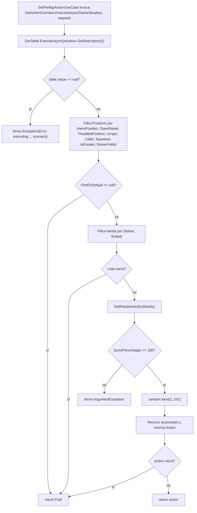
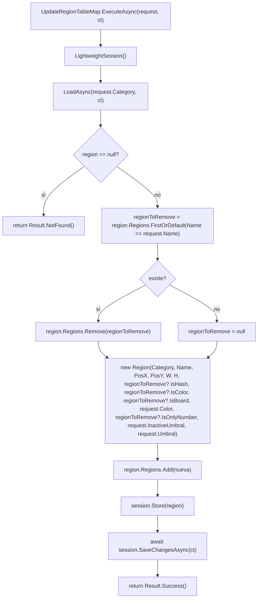
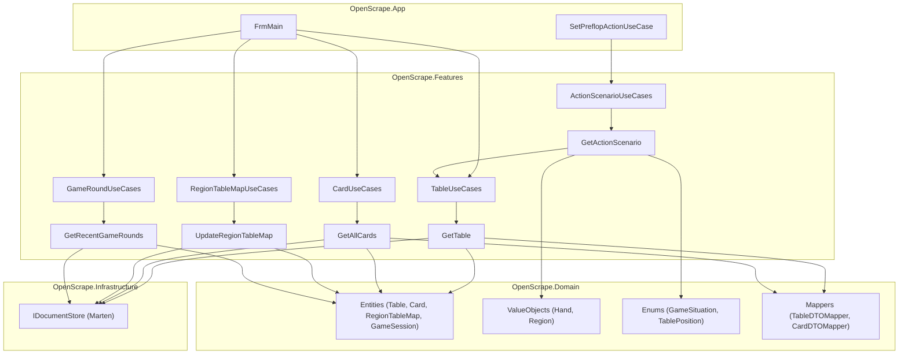

# OpenScrape.Features — Design Técnico

> Cómo está construida la capa de aplicación (Vertical Slice): aggregators DI, patrón `Result`, sesiones Marten cortas, sampling ponderado preflop y los 3 placeholders no implementados.

---

## Interface

`OpenScrape.Features` expone tres tipos de superficie:

1. **Extension method DI** — punto de entrada del bootstrap
2. **Records aggregators** — agrupadores inyectables
3. **Clases de use case** — implementación de cada slice

### 1. Extension method DI

| Símbolo | Firma | Retorno | Observación |
|---------|-------|---------|-------------|
| `Services.AddUseCases` | `(this IServiceCollection services)` | `IServiceCollection` | Registra **5 aggregators + 9 use cases** todos como `Scoped`. Encadena con `return` fluido. 🟢 (`Services.cs:18-35`) |

### 2. Aggregators (records)

| Aggregator | Componentes | Notas |
|------------|-------------|-------|
| `ActionScenarioUseCases(GetActionScenario)` | 1 use case | `record` 1-arity. 🟢 (`ActionScenario/ActionScenarioUseCases.cs:5`) |
| `TableUseCases(GetTable, GetAllTables)` | 2 use cases | `GetAllTables` está vacío. 🟡 (`Table/TableUseCases.cs:6`) |
| `CardUseCases(GetAllCards)` | 1 use case | namespace `Card` (singular) en carpeta `Cards/` (plural). 🟡 (`Cards/CardUseCases.cs:5`) |
| `RegionTableMapUseCases(GetAllRegionTableMap, UpdateRegionTableMap)` | 2 use cases | `GetAllRegionTableMap` con método comentado. 🔴 (`RegionsTableMap/RegionTableMapUseCases.cs:6`) |
| `GameRoundUseCases(GetRecentGameRounds)` | 1 use case | `record` 1-arity. 🟢 (`GameRound/GameRoundUseCases.cs:3`) |

### 3. Use cases (clases con `ExecuteAsync` / `Execute`)

| Símbolo | Firma | Retorno | Observación |
|---------|-------|---------|-------------|
| `GetActionScenario.ExecuteAsync` | `(GameSituation situation, ActionScenarioRequest request)` | `Task<string>` | **No usa `Result`** — re-lanza `Exception`. 🟡 (`ActionScenario/Get/GetActionScenario.cs:16`) |
| `GetActionScenario.GetRandomAction` | `(List<Hand> actions)` *private* | `string` | Sampling ponderado por `Hand.Percentage`. Valida suma == 100. 🟢 (`GetActionScenario.cs:51`) |
| `GetTable.ExecuteAsync` | `(string name)` | `Task<Result<TableDTO?>>` | Patrón `Result.Success/NotFound/CriticalError`. 🟢 (`Table/Get/GetTable.cs:17`) |
| `GetAllTables` | `(IDocumentStore)` ctor | n/a | **Sin método público**. 🔴 (`Table/GetAll/GetAllTables.cs:15`) |
| `GetAllCards.ExecuteAsync` | `()` | `Task<Result<List<CardDTO>?>>` | Lista completa proyectada a DTO. 🟢 (`Cards/GetAll/GetAllCards.cs:17`) |
| `GetFlopCards` | n/a | n/a | Solo declara `record GetFlopCardsResponse()`. **Dead code**. 🔴 (`Cards/GetFlop/GetFlopCards.cs`) |
| `UpdateRegionTableMap.ExecuteAsync` | `(UpdateRegionTableMapRequest request, CancellationToken ct = default)` | `Task<Result>` | Load-modify-store; preserva flags semánticos. 🟢 (`RegionsTableMap/Update/UpdateRegionTableMap.cs:15`) |
| `GetAllRegionTableMap` | `(IDocumentStore)` ctor | n/a | Método `Execute` **completamente comentado**. 🔴 (`RegionsTableMap/GetAll/GetAllRegionTableMap.cs:14-18`) |
| `GetRecentGameRounds.Execute` | `(int count = 20)` | `Task<List<GameSession>>` | **No usa `Result`** — retorna lista directa. 🟡 (`GameRound/GetRecentGameRounds.cs:15`) |

### 4. DTOs

| DTO | Tipo C# | Campos | Mutabilidad |
|-----|---------|--------|-------------|
| `ActionScenarioRequest` | `class` | `HandName`, `Suited`, `HeroPosition`, `OpenRaiser`, `ThreeBetPosition`, `Limper`, `Caller`, `Squeezer`, `BetSize`, `IsGreater`, `RaiserFolds` (todos nullable) | Mutable (set) 🟡 — único DTO mutable del módulo |
| `UpdateRegionTableMapRequest` | `record` positional | `Category, Name, PosX, PosY, Width, Height, Umbral, InactiveUmbral, Color, IsColor?, IsHash?, IsOnlyNumber?, IsBoard?` | Inmutable 🟢 |

### 5. Tipos retornados

| Tipo | Origen | Uso |
|------|--------|-----|
| `Result<T>` | `Ardalis.Result 10.1.0` (NuGet) | 4 use cases lo usan |
| `Result` (no genérico) | `Ardalis.Result` | `UpdateRegionTableMap` lo usa |
| `string` directo | BCL | `GetActionScenario` retorna acción cruda — sin envoltura |
| `List<GameSession>` directo | BCL + `Domain.Entities.GameSession` | `GetRecentGameRounds` retorna lista directa |

🟡 **Inconsistencia**: dos use cases (`GetActionScenario`, `GetRecentGameRounds`) escapan al patrón `Result<T>` que rige el resto del módulo.

---

## Fluxo Principal

### Fluxo A — Selección de acción preflop (GetActionScenario)

1. **`SetPreflopActionUseCase`** (en `OpenScrape.App.Aplication`) construye un `ActionScenarioRequest` con la posición del hero y el contexto (raiser, caller, squeezer, etc.). Invoca `actionScenarioUseCases.GetActionScenario.ExecuteAsync(situation, request)`. 🟢 (`legacy-mapping.md → consumidores`)
2. **`GetActionScenario.ExecuteAsync`** delega a `tableUseCases.GetTable.ExecuteAsync(situation.GetDescription())` para resolver la tabla estratégica.
3. **`GetTable`** abre una `QuerySession` (`using var session = _documentStore.QuerySession()`), consulta `Query<Table>().FirstOrDefaultAsync(x => x.Id == name)`, y proyecta el resultado a `TableDTO` vía `Domain.Mappers.TableDTOMapper.ToDto()`. 🟢 (`GetTable.cs:17-29`)
4. Si `table?.Value == null`: `GetActionScenario` lanza `Exception("Table not found")` que envuelve en otra `Exception` con el contexto del situation. 🟢 (`GetActionScenario.cs:21-22`, `46-48`)
5. **Filtrado en memoria**: `GetActionScenario` ejecuta LINQ `Where` sobre `table.Value.Positions` con 7 condiciones encadenadas (`HeroPosition`, `OpenRaiser`, `ThreeBetPosition`, `Limper`, `Caller`, `Squeezer`, `IsGreater`, `RaiserFolds` — `BetSize` está comentado). Cada filtro nullable: `request.X == null || w.X == request.X.GetDescription()`. 🟢 (`GetActionScenario.cs:24-33`)
6. Toma el primer match (`FirstOrDefault`). Si `null`, retorna `"Fold"`. 🟢 (`GetActionScenario.cs:34, 37-38`)
7. De ese match, filtra el subconjunto `Hands` por `f.Name == request.HandName && f.Suited == request.Suited`. 🟢 (`GetActionScenario.cs:35`)
8. **Sampling ponderado** (`GetRandomAction`):
   1. Valida `actions.Count != 0` y `actions.Sum(Percentage) == 100`. Si falla suma → `ArgumentException`. 🟢 (`GetActionScenario.cs:53-61`)
   2. Genera `random.Next(1, 101)` con `new Random()` ad-hoc. 🟡 (`GetActionScenario.cs:64-65`)
   3. Recorre acumulando `Percentage`. Devuelve la `Action` cuando `randomNumber <= accumulatedPercentage`. 🟢 (`GetActionScenario.cs:66-77`)
   4. Fallback: `actions.Last()?.Action ?? string.Empty`. 🟢 (`GetActionScenario.cs:79-80`)
9. **`GetActionScenario`** retorna `string.IsNullOrEmpty(action) ? "Fold" : action`. 🟢 (`GetActionScenario.cs:42`)

### Fluxo B — Lectura de tabla (GetTable)

1. Constructor recibe `IDocumentStore` (singleton Marten). 🟢
2. `ExecuteAsync(name)`:
   1. Abre `using var session = _documentStore.QuerySession()`. 🟢
   2. Ejecuta `session.Query<Domain.Entities.Table>().FirstOrDefaultAsync(x => x.Id == name)`.
   3. Si `table == null` → `Result<TableDTO?>.NotFound()`. 🟢
   4. Si encuentra → `Result<TableDTO?>.Success(table.ToDto())` (extension method `Domain.Mappers.TableDTOMapper`). 🟢
   5. Si lanza excepción interna → captura y devuelve `Result<TableDTO?>.CriticalError(ex.Message)`. 🟢

### Fluxo C — Catálogo de cartas (GetAllCards)

1. `ExecuteAsync()`:
   1. `using var session = _documentStore.QuerySession()`. 🟢
   2. `session.Query<Card>().ToListAsync()`.
   3. Si lista vacía → `NotFound()`.
   4. Si tiene → `Success(img.Select(c => c.ToDto()).ToList())`. 🟢

### Fluxo D — Edición de región OCR (UpdateRegionTableMap)

1. `ExecuteAsync(request, ct)`:
   1. `using var session = _documentStore.LightweightSession()`. 🟢 (no `await using`)
   2. `await session.LoadAsync<RegionTableMap>(request.Category, ct)` — carga por **identidad** (Category es la `Id` del documento).
   3. Si `null` → `Result.NotFound()`.
   4. Busca la `Region` con `r.Name == request.Name` en `region.Regions`. Si existe, la **elimina** del array. 🟢 (`UpdateRegionTableMap.cs:24-28`)
   5. Construye una nueva `Domain.ValueObjects.Region` con:
      - **Heredados del original** (si existía): `IsHash`, `IsColor`, `IsBoard`, `IsOnlyNumber`. 🟡
      - **Tomados del request**: `PosX/Y`, `Width/Height`, `Color`, `Umbral`, `InactiveUmbral`. 🟢
   6. `region.Regions?.Add(regionCategory)`. Llama `session.Store(region)` + `await session.SaveChangesAsync(ct)`. 🟢
   7. Retorna `Result.Success()` o, si lanza, `Result.CriticalError(ex.Message)`. 🟢

### Fluxo E — Histórico (GetRecentGameRounds)

1. `Execute(count = 20)`:
   1. `await using var session = _documentStore.QuerySession()` ← **único uso de `await using`** del módulo. 🟢
   2. `session.Query<GameSession>().OrderByDescending(s => s.EndTime).Take(count).ToListAsync()`. 🟢
   3. `results.ToList()` (defensivo — `ToListAsync` ya devuelve `IReadOnlyList<T>`). 🟡
2. Retorna `List<GameSession>` directo. **No usa `Result<T>`**, no envuelve excepciones — propaga al caller (`FrmMain.HistorialTab`). 🟡

---

## Fluxos Alternativos

### Errores en `GetActionScenario`

- **Tabla no encontrada en Marten** → `throw new Exception("Table not found")` interno → catch externo lanza `Exception($"Error executing {situation.GetDescription()} scenario: {ex.Message}")`. 🟢 (`GetActionScenario.cs:21-22, 46-48`)
- **`request.HeroPosition` null** → el filtro `request.HeroPosition?.GetDescription()` produce `null`, y la condición `w.HeroPosition == null` puede matchear filas con HeroPosition vacío (depende de la seed). 🟡 — caso límite no documentado.
- **Suma de `Percentage` ≠ 100** → `ArgumentException("Los porcentajes deben sumar 100")` se propaga como `Exception` envuelta. 🟢
- **`actions.Count == 0`** → retorna `string.Empty`, que `ExecuteAsync` traduce a `"Fold"`. 🟢

### Errores en use cases con `Result<T>`

- **Connection a PostgreSQL caída** → `Marten` lanza, el `try/catch` la convierte a `Result.CriticalError(ex.Message)`. La capa superior (`OpenScrape.App`) decide si reintentar o mostrar error. 🟢
- **`ToDto()` lanza** (improbable, mapper estático sin lógica) → idem `CriticalError`. 🟢

### Errores en `GetRecentGameRounds`

- **Sin try/catch.** Cualquier `Exception` (timeout, conexión perdida) se propaga al caller. La pestaña Historial debe defenderse. 🟡

---

## Dependências

- **`OpenScrape.Domain`** (ProjectReference, no NuGet) — entidades `Table`, `Card`, `RegionTableMap`, `GameSession`; value objects `Hand`, `Region`; enums `GameSituation`, `TablePosition`; mappers `TableDTOMapper`, `CardDTOMapper`; extension `EnumExtensions.GetDescription`. 🟢
- **`Marten 8.24.0`** (NuGet) — `IDocumentStore`, `QuerySession()`, `LightweightSession()`, `LoadAsync`, `Query<T>()`, `Store`, `SaveChangesAsync`. 🟢
- **`Ardalis.Result 10.1.0`** (NuGet) — patrón Result para 4 de los 5 use cases activos. 🟢
- **`Microsoft.Extensions.DependencyInjection.Abstractions`** (transitivo, vía SDK) — `IServiceCollection`, `AddScoped`. 🟢

🟢 **Sin dependencias circulares**. El módulo es cliente puro de `Domain` + Marten/Ardalis.

---

## Decisões de Design Identificadas

| Decisão | Evidência no código | Confiança |
|---------|---------------------|-----------|
| **Vertical Slice** (1 archivo por use case en `Feature/Action/Use.cs`) | Estructura de carpetas en `src/OpenScrape.Features/` | 🟢 |
| **Aggregator records** para reducir el número de ctor params en consumidores | `ActionScenarioUseCases`, `TableUseCases`, etc. (5 records) | 🟢 |
| **Sesión Marten por operación** (no long-lived) | 5 archivos abren+cierran en su `Execute*Async` | 🟢 |
| **Patrón Result** para errores controlados | `Result<TableDTO?>`, `Result<List<CardDTO>?>`, `Result` (`UpdateRegionTableMap`) | 🟢 |
| **Fold como default seguro** ante manos no encontradas | `GetActionScenario.cs:38, 42` | 🟢 |
| **Sampling ponderado entero (1..100) sobre `Percentage`** en lugar de doubles | `GetActionScenario.cs:64-77` | 🟢 |
| **Validación dura suma==100** en runtime de cada llamada (no al cargar la seed) | `GetActionScenario.cs:60` | 🟡 — costo adicional por llamada; alternativa sería validar al cargar |
| **`UpdateRegionTableMap` non-destructive con flags** (preserva `IsHash/IsColor/IsBoard/IsOnlyNumber` del original) | `UpdateRegionTableMap.cs:36-44` | 🟢 |
| **`Category` actúa como Marten Id de `RegionTableMap`** | `LoadAsync<RegionTableMap>(request.Category)` | 🟢 |
| **`Name` actúa como clave secundaria dentro de `Regions`** | `Regions.FirstOrDefault(r.Name == request.Name)` | 🟢 |
| **`GameSituation.GetDescription()`** funciona como puente enum→string para mapear a `Table.Id` | `GetActionScenario.cs:20`, `Domain.Enums.EnumExtensions.GetDescription` | 🟢 |
| **Random instanciado por llamada** (`new Random()`) en lugar de `Random.Shared` | `GetActionScenario.cs:64` | 🟡 — desperdicia entropía y aloca en hot path |
| **`AddScoped` para todos** los use cases (sin Singleton/Transient) | `Services.cs:20-35` | 🟢 |
| **`OrderByDescending(EndTime)`** en `GetRecentGameRounds` (no `StartTime`) | `GetRecentGameRounds.cs:18` | 🟢 — coincide con índice creado en `OpenScrape.Infrastructure` |
| **No registrar `GetFlopCards`** en DI (es dead code) | `Services.cs` no lo nombra | 🟢 |
| **Sí registrar `GetAllTables` y `GetAllRegionTableMap`** aunque sean placeholders | `Services.cs:29, 32` | 🔴 — registra dependencias inútiles, riesgo de uso accidental |

---

## Estado Interno

El módulo es **stateless**. Ningún use case mantiene campos mutables más allá de las dependencias inyectadas (`IDocumentStore`, aggregators).

| Archivo | Campos privados | Naturaleza |
|---------|-----------------|------------|
| `GetActionScenario` | `tableUseCases` | Inmutable post-ctor |
| `GetTable` | `_documentStore` | Inmutable post-ctor |
| `GetAllCards` | `_documentStore` | Inmutable post-ctor |
| `UpdateRegionTableMap` | `_documentStore` (`readonly`) | Inmutable post-ctor 🟢 — único `readonly` explícito |
| `GetAllRegionTableMap` | `_store` | Inmutable post-ctor |
| `GetRecentGameRounds` | `_documentStore` (`readonly`) | Inmutable post-ctor 🟢 |
| `GetAllTables` | `_documentStore` | Inmutable post-ctor (no usado) |

🟡 Inconsistencia: sólo 2 de 7 archivos marcan el campo como `readonly`. Refactor de bajo riesgo.

---

## Observabilidade

**No hay logging propio del módulo.** No se inyecta `ILogger<T>` en ningún use case. La observabilidad delega 100% a:

- **Marten** — `IDocumentStore` puede configurarse con `IMartenSessionLogger` en `OpenScrape.Infrastructure` (no se hace actualmente). 🔴 — sin trazabilidad de queries.
- **Caller (`OpenScrape.App`)** — los logs estructurados de decisión preflop (`GameLoggerService`, `GameLogger`) ocurren **fuera** del módulo Features. 🟢 — separación de responsabilidades coherente con Clean Architecture.

🟡 No hay métricas (latency, hit/miss de tabla, frecuencia de `"Fold"` por defecto). Si se quisiera evaluar la cobertura de las tablas seed, no hay instrumentación nativa.

---

## Riscos e Lacunas

### 🔴 Críticas (requieren decisión humana)

- **`Cold4Bet.json` vs `[Description("ColdFourBet")]`** — el seed file se llama `Cold4Bet.json` pero `GameSituation.Cold4Bet` (`Domain/Enums/Positions.cs:78`) tiene `[Description("ColdFourBet")]`. Si el seeder usa el nombre del archivo como `Table.Id`, `GetActionScenario` consulta `"ColdFourBet"` y obtiene `NotFound` → re-lanza excepción → `SetPreflopActionUseCase` recibe error en lugar de acción. **Validar urgentemente** con el seeder real (probable `App/Helpers/JsonSeeder` — pendiente análisis Fase 2 módulo App).
- **`BetSize` comentado** en filtro de `GetActionScenario:31`. Si la seed contempla `BetSize` por fila, la lógica actual ignora el campo y agrupa filas que deberían distinguirse → puede mezclar acciones de stakes diferentes.
- **`GetAllTables`, `GetFlopCards`, `GetAllRegionTableMap`** — 3 placeholders con código no operativo. Decidir: completar / eliminar / mover a backlog explícito.

### 🟡 Suposiciones que pueden ser frágiles

- **Asumimos que `Hand.Percentage` es `int`** (entero positivo). Definido así en `Domain.ValueObjects.Hand` (validado [0, 100]). Si alguna vez se usaran porcentajes fraccionarios, `Sum(Percentage) != 100` rompería siempre por redondeo. 🟡
- **Asumimos que las seeds tienen `Percentage` que suman 100 exactamente** por fila de `Positions[i].Hands` agrupada por (HandName, Suited). No hay validación al cargar — solo al ejecutar. 🟡
- **Asumimos que `request.HeroPosition` siempre se especifica**. Si llega `null`, el filtro lo ignora y puede devolver una fila no intencionada. 🟡
- **`new Random()` en cada llamada** — en .NET, `Random()` sin seed usa el reloj con resolución coarse (en versiones antiguas, mismo seed dentro del mismo tick). En .NET 6+ se inicializa con `Random.Shared` internamente, pero `new Random()` aún paga construcción. Recomendado `Random.Shared.Next(1, 101)`. 🟡
- **`throw new Exception(...)`** pierde stack trace original. Use `throw;` o `Result<string>`. 🟡 — alineamiento con guideline `CLAUDE.md`.

### 🟡 Inconsistencias menores

- Namespace `OpenScrape.Features.Card` (singular) en carpeta `Cards/` (plural).
- 6 de 7 use cases usan `using` síncrono, sólo `GetRecentGameRounds` usa `await using`.
- 2 de 7 use cases declaran el campo como `readonly`; el resto omite.
- `GetActionScenario` y `GetRecentGameRounds` retornan tipos primitivos en vez de `Result<T>`.

### 🔴 Lacunas pendientes para el Detective

- ¿`BetSize` debe re-habilitarse o eliminarse? Decisión humana.
- ¿Los flags `IsHash/IsColor/IsBoard/IsOnlyNumber` del request en `UpdateRegionTableMapRequest` deben ignorarse siempre (como hoy) o aplicarse cuando el request los aporta no-null? Decisión humana.
- ¿Mover los 9 wrappers `GetAction*UseCase` (en `App.Aplication.UseCases.Actions`) a este módulo siguiendo Vertical Slice estricto? Decisión humana.

---

## Diagrama de dependencias

