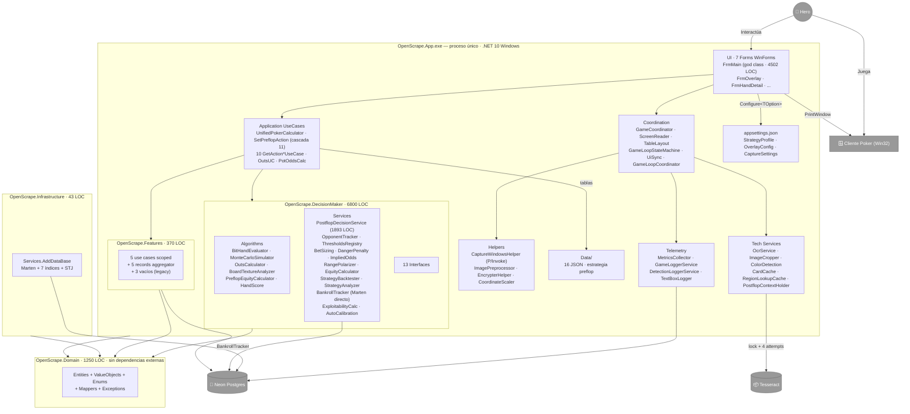

# Architecture — ScrapePoker

> Generado por el **Architect** del Reversa el 2026-05-06.
> Visión arquitectural consolidada del sistema legado.
> Nivel de documentación: **detalhado**.
>
> Escala de confianza: 🟢 CONFIRMADO · 🟡 INFERIDO · 🔴 LACUNA

---

## 1. Resumen ejecutivo

ScrapePoker / OpenScrape es un **bot asistente de poker NLHE cash game** desplegado como **binario WinForms standalone** sobre **.NET 10 Windows**. Su mecanismo es **scraping pasivo**: captura la ventana del cliente de poker que el usuario juega en otra aplicación, analiza la mesa con OCR + visión artificial, modela el estado del juego y muestra la recomendación en un overlay flotante.

🟢 **Núcleo de la arquitectura:**

- **Clean Architecture en 5 capas** (`Domain`, `Features`, `Infrastructure`, `DecisionMaker`, `App`) — ADR-0001.
- **Único proceso, único hilo lógico** con `BackgroundWorker` para detección y `Invoke` al UI thread.
- **Persistencia documental** vía Marten 8.24 sobre Neon Postgres (eu-west-2) — ADR-0003.
- **Motor de decisión determinístico** con pipeline unificado equity → outs → texture → EV → 10+ paths postflop — ADR-0006.
- **Monte Carlo híbrido**: enumeración exacta en turn/river, MC paralelo en flop/preflop — ADR-0010.
- **Estado postflop cross-street inmutable** vía `PostflopGameContext` + holder scoped — ADR-0007.
- **Tabla preflop driven** por 16 archivos JSON en `Data/` — no algorítmica.

🟡 **Madurez arquitectural:** funcional, en evolución continua. Hay refactor pendiente documentado en el propio código (`refactor-frmmain-coordinators` con bloque comentado al final de `FrmMain.cs`). Los 20 ADRs muestran un sistema donde se han revisado decisiones (ML.NET → determinismo, contextos divergentes → holder scoped, thresholds string → tipados con startup validation).

---

## 2. Capas y responsabilidades

🟢 Confirmado por `dependencies.md` y por el árbol de `*.csproj`. La regla de Clean Architecture (Domain no depende de nadie; capas externas dependen de interiores) **se respeta a nivel de proyecto**, con dos excepciones documentadas:

```
                       ┌─────────────────────┐
                       │   OpenScrape.App    │
                       │  WinExe net10-win   │
                       └──┬──────┬─────┬─────┘
                          │      │     │
              ┌───────────┘      │     └────────────┐
              ▼                  ▼                  ▼
        OpenScrape.            OpenScrape.       OpenScrape.
        Features               DecisionMaker     Infrastructure
              │                  │                  │
              └─────────┬────────┴──────────────────┘
                        ▼
                   OpenScrape.Domain
                   (puro, sin dependencias)
```

### 2.1 `OpenScrape.Domain` 🟢

Núcleo del modelo de dominio. Sin dependencias externas.

- **Entidades** persistibles (Marten): `Card`, `Table`, `RegionTableMap`, `OverlayConfig`, `GameSession`, `HandRecord`, `HandResult`, `StrategyProfile`, `OpponentProfile`, `OpponentPositionProfile`, `OpponentType`.
- **Value objects**: `Hand`, `Region`, `PlayerActionSequence`, `CardDataOuts`, `DrawProbability`, `HandStrength`, `HandEvaluation`, `PotOddsResult`, `StreetDecision`, `StreetThresholds`, `ThresholdKey`, `VillainRange`, `BankrollSnapshot/Stats/HistoryItem`, `CategoryStats`, `TelemetryAggregate`.
- **Enums** del juego: `Rank`, `Suit`, `HandRank`, `KickerStrength`, `Positions`, `TablePosition`, `HandSituation`, `BoardPosition`, `HeroHand`, `GameSituation`, `PairClassification`, `BluffConditionType`, `Styles`, `ActionsResponse`, `ListRegions`.
- **Mappers**: `CardDTOMapper`, `TableDTOMapper`. Convención: `Entity.Id` ↔ `DTO.Name`.
- **Excepciones**: `StrategyProfileValidationException` (acumula errores y los formatea en mensaje multilínea).

🟡 **Acoplamiento inverso documentado**: `ValueObjects.VillainRange` depende de `Entities.OpponentProfile`. En Clean Architecture estricta sería al revés.

### 2.2 `OpenScrape.Features` 🟢

Casos de uso scoped por feature folder (Clean Architecture vertical). Patrón Composite UseCases — un record aggregator por feature inyecta los use cases concretos.

- 5 use cases activos: `GetActionScenario`, `GetTable`, `GetAllCards`, `UpdateRegionTableMap`, `GetRecentGameRounds`.
- 5 records aggregator (`ActionScenarioUseCases`, `TableUseCases`, `CardUseCases`, `RegionTableMapUseCases`, `GameRoundUseCases`).
- 3 use cases vacíos (legacy / código muerto): `GetAllTables`, `GetAllRegionTableMap`, `GetFlopCards`.
- Retornos: `Ardalis.Result<T>` excepto `GetActionScenario` (string) y `GetRecentGameRounds` (List).

🟢 Todos los use cases registrados como `Scoped` en `Services.cs` (consistente con consumidor `FrmMain` resuelto desde scoped provider — ADR-0014).

### 2.3 `OpenScrape.Infrastructure` 🟢

Setup mínimo de Marten — 1 archivo (`Services.cs`) con 1 método público `AddDataBase(IServiceCollection, IConfiguration, bool isDevelopment)`.

- Configura Marten con serializador `System.Text.Json`.
- Declara 7 índices explícitos:
  - `GameSession.EndTime`, `GameSession.SessionId`, `GameSession.TableName`
  - `HandRecord.GameSessionId`, `HandRecord.Timestamp`, `HandRecord.HeroPosition`
  - `HandRecord (GameSessionId, Timestamp)` compuesto
- `AutoCreateSchemaObjects = AutoCreate.All` si `IsDevelopment`.

🔴 **Anomalía crítica**: `Program.cs:52` invoca con `IsDevelopment=true` hardcoded → `AutoCreate.All` siempre activo (ver §6 Dívidas técnicas).

### 2.4 `OpenScrape.DecisionMaker` 🟢

Motor de decisión y cálculo de equity. Building blocks numéricos puros.

**Algoritmos** (`Algorithms/`):
- `BitHandEvaluator` — evaluación de mano por bit-manipulation (zero-alloc, `stackalloc` Span).
- `MonteCarloSimulator` — equity híbrido: exact river C(45,2)=990, exact turn 45×C(44,2)≈42K, MC paralelo 50K (flop) / 30K (preflop) con `ThreadLocal` buffers.
- `OutsCalculator` — outs con inclusión-exclusión + tainted (×0.7/×0.3) + backdoor (1.5/1.0) + combo draw + overcards calibrados por textura.
- `BoardTextureAnalyzer` — wetness 0-100 (10 contribuciones), categorías Dry/SemiDry/SemiWet/Wet/Paired, `AnalyzeBoardChange` con DangerLevel 0-10, `ClassifyRiverCard` (Blank/Neutral/Scare).
- `PreflopEquityCalculator` — tabla estática 169 manos HU + ajuste por #oponentes.
- `HandScore` (struct readonly) — `CompositeScore` long para comparación O(1).
- `HandEvaluator` (legacy 206 LOC, brute-force C(7,5)=21) — coexiste sin justificación documentada.

**Servicios** (`Services/`):
- `PostflopDecisionService` — 1893 LOC, 10+ paths de decisión (facing bet, no-bet, c-bet, check-raise, float exit, probe bet, pot control, delayed value, bluff/semi-bluff, randomización).
- `PostflopGameContext` — record inmutable, estado cross-street.
- `BetSizingService`, `DangerPenaltyCalculator`, `ImpliedOddsCalculator`, `RangePolarizer`.
- `ThresholdsRegistry` — lookup tipado O(1) en `Dictionary<ThresholdKey, StreetThresholds>`.
- `OpponentTracker` — `ConcurrentDictionary` thread-safe + `RegisterSeatAlias` atómico.
- `EquityCalculatorService` — orquestador MC + Outs + Preflop.
- `StrategyBacktester` — replay A/B histórico.
- `StrategyAnalyzerService` — métricas agregadas.
- `BankrollTrackerService` — Marten directo (anomalía de capa).
- `ExploitabilityCalculator` — mbb vs GTO simplificada.
- `AutoCalibrationService` — propone ajustes (cap MaxAdjustmentPerCycle=5).

**13 interfaces** públicas para DI desde App. **PokerConstants** static (~25 constantes algorítmicas).

🔴 **Anomalías críticas**: SRP violado en `PostflopDecisionService`; `Random.Shared` directo (irreproducible); interfaces acopladas a tipos nested.

### 2.5 `OpenScrape.App` 🟢

Application & UI layer. Es a la vez **composition root**, **entry point WinForms**, **pipeline operacional** (captura → OCR → orquestación → decisión) y **presentación**.

- `Program.Main()` STA + Generic Host con ~50 servicios cableados.
- `FrmMain` (4502 LOC, **god class**) — game loop principal en `btnCapture_Click` (~270 LOC) y detección en `BackgroundWorker1_DoWork`.
- `FrmOverlay`, `FrmHandDetail`, `FrmDetectionDebug`, `FormImage`, `FormAction`, `FormListApps`.
- 38 archivos en `Services/` (~5450 LOC sin Logging/) — coordinación + I/O técnica.
- `Aplication/UseCases/` — `UnifiedPokerCalculator` (476 LOC, facade `IPokerCalculator`), `SetPreflopActionUseCase` (cascada 11 ramas), 10 `GetAction*UseCase` para escenarios preflop.
- `Helpers/` — `CaptureWindowsHelper` (P/Invoke User32+GDI32 con `PrintWindow PW_RENDERFULLCONTENT`), `ImagePreprocessorHelper`, `EncrypterHelper` (AES-CBC + SHA256), `WindowsInformationHelper`, `CoordinateScaler`.
- `Telemetry/` — `MetricsCollector` con histograma logarítmico 30 buckets (10 μs - 6.3 s), 16 categorías, dual última-mano + sesión.

---

## 3. Patrones arquitecturales relevantes

🟢 Inferidos del código + ADRs.

### 3.1 Composition Root + Generic Host

`Program.cs` cablea el grafo completo de servicios via `Microsoft.Extensions.Hosting`. **Forwarding pattern** para algoritmos: `AddSingleton<Concrete>` + `AddSingleton<IFace>(sp => sp.GetRequiredService<Concrete>())`. Comparten instancia, Concrete inyectable directamente para tests.

### 3.2 Fail-fast Validation

`StrategyProfileValidator.Validate(profile)` se ejecuta tras `host.Build()`. Si falla, `MessageBox` + `Environment.Exit(1)`. Acumula todos los errores en lista en lugar de fallar al primero (UX de diagnóstico).

### 3.3 Scoped DI con CreateAsyncScope

`FrmMain` se resuelve desde scope (no root) porque depende de scoped use cases (`TableUseCases`, `ActionScenarioUseCases`, `CardUseCases`, `RegionTableMapUseCases`, `GameRoundUseCases`). El scope se dispone en `finally` con `DisposeAsync().AsTask().GetAwaiter().GetResult()` (porque `GameLoopCoordinator` es `IAsyncDisposable`) — ADR-0014.

### 3.4 Composite UseCases (Facade ligero)

Cada feature folder de `Features/` expone un record aggregator con sus use cases concretos. El consumidor (App) inyecta el record y accede por propiedad. Reduce superficie de inyección sin introducir interfaces extra.

### 3.5 Pipeline determinístico de decisión

`UnifiedPokerCalculator.Calculate` → equity (MC/PreflopEquity) → outs → board texture → hand evaluation → fold equity → EV → action. `PostflopDecisionService.DetermineAction` aplica ajustes secuenciales sobre `(FoldBelow, ThinValueAbove)` y elige por path de prelación (10+).

### 3.6 Inmutabilidad cross-street

`PostflopGameContext` es record inmutable. Toda transición es `holder.Update(c => c with { ... })`. Un único `IPostflopContextHolder` scoped — ADR-0007 reemplazó un patrón previo donde `FrmMain._postflopContext` y `GameCoordinator.PostflopContext` divergían.

### 3.7 Multi-lectura por consenso (OCR)

`ScreenReaderService.ReadBetValue/ReadStackValue/ReadHandNumber` toma 3 lecturas con preprocesamientos distintos y aplica heurística de consenso (mayoría/igualdad). `OcrService` tiene 4 attempts con confidence scoring (`OrderByDescending(Confidence)`) y dHash cache (LRU 200). Si confidence < 0.70 → reintento.

### 3.8 State Machine con validación por board cards

`GameLoopStateMachine` (10 estados) valida transiciones contra mapa estático. La sobrecarga `TryTransition(state, visibleBoardCards)` rechaza transiciones sin las cartas mínimas (Flop≥3, Turn≥4, River≥5) — ADR-0012, fix de bug histórico de falsos positivos.

### 3.9 Forwarding pattern + interface segregation (DecisionMaker)

13 interfaces en `OpenScrape.DecisionMaker/Interfaces/` permiten inyección desde App. Cada algoritmo se registra como `Singleton` para que el comportamiento sea idéntico entre todos los consumidores en el mismo proceso.

### 3.10 Tabla-driven preflop

La estrategia preflop **no es algorítmica**: 16 JSON en `src/OpenScrape.App/Data/` mapean `(Position × Situation × Action) → List<Hand>` con frecuencias de mezcla. `GetActionScenario` aplica filtro multi-criterio y selección ponderada acumulada (`GetRandomAction` con `Random.Next(1, 101)`).

### 3.11 Telemetría con `IMetricsCollector` y histogramas log

16 categorías (`TelemetryCategories`) instrumentadas con `using var _ = _metrics.Measure("...")` (zero-alloc `ScopedMeasurement`). Dos histogramas por categoría: última mano + sesión. P50/P95/Max acumulados — ADR-0017.

---

## 4. Flujo de datos completo

🟢 Inferido por `flowcharts/OpenScrape.App-FrmMain.md` + `OpenScrape.App-GameCoordinator.md` + `OpenScrape.DecisionMaker-DetermineAction.md`.

```
┌──────────────────────────────────────────────────────────────────────┐
│  Hero (jugador humano)                                               │
└────────────────┬─────────────────────────────────────────────────────┘
                 │ Selecciona ventana del cliente desde FormListApps
                 ▼
┌──────────────────────────────────────────────────────────────────────┐
│  BackgroundWorker1_DoWork (loop infinito en thread propio)           │
│  ─────────────────────────────────────────────                       │
│  • PrintWindow → bitmap (sin foco)                                   │
│  • PerformEnhancedDetection (LockBits + 9-pixel cross sample)        │
│  • IsActionColorInRange = abs(avgB - 24) ≤ 3 (color hero turn)       │
│  • IsFlopVisible = abs(flopColor.B - 255) ≤ 10                       │
│  • Invoke UI: si ShouldCapture → btnCapture_Click(sender, e)         │
│  • Delay 100-200 ms; LogDetectionStatistics cada 1000 iter          │
└────────────────┬─────────────────────────────────────────────────────┘
                 │ trigger desde detection
                 ▼
┌──────────────────────────────────────────────────────────────────────┐
│  btnCapture_Click (~270 LOC, "main" del game loop)                   │
│  ─────────────────────────────────────────────                       │
│  1. Métrica: _metrics.Measure(CycleTotal)                            │
│  2. GetImageWhilePlaying → PrintWindow + PNG                         │
│  3. SetTableHand → pot, hole cards, hand#, table name                │
│  4. Detect new hand → snapshot postflop + Reset state machine        │
│  5. HandleNewHandAsync → EndHand prev + StartNewHandAsync            │
│  6. InitializePlayers (full / refresh)                               │
│  7. SetBetPlayer + SetHeroStack (auto-rebuy detect ≥50 BB)           │
│  8. ProcessTableInfoAsync → preflop o postflop pipeline              │
│  9. _frmOverlay.UpdateAction(_responseAction.Action)                 │
└────┬───────────────────────────────────┬─────────────────────────────┘
     │ preflop                            │ postflop
     ▼                                    ▼
┌─────────────────────────┐    ┌────────────────────────────────────────┐
│  SetPreflopActionUseCase│    │  GameCoordinator.DetermineFlopAction/  │
│  cascada 11 ramas       │    │  Turn/River                            │
│  ↓                      │    │  ↓                                     │
│  GetAction*UseCase ×10  │    │  • UnifiedPokerCalculator.Calculate    │
│  ↓                      │    │    (equity → outs → texture → EV)      │
│  Features.GetActionSce- │    │  • Construye PostflopDecisionInput     │
│  nario → tabla JSON     │    │    (30+ campos)                        │
│  ↓                      │    │  • PostflopDecisionService.            │
│  weighted random        │    │    DetermineAction (10+ paths)         │
│  (Hand.Percentage)      │    │  • TrackVillainPostflopAction          │
└─────────────────────────┘    │  • Update PostflopContextHolder        │
                               │  • ExploitabilityCalculator.           │
                               │    AnalyzeDecision + RecordDecision    │
                               │  • LogStreetDecision (Marten)          │
                               └────────────────────────────────────────┘
                                            │
                                            ▼
                               ┌────────────────────────────────────────┐
                               │  GameLoggerService.LogStreetDecision   │
                               │  + UpdateSituation                     │
                               │  ↓                                     │
                               │  GameLoggerService.                    │
                               │  FinalizeAndPersistHandAsync           │
                               │  (Marten LightweightSession,           │
                               │   SemaphoreSlim _dbWriteLock)          │
                               └────────────────────────────────────────┘
```

🟢 Coste por ciclo: 1-3 segundos típico. CPU-bound (OCR + MC). Memoria estable gracias a `ThreadLocal` buffers + LRU caches con bound.

---

## 5. Integraciones externas

🟢 ScrapePoker tiene **sólo 4 puntos de contacto con sistemas externos**:

| Integración | Tipo | Mecanismo | Bloqueante | Notas |
|-------------|------|-----------|------------|-------|
| **Cliente de poker** | Visual passive scraping | Win32 `PrintWindow PW_RENDERFULLCONTENT` + `BitBlt` + `LockBits` | No (sin foco) | Único enlace funcional con el dominio del juego |
| **Neon Postgres** | DB connection | Marten 8.24 + `IDocumentStore` + `await using session` | Sí (durante read/write) | Pooler activado, TLS verificado + Channel Binding |
| **Tesseract OCR** | In-process native | `Tesseract.Engine.Process(pix)` con `lock(_lock)` | Sí (engine no thread-safe) | Embebido `eng.traineddata` |
| **Win32 / GDI** | OS API | P/Invoke User32+GDI32 | No | `EnumWindows`, `PrintWindow`, `BitBlt` |

🟢 **No hay HTTP, gRPC, REST, GraphQL, WebSocket, mensajería ni colas externas.** El sistema no se comunica con APIs ni servicios remotos del cliente de poker. Todo el modelado del juego se hace por OCR + visión.

🟡 **No hay WebHooks, eventos ni mensajería pub/sub** — el sistema es enteramente sync con polling (BackgroundWorker → 100-200 ms).

🔴 **No hay endpoints expuestos** por la app (no hay listener, no hay puerto abierto, no hay API). Esto se nota en `surface.json` (no_centralized_routing: "No se detectaron Controllers, @RestController, app.get/post, urls.py ni Router(). El sistema es WinForms desktop sin REST API.").

---

## 6. Dívidas técnicas

🔴 **Críticas** (del análisis cruzado de `code-analysis.md` + `surface.json`):

| ID | Deuda | Ubicación | Impacto |
|----|-------|-----------|---------|
| DT-1 | God class `FrmMain` 4502 LOC | `OpenScrape.App/Forms/FrmMain.cs` | SRP violado; refactor planeado documentado en bloque comentado al final del archivo (`refactor-frmmain-coordinators` Fase 1.4) |
| DT-2 | God service `PostflopDecisionService` 1893 LOC, 40+ ramas | `OpenScrape.DecisionMaker/Services/PostflopDecisionService.cs` | SRP violado; sub-strategies (FacingBetStrategy, NoBetStrategy, ...) sería el camino natural |
| DT-3 | Credenciales reales committeadas | `OpenScrape.App/appsettings.json` | Postgres password (Neon) + Encrypter.Key expuestas en histórico Git. CLAUDE.md declara que deben ser placeholders `CHANGE_ME` |
| DT-4 | `IsDevelopment=true` hardcoded | `OpenScrape.App/Program.cs:52` | `AutoCreate.All` siempre activo, incluso en Production. La discriminación por entorno declarada en `Infrastructure/Services.cs:36` queda inerte |
| DT-5 | `BankrollTrackerService` accede a Marten directamente desde DecisionMaker | `OpenScrape.DecisionMaker/Services/BankrollTrackerService.cs` | Anomalía de capa — DecisionMaker no debería conocer la persistencia |
| DT-6 | `Random.Shared` directo en producción para mixing | `PostflopDecisionService` (×10+ invocaciones) | Decisiones irreproducibles; falta abstracción `IRandomProvider` para tests deterministas |
| DT-7 | Doble entry point al motor (`UnifiedPokerCalculator` vs `PokerDecisionFacade`) | `OpenScrape.App/Aplication/UseCases/` y `Services/` | UPC se usa hoy desde `FrmMain`; PDF está planeado pero no migrado |
| DT-8 | Coexisten `HandEvaluator` (legacy 206 LOC brute-force) y `BitHandEvaluator` | `OpenScrape.DecisionMaker/Algorithms/` | Ambigüedad sin justificación documentada |
| DT-9 | Interfaces acopladas a tipos nested de la implementación | `IMonteCarloSimulator.EquityResult`, `IOutsCalculator.OutsResult`, `IEquityCalculatorService.FullEquityAnalysis` | Cambiar tipo de retorno requiere tocar interfaz e implementación a la vez |
| DT-10 | `BackgroundWorker1_DoWork` loop sin `CancellationToken` | `FrmMain.cs:2737` | Solo sale por `Overlay.Visible == false`; parada al cerrar es frágil |

🟡 **Medias** (selección):

| ID | Deuda | Ubicación |
|----|-------|-----------|
| DT-11 | `SaveReferenceDimensionsToConfig` reescribe `appsettings.json` con string-building manual | `FrmMain.cs:2561` |
| DT-12 | `EncrypterHelper` usa **IV fija** (16 ceros) — debilidad criptográfica conocida | `OpenScrape.App/Helpers/EncrypterHelper.cs` |
| DT-13 | 3 use cases vacíos en `Features` registrados en DI | `OpenScrape.Features/Services.cs` |
| DT-14 | `obj/` versionado para net8/9/10 cuando solo se declara net10 | `OpenScrape.DecisionMaker/obj/` |
| DT-15 | `eng.traineddata` duplicado | `Resources/tessdata/` y `tessdata/` |
| DT-16 | Carpetas vestigio sin `.csproj` | `src/OpenScrape.Application/`, `src/OpenScrape.Core/` (solo bin/obj) |
| DT-17 | `MainPage.xaml`/`MainPage.xaml.cs` raíz, vacíos (resto MAUI/UWP) | raíz repo |
| DT-18 | `GetActionScenario` envuelve excepciones en `Exception` base — pierde stack trace | `OpenScrape.Features/ActionScenario/Get/GetActionScenario.cs:46` |
| DT-19 | `Update RegionTableMap` ignora flags del request, solo preserva los del registro existente | `OpenScrape.Features/RegionsTableMap/Update/UpdateRegionTableMap.cs:30-44` |
| DT-20 | `BankrollTrackerService.GetBankrollStats` hace N+1 queries | `OpenScrape.DecisionMaker/Services/BankrollTrackerService.cs` |
| DT-21 | `GameLoggerService.GetRecentSessionsWithStatsAsync` hace N+1 queries | `OpenScrape.App/Services/GameLoggerService.cs` |
| DT-22 | Pot commitment block duplicado entre `HandleFacingBet` y `HandleLowEquity` | `PostflopDecisionService` |
| DT-23 | `goto skipBluffCatch` en `HandleNoBet` | `PostflopDecisionService.cs:1602/1663` |
| DT-24 | `ExploitabilityCalculator.BigBlind=1.0` hardcoded — escala mbb mal con `potSize` decimal real | `ExploitabilityCalculator` |
| DT-25 | `OcrService.GetCroppedBitmap` keyifica con `image.GetHashCode()` (identidad, no contenido) | `OcrService.cs` |
| DT-26 | Path absoluto hardcoded `C:\Code\Poker\ScrapePoker\resources\Games` | `FrmMain` y `FormImage` |
| DT-27 | Vulnerabilidad `NU1902` suprimida sin plan de actualización | `Infrastructure.csproj`, `Features.csproj` |
| DT-28 | Sin CI pipeline (no GitHub Actions / GitLab / Jenkins). Pre-merge se valida manualmente con `scripts/verify-pre-merge.ps1` | repo root |

🟢 **Bajas:** ver `code-analysis.md` por módulo (~80 anomalías totales documentadas).

### 6.1 Tests y observabilidad

🟢 **Tests:**
- 638+ tests NUnit 4.3.2 en `OpenScrape.App.Tests/`. Sin mocking framework.
- Cobertura amplia: 194+ PostflopDecision, 26 BoardTexture, 19 MonteCarlo, 23 OutsCalculator, 21 OpponentTracker, 14 GameLoopStateMachine, 12 StrategyAnalyzer, etc.
- `DecisionMatrix` 216 casos como red de seguridad (ADR-0015).

🟡 **Observabilidad:**
- Logs estructurados en `tbResume` (UI) + `Console.WriteLine` (debug).
- `MetricsCollector` con histograma logarítmico — ADR-0017.
- `DetectionLoggerService` JSON line.
- Sin telemetría externa (no APM, no OpenTelemetry exporter activo — Marten lo arrastra como transitiva pero suprimida).

---

## 7. Visión integrada — diagrama unificado



---

## 8. Decisiones arquitecturales (ADRs)

🟢 20 ADRs retroactivos generados por el Detective. Resumen indexado:

| Nº | Decisión | Estado | Fecha aprox. |
|----|----------|--------|--------------|
| 0001 | Clean Architecture en 5 capas | 🟢 Aceptado | 2026-03-15 |
| 0002 | WinForms sobre `net10.0-windows` | 🟢 Aceptado | desde origen |
| 0003 | Marten + PostgreSQL como persistencia | 🟢 Aceptado | 2026-03-15 |
| 0004 | Scraping pasivo (OCR + visión) en vez de API | 🟢 Aceptado | foundational |
| 0005 | Eliminar ML.NET y volver a determinismo | 🟢 Aceptado (reemplaza) | 2026-03-16 |
| 0006 | Pipeline unificado de equity y decisión | 🟢 Aceptado | 2026-03-16 |
| 0007 | `PostflopGameContext` inmutable + holder scoped | 🟢 Aceptado (reemplaza) | 2026-04-21 |
| 0008 | `ThresholdsRegistry` tipado con startup validation | 🟢 Aceptado (reemplaza) | 2026-04-21 |
| 0009 | `Microsoft.Extensions.Logging` + sink TextBox + scopes | 🟢 Aceptado (reemplaza) | 2026-04-21 |
| 0010 | Monte Carlo híbrido (exact turn/river, MC adaptativo) | 🟢 Aceptado | 2026-03-26 |
| 0011 | `OpponentTracker` con reliability granular y Laplace | 🟢 Aceptado | 2026-03-25 |
| 0012 | `GameLoopStateMachine` con validación por board cards | 🟢 Aceptado | 2026-04-02 |
| 0013 | Detección de auto-rebuy (50 BB threshold) | 🟢 Aceptado | 2026-03-22 |
| 0014 | `FrmMain` resuelto desde scope (no root) | 🟢 Aceptado | 2026-03-19 |
| 0015 | `DecisionMatrix` 216 casos como red de seguridad | 🟢 Aceptado | 2026-04-20 |
| 0016 | Perf: LockBits, region cache, card cache | 🟢 Aceptado | 2026-03-26 |
| 0017 | Telemetría con `IMetricsCollector` + pre-merge checkpoints | 🟢 Aceptado | 2026-04-27..30 |
| 0018 | Configuración por ambiente, secretos en `Development.json` | 🟡 Aceptado pero incompleto | 2026-03-16 |
| 0019 | Posiciones con moving blinds (SitOut/Empty) | 🟢 Aceptado | 2026-04-15 |
| 0020 | OpenSpec spec-driven development | 🟢 Aceptado | 2026-03-25 |

### Decisiones abiertas / pendientes

- 🔴 **ADR-future-1**: Sistema de licencias (`openspec/changes/login-sistema-licencias/`). Spec lista; código no.
- 🔴 **ADR-future-2**: Estrategia de persistencia de `OpponentProfile` cross-sesión.
- 🔴 **ADR-future-3**: Decision Engine V3 (`openspec/changes/decision-engine-v3/`). Spec abierta.

---

## 9. Mapa rápido para onboarding

🟢 Si llegas nuevo al proyecto, este es el orden recomendado:

1. **Visión:** `_reversa_sdd/c4-context.md` (5 min).
2. **Estructura:** `_reversa_sdd/c4-containers.md` y este `architecture.md` (15 min).
3. **Modelo de datos:** `_reversa_sdd/erd-complete.md` y `_reversa_sdd/data-dictionary.md` (15 min).
4. **Decisiones clave:** ADRs `0001 → 0006 → 0009` para ver overview, después `0010, 0011, 0012` para entender motor + tracker + FSM.
5. **Detalle por módulo:** `_reversa_sdd/code-analysis.md` (sección por módulo, ~30 min para un primer barrido).
6. **Reglas de negocio del juego:** `_reversa_sdd/domain.md` (jerga + reglas + invariantes).
7. **Máquinas de estado:** `_reversa_sdd/state-machines.md` (FSMs y transiciones).
8. **Lacunas y preguntas:** `_reversa_sdd/questions.md` (24 preguntas abiertas).
9. **Componentes (nivel 3):** `_reversa_sdd/c4-components.md` y `_reversa_sdd/flowcharts/` (cuando vayas a tocar un área concreta).

---

## 10. Restricciones operacionales

| Categoría | Restricción | Confianza |
|-----------|-------------|-----------|
| Plataforma | Solo Windows (`net10.0-windows`, P-Invoke) | 🟢 |
| Stack | .NET 10, NuGet, sin Docker | 🟢 |
| Concurrencia | Single-process, single-machine. Hilo dedicado (BackgroundWorker) + UI thread + `Parallel.For` interno (MC) | 🟢 |
| DB | Neon Postgres en eu-west-2. Connection string única | 🟢 |
| Idioma del cliente de poker | Inglés (Tesseract `eng.traineddata`) | 🟡 (`INF-5`) |
| Resoluciones soportadas | Cualquier resolución; `CoordinateScaler` ajusta regiones según `CaptureSettings.IsReferenceSet` | 🟢 |
| Salas calibradas | 🟡 sin documentar — esquema 9-seat genérico (PokerStars/GG/party hipótesis) | 🟡 |
| Stakes calibrado | Cash micro/low (BB 0.50, BuyInMax 2.0) | 🟡 (`INF-6`) |
| Multi-table | No soportado | 🟡 (`INF-2`) |
| Multi-tenant / multi-usuario | No — single user, single instance | 🟢 |
| CI/CD | Sin pipeline. `scripts/verify-pre-merge.ps1` manual | 🟢 |
| Distribución | Binario WinForms `Application.Run`. Sin instalador | 🟢 |
| Licenciamiento | Comercial pendiente — spec abierta | 🔴 |

---

## 11. Métricas globales del repositorio

| Métrica | Valor |
|---------|-------|
| LOC C# total (estimado) | ~21.500 |
| Archivos `.cs` (no `obj/`) | ~282 |
| Archivos `.json` config / data | 22 |
| Archivos `.md` documentación | 162 |
| Tests NUnit | 638+ |
| Cobertura tests | No medida (coverlet disponible) |
| Proyectos productivos | 5 |
| Proyectos auxiliares | 3 (tests, benchmarks, extractor) |
| Dependencias NuGet directas | ~15 |
| ADRs documentados | 20 |
| FSMs documentadas | 7 |
| Reglas de negocio extraídas | 64 |
| Preguntas abiertas | 24 |

---

## 12. Referencias

- `_reversa_sdd/c4-context.md`
- `_reversa_sdd/c4-containers.md`
- `_reversa_sdd/c4-components.md`
- `_reversa_sdd/erd-complete.md`
- `_reversa_sdd/code-analysis.md`
- `_reversa_sdd/data-dictionary.md`
- `_reversa_sdd/domain.md`
- `_reversa_sdd/state-machines.md`
- `_reversa_sdd/permissions.md`
- `_reversa_sdd/questions.md`
- `_reversa_sdd/dependencies.md`
- `_reversa_sdd/inventory.md`
- `_reversa_sdd/adrs/README.md` y los 20 ADRs
- `_reversa_sdd/flowcharts/` (15 diagramas Mermaid por componente)
- `.reversa/context/surface.json` (Scout)
- `.reversa/context/modules.json` (Arqueólogo)
