```mermaid
%% C4 Components — OpenScrape.App
flowchart TB
    %% UI
    subgraph UI["🖥️ UI (Forms + designers)"]
        FrmMain["<b>FrmMain</b> · 4502 LOC<br/>Game loop + 5 tabs<br/>(Juego, Config, Tablas, Logs, Historial)"]
        FrmOverlay["<b>FrmOverlay</b><br/>Overlay flotante 9 filas<br/>+ acción + street"]
        FrmHandDetail["<b>FrmHandDetail</b><br/>Hand history coloreado"]
        FrmDetectionDebug["<b>FrmDetectionDebug</b><br/>Calibración OCR"]
        FormImage["<b>FormImage</b><br/>Visor PNG navegable"]
        FormAction["<b>FormAction</b>"]
        FormListApps["<b>FormListApps</b><br/>EnumWindows · filtra 'NL H'"]
    end

    %% Composition
    subgraph CR["⚙️ Composition Root"]
        Program["<b>Program.cs</b> · STA<br/>Generic Host + 50 servicios DI<br/>StrategyProfileValidator (fail-fast)<br/>CreateAsyncScope para FrmMain"]
        StratValidator["<b>StrategyProfileValidator</b>"]
        Configs["<b>FeatureFlags / GameLoopOptions /<br/>OverlayConfig / CaptureSettings</b>"]
    end

    %% UseCases application
    subgraph AppUC["🎯 Application UseCases"]
        UnifiedCalc["<b>UnifiedPokerCalculator</b> · 476 LOC<br/>Facade IPokerCalculator<br/>orquesta equity → outs → texture → EV"]
        DecisionFacade["<b>PokerDecisionFacade</b> · 231 LOC<br/>5 fases medidas<br/>🟡 ruta canónica futura"]
        SetPreflop["<b>SetPreflopActionUseCase</b><br/>Cascada 11 ramas"]
        GetActions["GetAction*UseCase × 10<br/>(OpenRaise, 3Bet, Squeeze,<br/>Cold4Bet, ROL, vs3Bet, ...)"]
        OutsUC["<b>OutsCalculatorUseCase</b><br/>12 tipos de draw"]
        PotOddsUC["<b>PotOddsCalculator</b>"]
        GetCardsUC["GetCards{Flop|Turn|River}UseCase"]
    end

    %% Coordination
    subgraph Coord["🎯 Coordination Services"]
        GameCoord["<b>GameCoordinator</b> · 793 LOC<br/>scoped<br/>DetermineFlopAction/Turn/River"]
        ScreenReader["<b>ScreenReaderService</b> · 521 LOC<br/>singleton<br/>OCR multi-lectura + consenso"]
        TableLayout["<b>TableLayoutService</b> · 664 LOC<br/>scoped<br/>Dealer + posiciones moving-blinds"]
        StateMachine["<b>GameLoopStateMachine</b> · 166 LOC<br/>10 estados · lock _stateLock<br/>validación board cards"]
        GameLoopCoord["<b>GameLoopCoordinator</b> · 213 LOC<br/>(esqueleto · feature flag OFF)"]
        UiSync["<b>UiSyncService</b> · 130 LOC<br/>scoped"]
        PokerHandEval["<b>PokerHandEvaluator</b> · 388 LOC<br/>(coexiste con BitHandEvaluator)"]
        PositionCalc["<b>PositionCalculator</b><br/>moving-blinds heads-up + 6-max"]
    end

    %% Tech
    subgraph Tech["🔧 Technical Services"]
        OcrSvc["<b>OcrService</b> · 462 LOC<br/>singleton · lock<br/>Tesseract 4 attempts<br/>+ dHash cache (LruCache 200)"]
        ImgCropper["<b>ImageCropperService</b> · 395 LOC<br/>recorte + similarity<br/>+ dHash"]
        ColorDet["<b>ColorDetectionService</b> · 63 LOC"]
        ContextHolder["<b>PostflopContextHolder</b> · scoped<br/>thread-safe via Volatile.Read"]
        CardCache["<b>CardCacheService</b> · 44 LOC<br/>Singleton lazy · 52 cartas"]
        RegionCache["<b>RegionLookupCache</b> · 64 LOC<br/>Dict O(1)"]
        OverlayPos["<b>OverlayPositioner</b>"]
        ActionFmt["<b>ActionFormatter</b>"]
        StratProfileSvc["<b>StrategyProfileService</b>"]
        LruCache_["<b>LruCache&lt;K,V&gt;</b> · 111 LOC<br/>Dict + LinkedList + lock"]
    end

    %% Telemetry
    subgraph Telem["📊 Telemetry & Logging"]
        Metrics["<b>MetricsCollector</b> · 149 LOC<br/>16 categorías<br/>histograma logarítmico 30 buckets"]
        Histogram["<b>Histogram</b> · 88 LOC"]
        ScopedMeas["<b>ScopedMeasurement</b><br/>(struct + IDisposable)"]
        DetectionLog["<b>DetectionLoggerService</b> · 362 LOC<br/>JSON line"]
        GameLogger["<b>GameLoggerService</b> · 374 LOC<br/>scoped · sesión + manos"]
        TextBoxLog["<b>TextBoxLogger</b><br/>BeginInvoke cross-thread<br/>+ MaxLines"]
    end

    %% Helpers
    subgraph Helpers["🛠️ Helpers"]
        Capture["<b>CaptureWindowsHelper</b> · 245 LOC<br/>P/Invoke User32+GDI32<br/>PrintWindow PW_RENDERFULLCONTENT"]
        ImgPrep["<b>ImagePreprocessorHelper</b> · 407 LOC<br/>Parallel.For grayscale + median<br/>+ contrast + binarize + deskew"]
        Encrypter["<b>EncrypterHelper</b> · 145 LOC<br/>AES-CBC + SHA256<br/>🟡 IV fija"]
        WinInfo["<b>WindowsInformationHelper</b> · 82 LOC<br/>EnumWindows filtro título"]
        CoordScaler["<b>CoordinateScaler</b> · 45 LOC"]
        FlopHelper["<b>FlopHelper/*</b>"]
        Misc["HandHelper, UserHandHelper,<br/>ColorHelper, AppThemeHelper,<br/>ObtainActionHelper, PlayerRegionParser"]
    end

    %% Data
    subgraph Data["📁 Data/ · 16 JSON"]
        StratFiles["OpenRaise · BBvsSB · ThreeBet · VsThreeBet<br/>Squeeze · Cold4Bet · FourBet · ROL<br/>+ tableMap.json + Cartas2.json<br/>+ Regiones*.json"]
    end

    %% Entities
    subgraph Entities["📦 Entities (App)"]
        PlayerGameState["<b>PlayerGameState</b><br/>~30 props · mutable<br/>Hero+Players+BoardCards+Pot"]
        Player["<b>Player</b> · 15 props"]
        BoardData["<b>BoardData</b>"]
        ResponseAction["<b>ResponseAction</b>"]
        BoardTextures["<b>BoardTextures</b><br/>(Turn/River enums)"]
    end

    %% Connections
    Program -- "AddSingleton/Scoped/Transient" --> Tech
    Program --> Coord
    Program --> Telem
    Program --> AppUC
    Program -- "validate at boot" --> StratValidator
    Program -- "Application.Run" --> FrmMain

    FrmMain -- "compone" --> FrmOverlay
    FrmMain --> FrmHandDetail
    FrmMain --> FrmDetectionDebug
    FrmMain --> FormImage
    FrmMain --> FormAction
    FrmMain --> FormListApps
    FrmMain --> ScreenReader
    FrmMain --> TableLayout
    FrmMain --> StateMachine
    FrmMain --> GameCoord
    FrmMain --> UnifiedCalc
    FrmMain --> SetPreflop
    FrmMain --> GameLogger
    FrmMain --> Capture
    FrmMain --> Metrics
    FrmMain --> DetectionLog
    FrmMain --> ImgCropper
    FrmMain --> ContextHolder

    FrmOverlay -.-> OverlayPos
    FrmOverlay -.-> ActionFmt

    ScreenReader --> OcrSvc
    ScreenReader --> ImgPrep
    ScreenReader --> RegionCache
    ScreenReader --> Metrics

    OcrSvc --> LruCache_

    TableLayout --> ColorDet
    TableLayout --> RegionCache
    TableLayout --> PositionCalc
    TableLayout --> CoordScaler

    GameCoord --> ContextHolder
    GameCoord --> Metrics

    UnifiedCalc --> CardCache
    UnifiedCalc --> Entities

    SetPreflop --> GetActions
    GetActions -- "lee tablas vía Features" --> StratFiles

    GameLogger --> Metrics
    Metrics --> Histogram
    Metrics --> ScopedMeas

    TextBoxLog --> FrmMain

    Capture --> WinInfo

    %% Estilos
    classDef ui fill:#85bbf0,stroke:#5a8bbb,color:#000;
    classDef cr fill:#0d3460,stroke:#072847,color:#fff;
    classDef appuc fill:#1168bd,stroke:#0b4884,color:#fff;
    classDef coord fill:#26a269,stroke:#1d7a4f,color:#fff;
    classDef tech fill:#9b59b6,stroke:#6d3e85,color:#fff;
    classDef telem fill:#f39c12,stroke:#b97a09,color:#000;
    classDef helpers fill:#16a085,stroke:#0e6655,color:#fff;
    classDef data fill:#7f8c8d,stroke:#566566,color:#fff;
    classDef entities fill:#c39bd3,stroke:#7d3c98,color:#000;

    class FrmMain,FrmOverlay,FrmHandDetail,FrmDetectionDebug,FormImage,FormAction,FormListApps ui
    class Program,StratValidator,Configs cr
    class UnifiedCalc,DecisionFacade,SetPreflop,GetActions,OutsUC,PotOddsUC,GetCardsUC appuc
    class GameCoord,ScreenReader,TableLayout,StateMachine,GameLoopCoord,UiSync,PokerHandEval,PositionCalc coord
    class OcrSvc,ImgCropper,ColorDet,ContextHolder,CardCache,RegionCache,OverlayPos,ActionFmt,StratProfileSvc,LruCache_ tech
    class Metrics,Histogram,ScopedMeas,DetectionLog,GameLogger,TextBoxLog telem
    class Capture,ImgPrep,Encrypter,WinInfo,CoordScaler,FlopHelper,Misc helpers
    class StratFiles data
    class PlayerGameState,Player,BoardData,ResponseAction,BoardTextures entities
```

```mermaid
%% C4 Components — OpenScrape.DecisionMaker
flowchart TB

    subgraph Algos["🧮 Algorithms · numéricos puros"]
        BitEval["<b>BitHandEvaluator</b><br/>zero-alloc · stackalloc<br/>Span&lt;int&gt; rankCount/suitCount<br/>HandScore struct"]
        HandEval["<b>HandEvaluator</b> (legacy)<br/>brute-force C(7,5)=21<br/>206 LOC · coexiste con BitEval"]
        MC["<b>MonteCarloSimulator</b><br/>Exact river C(45,2)=990<br/>Exact turn 45×C(44,2)≈42K<br/>MC flop 50K · preflop 30K<br/>Parallel.For + Interlocked.Add<br/>ThreadLocal&lt;deck/buffers&gt;<br/>SkippedSimulations + IsReliable"]
        Outs["<b>OutsCalculator</b><br/>Inclusión-exclusión<br/>flush + straight − overlap<br/>+ overcards (textura, blocker boost)<br/>+ backdoor (1.5/1.0) − overlap<br/>+ tainted (×0.7/×0.3)<br/>+ combo draw"]
        Texture["<b>BoardTextureAnalyzer</b><br/>Wetness 0-100 (10 contribuciones)<br/>Categorías Dry/SemiDry/SemiWet/Wet/Paired<br/>AnalyzeBoardChange (DangerLevel 0-10)<br/>ClassifyRiverCard (Blank/Neutral/Scare)"]
        PreflopEq["<b>PreflopEquityCalculator</b><br/>tabla estática 169 manos HU<br/>AdjustForOpponents:<br/>equity^(1 + log2(N) × 0.35)"]
        HandScore["<b>HandScore</b> (readonly struct)<br/>CompositeScore long<br/>rank&lt;&lt;20 \| k1&lt;&lt;16 \| ... \| k5<br/>comparación O(1)"]
    end

    subgraph DTOs["📨 DTOs"]
        PostflopInput["<b>PostflopDecisionInput</b><br/>record · 6 required + 36 default<br/>equity, street, situation, texture,<br/>position, villain bet/profile,<br/>cross-street flags, R/I outs..."]
        DecReq["<b>DecisionRequest</b> · sealed record"]
        DecRes["<b>DecisionResult</b> · sealed record"]
        PostflopRes["<b>PostflopDecisionResult</b><br/>Action, Reason, IsBluff/Barrel/CR/Floating"]
    end

    subgraph Services["⚙️ Services · lógica de negocio"]
        PostflopSvc["<b>PostflopDecisionService</b> · 1893 LOC<br/>10+ paths de decisión<br/>(facing bet, no-bet, c-bet,<br/>check-raise, float exit, probe,<br/>pot control, delayed value,<br/>bluff/semi-bluff, randomización)"]

        Ctx["<b>PostflopGameContext</b><br/>sealed record inmutable<br/>cross-street state<br/>WithFlopState/WithTurnState/<br/>TrackHeroStack/CombineBoardChanges"]

        Preflop["<b>PreflopAnalyzer</b><br/>IsPreflopAggressor<br/>HasRangeAdvantageOnBoard<br/>CalculateCbetAdjustment<br/>DetectDonkBet · CategorizeOpponentBet"]

        BetSizing["<b>BetSizingService</b><br/>CalculateDynamicBetSize<br/>SPR / multiway / textura / pos / street<br/>clamp [0.10, 1.00]<br/>discretiza Bet 1/4 ... Bet Pot"]

        Danger["<b>DangerPenaltyCalculator</b><br/>flush% × equity<br/>vs straight% × equity<br/>street mult (Flop ×1.3 ... River ×0.8)<br/>×1.4 si facing bet<br/>blocker reduction (nut/non-nut)"]

        Implied["<b>ImpliedOddsCalculator</b><br/>CalculateImpliedOddsFactor [0.5,1.0]<br/>+ CalculateReverseImpliedOdds<br/>(turn/river facing bet, OnePair/TwoPair)"]

        Polarizer["<b>RangePolarizer</b><br/>Linear / Polarized / Condensed<br/>thresholds adjustments por pos"]

        Registry["<b>ThresholdsRegistry</b><br/>Dict&lt;ThresholdKey, StreetThresholds&gt;<br/>O(1) lookup<br/>throws KeyNotFoundException<br/>(sin fallback silencioso)"]

        Tracker["<b>OpponentTracker</b><br/>ConcurrentDictionary&lt;string, OpponentProfile&gt;<br/>17 contadores por jugador<br/>VPIP/PFR/3Bet/Postflop/CBet/SD/CR/Donk/Barrel<br/>RegisterSeatAlias atómico<br/>HasReliableXxxData granular (5/8/10)"]

        EquityCalc["<b>EquityCalculatorService</b><br/>CalculateFullEquity<br/>orquestador MC + Outs + Preflop<br/>🟡 thresholds hardcoded en Recommendation"]

        Backtester["<b>StrategyBacktester</b><br/>Replay histórico A/B<br/>Simplify a 6 categorías<br/>Estima BB impact"]

        Analyzer["<b>StrategyAnalyzerService</b><br/>WinRate/BBPer100/BiggestWin/Loss<br/>por TablePosition/BoardPosition/Situation<br/>EquityAccuracy por buckets 10%"]

        Bankroll["<b>BankrollTrackerService</b><br/>🔴 Marten directo (anomalía de capa)<br/>RiskOfRuin clásica<br/>exp(-2 × winRate × bankroll / σ²)"]

        Exploit["<b>ExploitabilityCalculator</b><br/>ConcurrentQueue MaxRecords=10000<br/>EV decisión vs mejor respuesta GTO<br/>Mbb = (bestEV - ourEV) × 100 / BB<br/>LeakCategory (OverBluff, OverCall, ...)"]

        AutoCal["<b>AutoCalibrationService</b><br/>TopLeaks → ParameterAdjustment<br/>cap MaxAdjustmentPerCycle=5<br/>Recalibrate cada 50 decisiones<br/>🟡 hardcodea OldValue=45/40"]
    end

    subgraph Iface["🔌 Interfaces (13)"]
        IFaces["IPostflopDecisionService<br/>IPreflopAnalyzer<br/>IBetSizingService<br/>IDangerPenaltyCalculator<br/>IImpliedOddsCalculator<br/>IRangePolarizer<br/>IOpponentTracker<br/>IThresholdsRegistry<br/>IExploitabilityCalculator<br/>IBankrollTrackerService<br/>IAutoCalibrationService<br/>IEquityCalculatorService<br/>IStrategyAnalyzerService<br/>IStrategyBacktester<br/>+ algos: IBoardTextureAnalyzer,<br/>IMonteCarloSimulator, IOutsCalculator,<br/>IHandEvaluator"]
    end

    Const["<b>PokerConstants</b> (static)<br/>~25 constantes<br/>Wetness umbrales · Outs<br/>Multipliers · BluffCatch<br/>SPR · Multiway · Range narrowing"]

    Domain[("<b>Domain</b><br/>StrategyProfile · OpponentProfile<br/>VillainRange · CardDataOuts<br/>HandRank · TablePosition<br/>HandSituation · BoardPosition")]

    Marten[("🐘 <b>Marten</b><br/>(solo BankrollTracker)")]

    %% Wiring
    PostflopSvc --> Registry
    PostflopSvc --> BetSizing
    PostflopSvc --> Polarizer
    PostflopSvc --> Danger
    PostflopSvc --> Implied
    PostflopSvc --> Preflop
    PostflopSvc --> Tracker
    PostflopSvc --> Ctx
    PostflopSvc --> PostflopInput
    PostflopSvc --> PostflopRes
    PostflopSvc -.-> Const

    EquityCalc --> MC
    EquityCalc --> Outs
    EquityCalc --> PreflopEq
    EquityCalc --> Texture

    MC --> BitEval
    MC --> HandScore
    Outs --> Domain
    Texture --> Const
    BitEval --> HandScore
    HandEval --> BitEval

    Backtester --> PostflopSvc

    Bankroll --> Marten
    Exploit --> PostflopSvc
    AutoCal --> Exploit

    PostflopSvc --> Domain
    Tracker --> Domain
    Registry --> Domain

    IFaces -.-> Services
    IFaces -.-> Algos

    %% Externos consumidores
    AppCaller["⬆️ OpenScrape.App<br/>UnifiedPokerCalculator + GameCoordinator<br/>+ PokerDecisionFacade"]
    AppCaller -- "vía interfaces" --> IFaces

    classDef algo fill:#3498db,stroke:#1f618d,color:#fff;
    classDef svc fill:#16a085,stroke:#0b5345,color:#fff;
    classDef dto fill:#f1c40f,stroke:#9a7d0a,color:#000;
    classDef iface fill:#e67e22,stroke:#a04000,color:#fff;
    classDef ext fill:#95a5a6,stroke:#566566,color:#fff;

    class BitEval,HandEval,MC,Outs,Texture,PreflopEq,HandScore algo
    class PostflopSvc,Ctx,Preflop,BetSizing,Danger,Implied,Polarizer,Registry,Tracker,EquityCalc,Backtester,Analyzer,Bankroll,Exploit,AutoCal svc
    class PostflopInput,DecReq,DecRes,PostflopRes dto
    class IFaces iface
    class Const,Domain,Marten,AppCaller ext
```

# C4 — Diagrama de Components (Nivel 3) — ScrapePoker

> Generado por el **Architect** del Reversa el 2026-05-06.
> Nivel de documentación: **detalhado**.
>
> Escala de confianza: 🟢 CONFIRMADO · 🟡 INFERIDO · 🔴 LACUNA

---

## Alcance

Este documento desglosa los **dos containers más relevantes** en sus componentes internos:

1. **`OpenScrape.App`** — composition root + game loop + UI + servicios técnicos.
2. **`OpenScrape.DecisionMaker`** — motor de decisión postflop con 10+ paths.

Para `Domain`, `Features` e `Infrastructure` el desglose ya queda cubierto por `code-analysis.md` (cada módulo tiene su propia sección con tabla de tipos por carpeta).

---

## Componentes de `OpenScrape.App`

### Diagrama



---

### Componentes clave de `OpenScrape.App` — semántica

🟢 Fuente: `code-analysis.md` §"OpenScrape.App" + `flowcharts/OpenScrape.App-*.md`.

| Componente | Responsabilidad principal | Ciclo de vida | Reentrante / Thread-safe |
|-----------|---------------------------|---------------|--------------------------|
| `Program` | Composition root + fail-fast validator | Static | N/A |
| `FrmMain` | Game loop + UI principal | Transient (resuelto desde scope) | UI thread; `BackgroundWorker1_DoWork` corre en thread propio y vuelve por `Invoke` |
| `FrmOverlay` | Overlay flotante con recomendación | Singleton lógico (creado por FrmMain) | UI thread |
| `GameCoordinator` | Decisiones por calle + log estructurado | Scoped | Vive una vida del scope; estado en `PostflopContextHolder` |
| `ScreenReaderService` | OCR multi-lectura + consenso (3 reads) | Singleton | Sí (delega lock al `OcrService`) |
| `TableLayoutService` | Dealer + posiciones moving-blinds + aliases | Scoped | Estado en parámetros, no fields mutables compartidos |
| `OcrService` | Tesseract con cache dHash + 4 attempts | Singleton | `lock(_lock)` por engine + `LruCache` thread-safe |
| `ImageCropperService` | Recorte + similarity + dHash | Singleton | LockBits sin estado |
| `ColorDetectionService` | Detección píxel (dealer button, hero turn) | Singleton | Pure computation |
| `GameLoopStateMachine` | 10 estados + transiciones validadas | Singleton | `lock(_stateLock)`; `volatile CurrentState` |
| `PostflopContextHolder` | Holder scoped del `PostflopGameContext` inmutable | Scoped | `Volatile.Read` y `Update(Func)` bajo `Interlocked` |
| `GameLoggerService` | Sesión + manos + StreetDecision (Marten) | Scoped | `SemaphoreSlim _dbWriteLock` + `await using session` |
| `MetricsCollector` | Telemetría — histogramas por categoría | Singleton | `lock(_handLock)` + `lock(state.Lock)` por categoría |
| `CardCacheService` | 52 cartas lazy desde Marten | Singleton lazy | `Lazy<Task<...>>` thread-safe |
| `RegionLookupCache` | Lookup O(1) por (mapId, regionName) | Singleton | `ConcurrentDictionary` |
| `UnifiedPokerCalculator` | Facade `IPokerCalculator` (8 pasos) | Singleton | Stateless |
| `PokerDecisionFacade` | Facade futuro con telemetría por fase | Scoped | Stateless |
| `SetPreflopActionUseCase` | Cascada 11 ramas para acción preflop | Scoped | Stateless |
| `StrategyProfileValidator` | Validación al arranque, fail-fast | Static | N/A |

---

### Anomalías de `OpenScrape.App` (resumen — ver `code-analysis.md` §"OpenScrape.App.5")

| Sev | Anomalía |
|----:|----------|
| 🔴 | God class `FrmMain` 4502 LOC; refactor planeado documentado en bloque comentado al final del archivo |
| 🔴 | `SaveReferenceDimensionsToConfig` reescribe `appsettings.json` con string-building manual |
| 🔴 | `BackgroundWorker1_DoWork` loop infinito sin `CancellationToken` |
| 🔴 | Doble entry point al motor (`UnifiedPokerCalculator` vs `PokerDecisionFacade`) |
| 🟡 | `SetPreflopActionUseCase` instancia con `new` 10 wrappers en su constructor (fuera del DI) |
| 🟡 | `OcrService.GetCroppedBitmap` usa `image.GetHashCode()` (identidad, no contenido) |
| 🟡 | Path absoluto hardcoded `"C:\Code\Poker\ScrapePoker\resources\Games"` en `FrmMain` y `FormImage` |
| 🟡 | `EncrypterHelper` usa IV fija (debilidad criptográfica documentada) |
| 🟡 | `tbResume.Text` se reescribe entero en cada nueva mano (write amplification) |

---

## Componentes de `OpenScrape.DecisionMaker`

### Diagrama



---

### Componentes clave de `OpenScrape.DecisionMaker` — semántica

🟢 Fuente: `code-analysis.md` §"OpenScrape.DecisionMaker" + `flowcharts/OpenScrape.DecisionMaker-*.md`.

| Componente | Responsabilidad | Coste | Estado |
|------------|-----------------|------|--------|
| `BitHandEvaluator` | Evaluación de mano por bit-manipulation | O(7) escaneo + O(13) straight | Stateless |
| `MonteCarloSimulator` | Equity híbrido exact/MC | Determinístico (river/turn) o ±0.5% (flop/preflop) | `ThreadLocal` buffers, `Parallel.For` |
| `OutsCalculator` | Outs con tainted + backdoor + combo | O(deck × ranks) | Stateless |
| `BoardTextureAnalyzer` | Wetness scoring + DangerLevel + RiverCardType | O(community + suits + ranks) | Stateless |
| `PreflopEquityCalculator` | Tabla estática 169 manos HU | O(1) lookup | Stateless |
| `PostflopDecisionService` | 10+ paths con ajustes de threshold | O(1) por decisión | Stateless |
| `PostflopGameContext` | Estado cross-street inmutable | — | Record inmutable; transición devuelve nueva instancia |
| `OpponentTracker` | Tracking de stats por jugador | — | `ConcurrentDictionary` thread-safe |
| `ThresholdsRegistry` | Lookup O(1) tipado | — | Construido al arranque |
| `BetSizingService` | Modulación de bet size por contexto | O(1) | Stateless |
| `DangerPenaltyCalculator` | Penalty proporcional + flat | O(1) | Stateless |
| `ImpliedOddsCalculator` | Factor multiplicativo + reverse | O(1) | Stateless |
| `RangePolarizer` | Threshold adjustments por tipo de rango | O(1) | Stateless |
| `EquityCalculatorService` | Orquestador MC + Outs + Preflop | depende del MC | Stateless |
| `StrategyBacktester` | Replay A/B histórico | O(N decisions) | Consume `IPostflopDecisionService` |
| `StrategyAnalyzerService` | Métricas agregadas | O(N hands) | Stateless |
| `BankrollTrackerService` | Stats sobre últimas 100 sesiones | O(N hands × N sessions) — N+1 query | 🟡 Marten directo |
| `ExploitabilityCalculator` | mbb vs GTO simplificada | O(1) por decision; queue 10K | `ConcurrentQueue` |
| `AutoCalibrationService` | Propone ajustes de StrategyProfile | O(top 5 leaks) | 🟡 hardcodea OldValue |
| `PokerConstants` | ~25 constantes algorítmicas | — | static, immutable |

---

### Pipeline de decisión postflop (`DetermineAction`)

🟢 Detallado en `flowcharts/OpenScrape.DecisionMaker-DetermineAction.md`.

```
PostflopDecisionInput (record)
   │
   ▼
1. Equity efectiva = max(0, equity − dangerPenalty + comboDrawBonus(textura)) − reverseImplied
   │  + cap por DangerCompletedDrawNoBetCap=45
   ▼
2. ¿IsSimplified (RaiseOverLimper)? → DetermineSimplifiedAction (5 bets fijos)
   │
   ▼
3. Cargar StreetThresholds desde ThresholdsRegistry[Street, Situation]
   │
   ▼
4. Ajustes secuenciales sobre FoldBelow/ThinValueAbove:
   │   • Range polarizer (textura/pos/SPR/street)
   │   • Facing bet penalty (categoría × street mult × villain aggression)
   │   • Multi-way (IP lineal, OOP cuadrático con damping pos + street mult)
   │   • 3-bet/4-bet/squeeze/limp-raise pot adjustment
   │   • Blind vs Blind dinámico
   │   • Broadway-wet
   │   • Agresor vs caller (cross-street)
   │   • Range narrowing (× streets apostadas + bet-check-bet ×0.5)
   │   • Kicker quality (TPTK/TPWK)
   │   • Villain barreling
   │   • Sizing escalation
   │   • Stats reales villainFoldToBetPct (fallback estático)
   │   • WSD/Barrel/Donk/WTSD overrides
   │   • SPR push/fold (interpolación lineal)
   ▼
5. C-Bet path (agresor preflop, equity en [FoldBelow−15, FoldBelow))
   │   → c-bet a frecuencia GetCbetFrequency(street) modulada por runout
   │   → c-bet mixing en equity media [FoldBelow, ThinValueAbove): check (1−cbetFreq)
   ▼
6. HandleLowEquity (semi-bluff con FE check, draw call, bluff puro,
   pot odds marginales, bluff catching turn/river)
   ▼
7. HandleFacingBet (push/fold mode, 3-bet pot defense, donk exploitation,
   raise vs underbet, raise con TwoPair+, pot commitment)
   ▼
8. HandleNoBet (3-bet pot OOP, turn-river plan flush danger,
   river opportunity, river delayed value, check-raise OOP/IP,
   slow play, float exit, probe bet, overbet con nuts,
   river sizing contextual, strong/value bets, pot control,
   stackoff planning, randomización, thin value, double barrel)
   ▼
PostflopDecisionResult (Action string + Reason + flags)
```

---

### Anomalías de `OpenScrape.DecisionMaker` (resumen — ver `code-analysis.md` §"OpenScrape.DecisionMaker.5")

| Sev | Anomalía |
|----:|----------|
| 🔴 | `PostflopDecisionService` 1893 LOC, 40+ ramas — viola SRP |
| 🔴 | `AutoCalibrationService` hardcodea `OldValue=45/40` (ajustes desincronizados) |
| 🔴 | `Random.Shared.NextDouble()` directo en producción (mixing c-bet/CR/randomización) — irreproducible |
| 🔴 | Interfaces acopladas a tipos nested de la implementación (`MonteCarloSimulator.EquityResult`, etc.) |
| 🟡 | Coexistencia de `HandEvaluator` (legacy 206 LOC brute-force) y `BitHandEvaluator` |
| 🟡 | Pot commitment block duplicado (`HandleFacingBet` y `HandleLowEquity`) |
| 🟡 | `ExploitabilityCalculator.BigBlind = 1.0` hardcoded — escala mbb mal con potSize en decimal real |
| 🟡 | `BankrollTrackerService` N+1 queries + `using` síncrono |
| 🟡 | `EquityCalculatorService.GenerateRecommendation` con thresholds hardcoded — divergente vs `PostflopDecisionService` |

---

## Referencias

- `_reversa_sdd/code-analysis.md` (cada módulo)
- `_reversa_sdd/flowcharts/` — diagramas Mermaid por componente
- `_reversa_sdd/adrs/0006-pipeline-unificado-equity-decision.md`
- `_reversa_sdd/adrs/0007-postflop-context-inmutable-holder-scoped.md`
- `_reversa_sdd/adrs/0008-thresholds-tipados-startup-validation.md`
- `_reversa_sdd/adrs/0010-monte-carlo-hibrido-enumeracion-exacta.md`
- `_reversa_sdd/adrs/0011-opponent-tracker-laplace-reliability.md`
