# C4 — Diagrama de Containers (Nivel 2) — ScrapePoker

> Generado por el **Architect** del Reversa el 2026-05-06.
> Nivel de documentación: **detalhado**.
>
> Escala de confianza: 🟢 CONFIRMADO · 🟡 INFERIDO · 🔴 LACUNA

---

## Propósito

Este nivel descompone ScrapePoker en sus **unidades desplegables y de cómputo**. En este sistema, el "container" tiene una semántica peculiar: **toda la lógica vive dentro de un único proceso Windows** (`OpenScrape.App.exe`), y los containers son los proyectos .NET 10 que se compilan en assemblies separadas. La única dependencia externa al proceso es la base de datos Neon Postgres y la librería nativa Tesseract con su `traineddata`.

🟢 Confirmado en `dependencies.md` y en el árbol de `*.csproj`.

---

## Diagrama C4 — Containers

```mermaid
%% C4 Containers — ScrapePoker
flowchart TB
    %% ---- Persona ----
    Hero(["👤 <b>Hero</b><br/>Jugador humano"])

    %% ---- Sistema externo ----
    Cliente["🪟 <b>Cliente de poker</b><br/>App Windows (PokerStars/GG/...)<br/>Solo lectura pasiva"]

    subgraph SUT["ScrapePoker · proceso único <code>OpenScrape.App.exe</code> (.NET 10 Windows)"]

        subgraph UI["🖥️ UI Layer · WinForms"]
            FrmMain["<b>FrmMain</b><br/>4502 LOC · 5 tabs<br/>Juego/Config/Tablas/Logs/Historial<br/>God class — game loop principal"]
            FrmOverlay["<b>FrmOverlay</b><br/>Overlay flotante<br/>9 filas + acción + street"]
            FrmHandDetail["<b>FrmHandDetail</b><br/>Hand history coloreado<br/>(RichTextBox)"]
            FrmDetectionDebug["<b>FrmDetectionDebug</b><br/>Calibración OCR"]
            OtherForms["<b>FormImage / FormAction /<br/>FormListApps</b><br/>Visor PNG, dialogs"]
        end

        subgraph App["⚙️ Application · OpenScrape.App"]
            CompositionRoot["<b>Program.cs</b><br/>Generic Host · DI<br/>50+ servicios cableados<br/>Fail-fast StrategyProfileValidator"]
            UnifiedCalc["<b>UnifiedPokerCalculator</b><br/>Aplication/UseCases · 476 LOC<br/>Facade <i>IPokerCalculator</i><br/>orquesta equity → outs → texture → EV"]
            DecisionFacade["<b>PokerDecisionFacade</b><br/>231 LOC · 5 fases medidas<br/>🟡 ruta canónica futura, no usada<br/>en producción aún"]
            GameLoop["<b>GameLoopCoordinator</b> (esqueleto)<br/>FeatureFlag UseGameLoopCoordinator=false<br/>cutover Fase 6"]
            PreflopCascade["<b>SetPreflopActionUseCase</b><br/>Cascada 11 ramas · 10 GetAction*UseCase<br/>orquesta tablas JSON preflop"]
        end

        subgraph Coord["🎯 Coordination Services"]
            GameCoord["<b>GameCoordinator</b><br/>793 LOC · scoped<br/>DetermineFlopAction/Turn/River<br/>Construye PostflopDecisionInput"]
            ScreenReader["<b>ScreenReaderService</b><br/>521 LOC · singleton<br/>OCR multi-lectura + consenso"]
            TableLayout["<b>TableLayoutService</b><br/>664 LOC · scoped<br/>Dealer + posiciones moving-blinds<br/>+ aliases"]
            StateMachine["<b>GameLoopStateMachine</b><br/>166 LOC · 10 estados<br/>Validación por board cards<br/>lock _stateLock"]
        end

        subgraph Tech["🔧 Technical Services"]
            OcrSvc["<b>OcrService</b><br/>462 LOC · singleton<br/>Tesseract + dHash cache<br/>4 attempts confidence-based"]
            ImgCropper["<b>ImageCropperService</b><br/>395 LOC<br/>Recorte + similarity + dHash"]
            ColorDet["<b>ColorDetectionService</b><br/>Detección píxel<br/>(dealer button, hero turn)"]
            ContextHolder["<b>PostflopContextHolder</b><br/>scoped · IPostflopContextHolder<br/>cross-street thread-safe"]
            CardCache["<b>CardCacheService</b><br/>Singleton lazy · 52 cartas<br/>1 query/vida del proceso"]
            RegionCache["<b>RegionLookupCache</b><br/>Dict O(1) · reemplaza<br/>17 FirstOrDefault O(n)"]
        end

        subgraph Telem["📊 Telemetry"]
            Metrics["<b>MetricsCollector</b><br/>149 LOC · 16 categorías<br/>histograma logarítmico 30 buckets<br/>dual: última mano + sesión"]
            DetectionLog["<b>DetectionLoggerService</b><br/>362 LOC · JSON line<br/>estadísticas detección"]
            GameLogger["<b>GameLoggerService</b><br/>374 LOC · scoped<br/>Sesión + manos + StreetDecision"]
            TextBoxLog["<b>TextBoxLogger</b><br/>ILoggerProvider<br/>renderiza en tbResume<br/>cross-thread BeginInvoke"]
        end

        subgraph Domain["📦 OpenScrape.Domain · 33 archivos · 1250 LOC"]
            DomainCore["Entities (Card, Table, GameSession, HandRecord,<br/>StrategyProfile, OpponentProfile)<br/>+ ValueObjects (Hand, Region, Outs,<br/>StreetDecision, VillainRange, Telemetry)<br/>+ Enums (HandRank, TablePosition, HandSituation,<br/>BoardPosition, Positions...)<br/>+ Mappers + Exceptions"]
        end

        subgraph Features["🎯 OpenScrape.Features · 16 archivos · 370 LOC"]
            FeaturesCore["5 use cases scoped activos:<br/>• <b>GetActionScenario</b> (selector preflop)<br/>• <b>GetTable</b>, <b>GetAllCards</b><br/>• <b>UpdateRegionTableMap</b><br/>• <b>GetRecentGameRounds</b><br/>+ 3 use cases vacíos (legacy)<br/>+ 5 records aggregator (Composite)"]
        end

        subgraph DM["🧠 OpenScrape.DecisionMaker · 38 archivos · ~6800 LOC"]
            DMAlgos["<b>Algorithms/</b><br/>• BitHandEvaluator (zero-alloc)<br/>• MonteCarloSimulator (exact turn/river,<br/>&nbsp;&nbsp;MC 50K/30K paralelo)<br/>• OutsCalculator (incl-excl + backdoor)<br/>• BoardTextureAnalyzer (wetness 0-100)<br/>• PreflopEquityCalculator (169 manos)<br/>+ HandScore struct"]
            DMServices["<b>Services/</b> 1893 LOC PostflopDecisionService<br/>+ PostflopGameContext (record inmutable)<br/>+ BetSizingService + DangerPenaltyCalculator<br/>+ ImpliedOddsCalculator + RangePolarizer<br/>+ ThresholdsRegistry · IThresholdsRegistry<br/>+ OpponentTracker (ConcurrentDictionary)<br/>+ EquityCalculatorService<br/>+ StrategyBacktester · A/B histórico<br/>+ StrategyAnalyzerService · métricas<br/>+ BankrollTrackerService · Marten directo<br/>+ ExploitabilityCalculator · GTO mbb<br/>+ AutoCalibrationService"]
        end

        subgraph Infra["🗄️ OpenScrape.Infrastructure · 1 archivo · 43 LOC"]
            InfraCore["<b>Services.AddDataBase</b><br/>Único método de extensión<br/>• Marten + STJ serializer<br/>• 7 índices (GameSession.EndTime,<br/>&nbsp;&nbsp;HandRecord composito GameSessionId+TS, ...)<br/>• AutoCreate.All si IsDevelopment<br/>🔴 hardcoded a true en composition root"]
        end

        subgraph Helpers["🛠️ Helpers"]
            Capture["<b>CaptureWindowsHelper</b><br/>P/Invoke User32+GDI32<br/>PrintWindow PW_RENDERFULLCONTENT"]
            ImgPrep["<b>ImagePreprocessorHelper</b><br/>407 LOC · Parallel.For<br/>grayscale + median + contrast<br/>+ binarize + deskew"]
            Encrypter["<b>EncrypterHelper</b><br/>AES-CBC + SHA256<br/>🟡 IV fija (16 ceros)"]
            CoordScaler["<b>CoordinateScaler</b><br/>Escalado regiones<br/>según resolución actual vs referencia"]
        end

        subgraph Data["📁 Data/ · 16 JSON"]
            JsonStrategy["Estrategia preflop:<br/>OpenRaise · BBvsSB · ThreeBet · VsThreeBet<br/>Squeeze · Cold4Bet · FourBet · ROL<br/>+ tableMap.json + Cartas2.json<br/>+ Regiones*.json"]
        end

        subgraph Config["⚙️ Configuration"]
            Appsettings["<b>appsettings.json</b><br/>StrategyProfile · OverlayConfig<br/>GameLoop · Features · CaptureSettings<br/>🔴 ConnectionStrings con credenciales reales"]
            DevConfig["<b>appsettings.Development.json</b><br/>(gitignored — overrides credenciales<br/>+ Encrypter.Key)"]
        end
    end

    %% ---- Sistemas externos ----
    Neon[("🐘 <b>Neon Postgres</b><br/>eu-west-2 · pooler<br/>SSL VerifyFull · Channel Binding")]
    Tess[("📦 <b>Tesseract</b><br/>5.2.0 + eng.traineddata<br/>nativo in-process · lock _lock")]
    Win32["🖥️ <b>Win32 / GDI</b><br/>EnumWindows · PrintWindow · BitBlt"]

    %% ---- Relaciones principales ----
    Hero -- "Interactúa con UI" --> FrmMain
    Hero -- "Lee recomendación" --> FrmOverlay
    FrmMain -- "Composes UI" --> FrmOverlay
    FrmMain -- "Doble-click historial" --> FrmHandDetail
    FrmMain -- "Calibración" --> FrmDetectionDebug
    FrmMain -- "Selecciona ventana" --> OtherForms

    FrmMain -- "BackgroundWorker loop<br/>captura + detección" --> Capture
    Capture -- "P/Invoke" --> Win32
    Win32 -. "PrintWindow → Bitmap" .-> Cliente

    FrmMain --> ScreenReader
    FrmMain --> TableLayout
    FrmMain --> StateMachine
    FrmMain --> GameCoord
    FrmMain --> UnifiedCalc
    FrmMain --> PreflopCascade

    ScreenReader --> OcrSvc
    OcrSvc -- "lock + 4 attempts" --> Tess
    ScreenReader --> ImgCropper
    TableLayout --> ColorDet
    TableLayout --> RegionCache
    GameCoord --> DMServices
    GameCoord --> ContextHolder
    UnifiedCalc --> DMAlgos
    UnifiedCalc --> DMServices
    PreflopCascade --> FeaturesCore
    DecisionFacade -. "futuro" .-> DMServices

    DMServices --> Domain
    DMAlgos --> Domain
    DMServices -- "BankrollTrackerService" --> Neon
    FeaturesCore --> Domain
    FeaturesCore --> Neon
    InfraCore -- "AddMarten + 7 índices" --> Neon

    GameLogger --> Neon
    GameLogger --> Metrics
    GameCoord --> Metrics
    ScreenReader --> Metrics
    OcrSvc --> Metrics
    DetectionLog --> FrmMain
    TextBoxLog -- "BeginInvoke + MaxLines" --> FrmMain

    CompositionRoot -- "AddDataBase" --> InfraCore
    CompositionRoot -- "AddUseCases" --> FeaturesCore
    CompositionRoot -- "Singletons + Scoped + Transient" --> Tech
    CompositionRoot -- "Configure<TOption>" --> Appsettings
    Appsettings -.-> DevConfig

    PreflopCascade -- "lee tablas" --> JsonStrategy
    InfraCore -- "ConnectionString" --> Appsettings
    Encrypter -. "🟡 sin consumidor visible" .-> Appsettings

    %% ---- Estilos ----
    classDef ui fill:#85bbf0,stroke:#5a8bbb,color:#000;
    classDef app fill:#1168bd,stroke:#0b4884,color:#fff;
    classDef coord fill:#26a269,stroke:#1d7a4f,color:#fff;
    classDef tech fill:#9b59b6,stroke:#6d3e85,color:#fff;
    classDef telem fill:#f39c12,stroke:#b97a09,color:#000;
    classDef domain fill:#34495e,stroke:#1c2833,color:#fff;
    classDef external fill:#999,stroke:#666,color:#fff;
    classDef anomaly fill:#c0392b,stroke:#7f1d11,color:#fff;

    class FrmMain,FrmOverlay,FrmHandDetail,FrmDetectionDebug,OtherForms ui
    class CompositionRoot,UnifiedCalc,DecisionFacade,GameLoop,PreflopCascade app
    class GameCoord,ScreenReader,TableLayout,StateMachine coord
    class OcrSvc,ImgCropper,ColorDet,ContextHolder,CardCache,RegionCache,Capture,ImgPrep,Encrypter,CoordScaler tech
    class Metrics,DetectionLog,GameLogger,TextBoxLog telem
    class DomainCore,FeaturesCore,DMAlgos,DMServices,InfraCore,JsonStrategy,Appsettings,DevConfig domain
    class Cliente,Neon,Tess,Win32 external
```

---

## Containers (proyectos .NET) y responsabilidades

### `OpenScrape.App` (WinExe · `net10.0-windows`) 🟢

| Aspecto | Detalle |
|--------|---------|
| Tipo | WinForms desktop app + composition root |
| Tamaño | ~13.117 LOC (sin obj/bin), 124 archivos C# |
| Dependencias externas | Marten 8.24, Tesseract 5.2, OpenCvSharp4 4.10, SkiaSharp 3.119, MS.Extensions.Hosting 10.0.3 |
| Dependencias internas | `Domain`, `Features`, `Infrastructure`, `DecisionMaker` (es la **única** capa que conoce a las cuatro) |
| Punto de entrada | `Program.Main()` STA → `Application.Run(FrmMain)` |
| Ciclos de vida DI | 13 Singleton, 6 Scoped (`GameLoggerService`, `PokerDecisionFacade`, `GameLoopCoordinator`, `UiSyncService`, `TableLayoutService`, `GameCoordinator`, `PostflopContextHolder`), `FrmMain` Transient |
| AllowUnsafeBlocks | `true` (LockBits / pixel sampling) |
| Platforms declaradas | `AnyCPU; x64; x86; ARM32; ARM64` (limitado a Windows por TFM) |

🔴 **God class**: `FrmMain` 4502 LOC, 95+ métodos, mezcla UI + game loop + OCR coordination + persistence + config writer.

### `OpenScrape.DecisionMaker` (Library · `net10.0`) 🟢

| Aspecto | Detalle |
|--------|---------|
| Tipo | Motor de decisión y cálculo de equity. Building blocks numéricos puros. |
| Tamaño | ~6800 LOC, 38 archivos C# |
| Dependencias externas | Marten 8.24 (solo `BankrollTrackerService`), `MS.Extensions.{Logging.Abstractions, Options}` 10.0.3 |
| Dependencias internas | Solo `Domain` |
| InternalsVisibleTo | `OpenScrape.App.Tests` |
| Highlights | `BitHandEvaluator` (zero-alloc), `MonteCarloSimulator` (exact turn/river, MC paralelo), `PostflopDecisionService` (1893 LOC, 10+ paths), `OpponentTracker` (ConcurrentDictionary thread-safe), `ThresholdsRegistry` (lookup tipado O(1)), `BankrollTrackerService` (con Marten directo — anomalía de capa). |

> ⚠️ El facade `IPokerCalculator → UnifiedPokerCalculator` que CLAUDE.md describe como "entry point del motor" **no vive aquí**. Reside en `OpenScrape.App/Aplication/UseCases/UnifiedPokerCalculator.cs`. Este container expone **building blocks**, no facade.

### `OpenScrape.Features` (Library · `net10.0`) 🟢

| Aspecto | Detalle |
|--------|---------|
| Tipo | Casos de uso scoped por feature folder (Clean Architecture vertical) |
| Tamaño | ~370 LOC, 16 archivos C# |
| Dependencias externas | Marten 8.24, Ardalis.Result 10.1.0 |
| Dependencias internas | Solo `Domain` |
| Estructura | 5 feature folders (`ActionScenario/`, `Table/`, `Cards/`, `RegionsTableMap/`, `GameRound/`) |
| Patrón | Composite UseCases — record aggregator por feature inyecta los use cases concretos |

🟡 3 use cases vacíos (`GetAllTables`, `GetAllRegionTableMap`, `GetFlopCards`) — código muerto registrado en DI.

### `OpenScrape.Infrastructure` (Library · `net10.0`) 🟢

| Aspecto | Detalle |
|--------|---------|
| Tipo | Setup mínimo de Marten — sin repositorios, sin sesiones, sin mappers operacionales |
| Tamaño | 43 LOC, 1 archivo C# (`Services.cs`) |
| Dependencias externas | Marten 8.24, MS.Extensions.{Configuration.Abstractions, DependencyInjection.Abstractions} 10.0.3, Ardalis.Result 10.1.0 |
| Dependencias internas | Solo `Domain` (entidades persistidas) |
| Único método público | `AddDataBase(IServiceCollection, IConfiguration, bool isDevelopment)` |

🟢 7 índices declarados explícitamente (ver `c4-components.md` y `erd-complete.md` para detalles).

### `OpenScrape.Domain` (Library · `net10.0`) 🟢

| Aspecto | Detalle |
|--------|---------|
| Tipo | Núcleo del dominio — datos puros, validaciones inline, sin lógica aplicativa |
| Tamaño | ~1250 LOC, 33 archivos C# |
| Dependencias externas | **Ninguna** (puro BCL) |
| InternalsVisibleTo | `OpenScrape.App.Tests` |
| Estructura | `Entities/`, `ValueObjects/`, `Enums/`, `Mappers/`, `Dtos/`, `Exceptions/` |

🟡 Acoplamiento inverso documentado: `ValueObjects.VillainRange` depende de `Entities.OpponentProfile` (debería ser al revés en Clean Architecture estricta).

---

## Containers auxiliares (no-productivos)

| Container | Propósito | Tipo | Aislamiento |
|-----------|-----------|------|-------------|
| `OpenScrape.App.Tests` | NUnit 4.3.2 · 638+ tests | Library de test | net10.0-windows |
| `BenchmarkSuite1` | BenchmarkDotNet · microbenchmarks | Exe | net10.0; sin ProjectReferences explícitas |
| `Extractor/ExtractorTablas` | CLI auxiliar · genera tablas de estrategia preflop | Exe | net8.0 (✅ aislado) — único proyecto en .NET 8 y único con `Newtonsoft.Json` |

---

## Comunicación inter-container

🟢 **Toda comunicación es in-process** (referencias de proyecto). No hay HTTP, gRPC, mensajería, ni IPC entre containers. Los assemblies se cargan en el mismo `AppDomain` del proceso `OpenScrape.App.exe`.

| Origen | Destino | Mecanismo | Notas |
|--------|---------|-----------|-------|
| `App` | `Domain` | Referencia de proyecto + DI | Inyección de POCOs y `IOptions<StrategyProfile>` |
| `App` | `Features` | DI vía records aggregator (`TableUseCases`, `ActionScenarioUseCases`...) | Patrón Facade ligero, no interfaces |
| `App` | `DecisionMaker` | DI vía interfaces (`IPostflopDecisionService`, `IOpponentTracker`, `IPokerCalculator`...) | Forwarding pattern: `AddSingleton<Concrete>` + `AddSingleton<IFace>(sp => sp.GetRequiredService<Concrete>())` |
| `App` | `Infrastructure` | Llamada estática a `services.AddDataBase(config, true)` | Una sola vez en `Program.cs:52` |
| `Features` | `Domain` | Referencia + entidades persistibles | DTO mappers en `Domain` |
| `Features` | Marten | `IDocumentStore` inyectado, `QuerySession`/`LightweightSession` por operación | `await using` o `using` (inconsistente) |
| `DecisionMaker` | `Domain` | Referencia de proyecto | Usa `StrategyProfile`, enums, value objects |
| `DecisionMaker.BankrollTrackerService` | Marten | `IDocumentStore` directo | 🟡 anomalía de capa (acceso a persistencia desde DM) |
| `Infrastructure` | Marten | `services.AddMarten` con 7 índices declarados | Único punto de configuración |

---

## Decisiones arquitecturales relevantes

| ADR | Decisión | Impacto en containers |
|-----|----------|----------------------|
| **ADR-0001** | Clean Architecture en 5 capas | Determina la estructura de proyectos |
| **ADR-0002** | WinForms sobre `net10.0-windows` | Limita `App` a Windows; bloquea web/MAUI |
| **ADR-0003** | Marten + Postgres como persistencia | `Infrastructure` mínima; persistencia distribuida en Features y DM |
| **ADR-0009** | `Microsoft.Extensions.Logging` + sink TextBox | `TextBoxLogger` cross-thread |
| **ADR-0014** | `FrmMain` resuelto desde scope (no root) | Justifica `CreateAsyncScope` en `Program.cs` |

---

## Anomalías a nivel de containers

| Severidad | Anomalía | Ubicación |
|-----------|----------|-----------|
| 🔴 alta | `BankrollTrackerService` accede a `IDocumentStore` directamente desde DecisionMaker | `OpenScrape.DecisionMaker/Services/BankrollTrackerService.cs` |
| 🔴 alta | Credenciales reales committeadas en `appsettings.json` | `OpenScrape.App/appsettings.json` (Scout `surface.json:107`) |
| 🔴 alta | `IsDevelopment` hardcoded a `true` | `OpenScrape.App/Program.cs:52` |
| 🟡 media | Doble entry point al motor (`UnifiedPokerCalculator` vs `PokerDecisionFacade`) | `App/Aplication/UseCases/` y `App/Services/` |
| 🟡 media | 3 use cases vacíos en `Features` registrados en DI | `OpenScrape.Features/Services.cs` |
| 🟡 media | `obj/` versionado para net8/9/10 cuando solo se declara net10 | `OpenScrape.DecisionMaker/obj/` |
| 🟡 media | `eng.traineddata` duplicado | `OpenScrape.App/Resources/tessdata/` y `tessdata/` |
| 🟡 baja | `Extractor/ExtractorTablas` en .NET 8 (resto en .NET 10) | `Extractor/ExtractorTablas/ExtractorTablas.csproj` |

---

## Referencias

- `_reversa_sdd/code-analysis.md` — análisis técnico por módulo
- `_reversa_sdd/dependencies.md` — paquetes NuGet por proyecto
- `_reversa_sdd/adrs/0001-clean-architecture-cinco-capas.md`
- `_reversa_sdd/c4-components.md` — desglose de componentes (siguiente nivel)
- `.reversa/context/surface.json` — anomalías detectadas por el Scout
