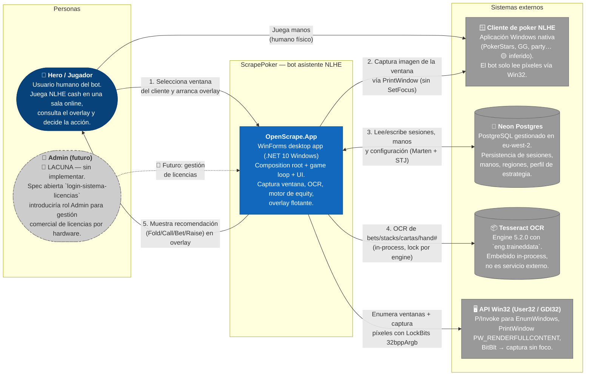

# C4 — Diagrama de Contexto (Nivel 1) — ScrapePoker

> Generado por el **Architect** del Reversa el 2026-05-06.
> Nivel de documentación: **detalhado**.
>
> Escala de confianza: 🟢 CONFIRMADO · 🟡 INFERIDO · 🔴 LACUNA

---

## Propósito

ScrapePoker es un **bot asistente de poker NLHE cash game** que opera **sin acceso a la API del cliente de poker**. El sistema captura de forma pasiva la ventana del cliente de poker que el jugador tiene abierta en otra aplicación de Windows, analiza la mesa con OCR + visión artificial, modela el estado del juego y muestra una recomendación de acción (Fold / Call / Bet / Raise / Check) en un overlay flotante encima de la mesa real.

🟢 El sistema **no ejecuta acciones automáticas** sobre el cliente — solo recomienda. El jugador humano sigue siendo quien pulsa los botones.

---

## Diagrama C4 — Contexto



---

## Descripción de actores

### 👤 Hero / Jugador (persona principal) 🟢

- Usuario humano que ejecuta el binario WinForms en su PC.
- Selecciona la ventana del cliente de poker desde `FormListApps` (`EnumWindows` filtrando título "NL H" 🟡).
- Recibe la recomendación en el `FrmOverlay` (overlay translúcido sobre la mesa real).
- Toma la decisión final en el cliente (pulsa el botón).

🟡 **Audiencia:** un único usuario humano por instalación. No es multi-tenant. No hay autenticación implementada hoy.

### 👑 Admin (futuro) 🔴

- Rol propuesto en `openspec/changes/login-sistema-licencias/`.
- Aún no implementado: ningún módulo, formulario ni endpoint.
- Si se implementa, gestionaría altas/bajas/renovaciones de licencias por `hardware fingerprint`.

---

## Descripción de sistemas externos

### 🪟 Cliente de poker NLHE 🟢

- Es la **única integración real** del bot hacia un sistema externo del dominio.
- El bot **no se conecta vía API ni protocolo de red** del cliente — toda interacción es pasiva: lee la ventana con `PrintWindow PW_RENDERFULLCONTENT` (`Helpers/CaptureWindowsHelper.cs`).
- 🟡 **Salas calibradas en producción:** sin confirmar (ver `questions.md` Q-1: PokerStars, GGPoker, partypoker son las hipótesis más razonables por convenciones del esquema 9-seat y idioma `eng`).
- 🟡 **Idioma del cliente esperado:** inglés (`eng.traineddata` embebido — `INF-5` en `domain.md`).

🟢 Decisión documentada en **ADR-0004**: scraping pasivo en vez de integración API → el bot es genérico para cualquier sala con esquema 9-seat NLHE, a costa de fragilidad ante cambios visuales.

### 🐘 Neon PostgreSQL 🟢

- Servicio gestionado en `eu-west-2.aws.neon.tech`, accedido vía pooler (`SSL Mode=VerifyFull; Channel Binding=Require`).
- Único almacén persistente del sistema. Concentra:
  - Sesiones (`GameSession`) y manos (`HandRecord`) con FK lógica.
  - Catálogo de cartas (`Card`) con imágenes base64 para reconocimiento.
  - Mapas de regiones por sala (`RegionTableMap`).
  - Tablas de estrategia preflop (`Table` con `Positions`).
- Acceso vía Marten 8.24 con serializador `System.Text.Json`. Esquema autogenerado en Development (`AutoCreate.All`); manual en Production.

🔴 **Anomalía de seguridad detectada por el Scout** y confirmada por el Arqueólogo (`code-analysis.md`):
- La cadena de conexión **real** (con credenciales) está commiteada en `appsettings.json` (debería ser `CHANGE_ME`).
- `Program.cs:52` invoca `services.AddDataBase(context.Configuration, true)` con `IsDevelopment` **hardcoded a `true`** → `AutoCreate.All` permanece activo en cualquier entorno.
- Ver **ADR-0018** (estado: 🟡 *aceptado pero incompleto*).

### 📦 Tesseract OCR 🟢

- Engine 5.2.0 + adaptador `Tesseract.Drawing` 5.2.0.
- **In-process** — no es un servicio externo, se carga como librería nativa (`x64`/`x86`) con datos `eng.traineddata` embebidos como `EmbeddedResource`.
- Acceso serializado vía `lock(_lock)` en `OcrService` (Tesseract no es thread-safe).

🟡 Se considera "externo" en el diagrama porque encapsula un proceso de cómputo no trivial fuera del control directo del dominio (depende de un binario nativo + traineddata).

### 🖥️ API Win32 (User32 / GDI32) 🟢

- Llamadas P/Invoke en `Helpers/CaptureWindowsHelper.cs` y `Helpers/WindowsInformationHelper.cs`:
  - `EnumWindows` para listar ventanas del sistema.
  - `PrintWindow` con flag `PW_RENDERFULLCONTENT` para capturar sin robar foco.
  - `BitBlt` y `LockBits` 32bppArgb para acceso eficiente a píxeles (color detection del botón dealer y del color hero turn).
- Es por tanto un **componente sistémico del SO**, no un servicio de red, pero conceptualmente externo al dominio del juego.

---

## Flujo de control de alto nivel

🟢 Confirmado por análisis cruzado de `FrmMain.btnCapture_Click` (`FrmMain.cs:642`), `BackgroundWorker1_DoWork` (`:2737`) y `GameCoordinator.DetermineFlopAction` (`:333`).

```
Hero arranca el bot
   │
   ▼
FormListApps → EnumWindows → Hero selecciona ventana del cliente
   │
   ▼
BackgroundWorker1_DoWork (loop infinito 100-200 ms)
   │  - PrintWindow → bitmap
   │  - PerformEnhancedDetection (LockBits + 9-pixel cross)
   │  - if ShouldCapture (color hero turn ≈ B=24 ±3) → trigger
   ▼
btnCapture_Click (game loop principal, ~270 LOC)
   │  - SetTableHand (pot, hole cards, hand#, table name)
   │  - Detect new hand → Reset state machine + persist previous
   │  - InitializePlayers (dealer detection + moving blinds + aliases)
   │  - SetBetPlayer / SetHeroStack (auto-rebuy detect)
   │  - ProcessTableInfoAsync (preflop o postflop pipeline)
   ▼
Pipeline postflop por calle (Flop/Turn/River)
   │  - UnifiedPokerCalculator.Calculate (equity + outs + texture + EV)
   │  - GameCoordinator.DetermineFlopAction → PostflopDecisionService.DetermineAction
   │  - 10+ paths: facing bet, no-bet, c-bet, check-raise, float exit, probe,
   │    pot control, delayed value, bluff/semi-bluff, randomización
   ▼
FrmOverlay.UpdateAction("Bet 1/2") → Hero ve recomendación
   │
   ▼
GameLoggerService.LogStreetDecision → Marten LightweightSession
```

---

## Restricciones e implícitos

| Categoría | Restricción | Confianza |
|-----------|-------------|-----------|
| Plataforma | Solo Windows (`net10.0-windows`, P-Invoke User32/GDI32) | 🟢 |
| Audiencia | Single-user, single-machine, single-table | 🟢 |
| Idioma cliente | Inglés (Tesseract `eng.traineddata`) | 🟡 |
| Stakes calibrado | Cash micro/low (BB default 0.50, BuyInMax 2.0) | 🟡 (`INF-6`) |
| Comunicación con clientes externos | Solo lectura pasiva — sin SendInput, SendKeys, automatización | 🟢 (sin imports activos) |
| Multi-table | No soportado en producción | 🟡 (ver Q-1 / `INF-2`) |
| Internacionalización | Strings en mezcla castellano/inglés; UI en español | 🟢 |

---

## Lacunas y preguntas abiertas

🔴 Ver `questions.md` para el listado completo. Las más relevantes a este nivel:

- **Q-1**: ¿Qué salas exactas están calibradas en producción? El esquema de regiones es genérico pero solo se han observado pruebas internas.
- **Q-2**: Rastros legacy de `Helpers/AutoIt` y commits "auto capture" — ¿hubo automatización de input que se descartó?
- **Q-3**: Sistema de licencias (`login-sistema-licencias`) — estado de la spec y plan de implementación.
- **Q-4**: ¿Existe plan para multi-table o multi-instancia?

---

## Referencias

- `_reversa_sdd/adrs/0001-clean-architecture-cinco-capas.md`
- `_reversa_sdd/adrs/0002-winforms-net10-windows.md`
- `_reversa_sdd/adrs/0003-marten-postgres-document-db.md`
- `_reversa_sdd/adrs/0004-ocr-en-vez-de-api-cliente-poker.md`
- `_reversa_sdd/adrs/0018-config-environment-development-secrets-gitignored.md`
- `_reversa_sdd/domain.md` §1 (visión del producto)
- `_reversa_sdd/inventory.md` (estructura del repo)
- `.reversa/context/surface.json` (Scout)
