# Deployment — ScrapePoker

> Generado por el **Architect** del Reversa el 2026-05-06.
> Modelo de despliegue, infraestructura y dependencias runtime.
> Nivel de documentación: **detalhado**.
>
> Escala de confianza: 🟢 CONFIRMADO · 🟡 INFERIDO · 🔴 LACUNA

---

## 1. Resumen del modelo de despliegue

🟢 ScrapePoker se despliega como **binario WinForms standalone** sobre la máquina del jugador. No hay arquitectura cliente/servidor: toda la lógica corre localmente. La única dependencia remota es **Neon Postgres** (managed PostgreSQL en `eu-west-2.aws.neon.tech`).

| Atributo | Valor |
|----------|-------|
| Modelo | Single-tenant desktop app + remote DB |
| Distribución | 🔴 Sin instalador definido — `dotnet publish` con `--self-contained` (CLAUDE.md) |
| Targets | `win-x64` (declarado); `Platforms=AnyCPU;x64;x86;ARM32;ARM64` en csproj pero limitado a Windows por TFM |
| Procesos | Uno (`OpenScrape.App.exe`) |
| Hilos | UI thread (STA WinForms) + `BackgroundWorker` dedicado + `Parallel.For` interno (Monte Carlo) + thread del `lock(_lock)` de Tesseract |
| Memoria | ≤ 512 MB típica (ThreadLocal MC + LRU caches con bound) |
| Auto-update | 🔴 Sin mecanismo |
| Observabilidad | Local: `tbResume` (UI), `Console.WriteLine`, JSON line files. Sin APM externo |

🟢 No hay Docker, docker-compose ni contenedores. No hay `Dockerfile` en el repo (`.reversa/context/surface.json` → `docker: null`).

🟢 No hay CI/CD pipeline declarado. La validación pre-merge se hace manualmente con `scripts/verify-pre-merge.ps1` (ADR-0017). Existe `docs/pre-merge-checklist.md` que documenta los pasos.

---

## 2. Diagrama de deployment

```mermaid
flowchart TB
    subgraph Player["💻 Máquina del jugador (Windows)"]
        subgraph WindowsOS["🖥️ Windows 10/11 (x64) — STA Apartment"]
            subgraph Process["📦 OpenScrape.App.exe (proceso único)"]
                Main["FrmMain (UI thread)"]
                BgWorker["BackgroundWorker1<br/>(thread dedicado)<br/>loop 100-200 ms"]
                MC["MonteCarloSimulator<br/>Parallel.For + ThreadLocal buffers"]
                TessLock["Tesseract Engine<br/>lock _lock"]
                Marten["Marten client<br/>await using session"]

                Main <-- "Invoke / BeginInvoke" --> BgWorker
                Main --> MC
                Main --> TessLock
                Main --> Marten
            end

            subgraph Resources["📁 Recursos locales"]
                Tessdata["tessdata/eng.traineddata<br/>+ Resources/tessdata/eng.traineddata<br/>🟡 duplicado"]
                Datafolder["Data/*.json<br/>(16 archivos · estrategia preflop)"]
                Appsettings["appsettings.json<br/>+ appsettings.Development.json (gitignored)"]
                Tessfolder["x64/ y x86/<br/>libleptonica + libtesseract<br/>(P/Invoke nativo)"]
                Games["resources/Games/<br/>🟡 path hardcoded en código"]
                Screens["screens/<br/>screenshots de debug"]
            end

            subgraph WinAPI["🔧 Win32 / GDI"]
                User32["User32.dll<br/>EnumWindows · PrintWindow"]
                Gdi32["Gdi32.dll<br/>BitBlt · CreateCompatibleDC"]
            end

            subgraph PokerClient["🪟 Cliente de poker NLHE<br/>(otro proceso Windows)"]
                ClientWnd["Ventana del cliente<br/>(con título 'NL H...')"]
            end

            Process --> Tessdata
            Process --> Datafolder
            Process --> Appsettings
            Process --> Tessfolder
            Process --> Games
            Process --> Screens

            Process -- "P/Invoke" --> User32
            Process -- "P/Invoke" --> Gdi32
            User32 -. "PrintWindow PW_RENDERFULLCONTENT<br/>(sin SetFocus)" .-> ClientWnd
            Gdi32 -. "BitBlt → Bitmap" .-> ClientWnd
        end
    end

    subgraph Cloud["☁️ Neon · eu-west-2.aws.neon.tech"]
        NeonPooler["Pooler endpoint<br/>ep-solitary-grass-abau81p4-pooler<br/>SSL Mode=VerifyFull · Channel Binding=Require"]
        NeonDB[("PostgreSQL<br/>(Neon serverless)<br/>esquema: GameSession, HandRecord,<br/>Card, Table, RegionTableMap,<br/>StrategyProfile, ...")]
        NeonPooler --> NeonDB
    end

    Marten -- "TCP/IP 5432<br/>SSL VerifyFull + Channel Binding" --> NeonPooler

    classDef machine fill:#1168bd,stroke:#0b4884,color:#fff;
    classDef process fill:#26a269,stroke:#1d7a4f,color:#fff;
    classDef resources fill:#f39c12,stroke:#b97a09,color:#000;
    classDef winapi fill:#9b59b6,stroke:#6d3e85,color:#fff;
    classDef external fill:#999,stroke:#666,color:#fff;
    classDef cloud fill:#16a085,stroke:#0e6655,color:#fff;

    class WindowsOS machine
    class Process,Main,BgWorker,MC,TessLock,Marten process
    class Resources,Tessdata,Datafolder,Appsettings,Tessfolder,Games,Screens resources
    class WinAPI,User32,Gdi32 winapi
    class PokerClient,ClientWnd external
    class Cloud,NeonPooler,NeonDB cloud
```



---

## 3. Build & publish

🟢 Comandos confirmados en CLAUDE.md y validados por estructura de proyectos.

| Operación | Comando |
|-----------|---------|
| Build solution completa | `dotnet build OpenScrape.sln` |
| Build Release | `dotnet build OpenScrape.sln --configuration Release` |
| Clean + Build | `dotnet clean OpenScrape.sln && dotnet build OpenScrape.sln` |
| Tests | `dotnet test OpenScrape.sln` |
| Tests con cobertura | `dotnet test OpenScrape.App.Tests/OpenScrape.App.Tests.csproj --collect:"XPlat Code Coverage"` |
| Format check | `dotnet format --verify-no-changes OpenScrape.sln` |
| Benchmarks | `dotnet run --project BenchmarkSuite1/BenchmarkSuite1.csproj` |
| **Publish** | `dotnet publish src/OpenScrape.App/OpenScrape.App.csproj --configuration Release --runtime win-x64 --self-contained` |

🟡 La spec `--self-contained` implica que el output incluye runtime .NET (no requiere instalación de .NET 10 en la máquina del jugador). Path típico: `bin/Release/net10.0-windows/win-x64/publish/`.

---

## 4. Recursos en runtime

### 4.1 Embebidos en el binario

| Recurso | Path | Mecanismo | Notas |
|---------|------|-----------|-------|
| `eng.traineddata` (Tesseract) | `Resources/tessdata/eng.traineddata` | `EmbeddedResource` | Extraído al disco solo si `tessdata/` del output no existe |
| `eng.traineddata` (copia) | `tessdata/eng.traineddata` | `CopyToOutputDirectory=PreserveNewest` | 🟡 Duplicado documentado en `surface.json` |
| Estrategia preflop | `Data/*.json` (16 archivos) | `CopyToOutputDirectory` | OpenRaise, BBvsSB, ThreeBet, etc. |
| Cartas | `Data/Cartas2.json` | `CopyToOutputDirectory` | 52 cartas con `ImageBase64` |
| Configuración | `appsettings.json` | `CopyToOutputDirectory` | 🔴 contiene credenciales reales (Scout `surface.json:107`) |
| Configuración dev | `appsettings.Development.json` | gitignored, `CopyToOutputDirectory` | Override credenciales |
| Native libs Tesseract | `x64/`, `x86/` | NuGet → output | `liblept-1761.dll`, `libtesseract-5402.dll` |

### 4.2 Generados en runtime

| Path | Propósito | Lifecycle |
|------|-----------|-----------|
| `resources/Games/` | Capturas PNG de cada mano | Crece sin límite (sin retention policy) |
| `screens/` | Screenshots para `FrmDetectionDebug` | Manual |
| Archivo log JSON line | `DetectionLoggerService` `File.AppendAllText` | Crece sin batching |
| `tbResume.Text` (memoria) | Log estructurado UI | Reescrito en cada nueva mano (write amplification — DT) |

🟡 **Path absoluto hardcoded** en `FrmMain.GetImageWhilePlaying`: `"C:", "Code", "Poker", "ScrapePoker", "resources", "Games"`. No portable a otras máquinas (deuda técnica DT-26).

---

## 5. Configuración por ambiente

🟢 ADR-0018 documenta el modelo. Resumen:

| Variable | Default | Mecanismo |
|----------|---------|-----------|
| `DOTNET_ENVIRONMENT` | `"Development"` | Leída en `Program.cs:34` con fallback explícito |
| `appsettings.json` | siempre cargado | Base — debería contener placeholders `CHANGE_ME` |
| `appsettings.{Environment}.json` | `appsettings.Development.json` | Override automático del Generic Host |
| `launchSettings.json` | `DOTNET_ENVIRONMENT=Development` | Solo Visual Studio launch |

🔴 **Problema documentado** (anomalía DT-3 + DT-4):
- `appsettings.json` tiene la connection string real de Neon committeada (debería ser placeholder).
- `Program.cs:52` invoca `services.AddDataBase(context.Configuration, true)` con `IsDevelopment=true` **hardcoded** → `AutoCreate.All` siempre activo, ignorando el `DOTNET_ENVIRONMENT` real.

---

## 6. Conexión a la base de datos

🟢 Confirmado en `code-analysis.md` (módulo Infrastructure).

```
Server=ep-solitary-grass-abau81p4-pooler.eu-west-2.aws.neon.tech
Database=neondb
Username=neondb_owner
Password=*** (rotar — committeada en histórico)
SSL Mode=VerifyFull
Channel Binding=Require
```

| Aspecto | Detalle |
|---------|---------|
| Provider | Neon (managed Postgres serverless) |
| Región | `eu-west-2` (Londres) |
| Pooler | Activado — conexiones efímeras OK con `await using` |
| TLS | `VerifyFull` (verifica certificado y hostname) |
| Channel Binding | `Require` (resistencia adicional a MITM) |
| Cliente .NET | Marten 8.24 sobre Npgsql |
| Esquema | Auto-creado por Marten en Development; `AutoCreate.All` |
| Backups | 🔴 Gestionado por Neon (out of scope del bot); plan exacto sin documentar |
| Migraciones | 🔴 Sin migración explícita; Marten autocreate hace el trabajo |

---

## 7. Dependencias runtime

| Categoría | Dependencias | Tamaño aprox |
|-----------|--------------|--------------|
| **.NET runtime** | Embebido si `--self-contained` (~80 MB) | 80 MB |
| **NuGet packages** | Marten 8.24, Tesseract 5.2, OpenCvSharp4 4.10 + native, SkiaSharp 3.119, MS.Extensions.Hosting 10.0.3 | ~120 MB |
| **Tesseract native** | `liblept-1761.dll`, `libtesseract-5402.dll` (x64 + x86) | ~30 MB |
| **traineddata** | `eng.traineddata` (×2 ubicaciones) | ~24 MB total |
| **OpenCvSharp4 native** | `OpenCvSharpExtern.dll` runtime win | ~50 MB |
| **Datos** | `Data/*.json` 16 archivos | ~5 MB (Cartas2 incluye base64) |

🟡 Tamaño total estimado del publish self-contained: **~300-350 MB**.

---

## 8. Inicio del proceso

🟢 `Program.Main()` (STA, WinForms requirement):

```
1. Leer DOTNET_ENVIRONMENT (default "Development")
2. Construir Host con:
   - AddDataBase(IsDevelopment=true)  # 🔴 hardcoded
   - AddUseCases()                    # Features
   - 13 Configure<TOption>() (StrategyProfile, OverlayConfig, GameLoop, Features, CaptureSettings)
   - 4+13 algoritmos DecisionMaker (Singleton + forwarding pattern)
   - 13 servicios App (Singleton) y 6 (Scoped)
   - FrmMain Transient
3. host.Build()
4. StrategyProfileValidator.Validate(profile)  # FAIL-FAST
   - if errors: MessageBox + Environment.Exit(1)
5. Inicializar CoordinateScaler si CaptureSettings.IsReferenceSet
6. host.Services.CreateAsyncScope()
7. Application.Run(form)
8. finally: scope.DisposeAsync().AsTask().GetAwaiter().GetResult()
```

🟢 Tiempo de arranque típico: ~3-5 s (Marten + OCR engine + StrategyProfile validation + CardCacheService lazy load).

---

## 9. Operación

### 9.1 Inicio de sesión (jugador)

1. Abrir `OpenScrape.App.exe`.
2. Seleccionar la ventana del cliente de poker en `FormListApps` (filtrado por título "NL H").
3. Configurar opciones de overlay si es necesario (`Config` tab).
4. Pulsar "Start" → `BackgroundWorker1.RunWorkerAsync()`.
5. El bot empieza a detectar acciones del hero y a recomendar.
6. Al cerrar la ventana del overlay, el loop sale (`e.Cancel = true`).
7. La sesión se persiste vía `GameLoggerService.SaveSessionAsync` al cerrar la app.

### 9.2 Frecuencia de operaciones

| Operación | Frecuencia típica |
|-----------|-------------------|
| Detection loop (`BackgroundWorker1_DoWork`) | Cada 100-200 ms |
| Captura completa (`btnCapture_Click`) | Cada vez que se detecta turno hero (~3-15 s entre manos) |
| OCR | ~10-20 invocaciones por captura |
| Monte Carlo | 1-3 por captura postflop (preflop, flop, turn, river) |
| Marten write | 1 por mano (`HandRecord`) + 1 por sesión (al cerrar) |
| Marten read | Lazy: `CardCacheService` (1 vez), `GetActionScenario` (preflop, vía `Table` lookup), `GetRecentGameRounds` (UI tab) |

🟢 CPU: spike ~70% durante MC postflop, ~10% en idle.

---

## 10. Escenarios de fallo

🟡 Documentados parcialmente; los más relevantes:

| Escenario | Componente | Comportamiento actual |
|-----------|-----------|----------------------|
| Connection string ausente / inválida | `Infrastructure.Services.AddDataBase` | `NullReferenceException` por `!` (null-forgiving). Falla en `host.Build()` |
| StrategyProfile inválido | `StrategyProfileValidator` | `MessageBox` + `Environment.Exit(1)` (fail-fast) |
| Ventana del cliente cerrada | `BackgroundWorker1_DoWork` | `_handle == IntPtr.Zero` → continúa loop sin capturar |
| Postgres caído | `IDocumentStore.LightweightSession` | Excepción Marten → propaga al consumer; en `GameLoggerService` se logguea pero la mano se pierde |
| OCR confidence baja persistente | `OcrService` | Reintenta hasta `MaxOcrRetries` y propaga string vacío |
| Tesseract dll missing | `OcrService.ctor` | Excepción al primer use; sin guardrails — falla el proceso |
| Auto-rebuy detectado | `PostflopGameContext.TrackHeroStack` | Ignora aumento ≥50 BB; preserva `HeroStackPreRebuy` |
| Multi-table abierta | `FormListApps` | Solo selecciona una ventana; loop opera contra esa única handle |

---

## 11. Seguridad operacional

🔴 **Anomalías críticas** identificadas:

| Anomalía | Severidad | Acción recomendada |
|----------|-----------|---------------------|
| Postgres password en `appsettings.json` (committed) | 🔴 alta | **Rotar password en Neon, scrubbing del Git history, revertir `appsettings.json` a `CHANGE_ME`** |
| `Encrypter.Key` en `appsettings.json` (committed) | 🔴 alta | Rotar y mover a `Development.json` |
| `IsDevelopment=true` hardcoded → `AutoCreate.All` siempre | 🔴 alta | Cambiar a `context.HostingEnvironment.IsDevelopment()` |
| `EncrypterHelper` con IV fija (16 ceros) | 🟡 media | Generar IV aleatorio por mensaje + prepend al ciphertext |
| Path absoluto hardcoded en código | 🟡 media | Cambiar a `AppDomain.CurrentDomain.BaseDirectory` |
| Sin auto-update mechanism | 🟡 media | Definir estrategia (Squirrel.NET, ClickOnce, manual) |
| Vulnerabilidad `NU1902` suprimida | 🟡 baja | Plan de upgrade Marten cuando OpenTelemetry.Api se actualice |

---

## 12. Performance characteristics

🟢 Documentadas en CLAUDE.md y validadas por análisis:

| Métrica | Valor | Notas |
|---------|-------|-------|
| Throughput por captura | 1 captura cada ~3 s típico | Limitado por OCR + MC |
| Latencia OCR | ~50-150 ms / región | 4 attempts, dHash cache hit reduce a ~5 ms |
| Latencia Monte Carlo flop | ~100-300 ms | 50K iters Parallel.For |
| Latencia Monte Carlo turn (exact) | ~50-100 ms | C(45,2) × C(44,2) ≈ 42K evals |
| Latencia Monte Carlo river (exact) | ~5-15 ms | C(45,2) = 990 manos |
| Latencia Marten write `HandRecord` | ~20-50 ms | `LightweightSession` + `await SaveChangesAsync` |
| Memoria base | ~150 MB | Sin manos jugadas |
| Memoria steady-state | ~250-400 MB | Tras ~100 manos |
| Memoria peak | ~500 MB | Durante MC con bitmap grandes |

🟢 Optimizaciones documentadas (ADR-0016):
- LockBits 32bppArgb directo (anti-marshaling de `GetPixel`).
- `RegionLookupCache` Dict O(1) reemplaza `FirstOrDefault` O(n).
- `CardCacheService` Singleton lazy: 1 query/vida del proceso (antes 3 redundantes).
- Marten session dispose con `await using` (sin leak de conexiones).
- `ThreadLocal<CardDataOuts[]>` deck por thread + `ThreadLocal<List<CardDataOuts>>` para hand/opponent buffers en MC (zero-allocations por iteración).
- `HandScore` struct readonly con `CompositeScore` long para comparación O(1).

---

## 13. Próximos pasos relevantes para deployment

🔴 Pendientes documentados:

1. **Rotación de credenciales y scrubbing de Git history** — anomalía DT-3 (mayor prioridad).
2. **Fix `IsDevelopment=true` hardcoded** — anomalía DT-4 (1 línea).
3. **Definir mecanismo de instalación / distribución** — actualmente solo `dotnet publish`.
4. **Auto-update strategy** — sin plan documentado.
5. **CI pipeline** — GitHub Actions con `dotnet build`, `dotnet test`, `dotnet format --verify-no-changes`. Reemplazaría `scripts/verify-pre-merge.ps1` manual.
6. **Spec `login-sistema-licencias`** — añadirá login local y validación de licencia por hardware fingerprint, con DB de licencias en Neon o servicio independiente.
7. **Backups & disaster recovery de Neon** — sin documentar.
8. **Telemetry export externo** — opcional (hoy es solo local in-process).

---

## 14. Referencias

- `_reversa_sdd/architecture.md` §10 (restricciones operacionales)
- `_reversa_sdd/c4-context.md`
- `_reversa_sdd/c4-containers.md`
- `_reversa_sdd/code-analysis.md` (sección Infrastructure y App)
- `_reversa_sdd/adrs/0002-winforms-net10-windows.md`
- `_reversa_sdd/adrs/0003-marten-postgres-document-db.md`
- `_reversa_sdd/adrs/0017-telemetria-metrics-collector-quality-checkpoints.md`
- `_reversa_sdd/adrs/0018-config-environment-development-secrets-gitignored.md`
- `.reversa/context/surface.json` (Scout — `docker: null`, no CI/CD)
- `scripts/verify-pre-merge.ps1`
- `docs/pre-merge-checklist.md`
- CLAUDE.md (build & publish commands)
