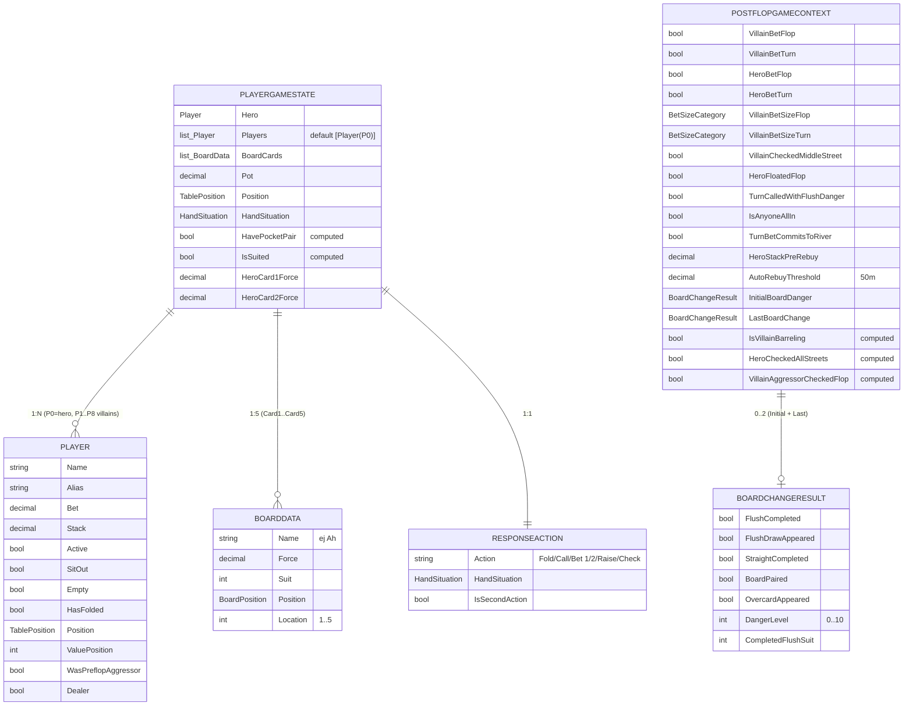

# ERD Completo — ScrapePoker

> Generado por el **Architect** del Reversa el 2026-05-06.
> Modelo de datos completo (entidades persistidas, value objects, DTOs operacionales).
>
> Escala de confianza: 🟢 CONFIRMADO · 🟡 INFERIDO · 🔴 LACUNA

---

## Naturaleza del modelo

ScrapePoker usa **Marten 8.24** (PostgreSQL como document DB con JSONB). Esto significa:

- **No hay esquema relacional clásico** — cada entidad se persiste como un documento JSONB.
- **Los "joins" se hacen vía claves lógicas** (string PK), no FK físicas. Marten no impone integridad referencial.
- **Los índices se definen explícitamente** en `OpenScrape.Infrastructure/Services.cs` para los campos más consultados; el resto del JSONB queda full-scan.
- Las **colecciones embebidas** (ej. `RegionTableMap.Regions`, `Table.Positions`, `HandRecord.Decisions`) se serializan dentro del documento padre — no son tablas separadas.
- `GameSession.Hands` está marcado `[JsonIgnore]` y se rehidrata por consulta separada en `HandRecord` (FK lógica `GameSessionId`).

🟢 Confirmado en `code-analysis.md` (módulos `Domain` e `Infrastructure`).

---

## Diagrama ERD principal

```mermaid
erDiagram
    %% ---- Documentos Marten persistidos ----

    GAMESESSION ||--o{ HANDRECORD : "1:N (FK lógica GameSessionId)"
    HANDRECORD ||--o{ STREETDECISION : "1:N (embebido en JSONB)"
    HANDRECORD ||--o| TELEMETRYAGGREGATE : "0..1 (embebido)"
    REGIONTABLEMAP ||--o{ REGION : "1:N (embebido)"
    TABLE ||--o{ PLAYERACTIONSEQUENCE : "1:N (embebido)"
    PLAYERACTIONSEQUENCE ||--o{ HAND : "1:N (embebido)"
    STRATEGYPROFILE ||--o{ STREETTHRESHOLDS : "1:N (Dictionary embebido)"
    OPPONENTPROFILE ||--o{ OPPONENTPOSITIONPROFILE : "1:6 (Dictionary embebido por TablePosition)"

    %% ---- Identificadores y campos clave ----

    GAMESESSION {
        string Id PK "Guid string"
        string SessionId "lógico, no único"
        string TableName "indexado"
        DateTime StartTime "indexado"
        DateTime EndTime "indexado"
        decimal BigBlind "default 0.50m"
        decimal StartingBankroll
        decimal EndingBankroll
        decimal PeakBankroll
        list_HandRecord Hands "JsonIgnore (no persistido)"
        int TotalHands "computed"
        decimal TotalProfit "computed"
        double BBPer100 "computed"
        bool IsValid "computed"
    }

    HANDRECORD {
        string Id PK "Guid string"
        string GameSessionId FK "indexado (FK lógica → GameSession)"
        long HandNumber "indexado por (GameSessionId, Timestamp)"
        DateTime Timestamp "indexado"
        string HeroCard1 "ej AKs"
        string HeroCard2
        TablePosition HeroPosition "indexado"
        decimal HeroStackStart
        decimal HeroStackEnd
        decimal BlindPosted
        decimal AutoRebuy "≥50 BB triggers"
        decimal NetProfit "computed"
        list_string FlopCards "lista de 3"
        string TurnCard "nullable"
        string RiverCard "nullable"
        list_StreetDecision Decisions "embebido"
        decimal PotSizeFinal
        BoardPosition LastStreetPlayed
        int NumOpponents
        HandResult Result "Won/Lost/Push/Unknown"
        HandSituation Situation
        TelemetryAggregate Telemetry "nullable, embebido"
    }

    STREETDECISION {
        BoardPosition Street
        double EquityPercent
        double PotOddsPercent
        decimal ExpectedValue
        string RecommendedAction "del motor"
        string ActionTaken "del jugador"
        decimal PotSizeAtDecision
        decimal BetSize
        HandSituation Situation
        bool IsInPosition
        string Reason "opcional"
        string BoardTexture "opcional"
        int TotalOuts "opcional"
        double SPR "opcional"
    }

    TELEMETRYAGGREGATE {
        long HandId
        DateTime CapturedAt
        list_PhaseStats Phases "Cycle/Capture/OCR/Decision por fase"
    }

    CARD {
        string Id PK "ej As/Kh/2c"
        string ImageBase64 "nullable"
        string BinaryValue "hash binario"
        list_string Hall "aliases por sala"
        int Force
        int Suit
    }

    TABLE {
        string Id PK "ej OpenRaise/ThreeBet"
        list_PlayerActionSequence Positions "embebido"
    }

    PLAYERACTIONSEQUENCE {
        string HeroPosition
        string OpenRaiser "nullable"
        string ThreeBetPosition "nullable"
        string Limper "nullable"
        string Caller "nullable"
        string Squeezer "nullable"
        decimal BetSize "nullable, filtro comentado en código"
        bool IsGreater "nullable"
        bool RaiserFolds "nullable"
        list_Hand Hands "embebido"
    }

    HAND {
        string Name "ej AA, AKs"
        bool Suited "nullable"
        string Action "Raise/Call/3Bet/Fold"
        int Percentage "0..100, suma 100"
    }

    REGIONTABLEMAP {
        string Id PK "Category/clave de mapa"
        list_Region Regions "embebido"
    }

    REGION {
        string Category
        string Name "ej P0_Card1, Pot, HeroBet"
        int PosX
        int PosY
        int Width
        int Height
        bool IsHash "preserve only"
        bool IsColor "preserve only"
        bool IsBoard "preserve only"
        bool IsOnlyNumber "preserve only"
        string Color "nullable"
        double InactiveUmbral
        double Umbral
    }

    STRATEGYPROFILE {
        string Id PK "Guid string"
        string Name "default Default"
        DateTime CreatedAt
        dict_StreetThresholds Thresholds "clave Street_Situation, ~30 entradas"
        decimal InitialBankroll "100m"
        decimal BuyInMax "2m"
        int MinSessionsForRecommendation "20"
        double RiskOfRuinThreshold "0.05"
        double FoldEquityBase "20.0"
        double FoldEquityMin "5.0"
        double FoldEquityMax "60.0"
        double DangerFlushCompletePct "35.0"
        double DangerStraightCompletePct "18.0"
        double CbetFrequencyFlop "0.65"
        double CbetFrequencyTurn "0.45"
        double CbetFrequencyRiver "0.30"
        bool CheckRaiseMixingEnabled "true"
        bool ThreeBetPotNoFloat "true"
        otros_~150_parametros otros "Bluff/SPR/Multiway/3-bet/Reverse/Combo Draw/Tainted/Float/Slow Play/Sprints S18-S22"
    }

    STREETTHRESHOLDS {
        double FoldBelow
        double ThinValueAbove
        double ValueAbove
        double StrongValueAbove
        bool IsSimplified "RaiseOverLimper → true"
        string DryBetSize
        string CoordinatedBetSize
        string PairedBetSize
        string MonotoneBetSize
        string WetBetSize
        bool CanBluff
        double BluffFrequencyMultiplier
        string BluffCondition
        bool ThinValueIPOnly
        string ThinValueOOPFallback
        bool CanCheckRaise
        double CheckRaiseThreshold
        bool CanOverbet
        string OverbetBetSize
        double OverbetMinEquity
        string ComboDrawBetSize
        int ComboDrawOutsThreshold
        bool CanProbeBet
        string ProbeBetSize
        double ProbeBetMinEquity
        bool CanDoubleBarrel
    }

    OPPONENTPROFILE {
        string Id PK "playerName"
        int HandsPlayed "default 0; <10 → Unknown"
        int VPIPCount
        int PFRCount
        int ThreeBetCount
        int PostflopBet_IP
        int PostflopBet_OOP
        int PostflopRaise_IP
        int PostflopRaise_OOP
        int PostflopCall_IP
        int PostflopCall_OOP
        int PostflopFold_IP
        int PostflopFold_OOP
        int CBetCount
        int CBetOpportunities
        int FoldToCBetCount
        int FoldToCBetOpportunities
        int TimesReachedRiver
        int TimesWentToShowdown
        int TimesWonAtShowdown
        int CheckRaiseCount
        int DonkBetCount
        int BarrelCount
        int BarrelOpportunities
        double VPIP "computed: VPIPCount/HandsPlayed"
        double PFR "computed"
        double ThreeBetPct "computed"
        double AggressionFactor "Laplace (a+1)/(p+1)"
        double AggressionFactorIP "-1 si <5 muestras"
        double AggressionFactorOOP "-1 si <5 muestras"
        double CBetPct "computed"
        double FoldToCBetPct "computed"
        double WTSDPct "computed"
        double WSDPct "computed"
        double CheckRaisePct "computed"
        double DonkBetPct "computed"
        double BarrelFrequency "computed"
        OpponentType Type "LAG/TAG/LP/TP/Unknown"
        bool HasReliableCBetData "≥5"
        bool HasReliableAFData "≥10"
        bool HasReliableFoldData "≥8"
        dict_OpponentPositionProfile PositionProfiles "Dict por TablePosition"
    }

    OPPONENTPOSITIONPROFILE {
        TablePosition Position
        int HandsPlayed "indep, ≥10 → IsReliable"
        int VPIPCount
        int PFRCount
        int PostflopBet_IP
        int PostflopRaise_IP
        int PostflopCall_IP
        int PostflopFold_IP
        int PostflopBet_OOP
        int PostflopRaise_OOP
        int PostflopCall_OOP
        int PostflopFold_OOP
        bool IsReliable "computed"
    }

    OVERLAYCONFIG {
        double Opacity "0.8"
        float FontSize "10"
        float ActionFontSize "14"
        int VerticalOffset "75"
        double HorizontalOffsetPercent "0.15"
    }
```

---

## Diagrama ERD operacional (no persistido)

Entidades en memoria que **no se guardan en Marten** pero modelan el estado del juego durante la mano.



---

## Tabla de entidades persistidas (resumen)

| Entidad | Persistencia | PK | Cardinalidad típica | Índices |
|---------|--------------|----|----|---------|
| `GameSession` | 📂 Marten | `Id` (Guid) | 1 por sesión / mesa | `EndTime`, `SessionId`, `TableName` |
| `HandRecord` | 📂 Marten | `Id` (Guid) | N por sesión (cientos por hora) | `GameSessionId`, `Timestamp`, `(GameSessionId, Timestamp)`, `HeroPosition` |
| `Card` | 📂 Marten (autodescubierto) | `Id` (ej `As`) | 52 cartas | solo PK |
| `Table` | 📂 Marten (autodescubierto) | `Id` (string clave situación) | ≤ 16 (1 por escenario) | solo PK |
| `RegionTableMap` | 📂 Marten | `Id` (Category) | Decenas (1 por sala/layout) | solo PK |
| `StrategyProfile` | 📂 Marten / `appsettings.json` | `Id` (Guid) | 1 activo (default) | solo PK |
| `OpponentProfile` | 🟡 Marten 🔴 abierta | `Id` (playerName) | Hasta 100s a lo largo del tiempo | 🔴 Ver `Q-FSM-02` (estrategia cross-sesión) |
| `OverlayConfig` | `appsettings.json` (no Marten) | — | 1 | — |

🟡 **`OpponentProfile`**: el `OpponentTracker` mantiene `ConcurrentDictionary` en memoria. La persistencia cross-sesión está abierta (ver ADR-future-2 en `_reversa_sdd/adrs/README.md`).

---

## Entidades operacionales (no persistidas)

| Entidad | Ubicación | Propósito | Mutabilidad |
|---------|-----------|-----------|-------------|
| `PlayerGameState` | `OpenScrape.App/Entities/` | Estado del juego in-memory por iteración | Mutable |
| `Player` | `OpenScrape.App/Entities/` | Estado de un jugador en la mesa | Mutable |
| `BoardData` | `OpenScrape.App/Entities/` | Carta del board con metadatos OCR | Mutable |
| `ResponseAction` | `OpenScrape.App/Entities/` | Output del motor para un input | Mutable |
| `PostflopGameContext` | `OpenScrape.DecisionMaker/Services/` | Estado cross-street durante una mano | **Inmutable** (record) |
| `BoardChangeResult` | `OpenScrape.Domain/ValueObjects/` | Detección de cambios entre streets | Inmutable |
| `BoardTextureResult` | `OpenScrape.DecisionMaker` | Wetness + flags | Inmutable record |
| `EquityResult` (nested) | `MonteCarloSimulator` | Output de equity con HandDistribution | Inmutable |
| `OutsResult` (nested) | `OutsCalculator` | Total/tainted/clean/effective + flags | Inmutable |
| `DecisionRequest` / `DecisionResult` | `OpenScrape.DecisionMaker/DTOs/` | DTO facade | Sealed record |
| `DetectionResult` (nested) | `FrmMain` | Output de `PerformEnhancedDetection` | Record |
| `OcrResult` | `OcrService` | Texto + Image + Confidence + Attempts | Mutable + IDisposable |
| `BetSizingOption` | `OpenScrape.DecisionMaker` | Size + Label + Type | Record |

---

## Configuración serializada (no Marten)

El sistema persiste también en archivos:

| Tipo | Path | Formato | Notas |
|------|------|---------|-------|
| `StrategyProfile` (overrides) | `appsettings.json` | JSON | Cargado vía `IOptions<StrategyProfile>`. Validación fail-fast al arrancar |
| `OverlayConfig` | `appsettings.json` | JSON | `IOptions<OverlayConfig>` |
| `GameLoopOptions` | `appsettings.json` | JSON | CaptureIntervalMs, StopTimeoutMs |
| `FeatureFlags` | `appsettings.json` | JSON | UseGameLoopCoordinator: bool |
| `CaptureSettings` | `appsettings.json` | JSON | IsReferenceSet, ReferenceImageWidth/Height |
| Tablas estrategia preflop | `Data/*.json` (16 archivos) | JSON | OpenRaise, BBvsSB, ThreeBet, VsThreeBet, Squeeze, Cold4Bet, FourBet, RaiseOverLimpers, RaiseVsSbLimp, VsSqueeze, VsThreeBetAndCall, Cartas2, Regiones*, RegionToTest, tableMap |
| Cartas (catálogo) | `Data/Cartas2.json` | JSON | 52 cartas con `ImageBase64` |
| `appsettings.Development.json` | gitignored | JSON | Override credenciales reales + Encrypter.Key |

---

## Convenciones del modelo

| Convención | Detalle |
|-----------|---------|
| `Id` ↔ `Name` | Los mappers `CardDTOMapper` y `TableDTOMapper` colapsan `Entity.Id` (string PK Marten) a `DTO.Name` para la UI |
| FK lógica string | `HandRecord.GameSessionId` apunta a `GameSession.Id`. Marten no enforce integridad referencial |
| Embebido vs documento separado | `HandRecord.Decisions` (lista de `StreetDecision`) embebida en JSONB; `HandRecord` es documento separado de `GameSession` |
| Index strategy | Solo se indexan los campos consultados en hot path (`EndTime`, `GameSessionId+Timestamp`, `HeroPosition`); el resto es full-scan sobre JSONB |
| Tipos string para enums en JSON | `TablePosition`, `BoardPosition`, `HandSituation` se serializan como string (STJ) para legibilidad |
| Decimal para dinero | Todo (`Pot`, `Stack`, `Bet`, `BigBlind`, `BlindPosted`, `AutoRebuy`, `NetProfit`, `Bankroll`) usa `decimal` (no `double`) para evitar errores de redondeo |
| Validación inline en records | `Hand.Name` y `Hand.Percentage` validan en `init` setter — invariantes garantizadas tras construcción |
| Computed properties | `GameSession.{TotalHands,TotalProfit,BBPer100,IsValid}`, `HandRecord.NetProfit`, `OpponentProfile.{VPIP,PFR,...}` — no se persisten, se calculan al deserializar |

---

## Lacunas y preguntas abiertas

🔴 Consolidadas en `questions.md`. Las relevantes al modelo de datos:

- **Q-DATA-01**: ¿Estrategia de persistencia de `OpponentProfile` cross-sesión? (ver ADR-future-2). Hoy es solo en memoria.
- **Q-DATA-02**: ¿Migración de `Game_YYYY_MM_DD` → `AAAAMMDD_Game` (commit `6699702`) deja folders huérfanos? Sin migración documentada.
- **Q-DATA-03**: `HandRecord.Telemetry` opcional — manos viejas no la tienen. ¿Plan de backfill o por diseño?
- **Q-DATA-04**: Filtro `BetSize` en `PlayerActionSequence` está comentado pero el campo persiste. ¿Deuda técnica o decisión consciente?
- **Q-DATA-05**: ¿Por qué `Suit` en `Card` es `int` y no el enum `Suit` definido en Domain?
- **Q-DATA-06**: Si `RegionTableMap.Regions` es `null` cuando se intenta `Add`, la operación silenciosamente descarta. ¿Marten garantiza inicialización?

---

## Referencias

- `_reversa_sdd/data-dictionary.md` — diccionario completo (todos los campos)
- `_reversa_sdd/code-analysis.md` — análisis técnico (ver §"OpenScrape.Domain", §"OpenScrape.Infrastructure")
- `_reversa_sdd/domain.md` §3.8 (persistencia y telemetría) y §3.9 (configuración)
- `_reversa_sdd/adrs/0003-marten-postgres-document-db.md`
- `_reversa_sdd/adrs/0007-postflop-context-inmutable-holder-scoped.md`
- `_reversa_sdd/adrs/0011-opponent-tracker-laplace-reliability.md`
- `_reversa_sdd/adrs/0013-auto-rebuy-detection-50bb-threshold.md`
