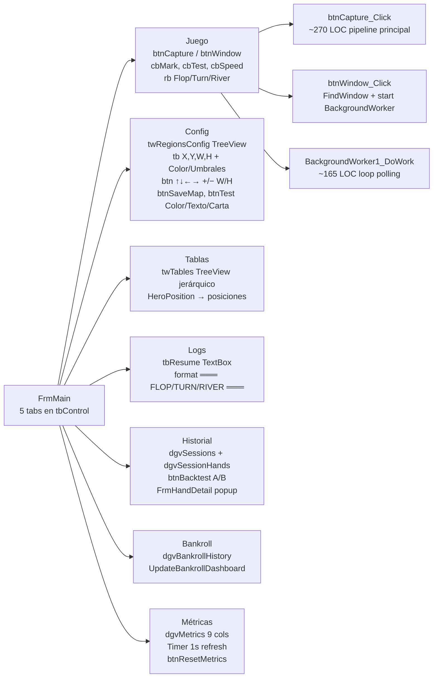
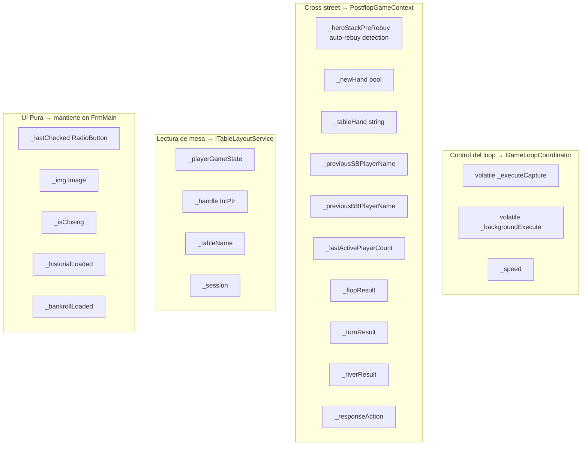
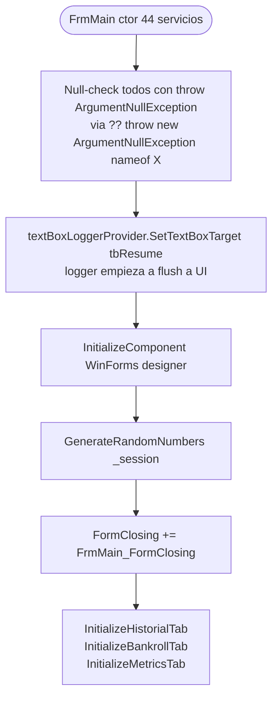
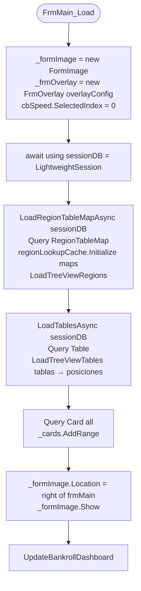
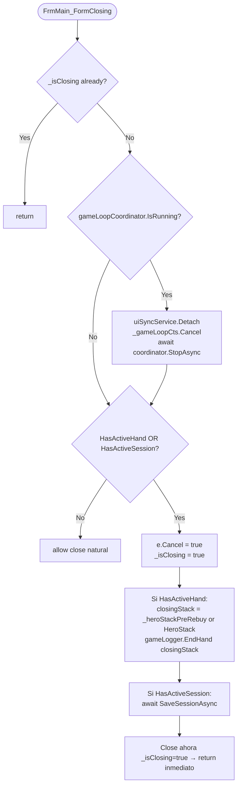
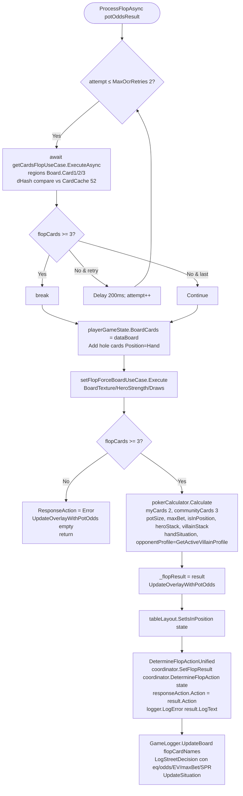
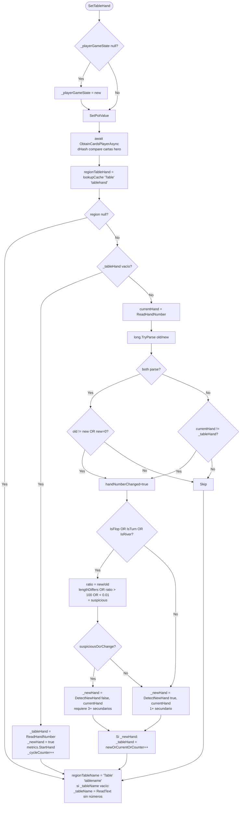
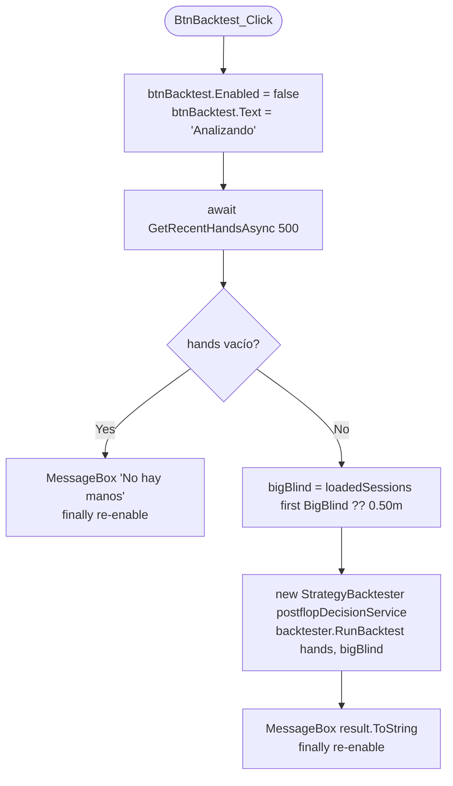
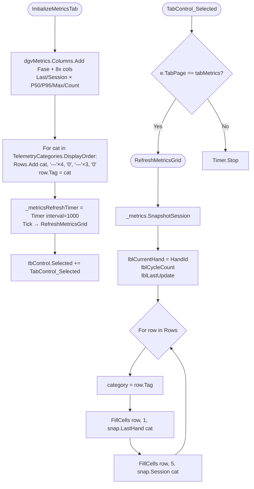

# Flowchart — `FrmMain` (4502 LOC)

> Form WinForms gigante: composition consumer de DI, captura, pipeline de juego, 5 tabs UI, 95+ métodos.
> Generado por el Arqueólogo del Reversa.

## Inventario de tabs y sus eventos

## Inventario de estado mutable

> Documentado dentro del propio FrmMain.cs:4448-4500 con plan de migración a Fase 7.3.

## Constructor — Inyección de dependencias (44 parámetros)

## FrmMain_Load (cuando se muestra)

## FrmMain_FormClosing (persistencia al cerrar)

## btnCapture_Click — Pipeline principal (canónico)

> Ya documentado en `OpenScrape.App.md`. Resumen:
>
> 1. Métricas: `cycleTimer = metrics.Measure CycleTotal`
> 2. Limpiar overlay y `_executeCapture = true`
> 3. **No-test:** `GetImageWhilePlaying` → captura, save PNG, init scaler en primera vez
> 4. **Test postflop:** `ForceState` Flop/Turn/River
> 5. `SetTableHand` (OCR pot, holes, table name, hand number)
> 6. `DetectNewHand` con 7 indicadores (handChange + 3-of-6 secundarios)
> 7. Si nueva mano: snapshot postflop si misma mano, reset PlayerGameState, restaurar estado
> 8. `HandleNewHandAsync` (EndHand previa + SaveSession + Tracker.RecordHand/VPIP/PFR + StartNewHandAsync)
> 9. Inicializar/refrescar jugadores via `tableLayout`
> 10. `SetBetPlayer` + `SetHeroStack` (con auto-rebuy detect) + `RetryEmptyAliases`
> 11. `ProcessTableInfoAsync`: rama preflop o postflop con retries para hole cards
> 12. **Postflop:** `ProcessFlopAsync`/`ProcessTurnAsync`/`ProcessRiverAsync` (cada uno OCR cards 3 retries → `pokerCalculator.Calculate` → `coordinator.DetermineXxxAction`)
> 13. Overlay update + log final

## ProcessFlopAsync (canónico)

## SetTableHand — Detección de nueva mano

## Backtest A/B (Historial tab)

## Métricas tab — Refresh loop

## Anomalías y deuda técnica críticas

🔴 **Críticas:**
- **God Class** `FrmMain` 4502 LOC con 95+ métodos. El propio archivo documenta inventario de migración pendiente al `GameLoopCoordinator` (refactor `refactor-frmmain-coordinators` Fases 6-7).
- **`SaveReferenceDimensionsToConfig`** reescribe `appsettings.json` mediante string-building manual (no roundtrip JSON real). Si una clave contiene `,` o se reordena, puede corromper el archivo.
- **`BackgroundWorker1_DoWork`** loop infinito `while(true)` sin `cancellationToken`; sólo sale por `e.Cancel = true` desde subthread o si `_frmOverlay` no es visible. Pendiente de migración a `IGameLoopCoordinator` (skeleton presente, feature flag OFF).
- **`btnCapture_Click`** método de ~270 LOC con responsabilidades mixtas: captura, OCR, lifecycle de manos, decisiones, persistencia, overlay update. Es el "main" del game loop.

🟡 **Medias:**
- **Hardcoded path** en `GetImageWhilePlaying`: `"C:", "Code", "Poker", "ScrapePoker", "resources", "Games"`. Debería derivar de `AppDomain.CurrentDomain.BaseDirectory` o config.
- `ProcessRiverAsync` cuenta cartas con `!string.IsNullOrEmpty(d.Name)` mientras `ProcessFlopAsync`/`ProcessTurnAsync` cuentan por `Position == BoardPosition.Flop` o `count >= 4`. Inconsistencia post-fix OCR-3.
- `_handle == IntPtr.Zero` se chequea en algunos métodos pero no en otros (posible NRE en P-Invoke si la ventana del poker se cerró).
- `tbResume.Text` se acumula sin truncar dentro de `HandleNewHandAsync` (`File.AppendAllTextAsync(path, tbResume.Text)`). Si crece mucho, escribe todo el log cada mano (write amplification).

🟢 **Bajas:**
- Comentarios `//portatil` legacy y `//folderPath = @"C:\Code\ScrapePoker\..."` en `FormImage.cs`.
- `_papel = _formImage.pbImage.CreateGraphics()` (`UpdateRegionDisplay`) crea Graphics sin disposar fuera del using.
- `MaximumSize = new Size(500, 400)` hardcoded en `FrmOverlay`.
- Mezcla `_logger.LogError` / `_logger.LogInformation` / `_logger.LogDebug` / `Console.WriteLine` indistintamente (existe `TextBoxLogger` correlated, pero conviven con `Debug.WriteLine`).
