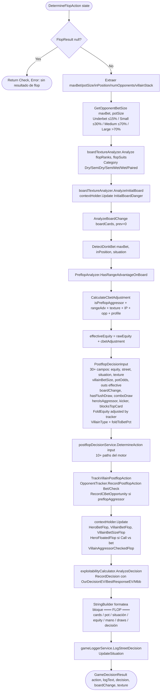
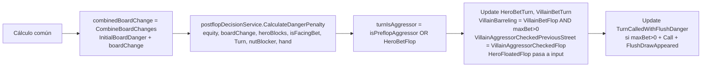
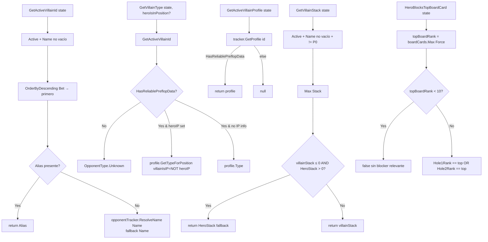
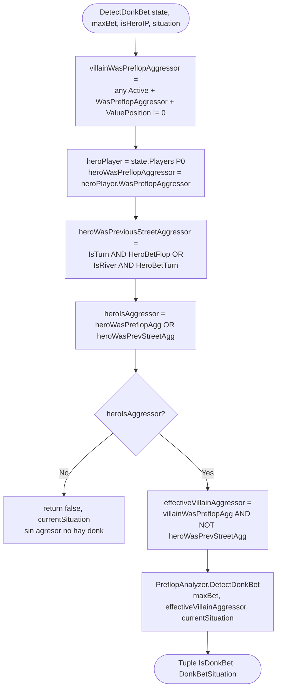
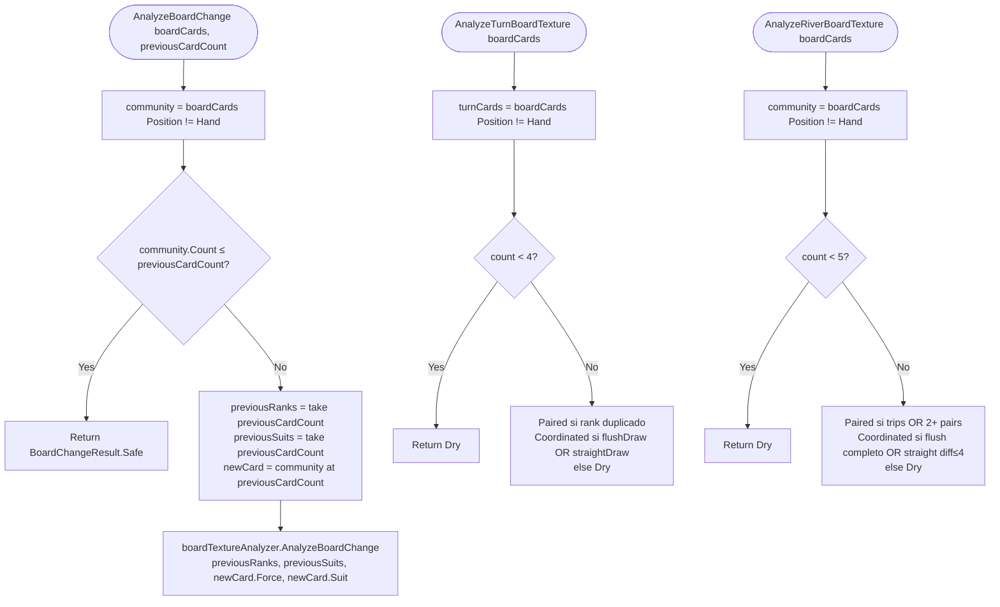

# Flowchart — `GameCoordinator.DetermineFlopAction / Turn / River`

> Coordinador del game loop. Funcionalmente idénticos los 3 métodos: equity → contexto → decisión → exploitabilidad → log.
> Generado por el Arqueólogo del Reversa.

## Contexto del componente

`GameCoordinator` (793 LOC) centraliza la **fase de decisión postflop** delegando en `IPostflopDecisionService` (motor del paquete `OpenScrape.DecisionMaker`). Es **scoped** en DI y sostiene el `PostflopContextHolder` cross-street.

Tres métodos públicos análogos: `DetermineFlopAction`, `DetermineTurnAction`, `DetermineRiverAction`. Las diferencias son:
- **Flop:** `cbetAdjustment`, sin `dangerPenalty` previo, `previousCardCount=0`
- **Turn:** `dangerPenalty` calculado, `combinedBoardChange = InitialBoardDanger + boardChange`, `previousCardCount=3`
- **River:** `dangerPenalty`, `combinedBoardChange = LastBoardChange + boardChange`, `previousCardCount=4`, all-in detection

## Flujo de `DetermineFlopAction` (canónico)

## Diferencias específicas por calle

### Turn-only

### River-only

```mermaid
flowchart LR
    Common[Cálculo común] --> AllinCheck{villainStack ≤ 0?}
    AllinCheck -->|Yes| MarkAllin[contextHolder.Update IsAnyoneAllIn=true]
    AllinCheck -->|No| RiverCard

    MarkAllin --> RiverCard[boardTextureAnalyzer.ClassifyRiverCard boardChange<br/>RiverCardType S22.2: Brick/Scare/Improving/Neutral]
    RiverCard --> CombineRiver[combinedBoardChange = CombineBoardChanges<br/>LastBoardChange + boardChange]
    CombineRiver --> AggRiver[riverIsAggressor = preflopAgg OR HeroBetFlop OR HeroBetTurn]
    AggRiver --> InputRiver[Pasa a input:<br/>VillainBetSizeTurn, VillainCheckedMiddleStreet<br/>TurnCalledWithFlushDanger, HeroCheckedAllStreets]
    InputRiver --> NoTrackUpdate[NO actualiza HeroBet/VillainBet de calle siguiente — es la última]
```

## Helpers compartidos del coordinator

## DonkBet Detection

## Análisis de board (post-OCR cards)

