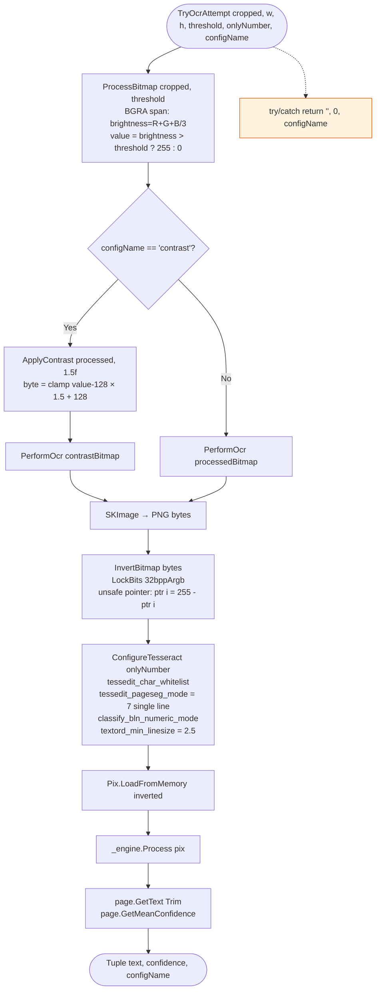
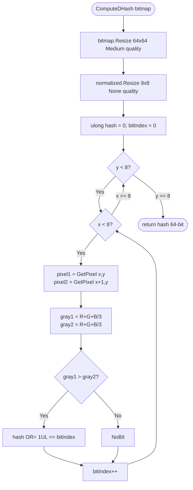

# Flowchart — `OcrService.ExtractTextFromRegionAndDebug` y soporte

> Servicio OCR núcleo: Tesseract envuelto con cache LRU dual (bitmap + texto), 4 intentos con contraste, dHash perceptual.
> Generado por el Arqueólogo del Reversa.

## Estado interno

| Campo | Tipo | Capacidad | Propósito |
|-------|------|-----------|-----------|
| `_engine` | `TesseractEngine` (lazy) | 1 | Motor Tesseract, recreado al fallo |
| `_bitmapCache` | `LruCache<string, SKBitmap>` | 200 | Crops parametrizados por `imageHash_x_y_w_h` |
| `_ocrCache` | `LruCache<ulong, string>` | 500 | Texto resultante por dHash 64-bit del crop |
| `_lock` | `static object` | — | Único hilo OCR a la vez (Tesseract no es thread-safe) |

## Flujo principal — `ExtractTextFromRegionAndDebug`

```mermaid
flowchart TD
    Start([ExtractTextFromRegionAndDebug image, x,y,w,h, umbral, onlyNumber]) --> Lock[lock _lock<br/>Tesseract single-threaded]
    Lock --> EngineCheck{_engine null o disposed?}
    EngineCheck -->|Yes| Init[InitializeEngine<br/>new TesseractEngine ./tessdata, eng, Default]
    EngineCheck -->|No| GetCrop

    Init --> GetCrop[GetCroppedBitmap<br/>key = hashCode_x_y_w_h]
    GetCrop --> CacheCrop{bitmapCache hit?}
    CacheCrop -->|Yes| RetCopy[return cached.Copy<br/>caller dispose-safe]
    CacheCrop -->|No| Decode[SKBitmap.Decode source<br/>DrawBitmap rect → cropped<br/>cache cropped.Copy]

    RetCopy --> Hash
    Decode --> Hash[ComputeDHash cropped<br/>resize 64x64 medium → 9x8 none<br/>compare px x,y vs x+1,y → 64 bits]

    Hash --> CacheText{ocrCache hit?}
    CacheText -->|Yes| FastPath[Re-encode SKBitmap → MemoryStream<br/>return OcrResult Text=cached, Confidence=-1]
    CacheText -->|No| Attempts

    Attempts[List ocrResults]
    Attempts --> A1[TryOcrAttempt umbral default]
    A1 --> A1Add{Text vacío?}
    A1Add -->|No| Add1[ocrResults.Add]
    A1Add -->|Yes| Skip1
    Add1 --> A2Check
    Skip1 --> A2Check

    A2Check{umbral > 0?}
    A2Check -->|Yes| A2[TryOcrAttempt Math.Max 0,umbral-20 lower]
    A2 --> A2Add{Text vacío?}
    A2Add -->|No| Add2[ocrResults.Add]
    A2Add -->|Yes| A3prep
    Add2 --> A3prep
    A2Check -->|No| A4Step

    A3prep[TryOcrAttempt Math.Min 255,umbral+20 higher]
    A3prep --> A3Add{Text vacío?}
    A3Add -->|No| Add3[ocrResults.Add]
    A3Add -->|Yes| A4Step
    Add3 --> A4Step

    A4Step[TryOcrAttempt umbral, contrast<br/>aplica ApplyContrast 1.5x antes de OCR]
    A4Step --> A4Add{Text vacío?}
    A4Add -->|No| Add4[ocrResults.Add]
    A4Add -->|Yes| Best
    Add4 --> Best

    Best[bestResult = ocrResults.Where Text<br/>OrderByDescending Confidence<br/>ThenByDescending Length<br/>FirstOrDefault]
    Best --> BestEmpty{best.Text vacío?}
    BestEmpty -->|Yes & ocrResults>0| Fallback[bestResult = OrderByDescending Length .First]
    BestEmpty -->|No| Process

    Fallback --> Process[finalText = ProcessText best.Text<br/>if has comma+TryParse → trunc 2 dec]
    Process --> Cache[ocrCache.Set hash, finalText]
    Cache --> Encode[Re-encode SKBitmap PNG → debugMs]
    Encode --> Return([new OcrResult Text/Image/Confidence/Attempts])

    classDef error fill:#ffebee,stroke:#c62828
    Lock -.-> Catch[catch Exception<br/>_engine.Dispose<br/>_engine = null<br/>throw]:::error
```

## Flujo `TryOcrAttempt`

## ComputeDHash (Difference Hash)

## OcrResult (DTO de salida)

| Campo | Tipo | Default | Significado |
|-------|------|---------|-------------|
| `Text` | `string?` | — | Texto OCR procesado |
| `Image` | `Bitmap?` | — | Crop debug (caller debe Dispose) |
| `Confidence` | `float` | -1 | -1 = cache hit; 0..1 = `GetMeanConfidence` |
| `Attempts` | `int` | 1 | Cuántos intentos exitosos |

`IsHighConfidence` = `Confidence < 0 OR Confidence ≥ 0.70f` (cache hit cuenta como alta).

## Anomalías relevantes

🟡 **Medias:**
- `GetCroppedBitmap` keyifica con `image.GetHashCode()` que es la identidad del objeto, **no del contenido**. Si el caller reusa el mismo `Bitmap` con un PNG distinto sobrescrito, devuelve cache stale. En el flujo actual `_formImage.pbImage.Image` se reasigna con `new Bitmap` por captura → no es bug, pero contrato frágil.
- `ProcessText` hace `Replace(".", ",").Replace(" ", ",")` y luego `decimal.TryParse`. Para inglés con `,` como miles (`1,500`) producirá `1500` parseable como `1500` o lanzar excepción dependiendo de cultura. Lo cubre `ScreenReaderService.NormalizeBetValue` aguas arriba.
- `InvertBitmap` re-decodifica el PNG ya generado; podría operarse directamente sobre `SKBitmap.GetPixelSpan` evitando un encode+decode por intento.

🟢 **Bajas:**
- `_engine.Dispose; _engine = null` en el `catch` global descarta el engine entero por cualquier excepción, incluso transitorias. La siguiente llamada lo reinicializa.
- `ClearCache()` (público) solo limpia OCR; `ClearBitmapCache()` separado dispone los `SKBitmap` cacheados — caller debe llamar ambos para release total.
