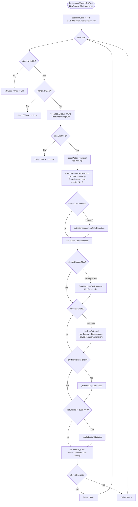
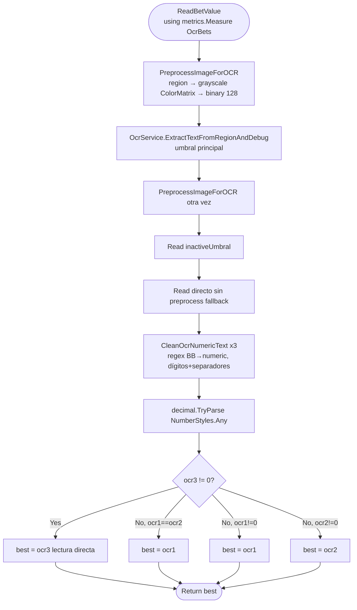
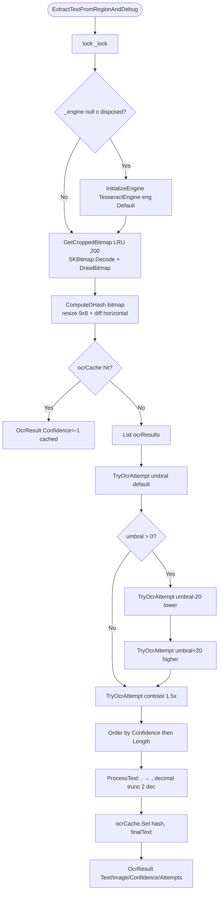
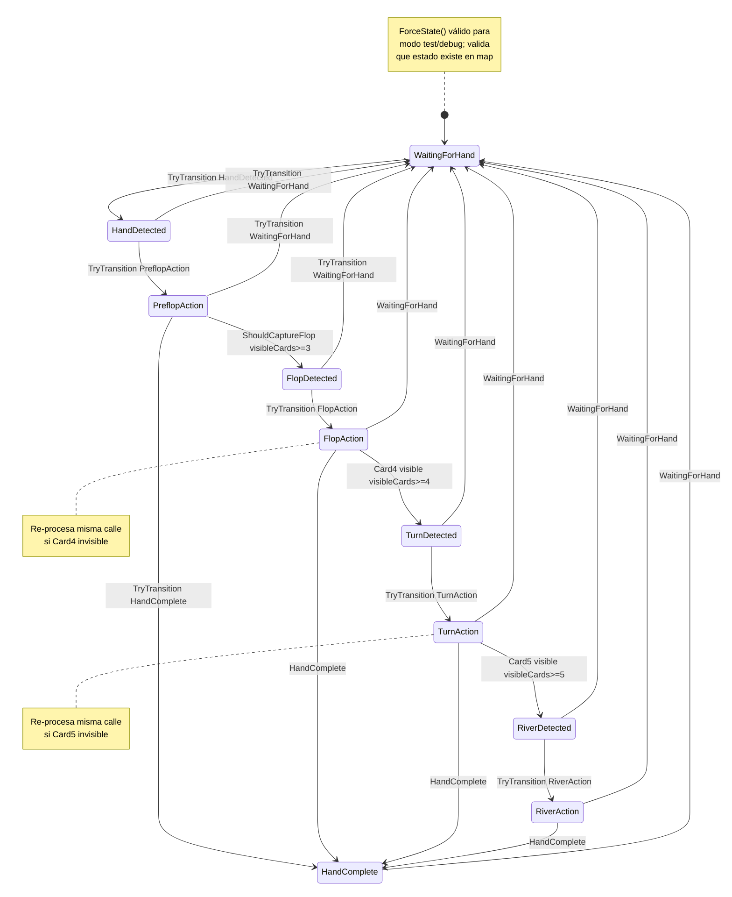

# Flowchart — `OpenScrape.App`

> Composition root, UI WinForms, OCR, game loop y telemetría. Diagrama de capas y flujo principal.
> Generado por el Arqueólogo del Reversa.

## Vista de capas y orquestación general

```mermaid
flowchart TB
    subgraph Boot["Composition Root"]
        Program[Program.cs<br/>STAThread Main<br/>Host.CreateDefaultBuilder]
        Cfg[appsettings.json<br/>+ Development override<br/>30+ secciones]
        DI[ServiceCollection<br/>~50 registros DI]
        Validator[StrategyProfileValidator<br/>fail-fast en arranque]
        Scope[CreateAsyncScope<br/>FrmMain transient]
    end

    subgraph Forms["Forms/ — WinForms UI"]
        FrmMain[FrmMain<br/>4502 LOC<br/>5 tabs + 95 métodos]
        FrmOverlay[FrmOverlay<br/>561 LOC<br/>9 filas + action panel]
        FrmHandDetail[FrmHandDetail<br/>RichTextBox coloreado]
        FrmDetectionDebug[FrmDetectionDebug<br/>calibración OCR]
        FormImage[FormImage<br/>visor PNG navegable]
        FormAction[FormAction]
        FormListApps[FormListApps<br/>EnumWindows filter NL]
    end

    subgraph Coords["Services/ — Coordinación"]
        Coordinator[GameCoordinator<br/>793 LOC<br/>Determine Flop/Turn/River]
        Reader[ScreenReaderService<br/>521 LOC<br/>OCR consenso 3-lecturas]
        Layout[TableLayoutService<br/>664 LOC<br/>dealer/posiciones/aliases]
        StateMachine[GameLoopStateMachine<br/>10 estados + lock]
        Facade[PokerDecisionFacade<br/>5 fases medidas]
        Holder[PostflopContextHolder<br/>thread-safe Volatile.Read]
        LoopCoord[GameLoopCoordinator<br/>esqueleto, feature-flag OFF]
        UiSync[UiSyncService<br/>BeginInvoke ↔ overlay]
    end

    subgraph Tech["Services/ — Técnicos"]
        Ocr[OcrService<br/>Tesseract + dHash cache<br/>4 attempts contraste]
        Color[ColorDetectionService<br/>LockBits 32bppArgb]
        Cropper[ImageCropperService<br/>dHash pre-filtro + pixel-comp]
        Cards[CardCacheService<br/>singleton lazy 52 cartas]
        RegionCache[RegionLookupCache<br/>Dict Dict O 1]
        GameLogger[GameLoggerService<br/>Marten lifecycle]
        DetectionLog[DetectionLoggerService<br/>JSON file daily]
        Metrics[MetricsCollector<br/>histogramas log]
    end

    subgraph Telem["Telemetry/"]
        IMetrics[IMetricsCollector]
        Histogram[Histogram<br/>30 buckets log10 0.2]
        ScopedM[ScopedMeasurement<br/>readonly struct]
        Cats[TelemetryCategories<br/>contrato estable]
    end

    subgraph Algo["Aplication/UseCases"]
        UPC[UnifiedPokerCalculator<br/>orquestador 8 pasos]
        SetPreflop[SetPreflopActionUseCase<br/>cascada 11 ramas]
        OutsUC[OutsCalculatorUseCase<br/>12 tipos de draw]
        PotOdds[PotOddsCalculator<br/>regla 4-2]
        GetCards[GetCards Flop/Turn/River<br/>UseCases]
    end

    subgraph Helpers["Helpers/"]
        Capture[CaptureWindowsHelper<br/>P-Invoke User32/GDI32]
        Encrypter[EncrypterHelper<br/>AES-CBC + SHA256]
        ImagePre[ImagePreprocessorHelper<br/>Parallel.For grayscale]
        Theme[AppThemeHelper<br/>palette 3 colores]
        Scaler[CoordinateScaler]
        WinInfo[WindowsInformationHelper<br/>EnumWindows]
    end

    subgraph Domain["OpenScrape.Domain"]
        Strategy[StrategyProfile]
        Profile[OpponentProfile]
        Hand[HandRecord/GameSession]
    end

    subgraph DM["OpenScrape.DecisionMaker"]
        PDS[PostflopDecisionService]
        MC[MonteCarloSimulator]
        OT[OpponentTracker]
    end

    subgraph Infra["OpenScrape.Infrastructure"]
        Marten[(Marten/Postgres)]
    end

    Program --> Cfg
    Program --> DI
    DI --> Validator
    Validator --> Scope
    Scope --> FrmMain

    FrmMain --> FrmOverlay
    FrmMain --> FormImage
    FrmMain --> FormListApps
    FrmMain --> FrmDetectionDebug
    FrmMain --> FrmHandDetail

    FrmMain --> Coordinator
    FrmMain --> Reader
    FrmMain --> Layout
    FrmMain --> StateMachine
    FrmMain --> Holder
    FrmMain --> Cards
    FrmMain --> RegionCache
    FrmMain --> Cropper
    FrmMain --> Color
    FrmMain --> GameLogger
    FrmMain --> DetectionLog
    FrmMain --> Metrics
    FrmMain --> SetPreflop
    FrmMain --> GetCards
    FrmMain --> UPC

    Coordinator --> PDS
    Coordinator --> OT
    Coordinator --> Holder
    Coordinator --> StateMachine
    Coordinator --> GameLogger

    Reader --> Ocr
    Reader --> Metrics
    Layout --> RegionCache
    Layout --> Reader
    Layout --> OT
    Layout --> Scaler

    Facade --> UPC
    Facade --> PDS
    Facade --> OT
    Facade --> Metrics

    UPC --> MC
    UPC --> Strategy
    Cards --> Marten
    GameLogger --> Marten
    GameLogger --> Hand

    LoopCoord -.-> UiSync
    UiSync -.-> FrmOverlay

    Metrics --> Histogram
    Metrics --> Cats
    Reader -.->|using Measure| ScopedM
    Coordinator -.->|using Measure| ScopedM

    Capture -.-> FrmMain
    Cropper --> Cards
    Ocr --> Cropper

    classDef anomaly fill:#fff3e0,stroke:#e65100
    class FrmMain,Validator anomaly
```

## Flujo del game loop principal (`btnCapture_Click`)

```mermaid
flowchart TD
    Start([btnCapture_Click<br/>Background o manual]) --> Cycle[_cycleTimer = metrics.Measure CycleTotal]
    Cycle --> ClearOverlay[Overlay.UpdateEquity/PotOdds/Phase '']
    ClearOverlay --> TestMode{cbTest.Checked?}

    TestMode -->|No| Capture[GetImageWhilePlaying<br/>PrintWindow + clone Bitmap]
    TestMode -->|Yes Postflop| ForceState[ForceState Flop/Turn/River]

    Capture --> InitScaler{CoordinateScaler initialized?}
    InitScaler -->|No| SaveDims[SaveReferenceDimensionsToConfig<br/>append a appsettings.json]
    InitScaler -->|Yes| HandRead

    SaveDims --> HandRead[SetTableHand<br/>OCR pot + holes + tablename + handnum]
    HandRead --> NewHand{DetectNewHand<br/>handChange ó 3-of-7 indicators?}

    NewHand -->|Yes| SaveState{Postflop activo<br/>misma mano?}
    SaveState -->|Yes| SavePostflop[Guardar GameState + BoardCards]
    SaveState -->|No| Reset

    SavePostflop --> Reset[PlayerGameState = new<br/>StateMachine.Reset HandDetected<br/>contextHolder.StartNewHand]
    Reset --> Restore{savedPostflop?}
    Restore -->|Yes| ForceRestore[ForceState + restaurar BoardCards si Names válidos]
    Restore -->|No| HandleNew

    ForceRestore --> HandleNew[HandleNewHandAsync<br/>logger.EndHand+SaveSession<br/>OpponentTracker.RecordHandPlayed/VPIP/PFR<br/>GameLogger.StartNewHandAsync]
    HandleNew --> InitPlayers
    NewHand -->|No| InitPlayers

    InitPlayers{needsInitialization?<br/>Players=0 o cbTest o Position=None}
    InitPlayers -->|Yes| FullInit[SetEmptyPlayer<br/>SetSitOutPlayer<br/>SetActivePlayer<br/>InitializePlayers dealer+posiciones+aliases]
    InitPlayers -->|No| Refresh[SetEmptyPlayer<br/>SetActivePlayer<br/>RefreshPlayerStates<br/>SetDealerPlayer si cambio]

    FullInit --> SetBets
    Refresh --> SetBets
    SetBets[SetBetPlayer<br/>SetHeroStack auto-rebuy detect<br/>RetryEmptyAliases]

    SetBets --> ProcessTable[ProcessTableInfoAsync]
    ProcessTable --> StreetCheck{IsFlop/Turn/River?}

    StreetCheck -->|No| RetryHoles{HoleCards detectadas?}
    RetryHoles -->|No| ObtainCards[ObtainCardsPlayerAsync<br/>2 retries x 200ms<br/>dHash + pixel compare]
    ObtainCards -->|Sigue sin| Skip([Skip preflop])
    RetryHoles -->|Yes| Preflop[Transition PreflopAction<br/>ProcessPreflopAsync<br/>SetPreflopActionUseCase cascada]
    ObtainCards -->|OK| Preflop

    StreetCheck -->|Yes| EnsureHoles{HoleCards detectadas?}
    EnsureHoles -->|No| RetryPostflop[ObtainCardsPlayerAsync 2 retries]
    RetryPostflop --> ProcessPostFlop
    EnsureHoles -->|Yes| ProcessPostFlop

    ProcessPostFlop[ProcessPostFlopAsync]
    ProcessPostFlop --> DetectFolded[layout.DetectFoldedPlayers<br/>color B != colorPlaying]
    DetectFolded --> CheckCard4{state=FlopAction<br/>Card4 visible?}

    CheckCard4 -->|Yes 4 cards| ToTurn[Transition TurnDetected<br/>continuar]
    CheckCard4 -->|No| ReprocFlop[Re-procesar Flop<br/>actualizar VillainBetSize]
    CheckCard4 -.->|otra rama| CheckCard5

    CheckCard5{state=TurnAction<br/>Card5 visible?}
    CheckCard5 -->|Yes 5 cards| ToRiver[Transition RiverDetected]
    CheckCard5 -->|No| ReprocTurn[Re-procesar Turn]

    ToTurn --> ProcessFlop[ProcessFlopAsync<br/>OCR cards 3 retries<br/>UnifiedPokerCalculator.Calculate<br/>DetermineFlopActionUnified delegado]
    ProcessFlop --> Logger1[GameLogger.UpdateBoard<br/>LogStreetDecision]

    ToRiver --> ProcessTurn[ProcessTurnAsync<br/>OCR card 4 + analyze TurnBoardTexture<br/>DetermineTurnAction]
    ProcessTurn --> Logger2[Logger LogStreetDecision]

    ProcessTurn -.-> ProcessRiver[ProcessRiverAsync<br/>OCR card 5 + analyze RiverBoardTexture<br/>DetermineRiverAction]
    ProcessRiver --> Logger3[Logger LogStreetDecision]

    Preflop --> Final[overlay.UpdateAction]
    Logger1 --> Final
    Logger2 --> Final
    Logger3 --> Final

    Final --> EndCycle([Dispose _cycleTimer<br/>Interlocked.Increment cycleCounter])
```

## Flujo del Background Worker (detección de turno)

## Flujo de OCR multi-lectura (`ScreenReaderService.ReadBetValue`)

## Flujo de OcrService.ExtractTextFromRegionAndDebug

## Flujo de DI (Composition Root, `Program.cs`)

```mermaid
flowchart TD
    Main([STAThread Main]) --> AppCfg[ApplicationConfiguration.Initialize]
    AppCfg --> Env[GetEnvironmentVariable DOTNET_ENVIRONMENT or 'Development']
    Env --> Host[Host.CreateDefaultBuilder]

    Host --> Logging[ConfigureLogging<br/>AddTextBoxLogger]
    Logging --> Services[ConfigureServices]

    Services --> Db[AddDataBase IsDevelopment=true<br/>Marten + 7 índices]
    Db --> UseCases[AddUseCases Features layer]
    UseCases --> OptCfg[Configure Overlay/Strategy/GameLoop/FeatureFlags]

    OptCfg --> Algos[Singleton Algorithms<br/>+ interface forwarding<br/>MC, BHE, OutsCalc, BTA, PEC]
    Algos --> DMSvcs[Singleton DM Services<br/>13 services<br/>+ interface forwarding]

    DMSvcs --> Bankroll[Lambda IDocumentStore + StrategyProfile<br/>BankrollTrackerService]
    Bankroll --> Calculator[Singleton IPokerCalculator UnifiedPokerCalculator]

    Calculator --> Scoped[Scoped<br/>PokerDecisionFacade<br/>GameLoopCoordinator<br/>UiSyncService<br/>SetPreflopActionUseCase<br/>TableLayoutService<br/>PostflopContextHolder<br/>GameCoordinator<br/>GameLoggerService]

    Scoped --> SingletonsApp[Singleton App Services<br/>OcrService<br/>ColorDetectionService<br/>ImageCropperService<br/>DetectionLoggerService<br/>ScreenReaderService<br/>GameLoopStateMachine<br/>RegionLookupCache<br/>CardCacheService<br/>CoordinateScaler<br/>MetricsCollector<br/>ActionFormatter<br/>OverlayPositioner]

    SingletonsApp --> Transient[Transient FrmMain]
    Transient --> Build[host.Build]

    Build --> ValidateProfile{StrategyProfileValidator.Validate}
    ValidateProfile -->|Throw| MsgBox[MessageBox + Environment.Exit 1]
    ValidateProfile -->|OK| InitScaler{CaptureSettings.IsReferenceSet=true?}

    InitScaler -->|Yes| ScalerInit[scaler.Initialize refWidth, refHeight]
    InitScaler -->|No| RunScope

    ScalerInit --> RunScope[CreateAsyncScope]
    RunScope --> Resolve[scope.GetRequiredService FrmMain]
    Resolve --> Run[Application.Run form]
    Run --> Dispose([scope.DisposeAsync<br/>finally])
```

## Flujo de la State Machine

