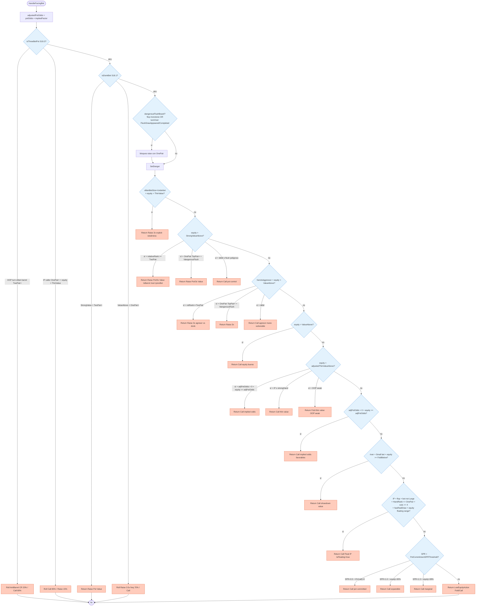

# Flowchart — `PostflopDecisionService.DetermineAction`

> Pipeline completo del único punto de entrada del motor postflop (1893 LOC).
> Ver `_reversa_sdd/code-analysis.md` sección "OpenScrape.DecisionMaker" para descripción narrativa.

## Pipeline general

```mermaid
flowchart TD
    Start([PostflopDecisionInput input]) --> Extract[Desestructurar 36+ campos<br/>a locales]
    Extract --> Thresh[GetThresholds street, situation<br/>vía ThresholdsRegistry]
    Thresh --> ImpFactor[CalculateImpliedOddsFactor<br/>street, IP, flushDraw, SPR, multiway]

    ImpFactor --> Eff[Calcular effectiveEquity<br/>ver flowchart de effectiveEquity]
    Eff --> AllInFE{IsAnyoneAllIn?}
    AllInFE -- sí --> ZeroFE[foldEquity = 0]
    AllInFE -- no --> KeepFE[mantener foldEquity]
    ZeroFE --> Simple
    KeepFE --> Simple

    Simple{thresholds.IsSimplified?}
    Simple -- sí --> SimpleReturn[DetermineSimplifiedAction<br/>retornar]
    Simple -- no --> AdjustStart

    AdjustStart[Ajustar adjustedFoldBelow,<br/>adjustedThinValueAbove]

    AdjustStart --> RangePolar[+ RangePolarizer adjustment<br/>por textura/IP/SPR/street]
    RangePolar --> FacingPenalty{isFacingBet?}
    FacingPenalty -- sí --> Penalty[+ FacingBetPenalty Underbet 0 / Small 1 / Med 4 / Large 8<br/>× streetMult Turn 1.15, River 1.30<br/>+ VillainAggressionPenalty=3 si aggression]
    FacingPenalty -- no --> NoFP

    Penalty --> Multiway
    NoFP --> Multiway

    Multiway{isMultiway?}
    Multiway -- sí --> CalcMW[IP: lineal extra×2.0<br/>OOP: cuadrático extra²×6.0×posDamping<br/>×streetMult Turn 1.2 River 1.4<br/>+ amplifier si villain IP+aggressor<br/>- nutReduction si Flush+ ×0.5 o set IP no paired ×0.7]
    Multiway -- no --> NoMW
    CalcMW --> ThreeBet
    NoMW --> ThreeBet

    ThreeBet{situation tipo?}
    ThreeBet -- ThreeBet/Vs3Bet --> Adj1[+ ThreeBetPostflop adjustments]
    ThreeBet -- Squeeze/VsSqueeze --> Adj2[+ SqueezeAdj S20.4]
    ThreeBet -- FourBet --> Adj3[+ FourBetPostflop adjustments]
    ThreeBet -- LimpRaise --> Adj4[+ LimpRaiseAdj S20.2 super-premium]
    ThreeBet -- otro --> NoAdj
    Adj1 & Adj2 & Adj3 & Adj4 & NoAdj --> BvB

    BvB{Posiciones BvB?}
    BvB -- SBvsBB --> BvB1[+ BvBSBvsBBAdj S20.1]
    BvB -- BBvsSB --> BvB2[+ BvBBBvsSBAdj]
    BvB -- BBvsBTN --> BvB3[+ BvBBBvsBTNFoldBelowAdj]
    BvB -- otro --> NoBvB
    BvB1 & BvB2 & BvB3 & NoBvB --> BroadwayWet

    BroadwayWet{isBroadwayWet?}
    BroadwayWet -- sí --> BWAdj[+ BroadwayWetAdj S21.3]
    BroadwayWet -- no --> NoBW
    BWAdj --> Aggressor
    NoBW --> Aggressor

    Aggressor{isFacingBet<br/>+ heroIsAggressor?}
    Aggressor -- sí agresor --> Aggr[- AggressorVsDonk -5/-3]
    Aggressor -- sí caller --> Caller[+ CallerVsCbet +2]
    Aggressor -- no facing --> NoAggr
    Aggr & Caller & NoAggr --> Narrowing

    Narrowing{facing bet + turn/river<br/>+ villain bet 2+ calles?}
    Narrowing -- sí --> NarrowCalc[narrowMul = 0.5 si bet-check-bet, sino 1.0<br/>+ RangeNarrowingPerStreet=3 × n-1 × narrowMul]
    Narrowing -- no --> NoNarrow
    NarrowCalc --> Kicker
    NoNarrow --> Kicker

    Kicker{facing bet + OnePair?}
    Kicker -- TPTK Strong --> KStrong[- KickerStrongEquityBonus]
    Kicker -- TPWK Weak OOP --> KWeak[+ KickerWeakEquityPenalty]
    Kicker -- otro --> NoK
    KStrong & KWeak & NoK --> Barrel

    Barrel{villainBarreling + facing bet?}
    Barrel -- bet-check-bet --> BCB[+ VillainBetCheckBetPenalty]
    Barrel -- bet-bet --> BReal[+ VillainBarrelFoldIncrease<br/>+ VillainBarrelThinValueIncrease]
    Barrel -- no --> NoBarrel
    BCB & BReal & NoBarrel --> SizingEsc

    SizingEsc{facing bet + turn/river<br/>+ villain bet size escalated?}
    SizingEsc -- sí --> SizeEsc[+ VillainSizingEscalationPenalty]
    SizingEsc -- no --> NoSizeEsc
    SizeEsc --> OppStats
    NoSizeEsc --> OppStats

    OppStats{villainFoldToBetPct >= 0?}
    OppStats -- sí stats reales --> StatsAdj[Por % fold:<br/>>60 -5, >45 -2, <30 +4, <40 +2]
    OppStats -- no, fallback --> TypeAdj[Por OpponentType:<br/>LP -4/-2, TAG 0, LAG facing -5/-3...]
    StatsAdj & TypeAdj --> ProfileOver

    ProfileOver{VillainProfile reliable<br/>S18 overrides}
    ProfileOver --> WSDAdj[WSD%>60 + facing river → +WSDFoldBelowAdjust]
    WSDAdj --> BarrelAdj[BarrelFreq vs expected → +Over/Under adjustments]
    BarrelAdj --> DonkAdj[isDonkBet → -DonkBetCallBonus]
    DonkAdj --> WTSDAdj[no facing + WTSD%>50 → +WTSDValueBetBonus]

    WTSDAdj --> SPRAdj[GetSPRAdjustment<br/>interpolación suave por SPR<br/>retorna foldAdj, valueAdj, isPushFold]
    SPRAdj --> CBetPath

    CBetPath{!facing bet + agresor + !multiway<br/>+ effEq < FoldBelow<br/>+ effEq > FoldBelow-15?}
    CBetPath -- sí --> CBetFreq[GetCbetFrequency street × textureMod × broadwayWet × villainCRMod]
    CBetFreq --> CBetRoll{Random < freq?}
    CBetRoll -- sí --> CBetReturn[Return C-Bet IsBarrel=prevBet]
    CBetRoll -- no --> Continue1
    CBetPath -- no --> Continue1

    Continue1[Equity check] --> EqLow{effEq < adjustedFoldBelow?}
    EqLow -- sí --> Low[Return HandleLowEquity<br/>semi-bluff, draw call, bluff puro,<br/>bluff catch turn/river, pot commit]

    EqLow -- no --> FacingCheck{isFacingBet?}
    FacingCheck -- sí --> PushFold1{isPushFold?}
    PushFold1 -- sí + EV>0 --> AllInValue1[Return All-In Value]
    PushFold1 -- no o EV<=0 --> Facing[Return HandleFacingBet]

    FacingCheck -- no --> PushFold2{isPushFold?}
    PushFold2 -- sí + EV>0 --> AllInValue2[Return All-In Value]
    PushFold2 -- no o EV<=0 --> CBetMix{agresor + !multiway<br/>+ FoldBelow <= effEq < ThinValue?}
    CBetMix -- sí --> CheckProtect[Roll: si Random>=cbetFreq → Check protección de range]
    CheckProtect --> NoBet
    CBetMix -- no --> NoBet
    NoBet[Return HandleNoBet]

    classDef startEnd fill:#c8e6c9,stroke:#388e3c
    classDef adjustment fill:#fff3e0,stroke:#f57c00
    classDef decision fill:#e3f2fd,stroke:#1976d2
    classDef returnNode fill:#ffccbc,stroke:#d84315

    class Start,SimpleReturn,CBetReturn,Low,AllInValue1,AllInValue2,Facing,NoBet startEnd
    class Penalty,CalcMW,Adj1,Adj2,Adj3,Adj4,BvB1,BvB2,BvB3,BWAdj,Aggr,Caller,NarrowCalc,KStrong,KWeak,BCB,BReal,SizeEsc,StatsAdj,TypeAdj,WSDAdj,BarrelAdj,DonkAdj,WTSDAdj,SPRAdj adjustment
    class Simple,FacingPenalty,Multiway,ThreeBet,BvB,BroadwayWet,Aggressor,Narrowing,Kicker,Barrel,SizingEsc,OppStats,ProfileOver,CBetPath,EqLow,FacingCheck,PushFold1,PushFold2,CBetMix decision
```

## `HandleFacingBet` (decisión vs villain bet)

## `HandleNoBet` (decisión sin villain bet)

```mermaid
flowchart TD
    Start([HandleNoBet]) --> ThreeBetOOP{isThreeBetPot + OOP S19.3?}

    ThreeBetOOP -- turn + villain checkeó + equity >= ThinValue --> Probe[Roll ProbeFreq 40% Bet 1/2 / Check]
    ThreeBetOOP -- flop CR mixing --> CRMix[Por hand: TwoPair+ 50% CR / Combo+Flush 35% CR / Fold]
    ThreeBetOOP -- otro --> TurnRiver
    Probe --> Done
    CRMix --> Done

    TurnRiver{turnCalledFlushDanger + river + flushCompleted + heroNoFlush?}
    TurnRiver -- sí --> CheckFlush[Return Check flush completó turn-river plan]
    TurnRiver -- no --> RiverRunout

    RiverRunout{river riverCardType?}
    RiverRunout -- Blank --> ThinAdj[riverThinValueAdjust = -RiverBlankThinValueBonus]
    RiverRunout -- Scare + relRank=TwoPair --> CheckScare[Return Check scare river mano degradada]
    RiverRunout -- otro --> RiverOpp
    ThinAdj --> RiverOpp
    CheckScare --> Done

    RiverOpp{river + boardChange<br/>+ flush completado y hero la tiene<br/>+ straight completado y hero >= Straight?}
    RiverOpp -- sí --> ValueRiver[Return StrongValue Bet River opportunity]
    RiverOpp -- no --> Delayed

    Delayed{river + heroCheckedAllStreets<br/>+ TopPair+ + equity >= ThinValue?}
    Delayed -- sí --> DelayedBet[Return Bet 1/3 delayed value]
    Delayed -- no --> CR

    CR{CanCheckRaise + !multiway<br/>+ equity > CRThreshold<br/>+ !heroIsAggressor + !lowSPRBlocks?}
    CR -- OOP + strongMade o strongDraw --> CROOP[S19.1 mixing por tipo:<br/>TopPair+FlushDraw 35% / Draw 30% / TwoPair+ 40%]
    CR -- IP trap + TwoPair+ + board no Wet/Monotone --> CRIPT[mixing CRMixFreqIPTrap]
    CR -- otro --> SlowPlay
    CROOP --> Done
    CRIPT --> Done

    SlowPlay{slowPlayStreet + Dry + !multiway<br/>+ !agresor + ThreeOfAKind+<br/>+ equity >= SlowPlayMinEquity?}
    SlowPlay -- sí --> CheckSP[Return Check slow play inducir bluff]
    SlowPlay -- no --> Float

    Float{heroFloatedFlop + turn + !multiway?}
    Float -- mejoró a OnePair+ --> ValueFloat[Return Bet 1/2 value mejoró tras float]
    Float -- bad runout --> CheckBadFloat[Return Check float exit abortado]
    Float -- runout favorable --> FloatExit[Return Bet 1/2 Float Exit]
    Float -- no --> Probe2

    Probe2{CanProbeBet + villainAggrChecked<br/>+ !multiway + equity >= ProbeMinEquity?}
    Probe2 -- sí --> ProbeBet[Return ProbeBet IP/OOP sizing]
    Probe2 -- no --> BetSize

    BetSize[Determinar baseBet por textura<br/>Dry/Coordinated/Paired/Monotone/Wet]
    BetSize --> ReduceOOP{ReduceSizeForOOP + OOP?}
    ReduceOOP -- sí --> ReduceSize[ReduceBetSize]
    ReduceOOP -- no --> KeepSize
    ReduceSize --> Dynamic
    KeepSize --> Dynamic

    Dynamic[ApplyDynamicSizing<br/>SPR/multiway/textura/posición/street]
    Dynamic --> Vulnerability[GetHandVulnerabilityAdjustment + boardPaired CbetReduction]
    Vulnerability --> Overbet

    Overbet{CanOverbet + equity > OverbetMinEquity?}
    Overbet -- river + relRank>=TwoPair --> OverbetRiver[Return Overbet river nuts]
    Overbet -- !river + Dry + agresor --> OverbetDry[Return Overbet board seco]
    Overbet -- no --> StrongValue

    StrongValue{equity > adjStrongValue?}
    StrongValue -- sí --> SVBet[Return StrongValue Bet con sizing boost si ThreeOfAKind+<br/>reducir si river danger + OnePair]
    StrongValue -- no --> ValueBet

    ValueBet{equity > adjValue?}
    ValueBet -- sí --> VBet[Return Value Bet con ajustes blocker/turn vulnerability/river merged/danger]
    ValueBet -- no --> PotControl

    PotControl{turn + !agresor + equity 40-55%<br/>+ Coordinated/Wet/Monotone?}
    PotControl -- sí --> CheckPC[Return Check pot control]
    PotControl -- no --> Stackoff

    Stackoff{S22.4 turn + equity > ThinValue<br/>+ projectedRiverSPR < threshold?}
    Stackoff -- equity >= CommitMin --> AllInTurn[Return All-In Value bet compromete river]
    Stackoff -- equity marginal --> CheckPC2[Return Check pot control bet comprometería river]
    Stackoff -- no --> Random

    Random{equity en ±RandomMargin de ThinValue+riverThinAdj?}
    Random -- sí --> Adapt[Bet freq por villainType<br/>LAG 85%, LP 80%,<br/>TAG 60%, TP 55%, Unk 70%]
    Adapt --> RandRoll{Roll > freq?}
    RandRoll -- sí --> CheckRand[Return Check randomización adaptativa]
    RandRoll -- no --> ThinValueBet
    Random -- no --> ThinValueBet

    ThinValueBet{equity > effThinValue?}
    ThinValueBet -- river + draw completed sin hero --> CheckDanger[Return Check thin value peligroso]
    ThinValueBet -- TPWK OOP --> CheckTPWK[Return Check thin value OOP showdown]
    ThinValueBet -- IP o thinValueIPOnly false --> ThinBet[Return Bet ThinValue con kicker boost]
    ThinValueBet -- OOP thinValueIPOnly --> CheckOOP[Return Check thin value OOP showdown]
    ThinValueBet -- no --> DoubleBarrel

    DoubleBarrel{CanDoubleBarrel + previousStreetBet + agresor<br/>+ !multiway + !flop<br/>+ equity en marginal range?}
    DoubleBarrel -- bad runout --> CheckBR[Return Check bad runout no barrel]
    DoubleBarrel -- favorable --> Barrel[Return Bet Barrel consistencia de rango]
    DoubleBarrel -- no --> Showdown

    Showdown{river?}
    Showdown -- sí --> CheckSD[Return Check showdown value]
    Showdown -- no --> CheckMarg[Return Check equity marginal]

    Done([fin])

    classDef returnNode fill:#ffccbc,stroke:#d84315
    classDef checkNode fill:#e3f2fd,stroke:#1976d2

    class CheckFlush,CheckScare,ValueRiver,DelayedBet,CROOP,CRIPT,CheckSP,ValueFloat,CheckBadFloat,FloatExit,ProbeBet,OverbetRiver,OverbetDry,SVBet,VBet,CheckPC,AllInTurn,CheckPC2,CheckRand,CheckDanger,CheckTPWK,ThinBet,CheckOOP,CheckBR,Barrel,CheckSD,CheckMarg,Probe,CRMix returnNode
    class ThreeBetOOP,TurnRiver,RiverRunout,RiverOpp,Delayed,CR,SlowPlay,Float,Probe2,Overbet,StrongValue,ValueBet,PotControl,Stackoff,Random,RandRoll,ThinValueBet,DoubleBarrel,Showdown,ReduceOOP checkNode
```

