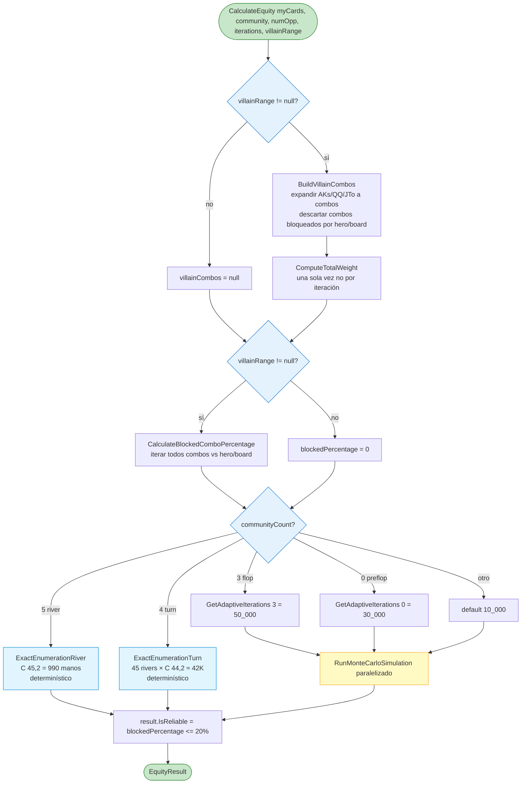
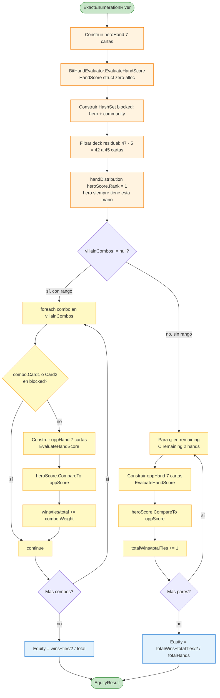
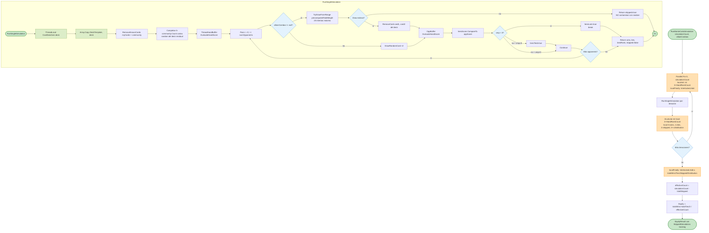

# Flowchart — `MonteCarloSimulator.CalculateEquity`

> Selección híbrida entre enumeración exacta y Monte Carlo paralelizado.
> Ver `_reversa_sdd/code-analysis.md` sección "OpenScrape.DecisionMaker" para descripción narrativa.

## Selección de método



## `ExactEnumerationRiver` (5 community cards)



## `RunMonteCarloSimulation` (Flop/Preflop con paralelismo)



## `BitHandEvaluator.EvaluateHandScore` (zero-alloc)

```mermaid
flowchart TD
    Start([EvaluateHandScore cards]) --> StackAlloc[Span int 15 rankCount<br/>Span int 5 suitCount<br/>int rankBits<br/>Span int 5 suitRankBits]
    StackAlloc --> Scan[Fase 1: escaneo único<br/>foreach card<br/>rankCount r++, suitCount s++,<br/>rankBits |= 1 LL r,<br/>suitRankBits s |= 1 LL r]

    Scan --> FlushDetect[Fase 2: flushSuit = -1<br/>for s = 1..4<br/>si suitCount s >= 5 → flushSuit = s, break]

    FlushDetect --> FlushBranch{flushSuit >= 0?}

    FlushBranch -- sí --> SFCheck[FindStraightHigh suitRankBits flushSuit]
    SFCheck --> SFFound{sfHigh > 0?}
    SFFound -- sí --> SFReturn[Return HandScore StraightFlush, BuildComposite SF, sfHigh]
    SFFound -- no --> FlushReturn[Flush: 5 kickers más altos del flush suit<br/>BuildComposite Flush, fk1..fk5]

    FlushBranch -- no --> Groups[Fase 4: encontrar grupos<br/>for r = 14..2<br/>quadsRank/tripsRank/highPair/lowPair]
    Groups --> StraightDetect[Fase 5: straightHigh = FindStraightHigh rankBits<br/>mask 0x1F LL high-4 desde 14..6, luego WheelMask]

    StraightDetect --> Quads{quadsRank > 0?}
    Quads -- sí --> QuadsReturn[FourOfAKind con kicker]
    Quads -- no --> FullHouse

    FullHouse{tripsRank > 0?}
    FullHouse -- sí + pairRank --> FHReturn[FullHouse tripsRank, pairRank]
    FullHouse -- no --> Straight1

    Straight1{straightHigh > 0 + tripsRank=0?}
    Straight1 -- sí --> StrReturn1[Straight straightHigh]
    Straight1 -- no --> Trips

    Trips{tripsRank > 0?}
    Trips -- sí + straight prio --> StrReturn2[Straight gana sobre trips]
    Trips -- sí --> TripsReturn[ThreeOfAKind con 2 kickers]
    Trips -- no --> Straight2

    Straight2{straightHigh > 0?}
    Straight2 -- sí --> StrReturn3[Straight straightHigh]
    Straight2 -- no --> TwoPair

    TwoPair{highPair > 0 + lowPair > 0?}
    TwoPair -- sí --> TPReturn[TwoPair con kicker]
    TwoPair -- no --> OnePair

    OnePair{highPair > 0?}
    OnePair -- sí --> OPReturn[OnePair con 3 kickers]
    OnePair -- no --> HighCard

    HighCard[HighCard con 5 kickers]
    HighCard --> HCReturn[Return HighCard composite]

    SFReturn --> Final
    FlushReturn --> Final
    QuadsReturn --> Final
    FHReturn --> Final
    StrReturn1 --> Final
    StrReturn2 --> Final
    TripsReturn --> Final
    StrReturn3 --> Final
    TPReturn --> Final
    OPReturn --> Final
    HCReturn --> Final([HandScore struct]) 

    classDef startEnd fill:#c8e6c9,stroke:#388e3c
    classDef stackAllocNode fill:#dcedc8,stroke:#689f38
    classDef bitOps fill:#fff3e0,stroke:#f57c00
    classDef returnNode fill:#ffccbc,stroke:#d84315

    class Start,Final startEnd
    class StackAlloc,Scan stackAllocNode
    class FlushDetect,SFCheck,Groups,StraightDetect bitOps
    class SFReturn,FlushReturn,QuadsReturn,FHReturn,StrReturn1,StrReturn2,StrReturn3,TripsReturn,TPReturn,OPReturn,HCReturn returnNode
```

> **HandScore.BuildComposite** codifica `rank<<20 | k1<<16 | k2<<12 | k3<<8 | k4<<4 | k5` en un único `long`. Comparar manos = `long.CompareTo` → O(1). Crítico para MC con ~42K evaluaciones.
