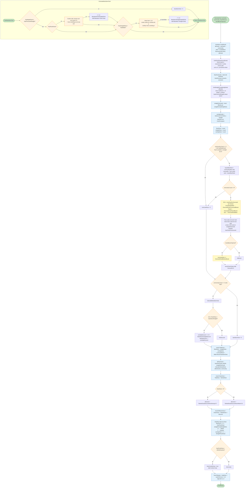
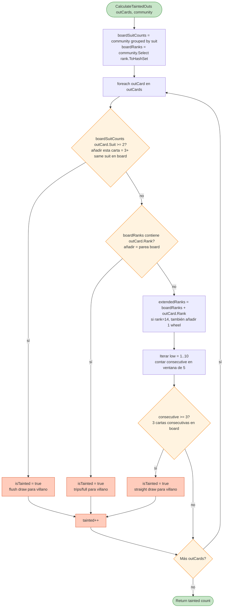

# Flowchart — `OutsCalculator.CalculateOuts`

> Cálculo de outs con inclusión-exclusión, backdoor implícitos, overcards textura-aware y tainted discount.

```mermaid
flowchart TD
    Start([CalculateOuts myCards, community, boardTexture, heroBlocksTopCard]) --> Init[Inicializar OutsResult<br/>allCards = myCards + community<br/>deck = CreateDeck<br/>RemoveCards deck, allCards]

    Init --> FlushDraw[GetFlushDrawSuit allCards<br/>retorna palo si exactamente 4 cartas mismo palo<br/>null si 5+ ya tenemos flush]
    FlushDraw --> FlushOuts[flushOutCards = deck del flushSuit<br/>HashSet para inclusión-exclusión]
    FlushOuts --> StraightRanks[GetStraightCompletingRanks allCards<br/>iterar testRank 2..14<br/>añadir y verificar HasFiveCardStraight wheel-aware]
    StraightRanks --> StraightOuts[straightOutCards = deck filtrado por straightCompletingRanks]
    StraightOuts --> Overlap[overlapCards = intersección de flush y straight<br/>HashSet con CardComparer]

    Overlap --> Counts[flushOuts = count<br/>straightOuts = count<br/>overlapOuts = count]

    Counts --> Overcards{community.Count >= 3<br/>+ NO hasMadeHand<br/>flush completo o straight de 5?}
    Overcards -- no --> SkipOC[overcardOuts = 0]
    Overcards -- sí --> CalcOC[boardMaxRank = community.Max rank<br/>overcards = hero.cards rank > boardMaxRank]
    CalcOC --> HasOC{overcards.Count > 0?}
    HasOC -- no --> SkipOC
    HasOC -- sí --> TextureOC[S21.1: maxOutsPerOvercard por textura<br/>Coordinated/Wet → OvercardOutsConnectedBoard<br/>Paired → OvercardOutsPairedBoard<br/>otro → OvercardOutsBase]
    TextureOC --> CountOC[Para cada overcard rank:<br/>iterar deck cards de ese rank<br/>contar si NO está en straightOutCards<br/>respetar maxOutsPerOvercard]
    CountOC --> BlockerBoost{heroBlocksTopCard?}
    BlockerBoost -- sí --> Boost[overcardOuts ×= OvercardOutsBlockerBoost]
    BlockerBoost -- no --> NoBoost
    Boost --> AddDrawType
    NoBoost --> AddDrawType
    AddDrawType[result.DrawTypes.Add Overcards N]
    AddDrawType --> Backdoor

    SkipOC --> Backdoor

    Backdoor{community.Count == 3 solo flop?}
    Backdoor -- sí --> CalcBD[CalculateBackdoorOuts]
    Backdoor -- no --> NoBD[backdoorOuts = 0]

    subgraph CalcBackdoor[CalculateBackdoorOuts]
        BDStart([CalcBackdoorOuts]) --> CheckMade1{HasMadeFlush o HasFiveCardStraight?}
        CheckMade1 -- sí --> SkipBD[backdoorOuts = 0]
        CheckMade1 -- no --> BDFlush{!hasFlushDraw?}
        BDFlush -- sí --> Suit3[Contar suits, buscar suit con count==3<br/>+ hero contribuye con esa suit]
        Suit3 -- sí --> AddBDFlush[+= 1.5 BackdoorFlushImpliedOuts<br/>Add Backdoor Flush Draw]
        Suit3 -- no --> BDStraight
        BDFlush -- no --> BDStraight
        AddBDFlush --> BDStraight
        BDStraight{!hasStraightDraw + !hasMade?}
        BDStraight -- sí --> Window[Iterar low=1..10<br/>contar ranks en ventana de 5<br/>verificar hero contribuye]
        Window -- 3+ con hero --> AddBDS[+= 1.0 BackdoorStraightImpliedOuts<br/>Add Backdoor Straight Draw]
        Window -- no --> BDEnd
        AddBDS --> BDEnd
        BDStraight -- no --> BDEnd
        SkipBD --> BDEnd
        BDEnd([Return backdoorOuts])
    end

    CalcBD --> S214{S21.4 flushDraw + backdoorStraight?}
    S214 -- sí --> Discount[overlapDiscount = 1.0 × BackdoorOverlapDiscount<br/>backdoorOuts -= overlapDiscount]
    S214 -- no --> NoDiscount

    Discount --> TotalOuts
    NoDiscount --> TotalOuts
    NoBD --> TotalOuts

    TotalOuts[result.TotalOuts =<br/>flushOuts + straightOuts - overlapOuts<br/>+ overcardOuts + Math.Round backdoorOuts]

    TotalOuts --> Tainted[allOutCards = flushOutCards UNION straightOutCards<br/>CalculateTaintedOuts allOutCards, community]

    Tainted --> CleanCalc[result.CleanOuts = TotalOuts - TaintedOuts]
    CleanCalc --> Effective{flushOuts > 0?}
    Effective -- sí --> StrongDiscount[discount = TaintedOutsDiscountHeroStrong=0.7]
    Effective -- no --> WeakDiscount[discount = TaintedOutsDiscountHeroWeak=0.3]
    StrongDiscount --> CalcEff
    WeakDiscount --> CalcEff
    CalcEff[result.EffectiveOuts = CleanOuts + TaintedOuts × discount]

    CalcEff --> Classify[Clasificar tipos de draw:<br/>flushOuts >= 9 → HasFlushDraw<br/>straightCompletingRanks 2+ → OESD<br/>1 → Gutshot<br/>overlapOuts >= 1 → StraightFlushDraw]

    Classify --> Combo{HasFlushDraw + OESD/Gutshot?}
    Combo -- sí --> ComboFlag[HasComboDraw = true<br/>Add Combo Draw]
    Combo -- no --> NoCombo
    ComboFlag --> Equity
    NoCombo --> Equity

    Equity[OutsToEquity = totalOuts × cardsToCome × 2.0<br/>regla del 2 y 4]
    Equity --> Final([OutsResult])

    classDef startEnd fill:#c8e6c9,stroke:#388e3c
    classDef calcStep fill:#e3f2fd,stroke:#1976d2
    classDef checkNode fill:#fff3e0,stroke:#f57c00
    classDef textureNode fill:#fff9c4,stroke:#f9a825

    class Start,Final,BDStart,BDEnd startEnd
    class Init,FlushOuts,StraightOuts,Overlap,Counts,TotalOuts,Tainted,CleanCalc,CalcEff,Classify,Equity calcStep
    class Overcards,HasOC,Backdoor,CheckMade1,BDFlush,Suit3,BDStraight,Window,Effective,Combo,BlockerBoost,S214 checkNode
    class TextureOC,Boost textureNode
```

## `CalculateTaintedOuts`

```mermaid
flowchart TD
    Start([CalculateTaintedOuts outCards, community]) --> Setup[boardSuitCounts = community grouped by suit<br/>boardRanks = community.Select rank.ToHashSet]
    Setup --> Loop[foreach outCard en outCards]

    Loop --> CheckFlush{boardSuitCounts outCard.Suit >= 2?<br/>añadir esta carta = 3+ same suit en board}
    CheckFlush -- sí --> MarkTainted1[isTainted = true<br/>flush draw para villano]
    CheckFlush -- no --> CheckPair

    CheckPair{boardRanks contiene outCard.Rank?<br/>añadir = parea board}
    CheckPair -- sí --> MarkTainted2[isTainted = true<br/>trips/full para villano]
    CheckPair -- no --> CheckStraight

    CheckStraight[extendedRanks = boardRanks + outCard.Rank<br/>si rank=14, también añadir 1 wheel]
    CheckStraight --> StraightLoop[Iterar low = 1..10<br/>contar consecutive en ventana de 5]
    StraightLoop --> Cons{consecutive >= 3?<br/>3 cartas consecutivas en board}
    Cons -- sí --> MarkTainted3[isTainted = true<br/>straight draw para villano]
    Cons -- no --> NextOut

    MarkTainted1 --> CountTaint[tainted++]
    MarkTainted2 --> CountTaint
    MarkTainted3 --> CountTaint
    CountTaint --> NextOut
    NextOut{Más outCards?}
    NextOut -- sí --> Loop
    NextOut -- no --> Final([Return tainted count])

    classDef startEnd fill:#c8e6c9,stroke:#388e3c
    classDef checkNode fill:#fff3e0,stroke:#f57c00
    classDef taintedNode fill:#ffccbc,stroke:#d84315

    class Start,Final startEnd
    class CheckFlush,CheckPair,Cons,NextOut checkNode
    class MarkTainted1,MarkTainted2,MarkTainted3,CountTaint taintedNode
```
