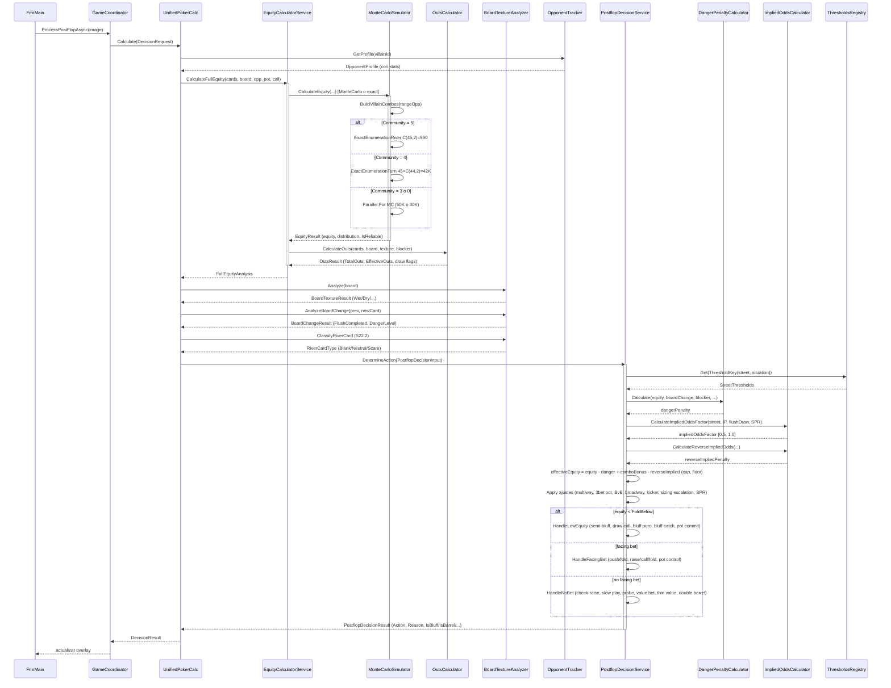
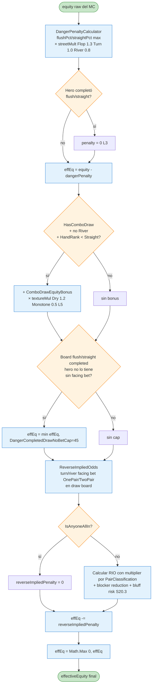

# Flowchart — `OpenScrape.DecisionMaker`

> Diagrama de dependencias y flujo del motor de decisión.
> Generado por el Arqueólogo del Reversa.

## Vista de capas y orquestación

```mermaid
flowchart TB
    subgraph App["OpenScrape.App (consumer)"]
        UPC[UnifiedPokerCalculator<br/>IPokerCalculator]
        PDF[PokerDecisionFacade]
        FrmMain[FrmMain UI]
        GC[GameCoordinator]
    end

    subgraph DM["OpenScrape.DecisionMaker"]
        subgraph Algos["Algorithms/"]
            MC[MonteCarloSimulator]
            BHE[BitHandEvaluator]
            HE[HandEvaluator legacy]
            OC[OutsCalculator]
            BTA[BoardTextureAnalyzer]
            PEC[PreflopEquityCalculator]
        end

        subgraph Decision["Services/ – decisión"]
            PDS[PostflopDecisionService<br/>1893 LOC]
            PA[PreflopAnalyzer]
            BSS[BetSizingService]
            DPC[DangerPenaltyCalculator]
            IOC[ImpliedOddsCalculator]
            RP[RangePolarizer]
            TR[ThresholdsRegistry]
            PGC[PostflopGameContext<br/>record inmutable]
        end

        subgraph Tracking["Services/ – tracking"]
            OT[OpponentTracker<br/>thread-safe]
            ECS[EquityCalculatorService<br/>orquestador]
            SB[StrategyBacktester]
            SAS[StrategyAnalyzerService]
            BTS[BankrollTrackerService]
        end

        subgraph Telem["Services/ – telemetría GTO"]
            EC[ExploitabilityCalculator<br/>queue 10K records]
            ACS[AutoCalibrationService]
        end

        subgraph DTOs["DTOs/ y record context"]
            PDI[PostflopDecisionInput<br/>6 required + 36 defaults]
            PDR[PostflopDecisionResult]
            DR[DecisionRequest/Result]
        end

        PK[PokerConstants<br/>~25 const algorítmicas]
    end

    subgraph Domain["OpenScrape.Domain"]
        StrProfile[StrategyProfile<br/>~150 params]
        OpProfile[OpponentProfile]
        VR[VillainRange]
        Thresh[StreetThresholds<br/>+ ThresholdKey]
        SD[StreetDecision]
        BR[BankrollSnapshot]
        Cards[CardDataOuts]
    end

    subgraph Infra["OpenScrape.Infrastructure"]
        Marten[(Marten/Postgres)]
    end

    %% App → DecisionMaker (consumo principal)
    FrmMain --> GC
    GC --> UPC
    UPC --> PDF
    PDF --> PDS
    PDF --> MC
    PDF --> BTA
    PDF --> OC
    PDF --> OT
    PDF --> EC

    %% PostflopDecisionService dependencies
    PDS --> BSS
    PDS --> RP
    PDS --> TR
    PDS --> DPC
    PDS --> IOC
    PDS --> PK
    PDS -.consume.-> PGC
    PDS -.input.-> PDI
    PDS -.output.-> PDR

    %% MC + Outs
    MC --> BHE
    HE --> BHE
    MC --> PK

    %% EquityCalculatorService orquestador
    ECS --> MC
    ECS --> OC
    ECS --> PEC

    %% StrategyBacktester depende de IPostflopDecisionService
    SB --> PDS

    %% AutoCalibrationService depende de ExploitabilityCalculator
    ACS --> EC

    %% BankrollTrackerService consume Marten
    BTS --> Marten

    %% Tracking
    OT -.profile lookup.-> PDS

    %% Domain consumption
    PDS --> StrProfile
    PDS --> OpProfile
    TR --> Thresh
    MC --> VR
    MC --> Cards
    OC --> Cards
    BHE --> Cards
    BTA --> Cards
    PEC --> Cards
    SB --> SD
    BTS --> BR
    OT --> OpProfile

    %% Estilos
    classDef appLayer fill:#e1f5ff,stroke:#0288d1
    classDef algorithmLayer fill:#fff3e0,stroke:#f57c00
    classDef serviceLayer fill:#f3e5f5,stroke:#7b1fa2
    classDef telemetryLayer fill:#fce4ec,stroke:#c2185b
    classDef domainLayer fill:#e8f5e9,stroke:#388e3c
    classDef dtoLayer fill:#f5f5f5,stroke:#616161

    class FrmMain,GC,UPC,PDF appLayer
    class MC,BHE,HE,OC,BTA,PEC algorithmLayer
    class PDS,PA,BSS,DPC,IOC,RP,TR,PGC,OT,ECS,SB,SAS,BTS serviceLayer
    class EC,ACS telemetryLayer
    class StrProfile,OpProfile,VR,Thresh,SD,BR,Cards domainLayer
    class PDI,PDR,DR,PK dtoLayer
```

## Flujo de una decisión postflop completa

## Path de mixing aleatorio en `PostflopDecisionService`

```mermaid
flowchart LR
    Start([DetermineAction equity calculada]) --> CBet{Hero agresor<br/>+ equity baja<br/>+ HU?}
    CBet -- sí --> Freq1[GetCbetFrequency street<br/>Flop 65% Turn 45% River 30%]
    Freq1 --> Mod1[Modular por textura runout<br/>broadway-wet<br/>villain CheckRaise%]
    Mod1 --> Roll1{Random.Shared<br/>< freq?}
    Roll1 -- sí --> CBetAction[C-Bet IsBarrel=prevBet]
    Roll1 -- no --> Continue1[Continuar]

    CBet -- no --> Continue1
    Continue1 --> CBetMix{Hero agresor<br/>+ equity media<br/>+ HU + no facing bet?}
    CBetMix -- sí --> Roll2{Random<br/>>= freq?}
    Roll2 -- sí --> CheckProtect[Check protección de range]
    Roll2 -- no --> Continue2[Continuar]
    CBetMix -- no --> Continue2

    Continue2 --> CR{CanCheckRaise<br/>+ no agresor<br/>+ no facing bet?}
    CR -- sí --> CRType{Tipo de hand}
    CRType -- TopPair+FlushDraw --> Freq2[CRMixFreqOOPTopPairDraw 35%]
    CRType -- Draw puro --> Freq3[CRMixFreqOOPDraw 30%]
    CRType -- TwoPair+ --> Freq4[CRMixFreqOOPStrong 40%]
    Freq2 & Freq3 & Freq4 --> Roll3{Random<br/>< freq?}
    Roll3 -- sí --> CheckRaise[Check Check-Raise]
    Roll3 -- no --> CheckMix[Check CR mixing]

    CR -- no --> Cont3[Continuar...]
    Cont3 --> Random{equity en<br/>±RandomMargin<br/>de ThinValueAbove?}
    Random -- sí --> Adapt[Bet freq por villainType<br/>LAG 85%, LP 80%,<br/>TAG 60%, TP 55%, Unk 70%]
    Adapt --> Roll4{Random<br/>> freq?}
    Roll4 -- sí --> CheckRand[Check randomización]
    Roll4 -- no --> Bet[Bet thin value]

    Random -- no --> Bet

    classDef randomStep fill:#fff9c4,stroke:#f9a825
    classDef actionStep fill:#c8e6c9,stroke:#388e3c
    classDef checkStep fill:#bbdefb,stroke:#1976d2

    class Roll1,Roll2,Roll3,Roll4 randomStep
    class CBetAction,CheckRaise,Bet,CheckProtect,CheckMix,CheckRand checkStep
```

## Flujo de cálculo de `effectiveEquity`

