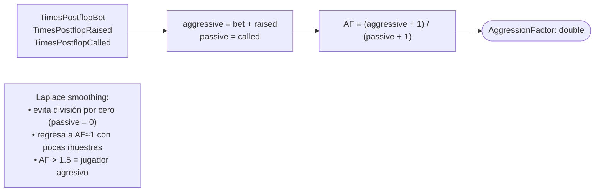
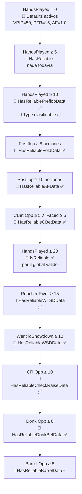
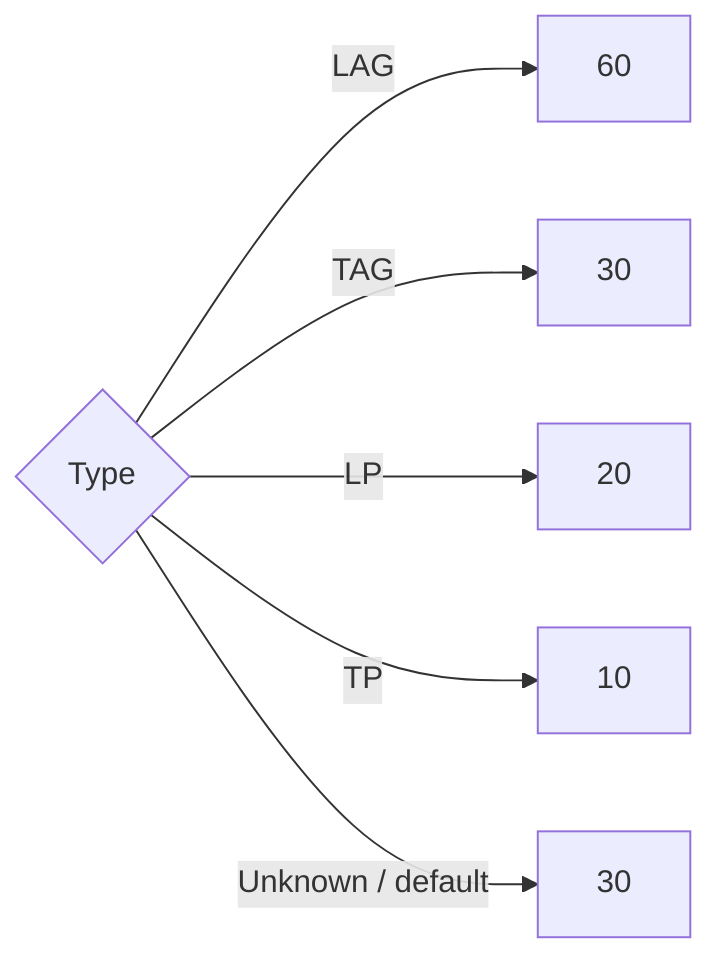

# Flowchart — `OpponentProfile` (typing y reliability)

> Funciones: `Type`, `GetTypeForPosition`, `GetProfileForPosition`, AggressionFactor con Laplace
> Archivo: `src/OpenScrape.Domain/Entities/OpponentProfile.cs`
> Doc level: detalhado

## 1. AggressionFactor con Laplace smoothing



### Variantes posicionales (`AggressionFactorIP` / `AggressionFactorOOP`)

```mermaid
flowchart TD
    Start([AggressionFactorIP getter]) --> Check{TimesAggressiveIP +<br/>TimesPassiveIP < 5?}
    Check -->|Sí pocas muestras| Sentinel[return -1<br/>📍 sentinel sin datos]
    Check -->|No| Compute[return (aggIP + 1) / (passIP + 1)]
    Compute --> Out([double])
    Sentinel --> Out
```

> **OOP idéntico** con `TimesAggressiveOOP`/`TimesPassiveOOP`. El centinela `-1` es **diferente** del valor neutral `1.0`: indica explícitamente "datos insuficientes" para que el caller decida fallback.

## 2. `Type` — clasificación 4-cuadrantes

```mermaid
flowchart TD
    Start([Type getter]) --> Hands{HandsPlayed < 10?}
    Hands -->|Sí| Unknown[return Unknown]
    Hands -->|No| Compute["isLoose = VPIP > 30%<br/>isAggressive = AggressionFactor > 1.5"]

    Compute --> Quad{(loose, aggressive)}
    Quad -->|true, true| LAG[LAG<br/>Loose-Aggressive]
    Quad -->|true, false| LP[LP<br/>Loose-Passive 'fish']
    Quad -->|false, true| TAG[TAG<br/>Tight-Aggressive 'reg']
    Quad -->|false, false| TP[TP<br/>Tight-Passive 'nit']
```

## 3. `GetTypeForPosition(bool villainIsInPosition)` — typing posicional

```mermaid
flowchart TD
    Start([GetTypeForPosition villainIsInPosition]) --> Hands{HandsPlayed < 10?}
    Hands -->|Sí| Unknown[return Unknown]
    Hands -->|No| PickAf{villainIsInPosition?}

    PickAf -->|true| Ip[af = AggressionFactorIP]
    PickAf -->|false| Oop[af = AggressionFactorOOP]

    Ip --> CheckSentinel
    Oop --> CheckSentinel

    CheckSentinel{af < 0?}
    CheckSentinel -->|Sí muestras posicionales <5| Fb[af = AggressionFactor global]
    CheckSentinel -->|No| Quadrant
    Fb --> Quadrant

    Quadrant["isLoose = VPIP > 30<br/>isAggressive = af > 1.5"]
    Quadrant --> Sw{(loose, aggr)}
    Sw -->|true,true| LAG[LAG]
    Sw -->|true,false| LP[LP]
    Sw -->|false,true| TAG[TAG]
    Sw -->|false,false| TP[TP]
```

> **Diferencia clave vs `Type`**: usa AF posicional con fallback al global, permitiendo distinguir un villain `LAG IP` pero `TAG OOP`.

## 4. `GetProfileForPosition(TablePosition position)` — perfil sintético

```mermaid
flowchart TD
    Start([GetProfileForPosition position]) --> TryGet{PositionProfiles.TryGetValue<br/>(position, out posProf)?}
    TryGet -->|No existe key| FB1[return this<br/>📍 fallback al global]
    TryGet -->|Sí existe| Reliable{posProf.IsReliable?<br/>HandsPlayed ≥ 10}
    Reliable -->|No| FB2[return this<br/>📍 fallback al global]
    Reliable -->|Sí| Synth["Construir perfil sintético"]

    Synth --> Mix["new OpponentProfile {<br/>  PlayerId = self.PlayerId<br/>  HandsPlayed = posProf.HandsPlayed<br/>  TimesVoluntarilyPutMoneyIn = posProf.TimesVPIP<br/>  TimesPreflopRaised = posProf.TimesPFR<br/>  TimesAggressive/Passive IP/OOP = posProf.*<br/>  // Stats globales no posicionales:<br/>  TimesPostflop* = self.*<br/>  TimesCBet* / TimesFacedCBet = self.*<br/>  TimesReachedRiver / WentToShowdown / Won = self.*<br/>}"]

    Mix --> Out([return synthetic OpponentProfile])
    FB1 --> Out
    FB2 --> Out
```

> **Stats posicionales clonadas**: VPIP, PFR, IP/OOP aggro/passive (5 contadores).
> **Stats globales heredadas**: postflop counters, c-bet stats, showdown stats (10+ contadores).
> Esto evita inflar contadores posicionales con datos no posicionales y permite usar el perfil sintético en cualquier consumidor que espere `OpponentProfile`.

## 5. Reliability flags — pirámide de confianza



### Tabla resumen de thresholds

| Flag | Umbral | Stat habilitado |
|------|---:|---|
| `HasReliablePreflopData` | `HandsPlayed ≥ 10` | VPIP/PFR/3Bet con confianza |
| `HasReliableFoldData` | `folded+called+raised ≥ 8` | Fold equity decisions |
| `HasReliableAFData` | `bet+raise+called ≥ 10` | AggressionFactor global |
| `HasReliableCBetData` | `Opp ≥ 5 ∧ Faced ≥ 5` | CBetPct + FoldToCBetPct |
| `IsReliable` (global) | `HandsPlayed ≥ 20` | Perfil completo confiable |
| `HasReliableWTSDData` | `ReachedRiver ≥ 15` | WTSD% |
| `HasReliableWSDData` | `WentToShowdown ≥ 10` | WSD% |
| `HasReliableCheckRaiseData` | `Opp ≥ 10` | CheckRaise% |
| `HasReliableDonkBetData` | `Opp ≥ 8` | DonkBet% |
| `HasReliableBarrelData` | `Opp ≥ 8` | BarrelFrequency |
| `OpponentPositionProfile.IsReliable` | `HandsPlayed ≥ 10` | Stats posicionales |

## 6. ExpectedBarrelFrequency por tipo



> Heurístico: villains LAG barrelean ~60% del turn cuando han disparado el flop; TP solo ~10%.

## 7. Invariantes y diseño defensivo

🟢 **CONFIRMADO**:
- `HandsPlayed = 0` nunca causa división por cero (todos los computed checkean `> 0` antes de dividir).
- Sentinel `-1` en AF posicional explícito (no se confunde con AF=1.0 neutral).
- `GetProfileForPosition` siempre retorna un `OpponentProfile` válido (jamás `null`): fallback a `this`.
- `Type` exhaustivo: cubre los 4 cuadrantes + `Unknown` con default switch.

🟡 **INFERIDO**:
- Los defaults sin datos (50/15/5%, AF=1, etc.) son valores intermedios que no sesgan la decisión hacia un tipo específico — diseño consciente para "no asumir nada" hasta tener datos.
- `OpponentPositionProfile` es un subset de `OpponentProfile` (solo stats clave VPIP/PFR/AF posicional). Esto sugiere optimización de memoria por evitar un perfil completo por posición.
