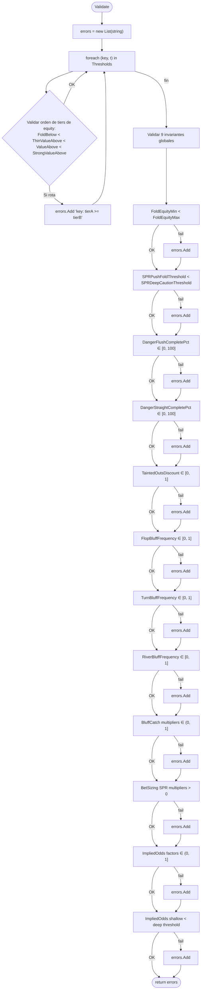
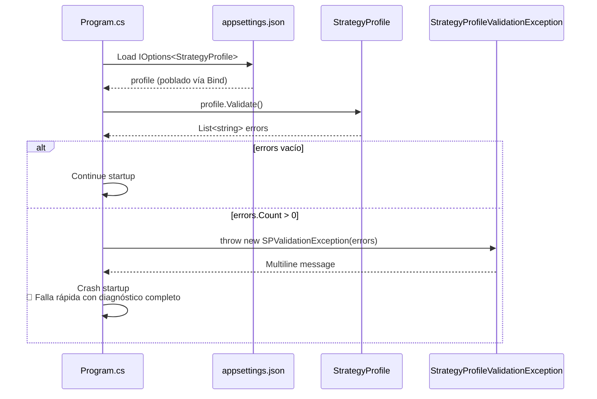

# Flowchart — `StrategyProfile.Validate()`

> Función: `StrategyProfile.Validate()`
> Archivo: `src/OpenScrape.Domain/Entities/StrategyProfile.cs:318-382`
> Doc level: detalhado

## 1. Visión general

## 2. Reglas detalladas (orden de aplicación)

| # | Regla | Mensaje en caso de fallo |
|--:|-------|--------------------------|
| 1 | `t.FoldBelow < t.ThinValueAbove` (por threshold) | `{key}: FoldBelow ({a}) debe ser menor que ThinValueAbove ({b})` |
| 2 | `t.ThinValueAbove < t.ValueAbove` (por threshold) | `{key}: ThinValueAbove ({a}) debe ser menor que ValueAbove ({b})` |
| 3 | `t.ValueAbove < t.StrongValueAbove` (por threshold) | `{key}: ValueAbove ({a}) debe ser menor que StrongValueAbove ({b})` |
| 4 | `FoldEquityMin < FoldEquityMax` | `FoldEquityMin ({a}) debe ser menor que FoldEquityMax ({b})` |
| 5 | `SPRPushFoldThreshold < SPRDeepCautionThreshold` | `SPRPushFoldThreshold ({a}) debe ser menor que SPRDeepCautionThreshold ({b})` |
| 6 | `0 ≤ DangerFlushCompletePct ≤ 100` | `DangerFlushCompletePct ({v}) debe estar entre 0 y 100` |
| 7 | `0 ≤ DangerStraightCompletePct ≤ 100` | `DangerStraightCompletePct ({v}) debe estar entre 0 y 100` |
| 8 | `0 ≤ TaintedOutsDiscount ≤ 1` | `TaintedOutsDiscount ({v}) debe estar entre 0 y 1` |
| 9 | `0 ≤ FlopBluffFrequency ≤ 1` | `FlopBluffFrequency ({v}) debe estar entre 0 y 1` |
| 10 | `0 ≤ TurnBluffFrequency ≤ 1` | (idem) |
| 11 | `0 ≤ RiverBluffFrequency ≤ 1` | (idem) |
| 12 | `0 < BluffCatchFoldBelowMultiplier ≤ 1` | `BluffCatchFoldBelowMultiplier ({v}) debe estar entre 0 (excl.) y 1` |
| 13 | `0 < BluffCatchTurnEquityMultiplier ≤ 1` | (idem) |
| 14 | `BetSizingSPRDeepMultiplier > 0` | `BetSizingSPRDeepMultiplier ({v}) debe ser > 0` |
| 15 | `BetSizingSPRShallowMultiplier > 0` | (idem) |
| 16 | `0 < ImpliedOddsSPRDeepFactor ≤ 1` | `ImpliedOddsSPRDeepFactor ({v}) debe estar entre 0 (excl.) y 1` |
| 17 | `0 < ImpliedOddsSPRShallowFactor ≤ 1` | (idem) |
| 18 | `ImpliedOddsSPRShallowThreshold < ImpliedOddsSPRDeepThreshold` | `ImpliedOddsSPRShallowThreshold ({a}) debe ser menor que Deep ({b})` |

## 3. Modelo de error consolidado

`Validate()` **acumula** errores en lugar de fallar al primero. Esto permite que el operador vea todos los problemas en un único mensaje, en lugar de iteraciones de "arreglar uno → recompilar → ver el siguiente".

El consumidor típico es `OpenScrape.App.Program.cs`/composición DI, que:

## 4. Defaults seguros (sin override en config)

Si no se sobrescribe nada vía `appsettings.json`, los defaults compilados pasan la validación:

| Campo | Default | Pasa validación? |
|-------|--------:|:----------------:|
| `FoldEquityBase` | 20.0 | ✅ |
| `FoldEquityMin` | 5.0 | ✅ (< 60.0) |
| `FoldEquityMax` | 60.0 | ✅ |
| `SPRPushFoldThreshold` | 2.0 | ✅ (< 4.0) |
| `SPRDeepCautionThreshold` | 4.0 | ✅ |
| `DangerFlushCompletePct` | 35.0 | ✅ |
| `DangerStraightCompletePct` | 18.0 | ✅ |
| `TaintedOutsDiscount` | 0.5 | ✅ |
| `FlopBluffFrequency` | 0.15 | ✅ |
| `TurnBluffFrequency` | 0.12 | ✅ |
| `RiverBluffFrequency` | 0.10 | ✅ |
| `BluffCatchFoldBelowMultiplier` | 0.75 | ✅ |
| `BluffCatchTurnEquityMultiplier` | 0.90 | ✅ |
| `BetSizingSPRDeepMultiplier` | 1.25 | ✅ |
| `BetSizingSPRShallowMultiplier` | 0.75 | ✅ |
| `ImpliedOddsSPRDeepFactor` | 0.65 | ✅ |
| `ImpliedOddsSPRShallowFactor` | 0.95 | ✅ |
| `ImpliedOddsSPRShallowThreshold` | 2.0 | ✅ (< 4.0) |
| `ImpliedOddsSPRDeepThreshold` | 4.0 | ✅ |

## 5. Lo que NO valida

🟡 **INFERIDO** — gaps potenciales en la validación:

- **Coherencia de bet sizes**: no valida que las strings de bet (`"Bet 1/2"`, `"Raise 3x"`) sean parseables por el `BetSizingService`.
- **Coherencia de frecuencias C-bet**: `CbetFrequencyFlop/Turn/River` no validan el rango `[0, 1]`.
- **Coherencia de `MultiwayOOPMultiplierSB/BB/EP`**: no valida que estén en `(0, 1]`.
- **S18-S22 calibration parameters** (50+ campos de sprints recientes): ninguno está incluido en `Validate()`. Posible deuda técnica.
- **Bankroll fields** (`InitialBankroll`, `BuyInMax`, etc.): no validados.
- **Coherencia entre `Thresholds` y enums**: no valida que las claves del diccionario sean parseables como `ThresholdKey` (e.g., podría haber `"Flop_Wrong"` y la validación pasaría).

🔴 **LACUNA**: Estas validaciones gap pueden causar bugs silenciosos en runtime. Recomendable extender `Validate()` o introducir `StrategyProfileValidator` (servicio dedicado) en futuras iteraciones.

## 6. Test surface

🟡 **INFERIDO**: NUnit tests probablemente cubren cada regla aisladamente. Verificar en `OpenScrape.App.Tests/StrategyProfileTests` (visible en CLAUDE.md, "StrategyProfile (12) tests").
