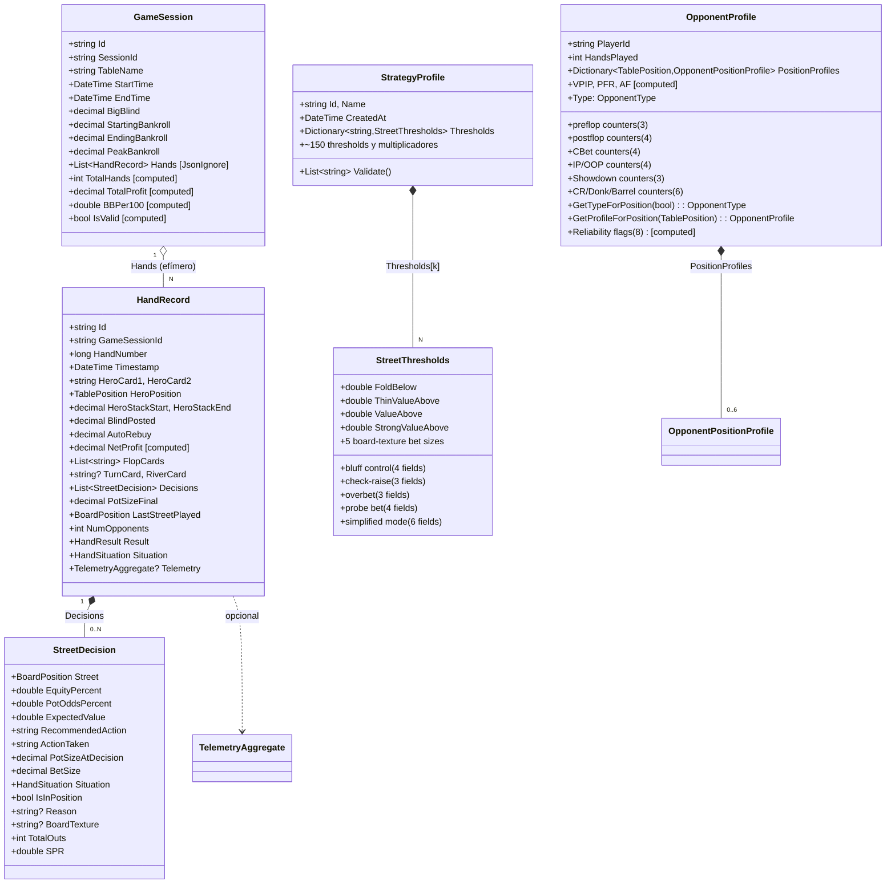
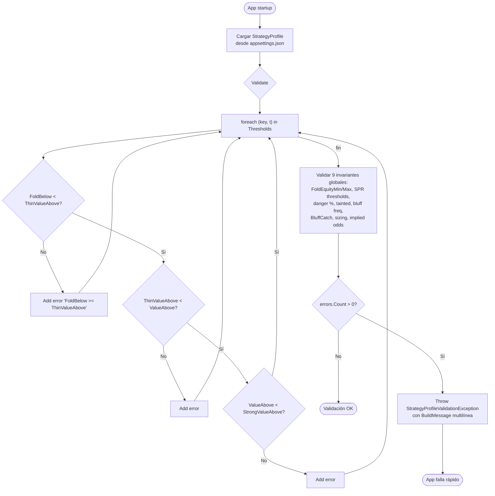
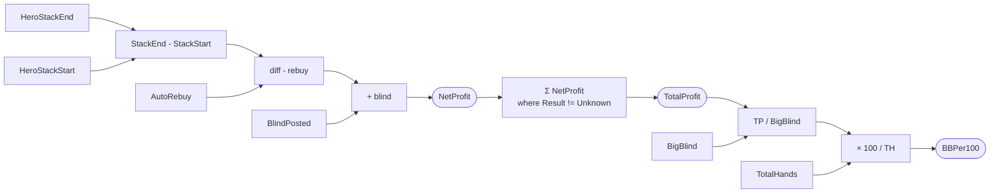

# Flowchart — `OpenScrape.Domain`

> Diagrama de relaciones del módulo Domain. Mermaid `classDiagram` y `flowchart`.
> Generado por el Arqueólogo del Reversa.

## 1. Mapa de paquetes y dependencias internas

```mermaid
flowchart TD
    subgraph Enums["Enums (sin deps)"]
        E1[Rank, Suit, HandRank, KickerStrength]
        E2[TablePosition, HandSituation, BoardPosition, Positions]
        E3[PairClassification, HandResult, OpponentType]
        E4[BluffConditionType]
        E5["🟡 HeroHand, GameSituation, Styles<br/>(legacy candidates)"]
    end

    subgraph ValueObjects["ValueObjects"]
        VO_Hand[Hand <i>record</i>]
        VO_Region[Region <i>record</i>]
        VO_PAS[PlayerActionSequence <i>record</i>]
        VO_CDO[CardDataOuts]
        VO_DP[DrawProbability]
        VO_HS[HandStrength]
        VO_HE[HandEvaluation]
        VO_POR[PotOddsResult]
        VO_SD[StreetDecision <i>record</i>]
        VO_ST[StreetThresholds <i>record</i>]
        VO_TK[ThresholdKey <i>record</i>]
        VO_VR[VillainRange]
        VO_BS[BankrollSnapshot/Stats/HistoryItem]
        VO_CS[CategoryStats]
        VO_TA[TelemetryAggregate]
    end

    subgraph Entities["Entities"]
        EN_Card[Card]
        EN_Table[Table]
        EN_RTM[RegionTableMap]
        EN_OC[OverlayConfig]
        EN_GS[GameSession + HandRecord]
        EN_SP[StrategyProfile]
        EN_OP[OpponentProfile + OpponentPositionProfile]
    end

    subgraph Dtos["Dtos"]
        D_Card[CardDTO]
        D_Table[TableDTO]
        D_Sess[SessionStatsDto <i>record</i>]
    end

    subgraph Mappers["Mappers"]
        M_Card[CardDTOMapper]
        M_Table[TableDTOMapper]
    end

    subgraph Exceptions["Exceptions"]
        EX[StrategyProfileValidationException]
    end

    E1 --> VO_CDO
    E1 --> VO_HE
    E2 --> VO_TK
    E2 --> VO_SD
    E2 --> EN_GS
    E2 --> EN_OP
    E3 --> EN_GS
    E3 --> EN_OP
    E4 --> VO_ST

    VO_CDO --> VO_DP
    VO_DP --> VO_HS
    VO_PAS --> EN_Table
    VO_PAS --> D_Table
    VO_Hand --> VO_PAS
    VO_Region --> EN_RTM
    VO_ST --> EN_SP
    VO_SD --> EN_GS
    VO_TA --> EN_GS
    VO_CS --> VO_TA
    VO_VR -. "depende de" .-> EN_OP

    EN_Card --> M_Card
    D_Card --> M_Card
    EN_Table --> M_Table
    D_Table --> M_Table

    EN_SP -.lanza.-> EX

    classDef legacy fill:#ffe9e3,stroke:#c66
    class E5 legacy
```



> **Anomalía**: `VillainRange` (en `ValueObjects/`) depende de `OpponentProfile` (en `Entities/`) — flecha hacia arriba en la pirámide. Es un olor a feature creep que la migración debería normalizar.

## 2. Class diagram — agregados raíz Marten



## 3. Flujo: validación de StrategyProfile al arranque



## 4. Flujo: clasificación villain (Type / GetTypeForPosition)

```mermaid
flowchart TD
    Start([Determinar OpponentType]) --> CheckHands{HandsPlayed >= 10?}
    CheckHands -->|No| Unknown[return Unknown]
    CheckHands -->|Sí| Pos{villainIsInPosition?}

    Pos -->|true| AfIP[af = AggressionFactorIP]
    Pos -->|false| AfOOP[af = AggressionFactorOOP]

    AfIP --> CheckPosAf{af < 0?}
    AfOOP --> CheckPosAf
    CheckPosAf -->|Sí muestras<5| Fallback[af = AggressionFactor global]
    CheckPosAf -->|No| Compute

    Fallback --> Compute[isLoose = VPIP > 30<br/>isAggressive = af > 1.5]

    Compute --> Switch{(loose, aggr)}
    Switch -->|true,true| LAG[return LAG]
    Switch -->|true,false| LP[return LP]
    Switch -->|false,true| TAG[return TAG]
    Switch -->|false,false| TP[return TP]
```

## 5. Flujo: NetProfit y BB/100



## 6. Notas finales

- Diagrama generado a partir del análisis estático de `src/OpenScrape.Domain/`.
- Los tipos `🟡 legacy` (`HeroHand`, `GameSituation`, `Styles`, `ListRegions`, `ActionsResponse`) son candidatos a `discard_log.md` durante migración — requieren confirmación cruzada con módulos consumidores.
- Detalle función-por-función en `flowcharts/OpenScrape.Domain-VillainRange.md`, `flowcharts/OpenScrape.Domain-OpponentProfile.md`, `flowcharts/OpenScrape.Domain-StrategyProfile.md`.
