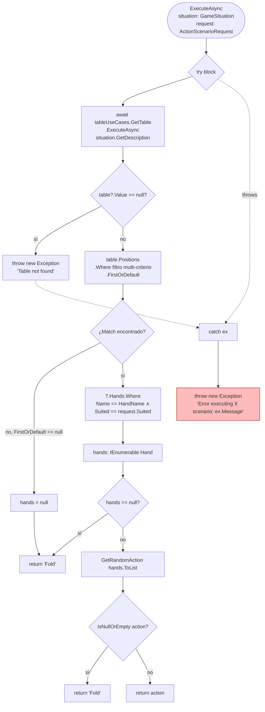
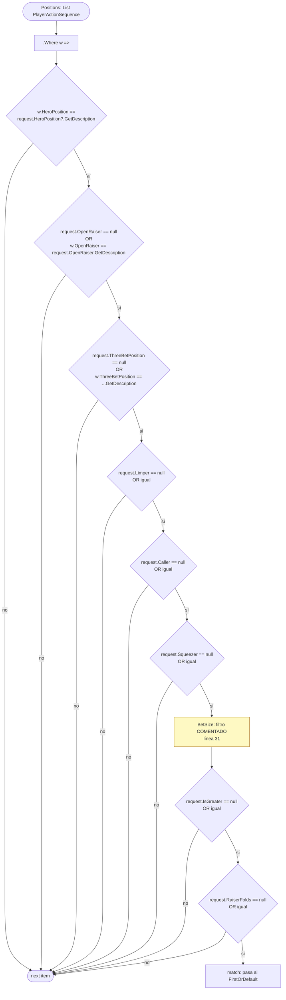
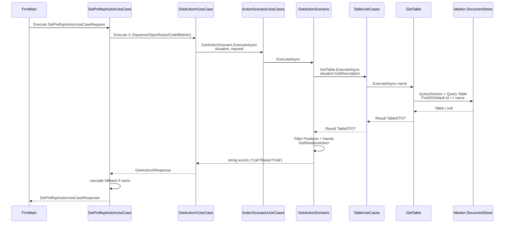

# Flowchart — `GetActionScenario.ExecuteAsync`

> Función crítica del módulo `OpenScrape.Features`.
> Archivo: `src/OpenScrape.Features/ActionScenario/Get/GetActionScenario.cs:16`.
> Doc-level: **detalhado** → flowchart por función con lógica no trivial.

---

## 1. Vista global del use case



🔴 **Anti-patrón**: el `catch` envuelve la excepción en `Exception` base perdiendo `InnerException` y stack trace. El re-throw no incluye `ex` como inner.

---

## 2. Detalle del filtro multi-criterio



🔴 El filtro `BetSize` está deshabilitado (línea 31, comentada). El campo sigue existiendo en `ActionScenarioRequest` y `PlayerActionSequence`. La diferenciación por tamaño de bet se delega al boolean `IsGreater`.

---

## 3. `GetRandomAction` — selección ponderada

```mermaid
flowchart TD
    Start([List Hand actions]) --> Empty1{actions.Count != 0?}
    Empty1 -->|no| RetEmpty1[return string.Empty]
    Empty1 -->|sí| Empty2{!actions.Any?}

    Empty2 -->|sí| ThrowEmpty[throw ArgumentException<br/>'lista vacía'<br/>🟡 redundante]
    Empty2 -->|no| Sum

    Sum{Sum Percentage == 100?}
    Sum -->|no| ThrowSum[throw ArgumentException<br/>'porcentajes != 100']
    Sum -->|sí| Rand

    Rand[Random rng = new<br/>🔴 anti-patrón: usar Random.Shared]
    Rand --> Roll[randomNumber = rng.Next 1 to 101]
    Roll --> Init[accumulated = 0]
    Init --> Foreach{foreach action in actions}

    Foreach --> Acc[accumulated += action.Percentage]
    Acc --> Compare{randomNumber <= accumulated?}
    Compare -->|sí| RetAct[return action.Action]
    Compare -->|no| Foreach

    Foreach -.->|fin del loop sin match| Fallback[return actions.Last.Action ?? string.Empty<br/>(redondeo de %)]

    classDef anti fill:#fbb,stroke:#900
    classDef warn fill:#fef9c3,stroke:#a16207
    class Rand anti
    class ThrowEmpty warn
```

### Reglas extraídas

| # | Regla | Severidad |
|---|-------|-----------|
| 1 | `Sum(Percentage) DEBE ser 100` (else `ArgumentException`) | 🟢 invariante |
| 2 | `randomNumber ∈ [1, 100]` | 🟢 |
| 3 | El último `Hand` actúa como fallback ante errores de redondeo | 🟢 |
| 4 | Si la lista está vacía → `string.Empty` | 🟢 |
| 5 | Doble check `Count != 0` + `!Any()` (redundante) | 🟡 deuda menor |
| 6 | `new Random()` por llamada (anti-patrón en .NET 10) | 🟡 deuda |

---

## 4. Llamadores externos (cadena completa)



---

## 5. Datos de entrada — semántica

| Campo de `ActionScenarioRequest` | Origen en consumidor | Mapeo a `PlayerActionSequence` |
|----------------------------------|----------------------|--------------------------------|
| `HandName` | `UserHandHelper.SetHandValue(playerState)` | `Hand.Name` |
| `Suited` | mismo helper | `Hand.Suited` |
| `HeroPosition` | `playerState.Position` | `HeroPosition` (string description) |
| `OpenRaiser` | detectado por bet > 1 en `SetPreflopActionUseCase` | `OpenRaiser` |
| `ThreeBetPosition` | jugador con bet > current | `ThreeBetPosition` |
| `Limper` | bet == 1 (excepto BB) | `Limper` |
| `Caller` | bet == bet del raiser y posición distinta | `Caller` |
| `Squeezer` | bet > current ∧ posición posterior | `Squeezer` |
| `BetSize` | **no usado en filtro** | `BetSize` |
| `IsGreater` | comparación contra umbrales hardcoded por par (Pos, RaiserPos) en `SetIsGreater` | `IsGreater` |
| `RaiserFolds` | `count > 1` cuando hay caller posterior | `RaiserFolds` |

🟡 **`IsGreater`** se calcula en `SetPreflopActionUseCase.SetIsGreater(...)` con un diccionario hardcoded `(TablePosition, TablePosition) → decimal?` de 15 entradas (líneas 252-278). Los umbrales (19m, 19.5m, 20m, 20.5m, 22m, 22.5m, 23.5m) representan tamaños de raise en BB encima de los cuales `IsGreater = true`. Tabla candidata a externalizar a `appsettings.json` o `StrategyProfile`.
