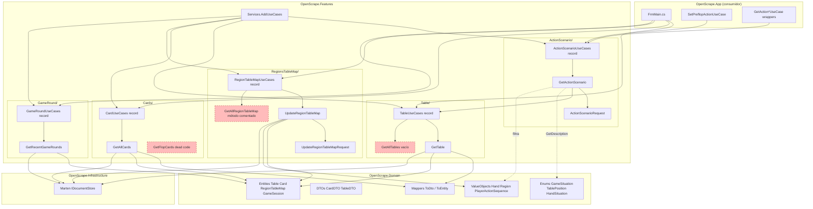
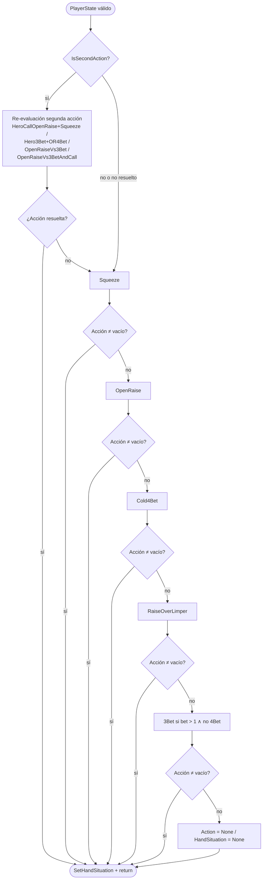
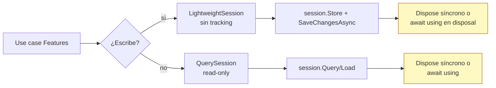
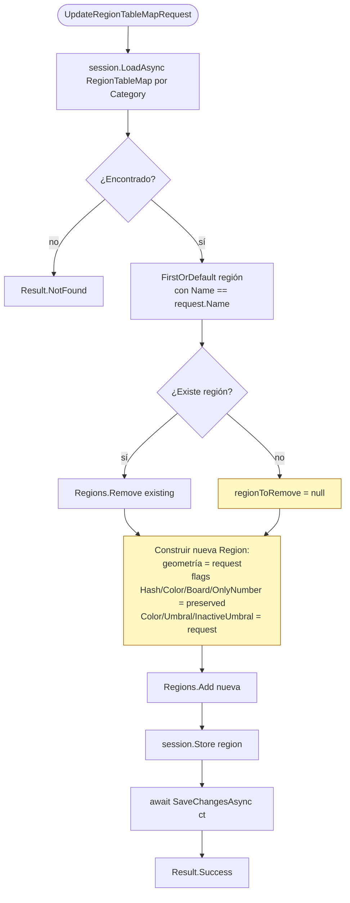

# Flowchart — `OpenScrape.Features`

> Diagramas Mermaid del módulo de casos de uso scoped.
> Referencia cruzada: `_reversa_sdd/code-analysis.md` § "Módulo: OpenScrape.Features".

---

## 1. Vista de capas y dependencias

🔴 Nodos en rojo punteado: **dead code** registrado en DI (`GetAllTables`) o no registrado (`GetFlopCards`, `GetAllRegionTableMap` con método comentado).

---

## 2. Flujo de selección preflop (cadena de fallback)

Resumen del consumidor `SetPreflopActionUseCase` que **encadena** llamadas a `GetActionScenario` con distintas situaciones hasta encontrar una acción ≠ `"Fold"`.

🟢 **Patrón de cascada**: cada nivel evalúa una `HandSituation` distinta vía `GetActionScenario`. El primer match no-vacío gana. Si ninguna situación matchea → `"None"`.

---

## 3. Decisión de tipo de sesión Marten

🟡 **Inconsistencia**: `GetTable` usa `using` síncrono; `GetRecentGameRounds` usa `await using` async. Ambos válidos pero no uniformes.

---

## 4. Update non-destructive de regiones

🟡 Si `regionToRemove == null` (creación inicial) → flags `IsHash/IsColor/IsBoard/IsOnlyNumber` quedan en `null` para siempre, aunque el request los traiga. Bug latente.
