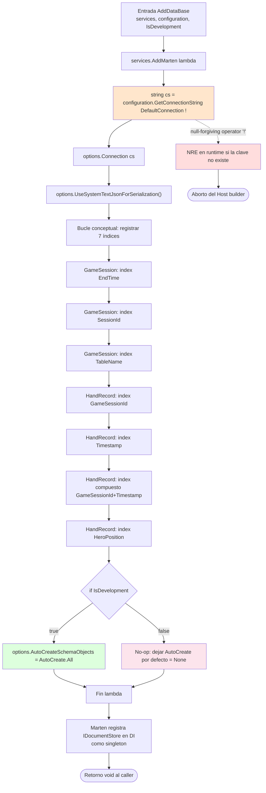

# Flowchart por función — `Services.AddDataBase()`

> Detalle del único método público del módulo `OpenScrape.Infrastructure`.
> Generado por el Arqueólogo del Reversa.

**Archivo:** `src/OpenScrape.Infrastructure/Services.cs:11`
**Firma:** `public static void AddDataBase(this IServiceCollection services, IConfiguration configuration, bool IsDevelopment)`
**Retorno:** `void` — muta `services` por efecto colateral.
**Llamadores conocidos:** `OpenScrape.App/Program.cs:52` (única llamada).

---

## Diagrama de control

## Tabla de invariantes y supuestos

| # | Invariante | Estado | Comentario |
|---|------------|--------|------------|
| 1 | `services != null` | 🟡 INFERIDO | No se valida; método de extensión asume no-null. |
| 2 | `configuration != null` | 🟡 INFERIDO | Sin validación. |
| 3 | `ConnectionStrings:DefaultConnection` está presente | 🔴 SIN VALIDAR | Operador `!` enmascara el null check; fallaría con NRE. |
| 4 | `IsDevelopment` refleja realmente el entorno | 🔴 ROTO | `Program.cs:52` lo hardcodea a `true`. |
| 5 | Marten admite `Schema.For<T>().Index(…)` repetido | 🟢 CONFIRMADO | Cada llamada agrega un índice; orden no importa. |
| 6 | Tipos `GameSession` y `HandRecord` tienen propiedad `Id` (string) | 🟢 CONFIRMADO | Convención Marten satisfecha. |
| 7 | `STJ` puede deserializar todos los tipos de `HandRecord` | 🟢 CONFIRMADO | `decimal`, `DateTime`, `enum`, `List<>`, `string?` son STJ-compatibles. `TelemetryAggregate?` también. |

## Riesgos identificados

| Severidad | Riesgo | Mitigación sugerida |
|-----------|--------|---------------------|
| 🔴 alta | Push to production con `IsDevelopment=true` provocará migraciones automáticas no auditadas | Cambiar `Program.cs:52` a `context.HostingEnvironment.IsDevelopment()` |
| 🔴 alta | NRE silencioso si falta `DefaultConnection` | Validar la cadena antes y lanzar `InvalidOperationException` con mensaje claro |
| 🟡 media | Sin override del esquema → Marten escribe en `public` por defecto | Considerar `options.DatabaseSchemaName = "openscrape"` para aislamiento multi-app |
| 🟡 media | Sin política de retry/timeout en la conexión | Marten 8 admite `options.Advanced.*`; evaluar para conexión Neon (latencia variable) |
| 🟡 baja | Sin `options.Logger(...)` registrado → no hay traza SQL | Considerar logger condicional en Development |
