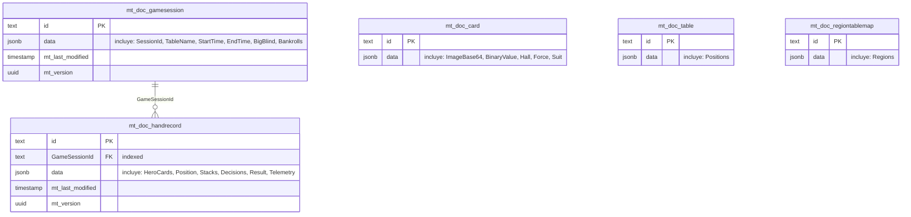

# Flowcharts — `OpenScrape.Infrastructure`

> Flowcharts generados por el Arqueólogo del Reversa.
> Confianza: 🟢 CONFIRMADO salvo nota explícita.

---

## 1. Composición de servicios — `Services.AddDataBase()`

Vista del único método público del módulo. Diagramado paso a paso desde la invocación en la composition root hasta el cierre del bootstrap de Marten.

```mermaid
flowchart TD
    Start([Inicio bootstrap App]) --> CallExt[Program.cs:52<br/>services.AddDataBase&#40;configuration, true&#41;]
    CallExt --> AddMarten[services.AddMarten&#40;options =&gt; ...&#41;]

    AddMarten --> ReadConn{¿Existe<br/>ConnectionStrings:<br/>DefaultConnection?}
    ReadConn -- No --> NRE[NullReferenceException<br/>en arranque<br/>uso de operador !]
    ReadConn -- Sí --> SetConn[options.Connection&#40;cs&#41;]

    SetConn --> SetSerializer[options.UseSystemTextJsonForSerialization&#40;&#41;]

    SetSerializer --> IdxGS[Schema.For&lt;GameSession&gt;&#40;&#41;<br/>.Index x =&gt; x.EndTime<br/>.Index x =&gt; x.SessionId<br/>.Index x =&gt; x.TableName]

    IdxGS --> IdxHR[Schema.For&lt;HandRecord&gt;&#40;&#41;<br/>.Index x =&gt; x.GameSessionId<br/>.Index x =&gt; x.Timestamp<br/>.Index x =&gt; new&#123; GameSessionId, Timestamp &#125;<br/>.Index x =&gt; x.HeroPosition]

    IdxHR --> IsDev{¿IsDevelopment?<br/>parámetro recibido}
    IsDev -- true --> AutoCreate[options.AutoCreateSchemaObjects = AutoCreate.All<br/>Marten crea/actualiza<br/>tablas e índices al arrancar]
    IsDev -- false --> NoAuto[Esquema NO se autocreará<br/>requiere migración manual]

    AutoCreate --> Done([Marten registrado<br/>en DI como IDocumentStore])
    NoAuto --> Done

    NRE --> Crash([Crash de la app])

    style NRE fill:#fdd
    style Crash fill:#fdd
    style AutoCreate fill:#dfd
```

**🔴 LACUNA crítica detectada:** la rama `IsDev=false` es **inalcanzable en la práctica** porque `Program.cs:52` invoca `AddDataBase(context.Configuration, true)` con el booleano hardcoded a `true`. El parámetro `IsDevelopment` debería leerse del `IHostEnvironment`. Validar con el usuario si es comportamiento intencional o regresión.

---

## 2. Ciclo de vida de una sesión Marten (consumo desde otros módulos)

El módulo Infrastructure **solo registra** `IDocumentStore`. La apertura de sesiones ocurre en consumidores (Features, App, DecisionMaker). Patrón uniforme observado:

```mermaid
flowchart LR
    DI[IDocumentStore<br/>singleton DI] --> Open{Tipo de operación}

    Open -- Escritura --> LW["await using var session<br/>= store.LightweightSession()"]
    Open -- Solo lectura --> QS["await using var session<br/>= store.QuerySession()"]

    LW --> Store[session.Store&lt;T&gt;&#40;doc&#41;]
    Store --> SaveAsync[await session.SaveChangesAsync&#40;&#41;]
    SaveAsync --> Dispose[await using DisposeAsync<br/>cierra conexión]

    QS --> Query[session.Query&lt;T&gt;&#40;&#41;<br/>+ LINQ]
    Query --> Materialize[await Query.ToListAsync&#40;&#41;]
    Materialize --> Dispose

    Dispose --> End([Conexión devuelta al pool])

    style LW fill:#dfd
    style QS fill:#dfd
    style Dispose fill:#dfd
```

**Convención del proyecto** (validada en `GameLoggerService`, `BankrollTrackerService`, `CardCacheService`, `FrmMain.cs:360,383`, `RegionsTableMap` use cases): nunca se mantiene una sesión Marten viva entre operaciones; cada operación abre+cierra. Esto evita el leak histórico documentado en `docs/PLAN_MEJORAS.md` (sesión long-lived en constructor).

---

## 3. Mapeo lógico de entidades a tablas Marten

Vista conceptual del esquema PostgreSQL resultante:

**Notas:**
- 🟢 La FK `GameSessionId` es **lógica**, no constraint físico (Marten no genera FK constraints sobre paths JSONB).
- 🟢 Las columnas `mt_last_modified`, `mt_version`, `mt_dotnet_type` son auto-generadas por Marten en cada tabla.
- 🟡 Los nombres `mt_doc_*` son convención de Marten 8.x; el esquema concreto depende de configuración (no se observa override).
