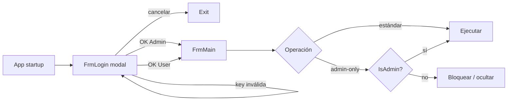

# Permisos y Roles — ScrapePoker

> Matriz de permisos del sistema. Generado por el Detective del Reversa el 2026-05-06.
>
> **Escala de confianza:** 🟢 CONFIRMADO · 🟡 INFERIDO · 🔴 LACUNA.

---

## Resumen ejecutivo

🟢 **Estado actual: el sistema NO tiene RBAC.**

El binario WinForms se ejecuta con permisos de Windows del usuario que lo lanza. No hay autenticación, login, gestión de sesiones, ni separación de roles internos. Cualquier persona con acceso al ejecutable puede usar todas las funcionalidades.

🟢 **Estado planificado:** la spec abierta `openspec/changes/login-sistema-licencias/` introducirá un sistema RBAC mínimo (2 roles: `User` y `Admin`) **antes de cualquier distribución comercial**. Documentado en §3.

---

## 1. Permisos del sistema operativo (estado actual) 🟢

### 1.1 Recursos accedidos

| Recurso | Permiso requerido | Notas |
|---|---|---|
| Filesystem (lectura) | `appsettings.json`, `appsettings.Development.json`, `Data/*.json`, `tessdata/eng.traineddata` | Read del directorio de instalación |
| Filesystem (escritura) | `Documents/OpenScrape/Sessions/{AAAAMMDD_Game}/` (screenshots cuando captura activada) | Write en `MyDocuments` del usuario |
| Filesystem (escritura) | `appsettings.Development.json` (si se modifica desde UI) | 🟡 No verificado en código activo |
| Captura de pantalla | `BitBlt` / `PrintWindow` Win32 sobre la ventana del cliente de poker | Permiso estándar de usuario, sin elevación |
| Conexión PostgreSQL | TCP a Neon DB (puerto 5432, SSL) | Outbound HTTPS/PG |
| Hardware ID (futuro) | `System.Management` (WMI) lectura disco + MAC | Estándar usuario; falla silente en VMs sin disco físico |
| OCR (Tesseract) | Acceso a `eng.traineddata` embebido | Sin red |
| Window enumeration | `EnumWindows`, `GetWindowText` | Estándar |

🟢 **No requiere elevación / Run as Admin** para funcionamiento normal.

### 1.2 Antivirus / TOS de salas de poker 🟡

🔴 **Q-PERM-AV-01:** El binario podría ser falso-positivo de antivirus por `BitBlt` + window enumeration + posible AutoIt legacy. ¿Hay alguna mitigación (firma de código, EV cert)?

🔴 **Q-PERM-TOS-01:** Las salas de poker prohíben categóricamente "bots que actúan". El sistema actual **no actúa** — solo recomienda en overlay. Sin embargo, herramientas asistivas suelen estar también prohibidas. **El usuario asume el riesgo.** ¿Documentación al respecto?

---

## 2. Permisos internos a la aplicación (estado actual) 🟢

🟢 No hay RBAC interno. **Todas las funcionalidades del UI son accesibles a cualquier usuario que haya abierto la aplicación.**

| Funcionalidad | Accesible para |
|---|---|
| Pestaña Juego (overlay activo, capturar mesa, decisiones live) | Cualquiera |
| Pestaña Config (editar `StrategyProfile` runtime) | Cualquiera |
| Pestaña Tablas (regiones, mapeo de salas) | Cualquiera |
| Pestaña Logs (lectura/búsqueda) | Cualquiera |
| Pestaña Historial (ver sesiones, manos, hand history detallada) | Cualquiera |
| Backtest A/B contra historial | Cualquiera |
| Botón Window (selector de ventana de poker activa) | Cualquiera |
| Métricas de telemetría | Cualquiera |
| Modificación directa de `appsettings*.json` | Quien tenga write access en el filesystem |
| Lectura/escritura de la BD Marten | Cualquier proceso con la connection string |

🟡 La connection string + Encrypter.Key viven en `appsettings.json` (anomalía Scout — debería estar solo en `Development.json` gitignored). Esto significa que quien obtenga el binario **tiene credenciales de la BD compartida**.

---

## 3. RBAC propuesto en spec abierta (no implementado) 🟢

> Spec: `openspec/changes/login-sistema-licencias/`. Las siguientes reglas son las que se aplicarán *cuando* se implemente.

### 3.1 Modelo de roles

### 3.2 Definición de roles 🟢

| Rol | Origen | Restricciones |
|-----|--------|---------------|
| **User** | Licencia con `Role=User` en BD | Vinculada a 1 hardware (HardwareId fijado en primera activación). Expira (`ExpiresAt < UTC.Now` → bloqueo). Puede desactivarse remotamente (`IsActive=false`). |
| **Admin** | Licencia con `Role=Admin` en BD | **Bypass total** de hardware (puede usarse en cualquier máquina). **Bypass total** de expiración (`ExpiresAt` ignorado). No se asigna `HardwareId`. |

### 3.3 Matriz de permisos propuesta 🟢 (de la spec) / 🟡 (de inferencia razonable)

> La spec **no documenta explícitamente** qué funcionalidades requieren `Admin` vs `User`. El único distintivo confirmado es **bypass de validación**. La matriz siguiente es 🟡 inferida y debe validarse con el usuario.

| Funcionalidad | User | Admin | Notas |
|---|------|-------|-------|
| Login / autenticación | ✅ requiere clave válida en HW vinculado | ✅ bypass HW & expiración | LIC-1..LIC-8 |
| Pestaña Juego | ✅ | ✅ | 🟡 inferido — funcionalidad core, sin razón para limitar |
| Pestaña Config (modificar StrategyProfile runtime) | ✅ | ✅ | 🟡 inferido. Quizá Admin debería poder importar/exportar perfiles. 🔴 |
| Pestaña Tablas (modificar regiones / añadir salas) | ✅ | ✅ | 🟡 inferido |
| Pestaña Logs | ✅ | ✅ | 🟡 |
| Pestaña Historial (lectura) | ✅ | ✅ | 🟡 |
| Backtest A/B | ✅ | ✅ | 🟡 |
| Modificar otra licencia (suspender, alargar) | ❌ | 🔴 ¿desde la app? | **No hay UI definida en la spec.** Posiblemente la gestión de licencias es manual sobre la BD. 🔴 Q-PERM-RBAC-01 |
| Crear seed admin idempotente | n/a (automático) | n/a (automático) | LIC-1, ejecutado por la app al arrancar antes del login |
| Bypass para "pruebas en producción" | ❌ | ✅ | Justificación principal del rol Admin según `proposal.md` |

### 3.4 Mecanismos de seguridad

🟢 De la spec:

| ID | Mecanismo | Detalle |
|----|-----------|---------|
| SEC-1 | **Vinculación a hardware** (Users) | SHA256(MachineName + DiskSerial + FirstActiveMAC). Una licencia User solo funciona en el equipo donde se activó. |
| SEC-2 | **Expiración** (Users) | `ExpiresAt < UTC.Now` → bloqueo. Admin lo ignora. |
| SEC-3 | **Desactivación remota** | `IsActive=false` en BD bloquea login (User y Admin). |
| SEC-4 | **Encriptación AES-CBC** ya existente | `EncrypterHelper` (key 32 bytes, IV 16 bytes) usado para ofuscar screenshots. 🟡 Eso **no protege** contra usuario con acceso al binario porque la key vive en `appsettings.json`. |
| SEC-5 | **Persistencia de "Recordar licencia"** | `Properties/Settings`. Conveniente pero **no encriptado** — quien acceda al perfil de Windows del usuario puede leerlo. 🔴 Q-PERM-RBAC-02 |

🔴 **Lacunas de seguridad explícitas:**

1. **Q-PERM-CRED-01:** La connection string PostgreSQL del Neon DB vive en `appsettings.json` (anomalía Scout). Cualquiera con el binario tiene acceso a la BD compartida — incluyendo licencias de otros usuarios. ¿Plan para mover a `Development.json` y rotar?
2. **Q-PERM-CRED-02:** `Encrypter.Key` también está en `appsettings.json` real. Si su único uso es ofuscar screenshots, ¿se puede rotar / mover?
3. **Q-PERM-CRED-03:** ¿La app debería conectar a la BD sin credenciales visibles (token / API endpoint intermedio)? Esto requiere un servicio backend que la spec no contempla.
4. **Q-PERM-RBAC-01:** ¿La gestión de licencias (crear, alargar, desactivar) se hará por SQL directo en Neon? ¿O hay un panel web futuro?
5. **Q-PERM-RBAC-02:** "Recordar licencia" en `Properties/Settings` — ¿debería encriptarse con DPAPI (`ProtectedData.Protect`)?

---

## 4. Permisos sobre datos persistidos 🟢

### 4.1 Documentos Marten

| Documento | Owner | Lectura | Escritura |
|---|---|---|---|
| `GameSession` | El usuario que lo creó (futuro: ligado a `LicenseKey`) | 🔴 hoy: cualquiera con la connection string | hoy: cualquiera |
| `HandRecord` | Idem | Idem | Idem |
| `RegionTableMap` | Compartido (configuración de salas) | Cualquiera con conn string | Cualquiera |
| `Card` | Compartido (cache de imágenes de cartas) | Cualquiera | Cualquiera |
| `OpponentProfile` (si se persiste) | 🔴 desconocido — Q-FSM-02 en state-machines.md | n/a | n/a |
| `License` (futuro) | El sistema (seed); modificable manual por admin | App lee al validar | App escribe `LastValidation`, `HardwareId` (primera activación) |

🟡 **Diseño actual no es multi-tenant.** Si un día se distribuye comercialmente:

- 🔴 **Q-PERM-DATA-01:** ¿Las sesiones/manos de un usuario quedan visibles para otros usuarios con la misma BD? Hoy técnicamente sí porque comparten conn string.
- 🔴 **Q-PERM-DATA-02:** ¿GDPR? Las manos pueden contener nombres reales de oponentes (alias OCR). ¿Se anonimiza algo?

### 4.2 `Properties/Settings` (registro Windows / app data)

🟢 Actual: `appsettings*.json` lecturas estándar, sin protección DPAPI.
🟢 Spec futura: `LicenseKey` recordada en `Properties/Settings` — texto plano por defecto.

---

## 5. Permisos en operaciones del motor de decisión 🟢

🟢 No hay permisos internos al motor. `IPokerCalculator.Calculate` y `IPostflopDecisionService.DetermineAction` son públicos, sin auth ni rate limiting. Justificable porque corren en proceso, sin red.

---

## 6. Capacidad de actuar sobre el cliente de poker 🟢

🟢 **El bot no actúa sobre el cliente de poker.** Solo lee (captura) y muestra recomendaciones en overlay. No hay envío de input (`SendKeys`, `SendInput`, `mouse_event`, `SetCursorPos`) en el código activo.

🟡 Existe rastro legacy en commits prehistóricos (`3db442c Capture auto`, `7562772 Add autoit to show form action`) que sugiere que **alguna vez hubo automatización vía AutoIt**. No se encontró código activo. **Q-DOM-06 abierta** en domain.md.

---

## 7. Conclusiones y recomendaciones para migración

| Recomendación | Confianza | Motivo |
|---|-----------|--------|
| Implementar la spec `login-sistema-licencias` antes de cualquier distribución | 🟢 | Hoy cualquiera con el binario y la BD funciona sin restricción |
| Mover `appsettings.json` a placeholders `CHANGE_ME` y rotar credenciales reales | 🟢 | Anomalía Scout; CLAUDE.md ya lo declara |
| Encriptar `Properties/Settings:LicenseKey` con DPAPI | 🟡 | Best practice; spec no lo impone |
| Considerar backend intermedio para autenticación (en vez de conn string compartida) | 🟡 | Multi-tenant correcto requiere esto |
| Documentar política sobre TOS de salas | 🟡 | Cubrir responsabilidad legal |
| Anonimizar nombres de oponentes en hand history si se exporta | 🟡 | GDPR potencial |

---

## Confianza global

- 🟢 **Alta:** estado actual sin RBAC; mecanismos de la spec (vinculación HW, expiración, bypass admin); ausencia de actuación sobre el cliente.
- 🟡 **Media:** matriz de permisos detallada User vs Admin (la spec no la define explícitamente), implicaciones de seguridad de "Recordar licencia".
- 🔴 **Lacunas:** Q-PERM-AV-01, Q-PERM-TOS-01, Q-PERM-CRED-01..03, Q-PERM-RBAC-01..02, Q-PERM-DATA-01..02.
