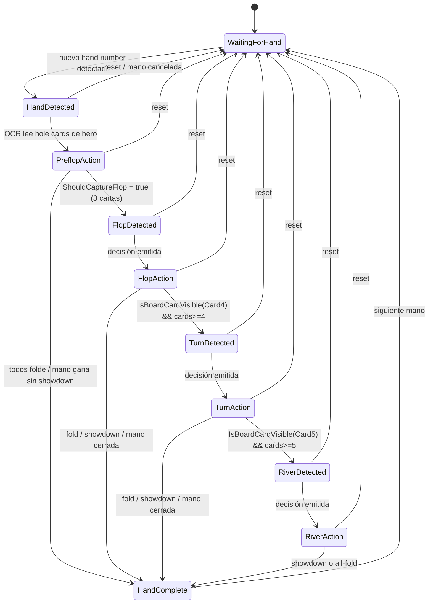
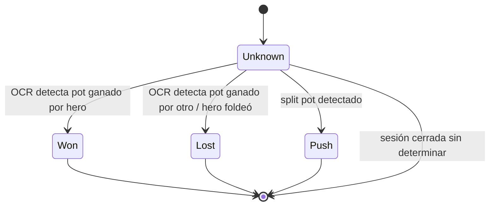
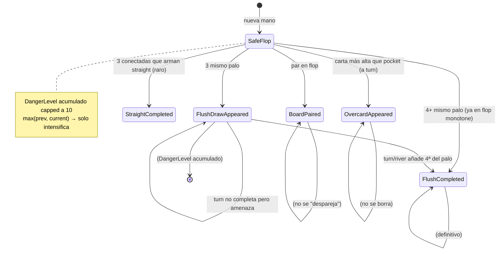
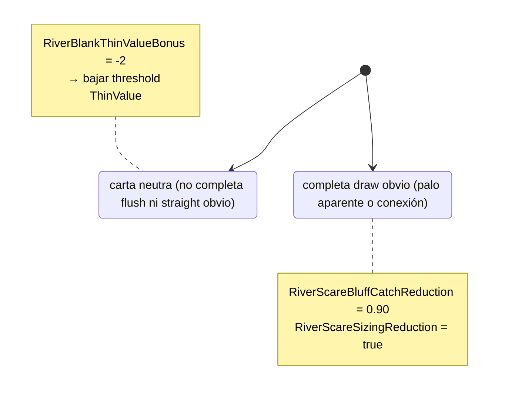
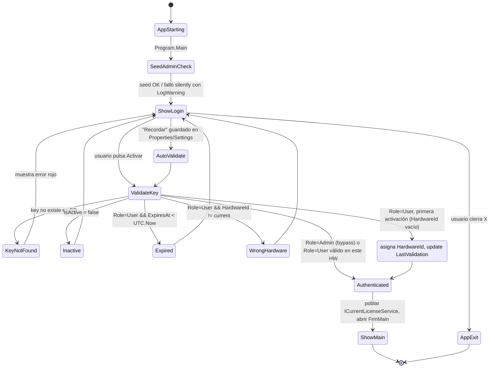
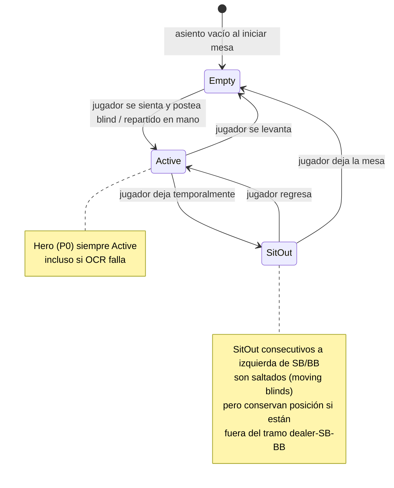
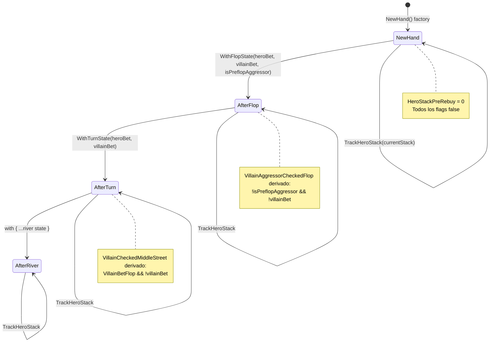

# Máquinas de Estado — ScrapePoker

> Diagramas de máquinas de estado del sistema. Generado por el Detective del Reversa el 2026-05-06.
>
> **Escala de confianza:** 🟢 CONFIRMADO · 🟡 INFERIDO · 🔴 LACUNA.

El sistema tiene **una máquina de estado central** (`GameLoopStateMachine`) y varios enums con transiciones implícitas (`HandResult`, `OpponentType`, futuras de `License`). Este documento las documenta todas.

---

## 1. GameLoopStateMachine — Estado central del game loop 🟢

> Fuente: `src/OpenScrape.App/Services/GameLoopStateMachine.cs`. Confirmado en código.

10 estados representan el ciclo de una mano de poker desde la espera hasta su finalización. Es el corazón de la coordinación entre captura/OCR/decisión/persistencia.

### 1.1 Diagrama



### 1.2 Tabla de transiciones permitidas

> Fuente literal: `_validTransitions` en el código.

| Origen | Destinos válidos |
|---|---|
| `WaitingForHand` | `HandDetected` |
| `HandDetected` | `PreflopAction`, `WaitingForHand` |
| `PreflopAction` | `FlopDetected`, `HandComplete`, `WaitingForHand` |
| `FlopDetected` | `FlopAction`, `WaitingForHand` |
| `FlopAction` | `TurnDetected`, `HandComplete`, `WaitingForHand` |
| `TurnDetected` | `TurnAction`, `WaitingForHand` |
| `TurnAction` | `RiverDetected`, `HandComplete`, `WaitingForHand` |
| `RiverDetected` | `RiverAction`, `WaitingForHand` |
| `RiverAction` | `HandComplete`, `WaitingForHand` |
| `HandComplete` | `WaitingForHand` |

> **Cualquier otra transición es rechazada por `TryTransition` y logueada con `LogWarning`.** No hay panic / throw — el loop sobrevive a un intento ilegal y solo lo registra.

### 1.3 Reglas de transición — invariantes 🟢

| ID | Invariante | Lugar |
|----|------------|-------|
| FSM-1 | Todas las transiciones son **atómicas**: protegidas por `lock(_stateLock)` (commit `f2b3422`). | `TryTransition`, `Reset`, `ForceState` |
| FSM-2 | El sistema **siempre** puede volver a `WaitingForHand` desde cualquier estado (excepto él mismo). Es la "vía de escape" si OCR pierde la mano o el usuario cierra la mesa. | tabla |
| FSM-3 | El conteo real de cartas visibles bloquea transiciones inconsistentes. La sobrecarga `TryTransition(state, visibleBoardCards)` rechaza el cambio si `visibleCards < expectedMin` (Flop=3, Turn=4, River=5). Bug fix histórico (commit `2538e55`): falsos positivos de `IsBoardCardVisible` hacían transitar antes de tiempo. | `TryTransition(state, visibleBoardCards)` |
| FSM-4 | `ForceState` (modo test/debug) **valida que el estado destino exista en el mapa** antes de aplicarlo. Si no existe, `LogError` y aborta sin cambiar. (Commit `f2b3422`). | `ForceState` |
| FSM-5 | `MaxOcrRetries = 2`. Si OCR falla, el loop reintenta dos veces antes de abortar la lectura (no abandona el estado actual). | `GameLoopStateMachine.MaxOcrRetries` |
| FSM-6 | Hay propiedades agregadas para detectar el "phase" de la mano: `IsPreflop = HandDetected ∨ PreflopAction`, `IsFlop = FlopDetected ∨ FlopAction`, `IsTurn = TurnDetected ∨ TurnAction`, `IsRiver = RiverDetected ∨ RiverAction`. Permiten al UI/coordinator preguntar "¿estás en flop?" sin ramificar entre los dos sub-estados. | propiedades booleanas |
| FSM-7 | Distinción `*Detected` vs `*Action`: `*Detected` indica "carta(s) nueva(s) ya leída(s), pendiente de pedir decisión"; `*Action` indica "ya emití recomendación, espero acción del jugador". `ProcessPostFlopAsync` solo procesa cuando está en `*Detected` (evita re-decidir cuando solo cambió el bet del villain). | `FrmMain.ProcessPostFlopAsync` |

### 1.4 Eventos / disparadores externos 🟡

> El código del state machine **no observa el mundo**: el caller (`FrmMain`) decide *cuándo* invocar `TryTransition`. Los disparadores externos son:

| Evento externo | Detección | Transición disparada |
|---|---|---|
| Nuevo hand number | OCR del hand number con consenso | `WaitingForHand → HandDetected` |
| Hole cards visibles del hero | OCR sobre regiones `P0_Card1`, `P0_Card2` | `HandDetected → PreflopAction` |
| 3 cartas comunes visibles | `ShouldCaptureFlop` (suma de píxeles activos en regiones de carta) | `PreflopAction → FlopDetected` |
| 4ª carta común visible | `IsBoardCardVisible("Card4")` por dHash + threshold 80% | `FlopAction → TurnDetected` |
| 5ª carta común visible | `IsBoardCardVisible("Card5")` por dHash | `TurnAction → RiverDetected` |
| Decisión emitida al overlay | `GameCoordinator.RecommendAction` retorna | `*Detected → *Action` |
| Showdown / pot ganado / fold | `IsHandFinished` (todos folded o board cleared) | `*Action → HandComplete` |
| Reset OCR / new hand sin terminar | hand number cambia mid-state | cualquier estado → `WaitingForHand` |

🔴 **Q-FSM-01:** ¿El sistema reset automáticamente si una mano se queda atascada en `*Action` durante demasiado tiempo? No vi watchdog en el código; merece confirmación.

---

## 2. HandResult — Estado terminal de cada mano 🟢

> Fuente: `src/OpenScrape.Domain/Entities/GameSession.cs:117-123`.

Cuatro valores que clasifican el desenlace:



### Reglas

| ID | Regla | Lugar |
|----|-------|-------|
| HR-1 | `Unknown` es el estado inicial. Hasta que el motor confirme el resultado, queda `Unknown`. | `HandRecord.Result = HandResult.Unknown` (default) |
| HR-2 | `GameSession.TotalProfit` **excluye** las manos `Unknown`: `Hands.Where(h => h.Result != Unknown).Sum(...)`. | `GameSession.TotalProfit` |
| HR-3 | Una mano que termine `Unknown` queda persistida pero no contabilizada en BB/100. 🟡 Esto significa que un OCR fallido no penaliza la métrica, solo la diluye (menos manos contabilizadas). |
| HR-4 | No hay transiciones tras `Won/Lost/Push`: estados terminales. La mano se cierra y no se reabre. | sin handlers `Update*Result` |

🔴 **Q-HR-01:** ¿Hay manos que se persisten como `Unknown` permanentemente? Si sí, ¿se reportan al usuario para corrección manual desde `FrmHistorial`?

---

## 3. OpponentType — Clasificación dinámica 🟢

> Fuente: `OpponentProfile.Type` y `GetTypeForPosition()`. La "máquina" es declarativa, derivada de stats — no se persiste explícitamente.

```mermaid
stateDiagram-v2
    [*] --> Unknown : HandsPlayed < 10

    Unknown --> TAG : VPIP <= 30 && AF > 1.5
    Unknown --> TP : VPIP <= 30 && AF <= 1.5
    Unknown --> LAG : VPIP > 30 && AF > 1.5
    Unknown --> LP : VPIP > 30 && AF <= 1.5

    TAG --> LAG : VPIP cruza 30
    TAG --> TP : AF cae bajo 1.5
    TP --> TAG : AF supera 1.5
    TP --> LP : VPIP cruza 30
    LAG --> TAG : VPIP cae bajo 30
    LAG --> LP : AF cae bajo 1.5
    LP --> LAG : AF supera 1.5
    LP --> TP : VPIP cae bajo 30

    note right of Unknown : Cliff: con HandsPlayed=10 salta directamente al tipo correspondiente
```

### Reglas 🟢

| ID | Regla | Lugar |
|----|-------|-------|
| OT-1 | Mientras `HandsPlayed < 10` el oponente es `Unknown`. **Cliff abrupto** al cruzar 10. | `OpponentProfile.Type` |
| OT-2 | Clasificación: `isLoose = VPIP > 30`, `isAggressive = AF > 1.5`. Combina los dos en 4 bucketes. | `OpponentProfile.Type` |
| OT-3 | `GetTypeForPosition(villainIsIP)` usa AF posicional (IP/OOP) si hay ≥5 muestras; si no, fallback al AF global. Permite distinguir "villain LAG IP pero TAG OOP". | `OpponentProfile.GetTypeForPosition` |
| OT-4 | Las defaults (sin datos): VPIP=50, PFR=15, 3Bet=5, FoldToCBet=50, CBet=50. Estas defaults **se usan en cálculos** mientras el oponente es `Unknown`. 🟡 Implica un asumir conservador "fish promedio". | propiedades default en `OpponentProfile` |
| OT-5 | El cliff de 10 manos es una decisión deliberada — antes con `Laplace smoothing` (commit `72ade14`) se usa AF=(a+1)/(p+1) para suavizar la entrada en el rango fiable. **Pero la asignación de tipo sigue siendo binaria al cruzar 10 manos.** 🟡 |

### Sample-size reliability granular

🟢 Confirmado en `OpponentProfile`:

| Estadística | Reliability flag | Mínimo |
|---|---|---|
| Tipo (general) | `IsReliable` | HandsPlayed ≥ 20 |
| VPIP/PFR | `HasReliablePreflopData` | HandsPlayed ≥ 10 |
| C-Bet & Fold-to-CBet | `HasReliableCBetData` | TimesCBetOpportunity ≥ 5 && TimesFacedCBet ≥ 5 |
| Aggression Factor | `HasReliableAFData` | (Bet+Raise+Call) ≥ 10 |
| Fold (postflop) | `HasReliableFoldData` | (Fold+Call+Raise) ≥ 8 |
| WTSD (Went to Showdown) | `HasReliableWTSDData` | TimesReachedRiver ≥ 15 |
| WSD (Won at Showdown) | `HasReliableWSDData` | TimesWentToShowdown ≥ 10 |
| Check-raise | `HasReliableCheckRaiseData` | TimesCheckRaiseOpportunity ≥ 10 |
| Donk-bet | `HasReliableDonkBetData` | TimesDonkBetOpportunity ≥ 8 |
| Barrel | `HasReliableBarrelData` | TimesBarrelOpportunity ≥ 8 |

> Cada cálculo del motor consulta el flag adecuado antes de usar la stat real (vs. fallback estático).

---

## 4. BoardChange — Acumulación de peligro entre calles 🟢

> Fuente: `BoardChangeResult` (record) en `BoardTextureAnalyzer.cs` + `PostflopGameContext.CombineBoardChanges()`.

`BoardChangeResult` no es estrictamente una FSM, pero tiene transiciones acumulativas entre `Flop → Turn → River`. Ningún campo se "limpia": todo flag pasa a `previous OR current`.



### Regla central — `CombineBoardChanges` 🟢

```csharp
// Pseudocódigo extraído literalmente
new BoardChangeResult(
    FlushCompleted: previous.FlushCompleted || current.FlushCompleted,
    FlushDrawAppeared: previous.FlushDrawAppeared || current.FlushDrawAppeared,
    StraightCompleted: previous.StraightCompleted || current.StraightCompleted,
    BoardPaired: previous.BoardPaired || current.BoardPaired,
    OvercardAppeared: previous.OvercardAppeared || current.OvercardAppeared,
    CompletedFlushSuit: current.CompletedFlushSuit >= 0 ? current.CompletedFlushSuit : previous.CompletedFlushSuit,
    DangerLevel: Math.Min(10, previous.DangerLevel + current.DangerLevel))
```

**Implicación:** el peligro **siempre crece** entre calles. Esto refleja que en poker una vez aparece un draw o se empareja el board, no desaparece.

### Categorías de textura derivadas 🟢

| Categoría | Condición |
|---|---|
| Dry | `DangerLevel < 15` |
| SemiDry | 15 ≤ < 35 |
| SemiWet | 35 ≤ < 60 |
| Wet | ≥ 60 |
| Paired | flag dedicado (transversal) |
| Monotone | 3+ del mismo palo en flop específicamente |

### RiverCardType (S22.2) 🟢



---

## 5. License & LoginState — Propuesto en spec abierta 🟡

> Spec: `openspec/changes/login-sistema-licencias/`. **No implementado todavía.** Se documenta porque está planificado y afecta arquitectura.

### 5.1 Estado de validación de licencia



### 5.2 Reglas de la spec 🟢 (de la spec, no del código)

| ID | Regla | Spec scenario |
|----|-------|---------------|
| LIC-1 | Seed admin **idempotente**: si no hay licencia con `Role=Admin`, crea una con clave de `appsettings.json:AdminLicense:Key`, `ExpiresAt=DateTime.MaxValue`, `IsActive=true`. | `admin-license-seed/Scenario: No existe licencia admin` |
| LIC-2 | Seed que falla por error de BD **no bloquea la app**: Warning + continuar a `FrmLogin`. | scenario `Fallo en el seed no bloquea la app` |
| LIC-3 | Hardware ID = `SHA256(MachineName + DiskSerial + FirstActiveMAC)`. Componentes faltantes (VM sin disco) → cadena vacía, no lanzar. Idempotente. | `hardware-id/Scenario` |
| LIC-4 | Primera activación de licencia User: asigna `HardwareId` y `LastValidation`, devuelve OK. | `license-validation/Scenario: Clave válida primera activación` |
| LIC-5 | Bypass Admin: ignora hardware **y** expiración. | `license-validation/Scenarios bypass` |
| LIC-6 | Cancelar `FrmLogin` (X o cancelar) → app termina sin abrir `FrmMain`. | `login-form/Scenario: Cancelar cierra la app` |
| LIC-7 | "Recordar licencia": guarda key en `Properties/Settings`. Al arrancar, si existe → autocompleta y valida automáticamente. | `login-form/Scenarios recordar` |
| LIC-8 | Mientras no se haya completado login, `ICurrentLicenseService` retorna `LicenseKey=""`, `Role=User`, `IsAdmin=false`. | `current-license-service/Scenario: Estado inicial sin login` |

🔴 **Q-FSM-LIC-01:** La spec dice "validación online en cada arranque". ¿Qué hacer si la BD no es accesible (sin internet) y la licencia no es Admin? ¿Modo offline temporal con `LastValidation`?

---

## 6. PlayerState (asientos detectados) 🟡

> Inferido de `TableLayoutService` y bug fix de positions (commit `1654e09`).

Cada asiento de la mesa puede estar en uno de estos estados. **No hay enum dedicado**, pero el comportamiento sí es state-machine.



### Reglas 🟢

| ID | Regla | Lugar |
|----|-------|-------|
| PS-1 | Hero (P0) siempre se considera `Active`, incluso si OCR no detecta su nombre. (Commit `4dc9075`). | `TableLayoutService` |
| PS-2 | `SitOut` y `Empty` son distintos: SitOut conserva el seat (jugador volverá), Empty libera el seat (siguiente jugador puede sentarse). | algoritmo de moving blinds |
| PS-3 | Cuando el número de jugadores Active cambia entre manos, se **recalculan las posiciones** desde cero. (Commit `5e21f14`). | `TableLayoutService.SetVillainPosition` |
| PS-4 | Moving blinds: SB y BB saltan los SitOut consecutivos a su izquierda. Empty está fuera del anillo. (Commit `1654e09`). | `PositionCalculator` |

🔴 **Q-PS-01:** ¿Hay estado intermedio "AllIn" para un jugador que comprometió todo su stack pero sigue en la mano? Veo `IsAnyoneAllIn` en `PostflopGameContext` pero no un estado per-jugador. Posiblemente es info derivada del stack actual (`stack ≤ 0`).

---

## 7. PostflopGameContext — No es FSM pero tiene estado cross-street 🟢

> Fuente: `src/OpenScrape.DecisionMaker/Services/PostflopGameContext.cs` (record inmutable).

No es estrictamente una FSM (no hay transiciones declaradas), pero los **helpers de transición** (`WithFlopState`, `WithTurnState`, `TrackHeroStack`) implementan un patrón de fluent state machine inmutable.



### Reglas de transición 🟢

| ID | Regla | Lugar |
|----|-------|-------|
| CTX-1 | Cada transición devuelve **una instancia nueva** (immutable record). El holder scoped (`IPostflopContextHolder.Update`) hace `c => c with { ... }` con `lock` interno. | commit `127a2f5` |
| CTX-2 | Una sola instancia por scope (mano). El bug histórico era que `FrmMain._postflopContext` y `GameCoordinator.PostflopContext` divergían. **Ahora es invariante**. | `IPostflopContextHolder` |
| CTX-3 | `TrackHeroStack(currentStack)` retorna tupla `(NewContext, EffectiveStack)`. Si detecta auto-rebuy (currentStack − HeroStackPreRebuy ≥ 50 BB), preserva `HeroStackPreRebuy` y devuelve `EffectiveStack = HeroStackPreRebuy`. | método `TrackHeroStack` |
| CTX-4 | `IsVillainBarreling` se deriva: `VillainBetFlop && VillainBetTurn`. No se setea explícitamente. | propiedad calculada |
| CTX-5 | `HeroCheckedAllStreets` se deriva: `!HeroBetFlop && !HeroBetTurn`. | propiedad calculada |
| CTX-6 | `LastBoardChange` se acumula con `CombineBoardChanges(previous, current)` (ver §4) — el danger level monotónicamente crece. | `CombineBoardChanges` |

---

## Resumen: estados que sobreviven a la sesión

| Tipo de estado | ¿Persiste entre manos? | ¿Persiste entre sesiones? |
|---|---|---|
| `GameLoopStateMachine.CurrentState` | No (Reset entre manos) | No |
| `HandRecord.Result` | Sí (es el resultado de la mano) | Sí (Marten) |
| `OpponentProfile.Type` (derivado) | Sí (acumula stats) | 🟡 No por defecto — los profiles parecen vivir solo en memoria de sesión. **Validar.** |
| `PostflopGameContext` | No (NewHand entre manos) | No |
| `BoardChangeResult` | No (se reinicia por mano) | No |
| `License` (futuro) | n/a | Sí (Marten + LastValidation) |
| `PlayerState` por seat | Sí parcial (alias caching) | No por defecto |

🔴 **Q-FSM-02:** ¿Los `OpponentProfile` se persisten en BD para mantener historial cross-sesión, o se resetean al cerrar la app? El campo `PlayerId = nombre` sugiere que sí se podría persistir (Marten document), pero no encontré config explícita. Validar.

---

## Confianza global

- 🟢 **Alta:** `GameLoopStateMachine`, `HandResult`, `OpponentType` cliff y reliability flags, `BoardChange` accumulation, `PostflopGameContext` transitions.
- 🟡 **Media:** `PlayerState` (no enum dedicado, inferido), interpretación de eventos externos del state machine.
- 🔴 **Lacunas:** Q-FSM-01, Q-FSM-02, Q-FSM-LIC-01, Q-PS-01, Q-HR-01.
